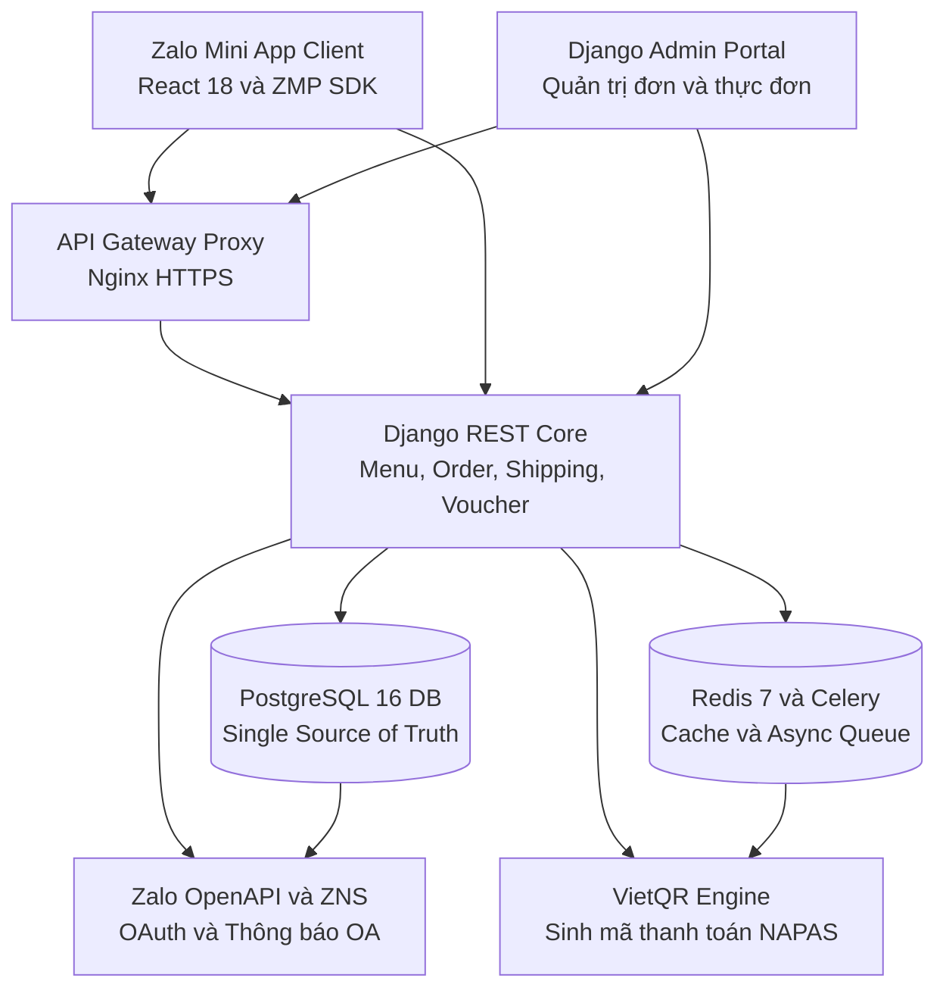
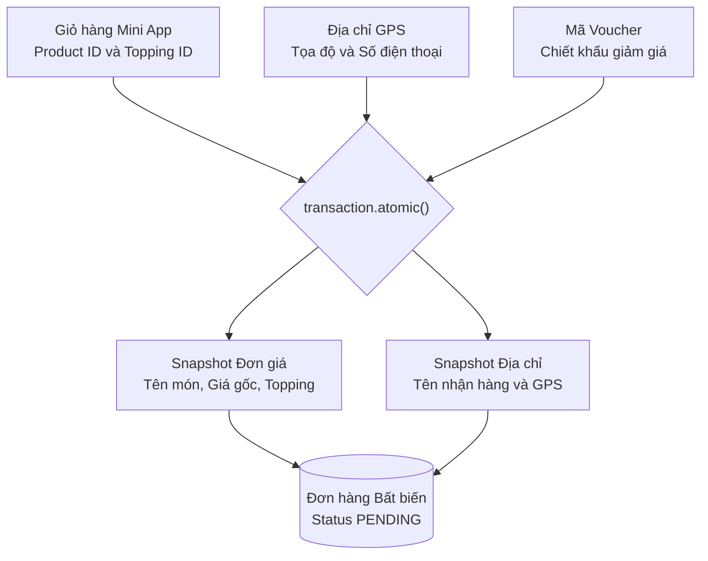

Bài toán thực tế trong kinh doanh dịch vụ ăn uống F&B là các cửa hàng vừa và nhỏ chịu áp lực chiết khấu hoa hồng rất cao từ 20% đến 30% khi bán qua các ứng dụng giao đồ ăn bên thứ ba, đồng thời bị mất hoàn toàn tệp dữ liệu khách hàng trung thành. Việc tự xây dựng ứng dụng di động độc lập native app lại gặp rào cản lớn về chi phí phát triển và tỷ lệ cài đặt ứng dụng của người dùng rất thấp. Dự án Bếp Dì 6 được xây dựng nhằm giải quyết bài toán này: đưa trải nghiệm gọi món, chọn topping và thanh toán trực tiếp lên nền tảng Zalo Mini App với hơn 75 triệu người dùng sẵn có, kết hợp cùng hệ thống backend Django và PostgreSQL chuyên nghiệp để vận hành đơn hàng độc lập.

## Kiến trúc hệ thống tổng thể

Hệ thống được thiết kế theo mô hình kiến trúc phân tầng rõ ràng, tách biệt hoàn toàn giữa trải nghiệm giao diện người dùng trên Mini App và lõi xử lý nghiệp vụ tại Backend:



### Thành phần kiến trúc

- **Frontend Client (Zalo Mini App):** Xây dựng trên React 18, Vite và ZMP SDK. Đảm nhận nhiệm vụ hiển thị thực đơn phân tầng, quản lý giỏ hàng cục bộ, lấy tọa độ vị trí GPS và render mã VietQR động.
- **Backend Core (Django REST Framework):** Đóng vai trò bộ não điều phối nghiệp vụ tập trung. Toàn bộ logic tính tiền, kiểm tra voucher, tính cước vận chuyển và biến đổi trạng thái đơn hàng đều do backend xử lý tuyệt đối.
- **Database (PostgreSQL 16):** Nguồn chân lý dữ liệu duy nhất (Single Source of Truth) lưu trữ thông tin thực đơn, danh mục, khách hàng, voucher và dữ liệu snapshot đơn hàng bất biến.
- **Async Queue & Cache (Redis 7 & Celery):** Tối ưu hóa tốc độ phản hồi qua bộ nhớ đệm thực đơn, áp dụng rate-limiting và gửi thông báo đơn hàng qua Zalo OA/ZNS mà không làm nghẽn luồng xử lý HTTP chính.

## Các quyết định kỹ thuật cốt lõi

### 1. Bảo toàn dữ liệu đơn hàng bằng cơ chế Snapshot

Trong mô hình F&B, giá bán sản phẩm, danh mục topping hoặc địa chỉ cửa hàng có thể thay đổi liên tục theo thời gian. Nếu chỉ lưu khóa ngoại `product_id` đơn thuần, các báo cáo tài chính hoặc lịch sử đơn hàng cũ sẽ bị sai lệch khi giá món biến động.



Chúng ta giải quyết bài toán này bằng cách đóng băng toàn bộ dữ liệu tại thời điểm bấm đặt hàng. Mỗi dòng chi tiết đơn hàng `OrderItem` lưu trữ bản sao cố định của tên món, đơn giá tại thời điểm mua, danh sách topping đã chọn và địa chỉ nhận hàng vào database, bảo đảm tính toàn vẹn dữ liệu kế toán 100%.

### 2. Chống trùng lặp đơn hàng với Idempotency Key

Khi mạng di động chập chờn, người dùng có thể vô tình bấm nút đặt hàng nhiều lần liên tiếp. Để ngăn chặn việc tạo ra các đơn hàng trùng lặp:

- Frontend sinh một chuỗi định danh duy nhất `Idempotency-Key` (UUIDv4) cho mỗi phiên checkout và tự động vô hiệu hóa nút bấm ngay cú chạm đầu tiên.
- Backend kiểm tra khóa trong Redis/Database trước khi thực thi `transaction.atomic()`. Nếu yêu cầu có cùng khóa đang được xử lý hoặc đã hoàn tất, hệ thống lập tức trả về kết quả đơn hàng đã tạo thay vì ghi thêm bản ghi mới.

### 3. Tính phí giao hàng chính xác với công thức Haversine

Hệ thống tích hợp trực tiếp khả năng lấy tọa độ GPS từ Zalo SDK và tính toán khoảng cách đường chim bay đến vị trí cửa hàng bằng công thức Haversine ngay tại backend:

```python
def calculate_haversine_distance(lat1: float, lon1: float, lat2: float, lon2: float) -> float:
    """Tính khoảng cách đường tròn lớn theo km giữa 2 tọa độ GPS."""
    earth_radius_km = 6371.0
    lat1_rad, lon1_rad = math.radians(lat1), math.radians(lon1)
    lat2_rad, lon2_rad = math.radians(lat2), math.radians(lon2)

    dlat = lat2_rad - lat1_rad
    dlon = lon2_rad - lon1_rad

    a = math.sin(dlat / 2) ** 2 + math.cos(lat1_rad) * math.cos(lat2_rad) * math.sin(dlon / 2) ** 2
    c = 2 * math.atan2(math.sqrt(a), math.sqrt(1 - a))

    return earth_radius_km * c
```

Khoảng cách tính toán sau đó được nhân với hệ số bù trừ cung đường thực tế và so khớp với bảng định mức cước phí nhiều nấc của quán (ví dụ: dưới 2km đồng giá 10.000đ, từ 2km đến 5km là 15.000đ), giúp minh bạch chi phí vận chuyển trước khi khách hàng tiến hành thanh toán.

### 4. Quy chuẩn thiết kế Zalo Design System

Giao diện ứng dụng được tối ưu kỹ lưỡng để hòa nhập hoàn hảo vào môi trường Zalo:

- Sử dụng hoàn toàn bộ phông chữ hệ thống System Font (`-apple-system`, `Roboto`, `SF Pro`) giúp giảm dung lượng bundle và tăng tốc độ khởi động Mini App.
- Thiết kế thanh tiêu đề có khoảng đệm an toàn `pr-20` (80px) tránh va chạm với nút điều hướng 3 chấm mặc định của Zalo.
- Áp dụng các token bo góc chuẩn: Modal bo góc 16px (`rounded-2xl`) và Badge bo góc 4px (`rounded`).

## Showcase Giao diện Thực tế

### Trải nghiệm Khách hàng trên Zalo Mini App

Hệ thống mang lại trải nghiệm mượt mà, trực quan từ khâu xem menu đến thanh toán chuyển khoản:

| 1. Trang chủ & Thực đơn | 2. Tùy chọn món ăn (Sheet 80vh) | 3. Giỏ hàng & Tóm tắt |
| :---: | :---: | :---: |
|  |  |  |
| *Thực đơn phân tầng theo danh mục món* | *Tùy chọn topping, kích cỡ & ghi chú* | *Kiểm tra số lượng và tổng tiền* |

| 4. Thanh toán & VietQR | 5. Danh sách Địa chỉ | 6. Modal thêm địa chỉ GPS |
| :---: | :---: | :---: |
|  |  |  |
| *Tự sinh mã VietQR chuẩn số tiền* | *Lưu trữ nhiều địa chỉ giao hàng* | *Định vị GPS Zalo tự động điền địa chỉ* |

---

### Cổng Quản trị Vận hành cho Chủ quán

Cổng quản trị Django Admin được tùy biến trực quan, hỗ trợ đội ngũ vận hành theo dõi và xử lý đơn hàng tức thì:

#### 1. Đăng nhập Quản trị Bảo mật


#### 2. Dashboard Tổng quan Doanh thu


#### 3. Danh sách Đơn hàng Thời gian thực


#### 4. Chi tiết Snapshot Đơn hàng


#### 5. Quản lý Thực đơn và Nhóm Tùy chọn Món


## Kết quả đạt được và Hướng mở rộng

Dự án Bếp Dì 6 đã chứng minh tính hiệu quả vượt trội khi kết hợp nền tảng Zalo Mini App với hệ thống backend chuẩn mực:

1. **Trải nghiệm tức thì:** Người dùng không cần tải ứng dụng từ kho ứng dụng, truy cập đặt món ngay trong Zalo với tốc độ tải trang dưới 1 giây.
2. **Tự động hóa vận hành:** Giảm thiểu tối đa sai sót đơn hàng nhờ tính năng snapshot giá và sinh mã VietQR tự động kèm nội dung chuyển khoản chính xác.
3. **Tiết kiệm chi phí trung gian:** Cửa hàng làm chủ hoàn toàn kênh phân phối và dữ liệu khách hàng.
4. **Sẵn sàng cho AI Integration:** Cấu trúc backend phân tầng độc lập giúp hệ thống sẵn sàng tích hợp AI Assistant (tra cứu trạng thái đơn, gợi ý món ăn theo sở thích qua Function Calling) trong các giai đoạn phát triển tiếp theo.
