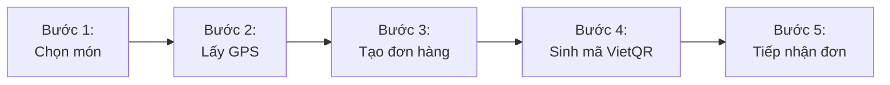
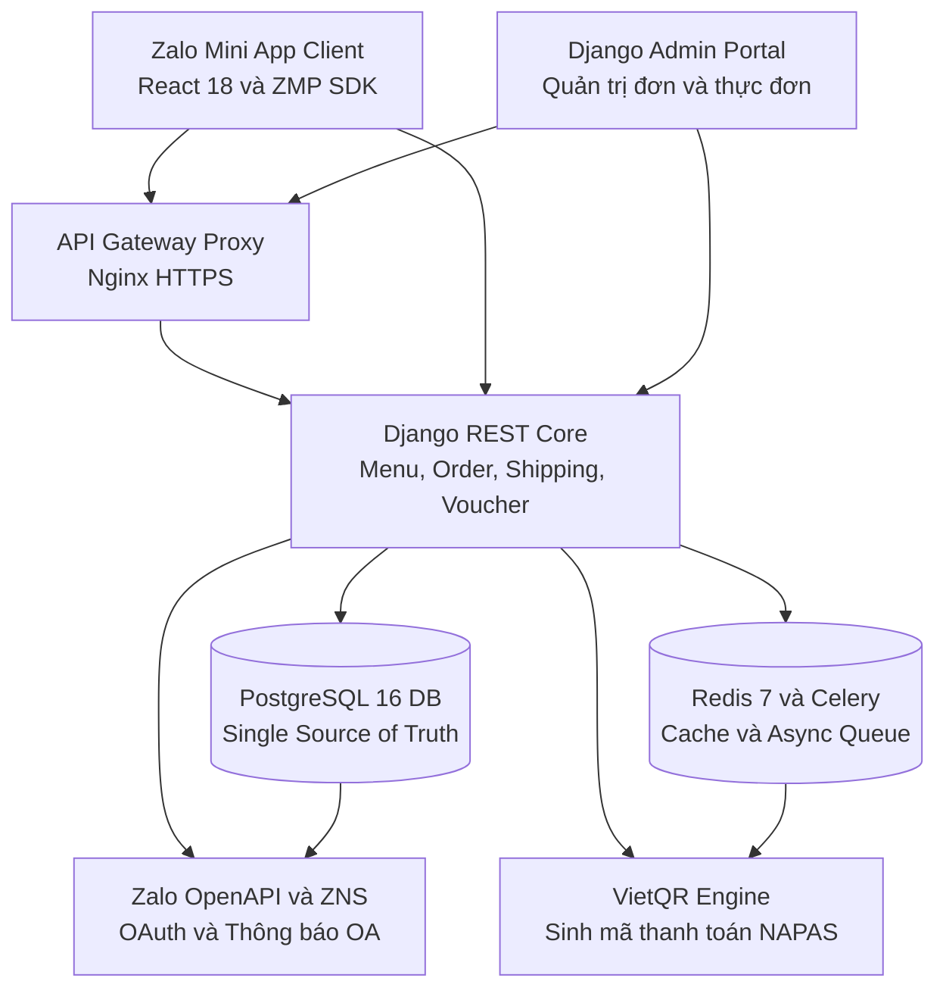
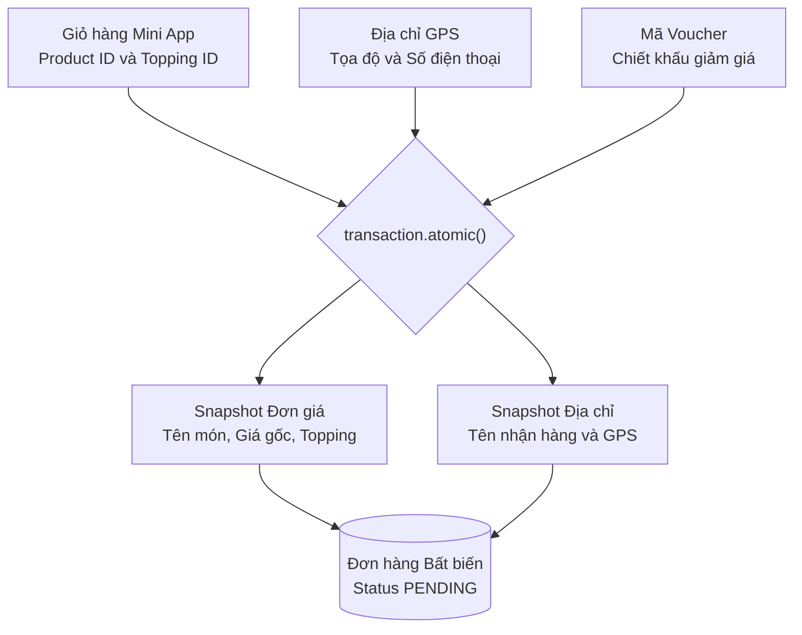



> [!TLDR]
> Bếp Dì 6 là nền tảng đặt món trực tiếp trên Zalo Mini App dành cho quán ăn địa phương, giúp khách hàng đặt hàng không cần cài ứng dụng mới và chủ quán đối soát dòng tiền tự động qua VietQR động và định vị GPS.
>
> **Vai trò:** Phụ trách toàn bộ kiến trúc backend, thiết kế cơ sở dữ liệu PostgreSQL, xây dựng API Django REST Framework, tích hợp ZMP SDK và thiết lập hạ tầng triển khai.

## Bối cảnh và bài toán thực tế

Các hàng quán F&B quy mô vừa và nhỏ thường chịu mức chiết khấu hoa hồng cao từ 20% đến 30% khi bán qua các ứng dụng giao đồ ăn bên thứ ba, đồng thời mất tệp dữ liệu khách hàng trung thành. Trong khi đó, việc tự phát triển ứng dụng di động độc lập tốn kém chi phí bảo trì và tỷ lệ khách hàng chịu tải ứng dụng về máy rất thấp.

### Đối tượng sử dụng
- **Khách hàng:** Người dùng Zalo muốn xem thực đơn, chọn topping và đặt món nhanh chóng mà không phải tải ứng dụng mới hay đăng ký tài khoản phức tạp.
- **Chủ quán và Nhân viên vận hành:** Đội ngũ quản lý đơn hàng cần hệ thống theo dõi trạng thái đơn hàng thời gian thực, quản lý thực đơn linh hoạt và đối soát chuyển khoản ngân hàng chính xác.

### Giải pháp cốt lõi
Đưa toàn bộ trải nghiệm gọi món trực tiếp vào Zalo Mini App nhằm tận dụng tệp người dùng sẵn có của Zalo. Phía sau là hệ thống backend với Django REST Framework và PostgreSQL đóng vai trò nguồn chân lý dữ liệu, tích hợp sinh mã VietQR động theo từng đơn hàng và tính cước giao hàng theo định vị GPS thời gian thực.

---

## Luồng hoạt động cốt lõi

Quy trình từ lúc khách hàng duyệt món đến khi đơn hàng được nhà bếp tiếp nhận và đối soát thanh toán:



1. **Khám phá và tùy biến:** Khách hàng mở Mini App trong Zalo, duyệt thực đơn phân tầng, tùy chọn kích cỡ, mức đường hoặc đá và topping đi kèm.
2. **Định vị và tính phí:** Mini App lấy tọa độ GPS của khách qua ZMP SDK, gửi về backend tính toán khoảng cách đường thực tế và áp mức cước tương ứng.
3. **Đóng băng đơn hàng:** Hệ thống tạo bản ghi đơn hàng với cơ chế khóa dữ liệu snapshot bất biến và cấp mã Idempotency Key ngăn trùng đơn.
4. **Thanh toán VietQR:** Hệ thống hiển thị mã QR thanh toán tích hợp sẵn số tiền chính xác và mã đơn trong nội dung chuyển khoản.
5. **Tiếp nhận và giao hàng:** Cổng quản trị nhận thông báo đơn mới tức thì, nhân viên xác nhận thanh toán và tiến hành chuẩn bị món.

---

## Kiến trúc hệ thống tổng thể

Hệ thống được thiết kế theo mô hình phân tầng rõ ràng, tách biệt giữa trải nghiệm giao diện người dùng trên Mini App và lõi xử lý nghiệp vụ tại Backend:



### Trách nhiệm các thành phần
- **Frontend Client:** Xây dựng trên React 18, Vite và ZMP SDK. Đảm nhận nhiệm vụ hiển thị thực đơn phân tầng, quản lý giỏ hàng cục bộ, lấy tọa độ vị trí GPS và render mã VietQR động.
- **Backend Core:** Đóng vai trò bộ não điều phối nghiệp vụ tập trung với Django REST Framework. Toàn bộ logic tính tiền, kiểm tra voucher, tính cước vận chuyển và biến đổi trạng thái đơn hàng đều do backend xử lý.
- **Database:** PostgreSQL 16 đóng vai trò nguồn chân lý dữ liệu duy nhất lưu trữ thông tin thực đơn, danh mục, khách hàng, voucher và dữ liệu snapshot đơn hàng bất biến.
- **Async Queue và Cache:** Redis 7 và Celery giúp tối ưu hóa tốc độ phản hồi qua bộ nhớ đệm thực đơn, áp dụng rate limiting và gửi thông báo đơn hàng qua Zalo OA hoặc ZNS mà không làm nghẽn luồng xử lý HTTP chính.

---

## Các quyết định kỹ thuật then chốt

### Bảo toàn dữ liệu đơn hàng bằng cơ chế Snapshot
- **Bối cảnh:** Trong ngành F&B, giá bán sản phẩm, danh mục topping hoặc địa chỉ cửa hàng biến động liên tục. Nếu chỉ lưu khóa ngoại `product_id` đơn thuần, báo cáo tài chính hoặc lịch sử đơn hàng cũ sẽ bị sai lệch khi giá thay đổi.
- **Quyết định:** Sử dụng cơ chế Snapshot dữ liệu ngay trong `transaction.atomic()`.



Mỗi dòng chi tiết đơn hàng `OrderItem` lưu trữ bản sao cố định của tên món, đơn giá tại thời điểm mua, danh sách topping đã chọn và địa chỉ nhận hàng vào database, bảo đảm tính toàn vẹn dữ liệu kế toán.

### Chống trùng lặp đơn hàng với Idempotency Key
- **Bối cảnh:** Khi mạng di động chập chờn, người dùng có thể vô tình bấm nút đặt hàng nhiều lần liên tiếp.
- **Quyết định:** Frontend sinh chuỗi định danh duy nhất Idempotency Key theo chuẩn UUIDv4 cho mỗi phiên checkout và vô hiệu hóa nút bấm ngay cú chạm đầu tiên. Backend kiểm tra khóa trong Redis hoặc Database trước khi thực thi. Nếu yêu cầu có cùng khóa đang được xử lý hoặc đã hoàn tất, hệ thống trả về kết quả đơn hàng đã tạo thay vì tạo thêm đơn trùng.

### Tính phí giao hàng chính xác với công thức Haversine
- **Bối cảnh:** Cần tính toán khoảng cách vận chuyển minh bạch mà không phụ thuộc vào các API bản đồ đắt tiền từ bên thứ ba.
- **Quyết định:** Tích hợp tọa độ GPS từ ZMP SDK và áp dụng công thức Haversine tính khoảng cách đường tròn lớn trực tiếp tại backend:

```python
def calculate_haversine_distance(lat1: float, lon1: float, lat2: float, lon2: float) -> float:
    """Tính khoảng cách đường tròn lớn theo km giữa 2 tọa độ GPS."""
    earth_radius_km = 6371.0
    lat1_rad, lon1_rad = math.radians(lat1), math.radians(lon1)
    lat2_rad, lon2_rad = math.radians(lat2), math.radians(lon2)

    dlat = lat2_rad - lat1_rad
    dlon = lon2_rad - lon1_rad

    a = math.sin(dlat / 2) ** 2 + math.cos(lat1_rad) * math.cos(lat2_rad) * math.sin(dlon / 2) ** 2
    c = 2 * math.atan2(math.sqrt(a), math.sqrt(1 - a))

    return earth_radius_km * c
```

Khoảng cách tính toán sau đó được nhân với hệ số bù trừ cung đường thực tế và so khớp với bảng định mức cước phí nhiều nấc của quán, giúp hiển thị chi phí vận chuyển minh bạch trước khi khách thanh toán.

---

## Giao diện thực tế của hệ thống

### Trải nghiệm khách hàng trên Zalo Mini App

<div class="showcase-gallery-grid">
  <div class="gallery-card">
    
    <div class="gallery-caption">
      <strong>1. Trang chủ và Thực đơn</strong>
      Thực đơn phân tầng theo danh mục món
    </div>
  </div>
  <div class="gallery-card">
    
    <div class="gallery-caption">
      <strong>2. Tùy chọn món ăn</strong>
      Tùy chọn topping, kích cỡ và ghi chú
    </div>
  </div>
  <div class="gallery-card">
    
    <div class="gallery-caption">
      <strong>3. Giỏ hàng và Tóm tắt</strong>
      Kiểm tra số lượng và tổng tiền
    </div>
  </div>
  <div class="gallery-card">
    
    <div class="gallery-caption">
      <strong>4. Thanh toán và VietQR</strong>
      Tự sinh mã VietQR chuẩn số tiền
    </div>
  </div>
  <div class="gallery-card">
    
    <div class="gallery-caption">
      <strong>5. Danh sách Địa chỉ</strong>
      Lưu trữ nhiều địa chỉ giao hàng
    </div>
  </div>
  <div class="gallery-card">
    
    <div class="gallery-caption">
      <strong>6. Modal thêm địa chỉ GPS</strong>
      Định vị GPS Zalo tự động điền địa chỉ
    </div>
  </div>
</div>

---

### Cổng quản trị vận hành cho chủ quán

#### Đăng nhập quản trị bảo mật


#### Dashboard tổng quan doanh thu


#### Danh sách đơn hàng thời gian thực


#### Chi tiết snapshot đơn hàng


#### Quản lý thực đơn và nhóm tùy chọn món


---

## Kết quả đạt được và giới hạn hiện tại

### Kết quả đạt được
1. **Trải nghiệm tức thì:** Người dùng không cần tải ứng dụng từ kho ứng dụng, truy cập đặt món ngay trong Zalo với tốc độ tải trang dưới 1 giây.
2. **Tự động hóa vận hành:** Giảm thiểu sai sót đơn hàng nhờ tính năng snapshot giá và sinh mã VietQR tự động kèm nội dung chuyển khoản định danh.
3. **Tiết kiệm chi phí trung gian:** Cửa hàng làm chủ hoàn toàn kênh phân phối và bảo toàn dữ liệu khách hàng.

### Giới hạn đã biết
- **Đối soát thanh toán:** Hiện tại việc xác nhận tiền về tài khoản vẫn dựa vào thông báo biến động số dư hoặc nhân viên kiểm tra đối soát thủ công trên trang admin thay vì webhook tự động từ ngân hàng.
- **Phụ thuộc môi trường Zalo:** Ứng dụng chỉ hoạt động trong môi trường client Zalo, chưa hỗ trợ trình duyệt web độc lập bên ngoài.

