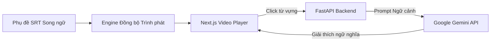



Việc học tiếng Anh qua phim ảnh rất hiệu quả nhưng người học thường gặp khó khăn khi tra cứu từ vựng và cấu trúc câu phức tạp trong ngữ cảnh hội thoại thực tế. Việc chuyển đổi qua lại giữa trình phát video và từ điển làm gián đoạn trải nghiệm xem phim. Dự án Bilingual Movie Learn được xây dựng để tạo ra một trình phát video thông minh, tích hợp phụ đề song ngữ tương tác và phân tích ngôn ngữ tức thì bằng AI.

## Các tính năng kỹ thuật cốt lõi

- **Đồng bộ phụ đề thời gian thực:** Đồng bộ chuẩn từng mili giây giữa video và file phụ đề SRT song ngữ Anh - Việt.
- **Tương tác từ vựng thông minh:** Người dùng có thể click trực tiếp vào bất kỳ từ nào trên phụ đề để xem nghĩa, phiên âm IPA và ví dụ thực tế.
- **Giải thích ngữ cảnh bằng Google Gemini API:** Khi gặp câu văn thành ngữ hoặc cấu trúc khó, hệ thống gửi đoạn kịch bản xung quanh đến Gemini API để nhận phân tích ý nghĩa văn cảnh sâu sắc.
- **Backend FastAPI và SQLite:** Xử lý tra cứu từ vựng siêu tốc và quản lý danh sách từ đã lưu của từng người dùng.

## Kiến trúc xử lý phụ đề và AI

## Bài học kinh nghiệm

Việc kết hợp giữa xử lý phụ đề khớp thời gian thực trên frontend và gọi API mô hình ngôn ngữ lớn ở backend giúp tạo ra trải nghiệm học ngoại ngữ thụ động nhưng mang lại hiệu quả ghi nhớ cao.

---
- 
