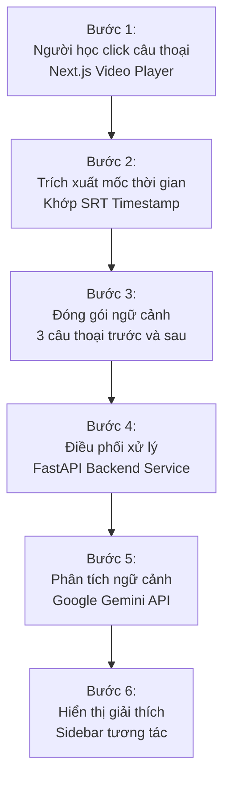
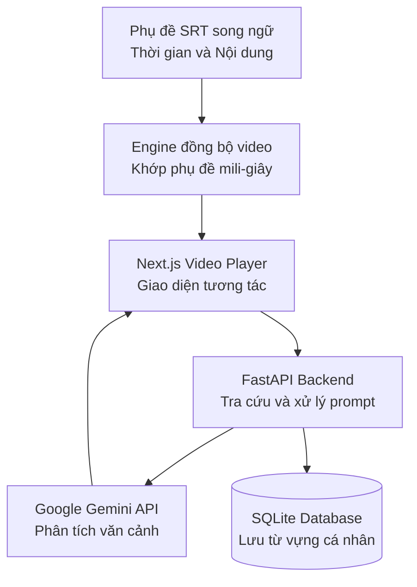



> **One-liner:** Bilingual Movie Learn là nền tảng học tiếng Anh tương tác qua phim ảnh, giúp người học tra cứu từ vựng theo ngữ cảnh và giải thích ngữ pháp tức thì từ câu thoại video thông qua Google Gemini API.

## 1. Tổng quan dự án

### Bài toán thực tế
Xem phim là phương pháp học tiếng Anh tự nhiên và hấp dẫn nhất, nhưng người học thường gặp rào cản lớn:
- Phụ đề thông thường chạy quá nhanh khiến người xem không kịp ghi nhớ từ mới.
- Khi gặp một thành ngữ hoặc cấu trúc câu ẩn dụ trong phim, việc chuyển tab sang từ điển hoặc Google Dịch làm đứt đoạn cảm xúc xem phim.
- Từ điển thông thường chỉ giải nghĩa từ vựng đơn lẻ ở dạng nguyên thể, không thể giải thích ngữ nghĩa chính xác trong ngữ cảnh hội thoại cụ thể của phân cảnh phim.

### Đối tượng sử dụng
Người học tiếng Anh muốn nâng cao vốn từ vựng tự nhiên, tiếng lóng và phản xạ giao tiếp thông qua phim ảnh nhưng cần một công cụ hỗ trợ tra cứu mượt mà, không làm gián đoạn trải nghiệm xem.

### Giải pháp cốt lõi
Xây dựng một trình phát video chuyên dụng kết hợp phụ đề song ngữ đồng bộ chính xác theo từng khung hình:
- Cho phép nhấp trực tiếp vào bất kỳ từ nào trên phụ đề để tra cứu nghĩa và phát âm tức thì.
- Tích hợp Google Gemini API phân tích toàn bộ câu thoại cùng các câu thoại ngữ cảnh xung quanh để giải thích ý nghĩa hàm ẩn, sắc thái biểu cảm và cấu trúc ngữ pháp ngay trên màn hình phát video.

---

## 2. Luồng hoạt động cốt lõi

Quy trình tương tác và xử lý ngữ cảnh diễn ra tức thì khi người học bấm vào phụ đề:

1. **Khớp phụ đề theo mili-giây:** Video Player lắng nghe sự kiện phát của thẻ HTML5 video, đối chiếu mốc thời gian của file phụ đề SRT song ngữ để hiển thị câu thoại đồng bộ.
2. **Kích hoạt tra cứu:** Khi tạm dừng hoặc nhấp vào một câu thoại khó, giao diện tự động bắt lấy nội dung câu hiện tại kèm 2 câu thoại liền kề trước đó.
3. **Đóng gói prompt và phân tích:** Backend FastAPI nhận ngữ cảnh hội thoại, áp dụng system prompt tinh gọn gửi tới Google Gemini API để bóc tách nghĩa ngữ cảnh, cấu trúc ngữ pháp đáng chú ý và ví dụ tương tự.
4. **Lưu trữ từ vựng:** Người học có thể lưu từ vựng hoặc câu thoại yêu thích vào danh sách cá nhân trong SQLite để ôn tập lại sau.

---

## 3. Kiến trúc hệ thống và Dòng chảy dữ liệu

Hệ thống được thiết kế theo hướng module hóa, tách biệt giữa trình phát frontend và dịch vụ AI backend:

### Trách nhiệm các thành phần
- **Frontend:** Xây dựng với Next.js và TypeScript. Đảm nhận nhiệm vụ hiển thị trình phát video tùy biến, dựng phụ đề song ngữ dạng layer trong suốt đè lên video, xử lý sự kiện hover và click trên từng từ vựng.
- **Backend:** Xây dựng bằng FastAPI và Python. Cung cấp API tra cứu từ vựng siêu tốc, xử lý rate limiting và giao tiếp bất đồng bộ với Google Gemini API.
- **Database:** SQLite lưu trữ danh mục phim, đường dẫn file phụ đề và danh sách từ vựng cá nhân của người học.

---

## 4. Các quyết định kỹ thuật then chốt

### 1. Đồng bộ phụ đề phía trình duyệt thay vì xử lý qua máy chủ
- **Bối cảnh:** Việc đối chiếu mốc thời gian phụ đề theo từng khung hình nếu gửi request lên server liên tục sẽ gây nghẽn mạng và tăng độ trễ giao diện.
- **Quyết định:** Chuyển đổi toàn bộ file phụ đề thành mảng cấu trúc JSON ngay trên trình duyệt khi tải phim. Sử dụng thuật toán tìm kiếm nhị phân trên danh sách mốc thời gian để tìm câu thoại hiển thị tức thì với độ phức tạp tối ưu.
- **Đánh đổi:** Tăng nhẹ thời gian khởi tạo ban đầu khoảng 100ms khi mở phim, nhưng đổi lại trải nghiệm tua video và khớp phụ đề diễn ra hoàn toàn mượt mà không có độ trễ mạng.

### 2. Sử dụng Google Gemini Flash API cho tác vụ phân tích tức thì
- **Bối cảnh:** Cần một mô hình AI có tốc độ phản hồi cực nhanh dưới 1 giây để người xem không phải chờ đợi lâu khi tạm dừng phim.
- **Quyết định:** Chọn mô hình Gemini Flash nhờ ưu thế vượt trội về chi phí thấp và thời gian sinh token đầu tiên cực ngắn, kết hợp prompt yêu cầu trả lời theo cấu trúc JSON ngắn gọn.

---

## 5. Kết quả đạt được và Giới hạn hiện tại

### Kết quả đạt được
1. **Trải nghiệm học liền mạch:** Người học không còn phải thoát khỏi video hay gõ lại từng từ ngữ vào từ điển; việc học diễn ra tự nhiên trong luồng giải trí.
2. **Hiểu sâu sắc thái ngôn ngữ:** AI giải thích được các phép chơi chữ, tiếng lóng văn hóa mà từ điển thông thường không thể hiện được.

### Giới hạn đã biết
- **Chất lượng phụ đề gốc:** Trải nghiệm phụ thuộc hoàn toàn vào độ chính xác của file phụ đề SRT. Nếu phụ đề gốc bị lệch mốc thời gian hoặc dịch máy sai, phần giải thích ngữ cảnh của AI cũng sẽ bị ảnh hưởng.
- **Hỗ trợ định dạng video:** Hiện tại ứng dụng hỗ trợ tốt các định dạng video web chuẩn như MP4, WebM với phụ đề tách rời; các định dạng video nhúng sẵn phụ đề cứng chưa thể nhận diện ký tự.

---

- 
