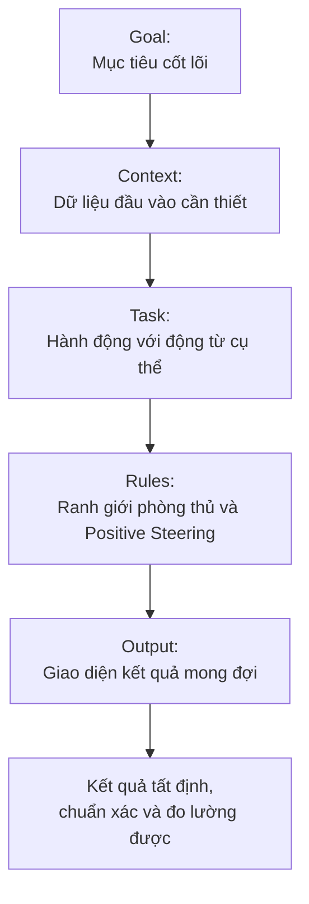
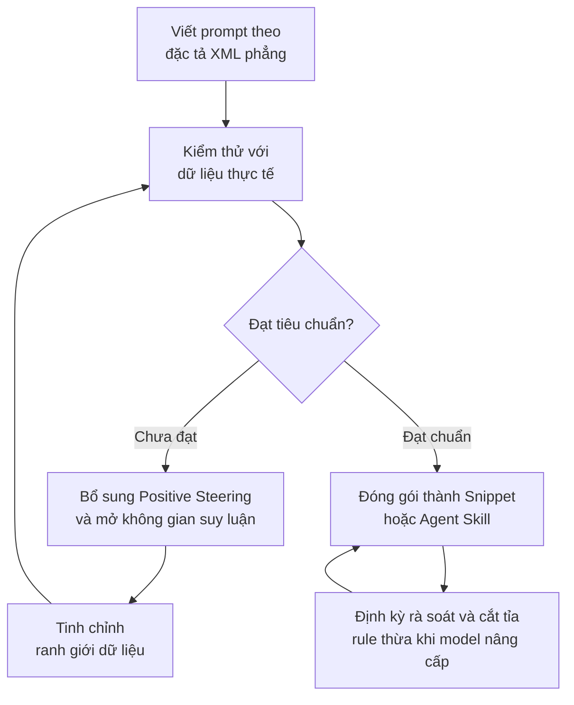

> Một prompt xuất sắc không phải là chuỗi câu lệnh phức tạp hay thần bí. Nó là một bản đặc tả kỹ thuật đủ tường minh để cả người viết lẫn mô hình ngôn ngữ lớn xác định chính xác thế nào là một kết quả đúng.

Trong thực tế, chúng ta rất dễ biến prompt engineering thành cuộc sưu tầm những câu thần chú: mở đầu bằng *"Bạn là chuyên gia hàng đầu thế giới..."*, chèn thêm *"Hãy suy nghĩ thật sâu từng bước..."*, rồi kết thúc bằng hàng loạt câu cấm đoán tiêu cực.

Prompt dài dần và tốn token, nhưng độ tin cậy của kết quả nhận về không tăng tương ứng. Dưới góc nhìn kỹ thuật phần mềm, LLM là một **hệ thống xử lý xác suất**. Việc điều khiển một hệ thống xác suất đòi hỏi **Context Engineering** và **Specification Writing** — giao tiếp bằng ranh giới dữ liệu chuẩn xác và tiêu chí đo lường định lượng thay vì dựa vào mẹo vặt câu chữ.

---

## 1. Chuyển dịch tư duy: Prompt như một bản đặc tả kỹ thuật

### Bản chất của Goal > Persona
Thói quen dùng Persona Prompting như *"Bạn là lập trình viên 20 năm kinh nghiệm"* tự thân nó không làm tăng năng lực suy luận logic của mô hình nếu thiếu tiêu chí đánh giá đi kèm. Trong nhiều trường hợp, việc gán vai thái quá còn kích hoạt văn phong trịnh trọng, sáo rỗng từ dữ liệu huấn luyện.

Vai trò chỉ thực sự có giá trị khi dùng để thiết lập góc nhìn chuyên môn qua kỹ thuật **Perspective Framing**:

```text
Đánh giá đoạn mã này dưới góc nhìn của một kỹ sư bảo mật: tập trung vào rủi ro SQL Injection và kiểm thực đầu vào.
```

Thay vì đầu tư vào danh xưng, hãy tập trung vào kết quả đầu ra mong đợi.

### 5 thành phần của một bản đặc tả hoàn chỉnh



1. **Goal:** Xác định mục tiêu thực chất. Thay vì `Nghiên cứu Docker`, hãy viết: `So sánh Docker Compose và Kubernetes cho ứng dụng chạy trên một VPS để xác định ngưỡng phức tạp không cần thiết`.
2. **Context:** Cung cấp dữ liệu nền tảng như code, log lỗi, tài liệu để mô hình không phải tự phỏng đoán.
3. **Task:** Sử dụng các động từ hành động đơn nghĩa: `Trích xuất 3 rủi ro chính`, `Tìm lỗ hổng logic`, `Viết đoạn mã sửa lỗi tối thiểu`.
4. **Rules:** Thiết lập các quy tắc phòng vệ chống hallucination và xử lý khi thiếu thông tin.
5. **Output:** Định nghĩa cấu trúc giao diện kết quả để người đọc hoặc hệ thống tiếp theo dễ dàng tiêu thụ.

---

## 2. Kiến trúc ranh giới: Phân vùng ngữ nghĩa bằng XML phẳng

### Hiện tượng Data Bleeding và Prompt Injection
Khi làm việc với các tác vụ lập trình hoặc phân tích tài liệu, dữ liệu đầu vào như code, log hệ thống, bài viết Markdown thường chứa sẵn các ký tự `#`, `-`, `*`, ```` ``` ````. 

Nếu tiếp tục sử dụng Markdown header để phân đoạn prompt, mô hình rất dễ nhầm lẫn giữa **lệnh thực thi của hệ thống** và **dữ liệu người dùng nạp vào**, dẫn đến hiện tượng Data Bleeding. 

Tài liệu kỹ thuật từ Anthropic và các nghiên cứu thực nghiệm chỉ ra rằng: **Sử dụng các cặp thẻ XML đóng/mở tường minh** là giải pháp phân vùng ngữ nghĩa Semantic Zoning tin cậy nhất hiện nay.

```xml
<prompt>
  <goal>
    Tìm nguyên nhân gốc rễ gây crash ứng dụng và đề xuất bản vá tối thiểu.
  </goal>

  <context>
    <error_logs>
      [FATAL 2026-08-31] NullPointerException at OrderService.java:142
      Stacktrace chứa nhiều ký tự đặc biệt, dấu # và code snippet
    </error_logs>
    <code_snippet>
      public Order processOrder(String orderId) { ... }
    </code_snippet>
  </context>

  <task>
    1. Phân tích nguyên nhân trực tiếp dẫn đến NullPointerException.
    2. Chỉ ra kịch bản thực tế làm phát sinh lỗi.
    3. Cung cấp đoạn code sửa chữa tối thiểu.
  </task>
</prompt>
```

### Nguyên tắc XML phẳng Flat Hierarchy
Tránh biến prompt thành một file XML phức tạp với nhiều tầng lồng nhau như `<task><step><condition><action>...`. Việc lồng thẻ quá sâu gây lãng phí token và tăng nguy cơ mô hình sinh lỗi quên đóng thẻ.

**Quy tắc vàng:** Chỉ sử dụng XML ở tầng cao nhất, 1 tầng duy nhất, để phân vùng lớn (`<goal>`, `<context>`, `<task>`, `<rules>`, `<output_format>`). Toàn bộ nội dung bên trong mỗi thẻ được trình bày bằng Markdown tự nhiên.

> [!NOTE] Ranh giới áp dụng
> - **NÊN dùng XML:** Khi prompt có dữ liệu đầu vào phức tạp như code, git diff, logs, tài liệu dài hoặc khi đóng gói làm System Prompt, Skill cho AI Agent.
> - **KHÔNG NÊN dùng XML:** Đối với các câu hỏi đàm thoại ngắn ngày thường, plain text hoặc Markdown đơn giản là lựa chọn tối ưu tốc độ.

---

## 3. Tối ưu hóa cơ chế suy luận: Mở khóa Chain-of-Thought

### Hướng dẫn khẳng định qua Positive Steering
Tại sao các câu lệnh cấm đoán tiêu cực thuần túy như `Không được bịa đặt`, `Không được đoán mò` thường kém hiệu quả?

Về mặt xác suất token, câu lệnh phủ định vẫn kích hoạt các cụm token liên quan trong không gian biểu diễn của mô hình. Giải pháp thực chiến là **ghép đôi lệnh cấm với một chỉ thị hành động khẳng định cụ thể qua Positive Steering**:

| Lệnh cấm tiêu cực (Dễ lỗi) | Hướng dẫn khẳng định (Độ tin cậy cao) |
|---|---|
| *Không được đoán thông tin thiếu.* | *Nếu thiếu dữ liệu để xác nhận, hãy ghi rõ: "Chưa đủ dữ liệu về [X] để kết luận".* |
| *Không viết dài dòng lan man.* | *Trình bày súc tích trong tối đa 3 đoạn văn ngắn.* |
| *Không tự tạo số liệu.* | *Chỉ sử dụng các con số xuất hiện trực tiếp trong tài liệu nguồn được cung cấp.* |

### Tránh bẫy "Nghẽn suy luận" khi ép khung Output
Nhiều prompt ép mô hình xuất kết quả dạng bảng hoặc JSON ngay lập tức:

```xml
<output_format>
  | Giả thuyết lỗi | Nguyên nhân gốc rễ | Cách sửa |
</output_format>
```

Đối với các bài toán phân tích đa bước, việc ép định dạng bảng ngay từ token đầu tiên sẽ **triệt tiêu không gian Chain-of-Thought và Scratchpad** của mô hình. Mô hình phải dồn năng lực tính toán vào việc căn chỉnh cú pháp bảng thay vì đào sâu bản chất logic, dẫn đến nội dung trong bảng rất nông.

**Kỹ thuật tối ưu:** Cho phép mô hình phân tích cơ chế trước khi tổng hợp thành bảng:

```xml
<output_format>
  ## 1. Phân tích nguyên nhân và giả thuyết
  [Không gian để mô hình tự do suy luận và kiểm chứng]

  ## 2. Bảng tổng hợp giải pháp
  | Vấn đề | Cơ chế gây lỗi | Bản vá tối thiểu |
  |---|---|---|

  ## 3. Kế hoạch kiểm chứng
  [Test case cụ thể]
</output_format>
```

---

## 4. Kỹ thuật thực chiến: Vòng đời Prompt và Khung mẫu chuẩn

### Chống thoái hóa Prompt: Prompt Drift và Prompt Rot
Một thư viện prompt không phải tài sản bất biến. Khi các mô hình nền tảng được nâng cấp, ví dụ từ GPT-4 sang Claude 3.7 hoặc DeepSeek-R1, nhiều ràng buộc tiêu cực cũ dùng để vá lỗi mô hình trước sẽ trở nên thừa thãi.

- **Cắt tỉa định kỳ:** Loại bỏ các emoji, chú thích từ vựng rườm rà để tối đa hóa tỷ lệ tín hiệu trên token Signal-to-Noise Ratio.
- **Giảm ma sát nhập liệu Template Fatigue:** Tích hợp prompt vào các công cụ gõ tắt như Raycast, TextExpander, Obsidian Templater hoặc nạp làm System Prompt cho AI Agent thay vì copy-paste thủ công mỗi ngày.



### Khung mẫu Baseline XML tinh gọn

Dưới đây là khung mẫu XML phẳng chuẩn mực, tương thích tối đa với mọi mô hình hiện đại:

```xml
<prompt>
  <goal>
    [Mô tả chính xác kết quả cuối cùng cần đạt được]
  </goal>

  <context>
    <background>
      [Bối cảnh bài toán, môi trường, hoặc các ràng buộc bất biến]
    </background>
    <input_data>
      [Dữ liệu thô, đoạn mã nguồn, tài liệu tham khảo hoặc ghi chú]
    </input_data>
  </context>

  <task>
    1. [Hành động cụ thể bước 1 với động từ đơn nghĩa]
    2. [Hành động cụ thể bước 2]
    3. [Hành động cụ thể bước 3]
  </task>

  <rules>
    - Chỉ sử dụng thông tin có trong dữ liệu nguồn cung cấp.
    - Nếu thiếu dữ liệu để khẳng định, nêu rõ chưa đủ thông tin thay vì phỏng đoán.
    - Đi thẳng vào trọng tâm phân tích, loại bỏ văn phong sáo rỗng.
  </rules>

  <output_format>
    ## 1. Phân tích cốt lõi
    - [Các phát hiện quan trọng]

    ## 2. Giải pháp chi tiết
    - [Đoạn mã nguồn hoặc nội dung hoàn chỉnh]

    ## 3. Khuyến nghị hành động
    - [Bước tiếp theo cụ thể]
  </output_format>
</prompt>
```

---

## Lời kết

Viết prompt không phải là tìm kiếm những câu từ hoa mỹ để "nịnh" mô hình. 

Đó là kỹ năng **thiết lập bài toán và kiểm soát ranh giới dữ liệu** — một kỹ năng kỹ thuật cốt lõi giúp lập trình viên biến một mô hình xác suất thành một công cụ giải quyết vấn đề chính xác, đáng tin cậy và có thể tái lập trong công việc hàng ngày.
