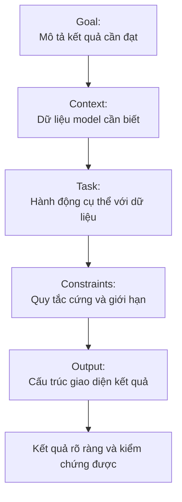
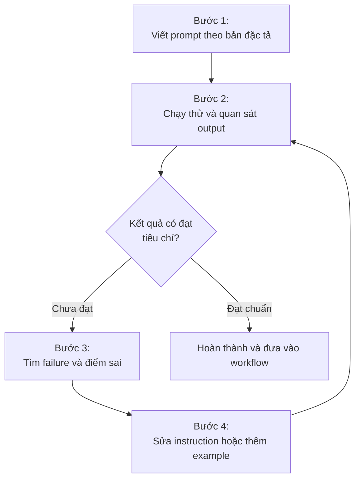


Một prompt tốt không cần trông phức tạp. Nó cần đủ rõ để cả người viết lẫn model biết thế nào là một kết quả đúng.


Chúng ta rất dễ biến prompt engineering thành việc sưu tầm template:

```text
Bạn là chuyên gia...
Hãy suy nghĩ từng bước...
Sử dụng XML...
Không được làm A, B, C...
```

Prompt cứ dài dần, nhưng kết quả chưa chắc ổn định hơn. Vấn đề thường nằm ở một chỗ đơn giản hơn: chúng ta chưa mô tả rõ mình muốn model làm gì.

---

## 1. Prompt tốt giống một bản đặc tả nhỏ

Một cấu trúc thực dụng có thể bắt đầu từ năm phần:

```text
Goal
Context
Task
Constraints
Output
```

Đây không phải framework bắt buộc. Một câu hỏi đơn giản có thể chỉ cần một dòng.

Nhưng khi task bắt đầu phức tạp, năm câu hỏi này giúp chúng ta phát hiện phần còn thiếu:

1. **Goal:** Chúng ta muốn đạt kết quả gì?
2. **Context:** Model cần biết dữ liệu nào?
3. **Task:** Model phải thực hiện việc gì với dữ liệu đó?
4. **Constraints:** Có giới hạn nào thực sự quan trọng?
5. **Output:** Kết quả cuối cùng phải trông như thế nào?

Sơ đồ năm thành phần của một bản đặc tả prompt:



Các survey về prompting cũng không chỉ ra một template duy nhất chiến thắng mọi tình huống. Báo cáo *The Prompt Report* tổng hợp 58 kỹ thuật prompting cho LLM, từ zero-shot, few-shot đến nhiều kỹ thuật reasoning và decomposition khác nhau. Điều đó phù hợp với một cách nhìn thực tế hơn: **prompting là một toolbox, không phải một công thức cố định**.

---

## 2. Goal phải mô tả kết quả, không chỉ đặt tên chủ đề

Prompt này không sai cú pháp:

```text
Nghiên cứu Docker.
```

Nhưng model phải tự quyết định gần như mọi thứ:
- Nghiên cứu phần nào;
- Cho ai;
- Sâu đến đâu;
- Dùng Docker vào việc gì;
- So sánh với cái gì.

Chúng ta có thể thu hẹp bài toán:

```text
So sánh Docker Compose và Kubernetes cho một ứng dụng cá nhân chạy trên một VPS.

Mục tiêu là xác định khi nào Kubernetes tạo thêm độ phức tạp mà không mang lại lợi ích thực tế.
```

Prompt thứ hai không dùng kỹ thuật đặc biệt nào. Nó đơn giản là giảm ambiguity.

Đây cũng là một pattern xuất hiện lặp lại trong các hướng dẫn prompting và thảo luận cộng đồng: **instruction rõ và cụ thể thường quan trọng hơn việc tìm một cách diễn đạt thông minh**.

---

## 3. Context quyết định model đang reasoning trên cái gì

Context là nền tảng dữ liệu cho quá trình suy luận:
- Nếu yêu cầu: `Review đoạn code này.` thì code chính là context.
- Nếu yêu cầu: `Tạo câu hỏi Active Recall từ video này.` thì transcript và timestamp là context.
- Nếu yêu cầu: `Viết lại đoạn này theo giọng của tôi.` thì draft gốc và writing samples mới là context quan trọng.

Chúng ta nên phân biệt rõ **instruction** với **data**.

Ví dụ phân tách rõ ràng giữa nhiệm vụ và dữ liệu nguồn:

```markdown
# Task
Tìm các assumption chưa được chứng minh trong ghi chú.

# Source
[Nội dung ghi chú]
```

Markdown ở đây không khiến model thông minh hơn. Nó chỉ làm ranh giới giữa các phần dễ nhận biết hơn.


Nghiên cứu *Lost in the Middle* cho thấy model có thể sử dụng thông tin ở đầu và cuối context tốt hơn thông tin nằm giữa một context dài. Vì vậy khả năng chứa hàng trăm nghìn token không đồng nghĩa với việc chúng ta nên đổ mọi thứ mình có vào prompt. **Context hữu ích quan trọng hơn context nhiều**.


---

## 4. Task nên bắt đầu từ một hành động cụ thể

Một prompt như:

```text
Giúp tôi với bài viết này.
```

không định nghĩa được model phải làm gì.

Có rất nhiều hành động khác nhau có thể xảy ra:

```text
Phân tích luận điểm của bài.
```

```text
Tìm các claim thiếu bằng chứng.
```

```text
Rút gọn bài nhưng giữ nguyên luận điểm.
```

```text
Tạo outline từ các ghi chú này.
```

```text
So sánh ba giải pháp và chỉ ra trade-off.
```

Động từ càng cụ thể, không gian model phải tự suy đoán càng nhỏ.

---

## 5. Constraint không phải nơi chứa mọi sở thích

Một lỗi phổ biến là biến prompt thành hàng chục dòng phủ định:

```text
Không làm A.
Không làm B.
Không làm C.
Không dùng X.
Không dùng Y.
Không được...
```

Một số constraint là cần thiết. Ví dụ:

```text
Chỉ sử dụng thông tin trong transcript.
Không tự tạo timestamp.
```

Đây là hard constraint vì vi phạm chúng khiến kết quả sai. Nhưng những preference như:

```text
Ưu tiên câu ngắn.
Tránh giải thích dài khi không cần.
```

không cùng mức độ quan trọng. Tách hai loại này giúp prompt dễ bảo trì hơn:

```markdown
# Rules
- Chỉ sử dụng transcript làm nguồn.
- Không tự tạo timestamp.

# Style
- Viết ngắn gọn.
- Mỗi câu hỏi chỉ kiểm tra một ý.
```

Quan trọng hơn, nên mô tả hành vi mong muốn khi có thể. Thay vì `Không viết dài dòng`, có thể viết: `Mỗi phần tối đa ba đoạn ngắn`. Câu thứ hai có thể kiểm chứng được.

---

## 6. Output nên được xem như một interface

Nếu chúng ta không nói kết quả phải trông như thế nào, model lại phải tự quyết định.

Ví dụ:

```text
So sánh PostgreSQL và MongoDB.
```

có thể tạo một bài essay dài. Nếu thứ chúng ta cần là thông tin phục vụ quyết định:

```markdown
# Output
Tạo bảng gồm:
- Tiêu chí;
- PostgreSQL;
- MongoDB;
- Khi nào khác biệt này quan trọng.

Sau bảng, đưa ra hai tình huống nên chọn PostgreSQL và hai tình huống nên chọn MongoDB.
```

Output lúc này có một contract rõ ràng.

Các hướng dẫn prompting cũng thường khuyến nghị mô tả trực tiếp format mong muốn. Khi format khó diễn đạt bằng instruction, đưa một example có thể giúp model học được pattern đầu ra ngay trong context.

---

## 7. Example hữu ích khi lời giải thích bắt đầu quá dài

Giả sử chúng ta cần format:

```text
[00:12:31] Pointer là gì?
```

Thay vì mất một đoạn dài giải thích thứ tự của timestamp, dấu ngoặc và câu hỏi, đôi khi chỉ cần cho model thấy:

```markdown
# Example
1. `[00:12:31]` Pointer là gì?
2. `[00:14:08]` Toán tử bitwise AND đang làm gì?
```

Few-shot prompting chính là cách cung cấp một hoặc nhiều cặp input và output mẫu để model suy ra pattern cần thực hiện. Tài liệu kỹ thuật về prompting thường khuyên bắt đầu bằng zero-shot, sau đó thêm example nếu instruction đơn thuần chưa tạo được kết quả ổn định.

Điều đó cũng giúp prompt không trở thành một cuốn rulebook. Một example tốt đôi khi diễn đạt được thứ chúng ta muốn tốt hơn mười dòng mô tả.

---

## 8. Role không thay thế requirement

Prompt thường bắt đầu bằng:

```text
Bạn là một chuyên gia hàng đầu thế giới về...
```

Role không hoàn toàn vô dụng. Nó có thể hữu ích khi chúng ta muốn model nhìn vấn đề từ một góc cụ thể:

```text
Review thiết kế này dưới góc nhìn của một database engineer.
```

Nhưng role không trả lời được:
- Review cái gì;
- Tiêu chí nào quan trọng;
- Source nào được phép sử dụng;
- Output cần gì.

Các báo cáo thực nghiệm từ cộng đồng cũng thường nhận thấy role prompting đứng riêng có tác động nhỏ khi nó không đi cùng goal, context và constraints cụ thể.

Vì vậy:

```text
Role + yêu cầu mơ hồ
```

không tốt hơn:

```text
Goal + context + task rõ ràng
```

chỉ vì prompt thứ nhất nghe chuyên nghiệp hơn.

---

## 9. Markdown, XML hay JSON không phải cuộc thi

Chúng ta đôi khi tranh luận format nào là "chuẩn prompt". Thực tế chúng giải quyết những vấn đề khác nhau:

- **Plain text** đủ cho task ngắn:
  ```text
  Giải thích decorator trong Python cho người mới.
  ```
- **Markdown** thuận tiện khi prompt có một số section độc lập:
  ```markdown
  # Goal
  ...
  # Source
  ...
  # Rules
  ...
  # Output
  ...
  ```
  Nó dễ đọc và dễ chỉnh bằng tay.
- **XML** hữu ích hơn khi có nhiều loại dữ liệu cần ranh giới rất rõ:
  ```xml
  <transcript>
  ...
  </transcript>

  <notes>
  ...
  </notes>

  <previous_answer>
  ...
  </previous_answer>
  ```
- **JSON** đặc biệt phù hợp khi output được một chương trình khác xử lý qua schema.

Không có lý do phải dùng XML cho `<task>Tóm tắt bài này.</task>` nếu một câu plain text đã đủ rõ. **Format phục vụ cấu trúc. Format không thay thế nội dung của prompt.**

---

## 10. Đừng biến mọi thứ thành một mega-prompt

Một task đôi khi thực sự gồm nhiều bài toán:

```text
Research  -->  Lọc nguồn  -->  Phân tích  -->  Chọn hướng  -->  Viết  -->  Review
```

Chúng ta có thể mô tả toàn bộ trong một prompt rất dài. Nhưng cũng có thể tách:

1. `Research --> Content Brief`
2. `Content Brief --> Draft`
3. `Draft --> Technical Review`

Một số người dùng LLM trong workflow thực tế báo cáo prompt chaining ổn định hơn các mega-prompt chứa rất nhiều trách nhiệm cùng lúc. Đây chưa phải bằng chứng rằng mọi task đều phải chia nhỏ, nhưng nó đưa ra một nguyên tắc hữu ích: **chỉ gộp những bước thật sự cần cùng context**.

---

## 11. Prompt tốt phải có cách biết nó thất bại

Đây có lẽ là chuẩn mực hữu ích nhất.

Prompt:

```text
Viết bài thật hay và chuyên nghiệp.
```

gần như không có test.

Prompt:

```text
Bài phải giải thích được:
- Vấn đề đang giải quyết;
- Cơ chế hoạt động;
- Một ví dụ;
- Trade-off;
- Trường hợp không nên sử dụng giải pháp.

Không đưa claim kỹ thuật nếu không xác minh được nguồn.
```

đã có success criteria. Chúng ta có thể đọc output và xác định rule nào đạt, rule nào không.

Prompt engineering vì vậy gần với một vòng lặp kỹ thuật:



thay vì: `Tìm template hoàn hảo --> Dùng cho mọi bài toán`.

---

## 12. Một baseline đủ dùng

Với phần lớn task có độ phức tạp vừa phải, chúng ta có thể bắt đầu từ:

```markdown
# Goal
Kết quả cuối cùng cần đạt.

# Context
Thông tin model cần để thực hiện task.

# Task
Những việc cần thực hiện.

# Rules
Các ràng buộc thực sự quan trọng.

# Output
Hình dạng của kết quả mong muốn.
```

Sau đó chỉ thêm thứ mới khi có lý do:
- Model liên tục hiểu sai format thì thêm example.
- Context có nhiều vùng dữ liệu khó phân biệt thì thêm delimiter hoặc XML.
- Task gồm nhiều bước độc lập thì tách workflow.
- Output được chương trình xử lý thì dùng schema.

Một prompt tốt không phải prompt sử dụng nhiều kỹ thuật nhất. Nó là prompt **chứa vừa đủ thông tin để giảm những quyết định mà model không nên tự đưa ra**, nhưng vẫn để model tự xử lý những phần mà chúng ta thực sự muốn nó suy luận.
