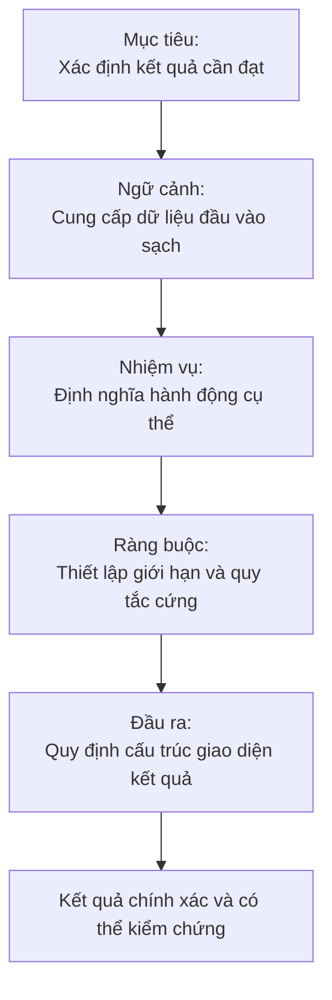
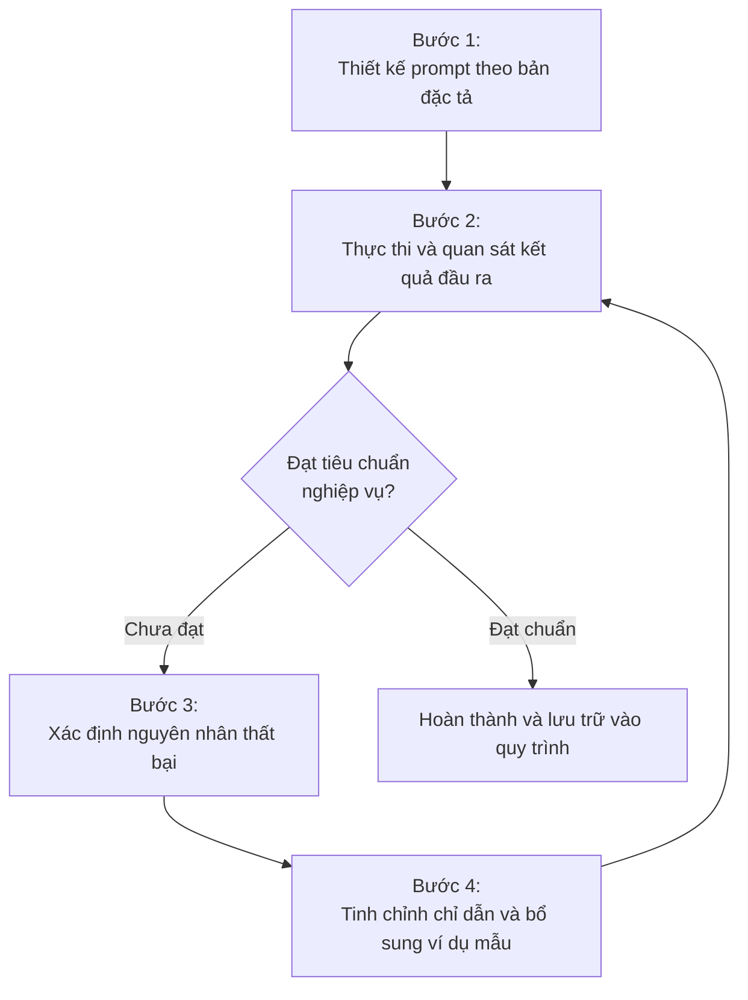


Một prompt tốt không cần trông phức tạp. Nó cần đủ rõ ràng để cả người viết lẫn mô hình ngôn ngữ lớn đều biết thế nào là một kết quả đúng.


Chúng ta rất dễ biến kỹ thuật viết prompt thành việc sưu tầm các khuôn mẫu có sẵn. Chúng ta nhồi nhét vào prompt đủ mọi câu lệnh quen thuộc:

```text
Bạn là chuyên gia hàng đầu thế giới...
Hãy suy nghĩ từng bước...
Sử dụng thẻ XML để bọc dữ liệu...
Tuyệt đối không được làm A, B, C...
```

Prompt cứ dài dần sau mỗi lần thử sai, nhưng kết quả đầu ra lại không hề ổn định hơn. Vấn đề thực chất nằm ở một điểm cốt lõi: chúng ta chưa mô tả rõ ràng mình muốn mô hình thực hiện điều gì. 

Bài viết này đi sâu vào cách tiếp cận prompt như một bản đặc tả kỹ thuật thu nhỏ, giúp chúng ta kiểm soát chất lượng đầu ra của các mô hình ngôn ngữ lớn một cách có hệ thống.

---

## 1. Bản chất: Prompt tốt giống một bản đặc tả kỹ thuật nhỏ

Khi xây dựng phần mềm, một bản đặc tả yêu cầu không bắt đầu bằng lời khen ngợi lập trình viên, mà bắt đầu bằng mục tiêu và ràng buộc nghiệp vụ. Với prompt cho mô hình ngôn ngữ lớn, một cấu trúc thực dụng có thể bắt đầu từ năm thành phần cốt lõi:

```text
Goal
Context
Task
Constraints
Output
```

Đây không phải là một công thức cứng nhắc. Một câu hỏi tra cứu thông thường có thể chỉ cần một dòng chỉ dẫn ngắn gọn. Tuy nhiên, khi tác vụ bắt đầu phức tạp và đòi hỏi độ chính xác cao, năm câu hỏi sau sẽ giúp chúng ta phát hiện ngay những mảnh ghép còn thiếu:

1. **Goal:** Chúng ta muốn đạt được kết quả gì cuối cùng?
2. **Context:** Mô hình cần tiếp nhận những dữ liệu nền tảng nào?
3. **Task:** Mô hình phải thực hiện hành động cụ thể gì trên dữ liệu đó?
4. **Constraints:** Có những giới hạn kỹ thuật và quy chuẩn nào thực sự quan trọng?
5. **Output:** Giao diện kết quả cuối cùng phải có cấu trúc như thế nào?

Sơ đồ luồng xử lý thông tin của một bản đặc tả prompt chuẩn:



Nghiên cứu *The Prompt Report* đã tổng hợp 58 kỹ thuật tương tác với mô hình ngôn ngữ lớn, từ zero-shot, few-shot cho đến các phương pháp suy luận đa tầng. Điều này chứng minh rằng kỹ thuật viết prompt là một hộp công cụ linh hoạt, không phải một khuôn mẫu bất biến áp dụng cho mọi bài toán.

---

## 2. Goal: Mô tả kết quả, không chỉ đặt tên chủ đề

Một câu lệnh ngắn gọn sau đây hoàn toàn không sai cú pháp:

```text
Nghiên cứu Docker.
```

Thế nhưng, câu lệnh này buộc mô hình phải tự phỏng đoán toàn bộ không gian bài toán:

- Nghiên cứu mảng kiến thức nào?
- Đối tượng thụ hưởng tài liệu là ai?
- Độ sâu kỹ thuật đến mức nào?
- Ứng dụng Docker vào tình huống thực tế nào?
- So sánh công nghệ này với giải pháp nào khác?

Chúng ta có thể thu hẹp bài toán bằng một mục tiêu rõ ràng:

```text
So sánh Docker Compose và Kubernetes cho một ứng dụng cá nhân chạy trên một máy chủ ảo VPS.

Mục tiêu là xác định khi nào Kubernetes tạo thêm độ phức tạp quản trị mà không mang lại lợi ích thực tế cho dự án.
```

Câu lệnh thứ hai không sử dụng bất kỳ thuật ngữ thần bí nào. Nó thành công vì đã triệt tiêu hoàn toàn sự mơ hồ. Chỉ dẫn rõ ràng và cụ thể luôn quan trọng hơn việc cố gắng tìm kiếm cách diễn đạt hoa mỹ.

---

## 3. Context: Quyết định phạm vi suy luận của mô hình

Dữ liệu ngữ cảnh quyết định trực tiếp chất lượng suy luận. Chúng ta cần phân định ranh giới giữa chỉ dẫn thực thi và dữ liệu nguồn:

- Khi chúng ta yêu cầu *Đánh giá đoạn mã nguồn này*, mã nguồn chính là ngữ cảnh.
- Khi chúng ta yêu cầu *Tạo bộ câu hỏi truy hồi chủ động từ video*, bản ghi âm kèm mốc thời gian chính là ngữ cảnh.
- Khi chúng ta yêu cầu *Viết lại đoạn văn theo văn phong cá nhân*, bản nháp ban đầu và các bài viết mẫu trước đây chính là ngữ cảnh.

Ví dụ về việc phân định ranh giới rõ ràng bằng cấu trúc Markdown:

```markdown
# Task
Tìm các giả định chưa được chứng minh bằng dữ liệu trong tài liệu ghi chú.

# Source
[Nội dung tài liệu ghi chú cần phân tích]
```

Cú pháp Markdown không làm mô hình thông minh hơn, nhưng nó giúp phân tách ranh giới dữ liệu một cách trực quan, tránh hiện tượng mô hình nhầm lẫn giữa chỉ dẫn điều khiển và dữ liệu cần xử lý.


Nghiên cứu *Lost in the Middle* chỉ ra rằng các mô hình ngôn ngữ lớn có xu hướng ghi nhớ và xử lý tốt nhất thông tin nằm ở phần đầu và phần cuối của ngữ cảnh. Thông tin nằm ở khoảng giữa rất dễ bị bỏ sót. Khả năng xử lý hàng trăm nghìn token không đồng nghĩa với việc chúng ta nên nhồi nhét mọi dữ liệu thô vào prompt. Ngữ cảnh tinh gọn và liên quan trực tiếp luôn vượt trội hơn ngữ cảnh dung lượng lớn nhưng loãng.


---

## 4. Task: Bắt đầu từ một động từ hành động cụ thể

Một yêu cầu mơ hồ như sau sẽ đẩy mô hình vào thế bị động:

```text
Giúp tôi với bài viết này.
```

Câu lệnh trên không đưa ra bất kỳ định nghĩa nào về hành động mong muốn. Chúng ta cần bắt đầu bằng các động từ hành động chuẩn xác:

Ví dụ về các động từ hành động cụ thể cho từng mục đích:

```text
Phân tích tính nhất quán trong các luận điểm của bài viết.
```

```text
Tìm các luận cứ kỹ thuật còn thiếu bằng chứng hoặc trích dẫn nguồn.
```

```text
Rút gọn độ dài bài viết xuống 50% nhưng giữ nguyên toàn bộ luận điểm cốt lõi.
```

```text
Xây dựng dàn ý chi tiết từ các đoạn ghi chú rời rạc này.
```

```text
So sánh ba giải pháp kiến trúc và chỉ rõ sự đánh đổi về chi phí hạ tầng.
```

Động từ hành động càng cụ thể, không gian suy đoán tự do của mô hình càng thu hẹp, giúp kết quả đầu ra đi đúng trọng tâm.

---

## 5. Constraints: Phân biệt quy tắc cứng và sở thích định dạng

Một lỗi phổ biến là biến phần ràng buộc thành một danh sách phủ định tràn lan:

```text
Không làm A.
Không làm B.
Không làm C.
Không dùng thuật ngữ X.
Không dùng thư viện Y.
Không được viết dài...
```

Chúng ta cần phân tách rõ ràng giữa quy tắc kỹ thuật bắt buộc và sở thích định dạng:

Ví dụ về cấu trúc phân định rõ ràng giữa quy tắc cứng và phong cách:

```markdown
# Rules
- Chỉ sử dụng dữ liệu từ bản ghi âm đính kèm làm nguồn trích dẫn duy nhất.
- Không tự ý suy diễn hoặc khởi tạo các mốc thời gian không có trong nguồn.

# Style
- Hành văn súc tích, trực diện.
- Mỗi câu hỏi kiểm tra duy nhất một khái niệm kỹ thuật.
```


Thay vì đưa ra chỉ dẫn phủ định mơ hồ như *Không viết dài dòng*, chúng ta nên chuyển thành yêu cầu định lượng có thể kiểm tra: *Mỗi phần trình bày tối đa ba đoạn văn ngắn, mỗi đoạn không quá bốn câu*.


---

## 6. Output: Giao diện dữ liệu có hợp đồng rõ ràng

Nếu chúng ta không định nghĩa cấu trúc kết quả đầu ra, mô hình sẽ tự chọn định dạng mặc định, thường là các đoạn văn dài khó tái sử dụng.

Ví dụ yêu cầu so sánh chưa có định dạng:

```text
So sánh cơ sở dữ liệu PostgreSQL và MongoDB.
```

Yêu cầu trên thường tạo ra một bài luận chung chung. Khi chúng ta cần thông tin phục vụ việc ra quyết định kỹ thuật, hãy thiết lập một hợp đồng đầu ra rõ ràng:

Ví dụ về cấu trúc đầu ra có giao diện cụ thể:

```markdown
# Output
Tạo bảng so sánh bao gồm bốn cột:
- Tiêu chí đánh giá
- PostgreSQL
- MongoDB
- Tình huống khác biệt này trở nên quan trọng

Ngay sau bảng, liệt kê chính xác hai kịch bản kiến trúc nên chọn PostgreSQL và hai kịch bản nên chọn MongoDB kèm lý do kỹ thuật.
```

Khi định dạng quá phức tạp để diễn đạt bằng lời, việc cung cấp một vài ví dụ mẫu Few-shot sẽ giúp mô hình nắm bắt quy luật nhanh chóng:

Ví dụ về việc cung cấp dữ liệu mẫu:

```markdown
# Example
1. `[00:12:31]` Khái niệm con trỏ bộ nhớ là gì?
2. `[00:14:08]` Toán tử AND theo bit thực hiện tác vụ gì trong đoạn mã?
```

Cung cấp mẫu đầu ra cụ thể giúp mô hình hiểu cấu trúc ngay lập tức mà không cần chúng ta phải viết thêm nhiều dòng giải thích quy tắc rườm rà.

---

## 7. Đánh giá đúng vai trò của Role Prompting

Nhiều người có thói quen mở đầu prompt bằng những câu như:

```text
Bạn là một chuyên gia kỹ thuật hàng đầu thế giới về tối ưu hóa cơ sở dữ liệu...
```

Việc gán vai trò không hoàn toàn vô ích. Nó giúp mô hình điều chỉnh trường từ vựng và lăng kính tiếp cận vấn đề:

```text
Đánh giá bản thiết kế kiến trúc này dưới góc nhìn của một kỹ sư tối ưu hóa cơ sở dữ liệu quy mô lớn.
```

Tuy nhiên, việc chỉ khai báo vai trò sẽ không trả lời được các câu hỏi then chốt: đánh giá thành phần nào, tiêu chí nào là tiên quyết, nguồn dữ liệu nào được phép dùng và cấu trúc đầu ra cần gì.

```text
Role + Yêu cầu mơ hồ  ==>  Kết quả chung chung, không thể ứng dụng
Goal + Context + Task rõ ràng  ==>  Kết quả chuẩn xác và có thể kiểm tra
```

---

## 8. Lựa chọn định dạng: Plain Text, Markdown, XML hay JSON?

Mỗi định dạng dữ liệu sinh ra để giải quyết một bài toán cấu trúc khác nhau:

- **Plain Text:** Đủ dùng cho các tác vụ đơn giản, ngắn gọn và một bước thực thi.
- **Markdown:** Rất thuận tiện khi prompt có nhiều phân mục độc lập như Goal, Context, Task, Output vì dễ đọc và dễ chỉnh sửa thủ công.
- **XML:** Đặc biệt hữu ích khi cần phân định ranh giới tuyệt đối giữa nhiều khối dữ liệu lớn, tránh xung đột giữa câu lệnh điều khiển và nội dung tài liệu.
- **JSON:** Lựa chọn bắt buộc khi kết quả đầu ra cần được truyền trực tiếp vào các hàm xử lý mã nguồn hoặc API tự động.

Ví dụ về việc sử dụng thẻ XML để đóng gói dữ liệu phức tạp:

```xml
<context>
  <system_log>
    2026-08-31 10:00:00 ERROR Connection timeout on port 5432
  </system_log>
  <source_code>
    db = connect_database(timeout=5)
  </source_code>
</context>

<task>
Xác định nguyên nhân gây lỗi và đề xuất phương án xử lý cấu hình kết nối.
</task>
```

Định dạng sinh ra để phục vụ cấu trúc thông tin. Cấu trúc không thể thay thế cho bản chất nội dung của yêu cầu.

---

## 9. Tách chuỗi xử lý thay vì nhồi nhét vào Mega-Prompt

Một quy trình kỹ thuật hoàn chỉnh thường bao gồm nhiều giai đoạn:

```text
Thu thập dữ liệu  -->  Lọc nguồn  -->  Phân tích  -->  Chọn giải pháp  -->  Viết mã  -->  Kiểm thử
```

Nếu nhồi nhét toàn bộ các bước trên vào một câu lệnh duy nhất, mô hình rất dễ bị quá tải sự chú ý và tạo ra kết quả hời hợt ở các bước sau. Giải pháp tối ưu là chia nhỏ thành một chuỗi các bước độc lập:

1. **Bước 1:** `Thu thập dữ liệu --> Bản tóm tắt yêu cầu`
2. **Bước 2:** `Bản tóm tắt yêu cầu --> Bản thiết kế kỹ thuật`
3. **Bước 3:** `Bản thiết kế kỹ thuật --> Mã nguồn và kịch bản kiểm thử`

Chúng ta chỉ nên gộp các bước vào cùng một prompt khi chúng thực sự chia sẻ cùng một ngữ cảnh làm việc tại thời điểm tức thì.

---

## 10. Vòng lặp phản hồi: Prompt tốt phải có tiêu chí đánh giá thất bại

Một câu lệnh không có tiêu chí kiểm thử:

```text
Viết cho tôi một bài phân tích thật hay và chuyên nghiệp về kiến trúc vi dịch vụ.
```

Chúng ta không có bất kỳ căn cứ khách quan nào để xác định kết quả sinh ra là đạt hay không đạt. Ngược lại, một câu lệnh có tiêu chí kiểm thử rõ ràng:

```markdown
# Acceptance Criteria
Bài viết phải đáp ứng đầy đủ các tiêu chuẩn sau:
- Giải thích rõ ràng bài toán thực tế mà kiến trúc vi dịch vụ giải quyết.
- Trình bày cơ chế giao tiếp bất đồng bộ qua hàng đợi thông điệp.
- Đưa ra một ví dụ cấu hình triển khai cụ thể.
- Phân tích chi tiết sự đánh đổi về tính nhất quán dữ liệu.
- Liệt kê hai trường hợp kiến trúc nguyên khối monolithic vượt trội hơn.
```

Với bản đặc tả này, chúng ta có thể đối soát từng tiêu chí để khẳng định mô hình đã hoàn thành nhiệm vụ hay chưa.

Quy trình tối ưu hóa prompt là một vòng lặp kỹ thuật liên tục:



---

## 11. Cấu hình mẫu khởi đầu cho mọi tác vụ

Đối với phần lớn các tác vụ có độ phức tạp vừa và lớn, chúng ta có thể sử dụng bộ khung đặc tả chuẩn sau đây:

```markdown
# Goal
Kết quả cuối cùng cần đạt được là gì.

# Context
Dữ liệu và tài liệu nền tảng mô hình cần sử dụng để xử lý.

# Task
Các hành động cụ thể cần thực hiện trên dữ liệu ngữ cảnh.

# Rules
Các ràng buộc kỹ thuật bắt buộc và quy chuẩn an toàn.

# Output
Cấu trúc giao diện và định dạng chính xác của kết quả mong muốn.
```

Từ bộ khung nền tảng này:
- Nếu mô hình hiểu sai cấu trúc: bổ sung một ví dụ mẫu đầu vào và đầu ra.
- Nếu ngữ cảnh có nhiều khối dữ liệu lẫn lộn: sử dụng thẻ XML để phân định.
- Nếu tác vụ có nhiều giai đoạn phức tạp: tách thành chuỗi các câu lệnh tuần tự.
- Nếu kết quả cần chuyển cho hệ thống khác xử lý: yêu cầu trả về định dạng JSON schema chuẩn.

Một prompt xuất sắc không phải là một câu lệnh sử dụng nhiều mẹo vặt nhất, mà là một bản đặc tả chứa vừa đủ thông tin để giảm thiểu tối đa những suy đoán tự do không cần thiết của mô hình.
