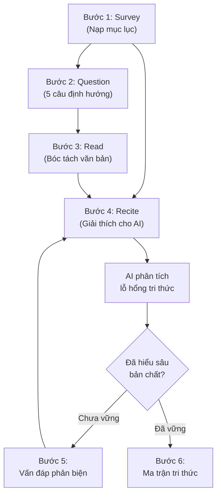

Bạn nạp một tài liệu học thuật vài chục trang vào mô hình AI, hy vọng nó sẽ giúp bạn bóc tách từng luồng tư duy phức tạp. Nhưng kết quả trả về thường là một bản tóm tắt nông cạn, bỏ sót hoàn toàn những luận điểm sắc bén nằm ở giữa văn bản, hoặc nguy hiểm hơn là tự bịa ra thông tin. Đây là rào cản chung khi chúng ta cố gắng biến AI thành người thầy cá nhân: sự hời hợt do giới hạn của không gian ngữ cảnh và thói quen đọc thụ động của não bộ.

Để biến mô hình ngôn ngữ từ một công cụ tóm tắt thành một cỗ máy ép buộc chúng ta đào sâu tri thức, chúng ta không thể dùng những câu lệnh giao tiếp thông thường. Việc này đòi hỏi một hệ thống kỹ thuật tạo câu lệnh có cấu trúc và một quy trình học chủ động kết hợp giữa SQ3R và vòng lặp Feynman tương tác.

## Sự Hời Hợt Của Không Gian Ngữ Cảnh Lớn

Mặc dù các mô hình ngôn ngữ hiện tại sở hữu cửa sổ ngữ cảnh lên tới hàng triệu token, việc nạp nguyên một cuốn sách vào hệ thống không mang lại hiệu quả như mong đợi. Các nghiên cứu thực nghiệm chỉ ra rằng khả năng truy xuất thông tin của mô hình có hình chữ U (Lost in the Middle). Hệ thống nhớ rất rõ dữ liệu ở đầu văn bản (định kiến ưu tiên đầu) và ở cuối văn bản (định kiến ưu tiên đuôi), nhưng khả năng ghi nhớ sẽ sụt giảm nghiêm trọng đối với dữ liệu nằm từ mức 20% đến 80% độ dài ngữ cảnh.


Khi những chi tiết quan trọng nhất bị vùi lấp ở giữa văn bản dài, khả năng truy xuất chính xác giảm sút mạnh. Mô hình có xu hướng dùng dữ liệu đã được huấn luyện sẵn để tự động điền vào khoảng trống, dẫn đến việc bịa đặt thông tin thay vì bám sát vào tài liệu thực chứng.


Thay vì nhồi nhét toàn bộ cuốn sách thụ động, chiến lược tối ưu là phân đoạn ngữ cảnh, mỗi lần xử lý chỉ nên nạp từ 2000 đến 4000 token và phải đặt các chỉ dẫn phân tích quan trọng ở cả đầu và cuối câu lệnh để duy trì trọng số chú ý.

## Kiến Trúc 5 Trụ Cột Kiểm Soát Ngữ Cảnh

Để ép buộc mô hình tuân thủ giới hạn của tài liệu và giảm thiểu triệt để sự sai lệch, chúng ta cần một rào chắn kỹ thuật vững chắc. Kiến trúc năm trụ cột dưới đây được thiết kế để định hướng chính xác không gian tìm kiếm của mô hình:

1. **System Role Persona:** Kích hoạt vùng chuyên môn bằng cách chỉ định vai trò cấp cao cụ thể.
2. **Core Objective Task:** Xác định mục tiêu cốt lõi bằng các động từ hành động dứt khoát như Bóc tách, Trích xuất, Phản biện.
3. **Grounding Context:** Neo giữ phản hồi vào dữ liệu thực chứng thông qua văn bản gốc nạp vào.
4. **Negative Constraints:** Đặt ranh giới nghiêm ngặt về những điều tuyệt đối không được làm để chặn các câu giao tiếp xã giao thừa mứa.
5. **Strict Output Schema:** Ép buộc mô hình xuất dữ liệu theo định dạng cố định để tối ưu hóa việc ghi chú và lưu trữ.


Bên cạnh cấu trúc câu lệnh, việc kiểm soát tham số đóng vai trò quyết định. Nếu cần độ chính xác tuyệt đối để trích xuất công thức khoa học, hãy hạ Temperature xuống mức từ 0.0 đến 0.2. Ngược lại, nếu muốn AI liên tưởng và so sánh đa chiều giữa các học thuyết triết học, hãy nâng Temperature lên mức từ 0.7 đến 0.9.


## Sơ Đồ Vận Hành Chuẩn Hóa: Tích Hợp SQ3R Và Vòng Lặp Feynman

Để quy trình đọc hiểu không bị đứt gãy, chúng ta kết hợp hai phương pháp giáo dục học kinh điển vào một luồng dữ liệu khép kín: SQ3R xử lý định hướng vĩ mô và bóc tách tài liệu, trong khi Vòng lặp Feynman tương tác đóng vai trò máy vạch lá tìm sâu các lỗ hổng tri thức.



## Quy Trình 5 Bước Sử Dụng Bộ Prompt Thực Chiến

Bộ 5 prompt thực chiến dưới đây được thiết kế truyền dữ liệu nối tiếp nhau: đầu ra của bước trước làm đầu vào cho bước sau, đảm bảo không bị rời rạc.

### Bước 1: Khảo sát mục lục và tạo hệ thống câu hỏi định hướng (SQ3R Survey)

Trước khi đọc chi tiết, chúng ta nạp mục lục và lời nói đầu vào AI để xây dựng bộ câu hỏi kích thích tư duy tìm kiếm của não bộ:

```text
Bạn là một Chuyên gia Nhận thức luận. Hãy phân tích mục lục và lời nói đầu của cuốn sách dưới đây để tạo ra một khung định hướng đọc hiểu.

Dữ liệu đầu vào:
[DÁN MỤC LỤC VÀ LỜI NÓI ĐẦU Ô ĐÂY]

Yêu cầu đầu ra:
1. Khung Kiến Trúc Tri Thức: Tóm tắt 3 đến 5 trụ cột nội dung chính của cuốn sách.
2. 5 Câu Hỏi Định Hướng SQ3R: Đặt 5 câu hỏi trọng tâm mà người đọc bắt buộc phải tìm được câu trả lời sau khi hoàn thành cuốn sách.
3. Danh Sách Thuật Ngữ Tiềm Năng: Liệt kê các khái niệm cốt lõi cần chú ý.
```

### Bước 2: Bóc tách nội dung chương sách chống trôi ngữ cảnh (Read)

Khi đọc từng chương dài, chúng ta dùng prompt này để ép AI rà soát đồng đều cả 3 vùng đầu, giữa và cuối của tài liệu, tránh bỏ sót các luận điểm quan trọng ở giữa:

```text
Bạn là Chuyên gia Trích xuất Tri thức Ngữ cảnh Dài. Hãy đọc chương sách dưới đây và trích xuất thông tin đồng đều ở cả 3 vùng: Phần Đầu, Phần Giữa và Phần Cuối.

[DÁN NỘI DUNG CHƯƠNG SÁCH Ô ĐÂY]

Phản hồi bắt buộc tuân theo bảng sau:
- Vị trí (Phần Đầu / Phần Giữa / Phần Cuối)
- Luận Điểm Cốt Lõi
- Bằng Chứng Thực Chứng Hoặc Lập Luận Bổ Trợ
- 3 Chi Tiết Quan Trọng Nhất Nằm Ở Giữa Văn Bản
```

### Bước 3: Kích hoạt Vòng lặp Feynman tự giải thích (Recite)

Sau khi đọc lướt xong, chúng ta tự viết lại khái niệm theo cách hiểu của mình và gửi cho AI đóng vai người học 10 tuổi để vạch lá tìm sâu các lỗ hổng tư duy:

```text
Bạn là một Giám khảo Kiểm tra Tri thức theo Phương pháp Feynman. Bạn đóng vai một người học chưa có kiến thức nền tảng, có tư duy logic sắc bén và luôn tìm kiếm sự rõ ràng.

Tôi đang học về chủ đề [TÊN_KHÁI_NIỆM]. Tôi sẽ tự giải thích khái niệm này theo cách hiểu của tôi. Nhiệm vụ của bạn là phân tích lời giải thích của tôi, chỉ ra các khoảng trống tri thức, các từ ngữ phức tạp tôi dùng nhưng chưa hiểu bản chất, và yêu cầu tôi tinh chỉnh.

Bắt đầu bằng việc xác nhận ngắn gọn: "Tôi đã sẵn sàng. Hãy giải thích khái niệm [TÊN_KHÁI_NIỆM] cho tôi như thể tôi là một học sinh 10 tuổi."
Sau khi tôi gửi câu trả lời, hãy phân tích theo 3 góc độ:
1. Điểm chính xác: Những phần tôi đã hiểu đúng.
2. Lỗ hổng Tri thức: Những phần tôi giải thích sai, bịa đặt hoặc bỏ sót.
3. Thuật ngữ dư thừa: Những từ ngữ chuyên ngành tôi dùng mà không giải thích được cơ chế.

Đặt lại cho tôi đúng 2 câu hỏi làm rõ tập trung vào lỗ hổng lớn nhất. Chờ tôi trả lời rồi mới tiếp tục vòng lặp.
```

### Bước 4: Vấn đáp Socratic phá vỡ các giả định ngầm (Critical Review)

Đối với các đoạn văn bản triết học hoặc lập luận phức tạp, chúng ta chuyển sang prompt Socratic để AI liên tục đặt câu hỏi phản biện, ép chúng ta phải quay lại tài liệu gốc để đào sâu:

```text
Bạn là Triết gia Socratic. Mục tiêu của bạn không phải là cung cấp câu trả lời, mà là dùng chuỗi câu hỏi vấn đáp để giúp tôi tự nhận ra các giới hạn và mâu thuẫn trong cách hiểu của mình về cuốn sách.

Đoạn văn bản tôi đang nghiên cứu:
[DÁN ĐOẠN VĂN BẢN TRONG SÁCH]

Không tóm tắt lại đoạn văn bản. Hãy đưa ra 1 câu hỏi duy nhất đánh thẳng vào giả định ẩn sâu nhất mà tác giả hoặc tôi đang thừa nhận trong đoạn văn trên.
Chờ câu trả lời của tôi. Khi tôi trả lời, hãy sử dụng kỹ thuật Bác bỏ Socratic để chỉ ra điểm mâu thuẫn logic trong câu trả lời của tôi và đặt câu hỏi tiếp theo.
Duy trì cuộc hội thoại vấn đáp này cho đến khi tôi tự rút ra được bản chất gốc rễ của vấn đề.
```

### Bước 5: Tổng hợp sơ đồ và xây dựng ma trận tri thức (Review and Concept Mapping)

Ở bước cuối cùng, chúng ta yêu cầu AI chuyển đổi toàn bộ tri thức đã thẩm thấu thành ma trận mối quan hệ và cây tri thức trực quan để ghi nhớ lâu dài:

```text
Bạn là một Kiến trúc sư Tri thức. Nhiệm vụ của bạn là chuyển đổi các đoạn văn bản tuyến tính thành ma trận quan hệ mạng lưới nhằm phục vụ việc ghi nhớ thị giác và xây dựng sơ đồ tư duy.

[DÁN NỘI DUNG SÁCH CẦN MÔ HÌNH HÓA]

Hãy chuyển đổi nội dung trên thành cấu trúc dữ liệu sau:
1. Ma Trận Tương Quan Khái Niệm: Trình bày mối quan hệ nối tiếp, đối lập hoặc nguyên nhân giữa các khái niệm.
2. Cây Tri Thức Cấu Trúc: Gồm các khái niệm trụ cột và các nhánh cấu thành.
3. Kịch Bản Tự Kiểm Tra Siêu Nhận Thức: Tạo 2 tình huống thực tế yêu cầu người đọc phải áp dụng đúng cây tri thức trên để giải quyết vấn đề.
```

## Kết Luận

Việc làm chủ các kỹ thuật tạo câu lệnh không chỉ cải thiện chất lượng câu trả lời của hệ thống AI mà còn tái định hình toàn bộ cách chúng ta tư duy và xử lý thông tin. Từ một người đọc thụ động, chúng ta trở thành những kiến trúc sư tri thức, sử dụng công nghệ mô phỏng đa chiều để tự rà soát, phản biện và mở rộng năng lực nhận thức của chính mình.
