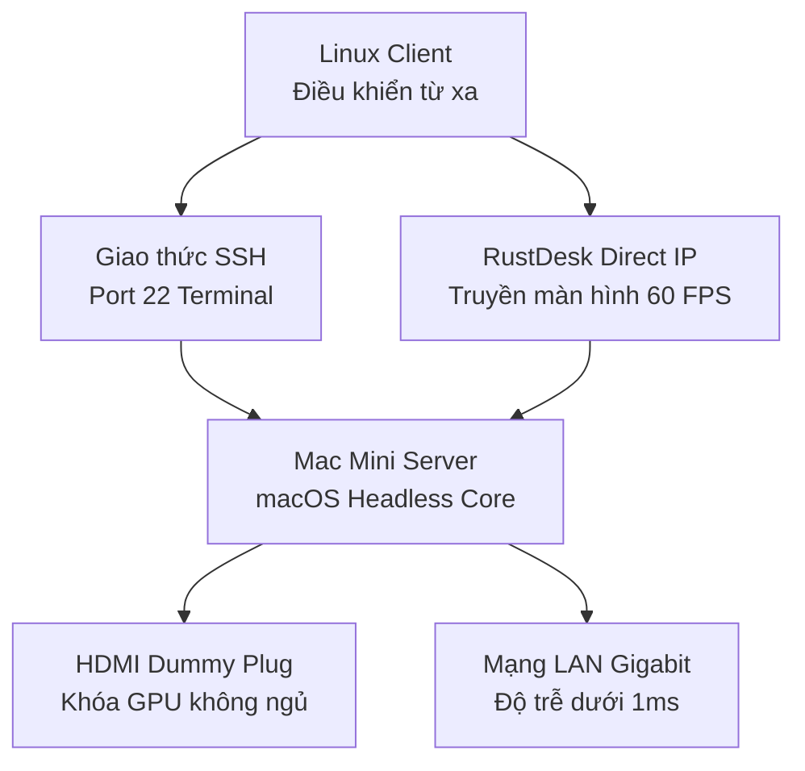

> [!TLDR]
> Khi vận hành Mac Mini dạng Headless Server mà không cắm màn hình, chip đồ họa GPU tự động ngắt xuất hình khiến RustDesk tụt sâu xuống 2–5 FPS, đồng thời máy kẹt ở màn hình đăng nhập sau mỗi lần mất điện. Bài viết hướng dẫn cách dùng HDMI Dummy Plug, khởi chạy RustDesk ở chế độ User App 60 FPS và cấu hình tự khôi phục sau sự cố nguồn.

Khi vận hành Mac Mini dạng Headless Server mà không cắm màn hình, chuột hay bàn phím, hệ thống thường vấp phải hai rào cản: chip đồ họa GPU tự động ngắt xuất hình khiến remote desktop tụt sâu xuống 2–5 FPS, và máy bị kẹt ở màn hình đăng nhập sau mỗi lần khởi động lại do mất điện.

Dưới đây là giải pháp kỹ thuật giải quyết hiện tượng nghẽn hiệu năng render, đồng thời xây dựng cơ chế tự khôi phục dịch vụ để điều khiển Mac Mini từ máy Linux qua RustDesk và SSH.

---

## Hiện tượng nghẽn hiệu năng trên macOS headless



Khi không nhận diện được màn hình vật lý cắm trực tiếp, macOS tự động tắt hoặc hạ xung nhịp GPU để tiết kiệm năng lượng. Hệ quả là giao diện truyền về qua các công cụ remote desktop bị giật lag nghiêm trọng. Đồng thời, việc cài đặt RustDesk dạng System Service ngầm trên macOS thường bị cơ chế bảo mật phần cứng bóp hiệu năng render xuống 2–5 FPS.

### Phần cứng cần chuẩn bị

> [!IMPORTANT]
> - **HDMI Dummy Plug:** Đánh lừa macOS rằng đang có màn hình kết nối. Thiếu thiết bị này, GPU của Mac sẽ đi vào chế độ ngủ và bóp FPS xuống mức không thể thao tác.
> - **Cáp mạng LAN:** Sử dụng kết nối dây thay vì Wi-Fi để đảm bảo độ trễ trong mạng nội bộ luôn dưới 1ms.
> - **Màn hình, bàn phím, chuột thật:** Chỉ sử dụng một lần duy nhất cho quá trình thiết lập ban đầu.

---

## Cấu hình tự khôi phục hệ thống sau sự cố nguồn

Để Mac Mini tự khởi động vào thẳng Desktop và kích hoạt RustDesk ngay khi có điện trở lại sau sự cố, chúng ta thực hiện 4 bước thiết lập dưới đây.

### Tự động mở máy khi có điện (Auto Power On)
Truy cập **System Settings > Energy Saver** (hoặc Lock Screen), tích chọn **Start up automatically after a power failure**.

Mở Terminal trên Mac và chạy lệnh sau để ép hệ thống tự khởi động lại:

```bash
sudo pmset autorestart 1
```

### Tự động đăng nhập (Automatic Login)
Nếu không bật tự động đăng nhập, hệ thống sẽ dừng lại ở màn hình nhập mật khẩu User, ngăn cản các dịch vụ điều khiển từ xa truyền hình ảnh về máy Linux Client.

1. Vào **System Settings > Users và Groups**.
2. Nhấp chọn **Login Options** ngay bên dưới danh sách tài khoản.
3. Tại mục **Automatic login**, chuyển từ Off sang Tên tài khoản mong muốn và nhập mật khẩu xác nhận.

> [!WARNING]
> Nếu mục Automatic login bị ẩn xám không chọn được, cần tắt FileVault trước tại **System Settings > Privacy và Security > FileVault**.

### Cố định địa chỉ IP trong mạng nội bộ
Giúp máy Linux luôn tìm thấy Mac Mini ở một địa chỉ IP cố định.

1. Vào **System Settings > Network > Ethernet > Advanced...**
2. Chuyển sang tab **TCP/IP**:
   - **Configure IPv4:** Đổi từ Using DHCP sang **Using DHCP with manual address**.
   - **IPv4 Address:** Nhập IP mong muốn (Ví dụ: `192.168.1.63`).
3. Nhấn **OK** và bấm **Apply** để lưu.

### Kích hoạt dịch vụ SSH
Vào **System Settings > General > Sharing**, tích bật công tắc **Remote Login** để cho phép quản trị bằng dòng lệnh từ Linux.

---

## Cấu hình RustDesk đạt 60 FPS

Tải file `.dmg` từ [trang chủ RustDesk](https://rustdesk.com) và kéo vào thư mục Applications.

### Cấp quyền hệ thống
Vào **System Settings > Privacy và Security** để cấp quyền cho RustDesk:
- **Screen Recording:** Cho phép RustDesk ghi và truyền hình ảnh màn hình.
- **Accessibility:** Cho phép RustDesk nhận lệnh gõ phím và click chuột.

> [!TIP]
> Nếu đã bật quyền mà máy Linux vẫn không thao tác được chuột: Hãy xóa RustDesk khỏi danh sách bằng dấu `-`, bấm dấu `+` để thêm lại RustDesk từ thư mục Applications, sau đó khởi động lại Mac Mini.

### Khởi chạy dạng User App để đạt 60 FPS
> [!CAUTION]
> Không bấm nút **Install Service** trong ứng dụng RustDesk trên Mac Mini. Cơ chế System Service ngầm của macOS thường bị bóp phần cứng render, dẫn đến sụt giảm xuống 2–5 FPS.

1. Mở RustDesk trên Mac Mini.
2. Vào **Settings > Security > Unlock Security Settings**, chọn **Use permanent password** để đặt mật khẩu cố định.
3. Tích chọn **Enable direct IP access** để cho phép kết nối thẳng qua IP nội bộ.
4. Thêm RustDesk vào danh sách khởi động cùng hệ thống: Vào **System Settings > General > Login Items**, tại mục **Open at Login** bấm dấu `+` và chọn ứng dụng RustDesk từ thư mục Applications.

Nhờ đã bật Auto-Login ở bước trước, khi cấp điện trở lại, macOS sẽ tự động mở ứng dụng RustDesk ở chế độ thường, giải phóng hoàn toàn GPU và đạt hiệu năng 60 FPS.

---

## Tối ưu hiệu năng truyền tải trên máy Linux Client

Khi kết nối từ máy Linux, điều chỉnh các thông số trong RustDesk (**Settings > Display**):

- **Default image quality:** Chọn **Optimize reaction time** để tối ưu tốc độ phản hồi.
- **Default codec:** Chọn **H264** (hoặc AV1 / H265 tùy theo card màn hình của máy Linux).
- **Hardware Acceleration:** Tích bật tất cả các ô tăng tốc phần cứng.
- **Show remote cursor:** Tắt tùy chọn này để loại bỏ cảm giác trễ con trỏ chuột.

Trên Mac Mini, vào **System Settings > Displays**, đặt độ phân giải về chuẩn `1920 x 1080` (1080p) và cố định **Refresh Rate** ở mức `60Hz`.

> [!NOTE]
> RustDesk sử dụng cơ chế FPS động: Khi màn hình không có chuyển động, chỉ số sẽ tự động hạ về 2–5 FPS để giảm tải băng thông mạng. Khi rê chuột liên tục hoặc mở video, chỉ số này lập tức tăng lên 30–60 FPS.

---

## Quy trình kết nối và vận hành thực tế

### Kết nối giao diện đồ họa GUI
Mở RustDesk trên máy Linux:
1. Nhập IP nội bộ: `192.168.1.63` (hoặc ID 9 chữ số) cùng mật khẩu cố định đã tạo.
2. Đồng bộ phím bấm: Trên thanh công cụ RustDesk, chọn **Input > Map phím Ctrl (Linux) thành Command (Mac)** để thao tác bàn phím tự nhiên.

### Kết nối dòng lệnh SSH
Mở Terminal trên máy Linux và thực hiện:

```bash
ssh username_mac@192.168.1.63
```

### Chuyển sang chế độ Headless hoàn toàn
1. Tắt nguồn Mac Mini.
2. Rút toàn bộ màn hình, chuột và bàn phím thật.
3. Cắm **HDMI Dummy Plug** vào cổng HDMI và cắm dây mạng LAN.
4. Bật nguồn lại. Hệ thống sẽ tự khởi động vào Desktop, tự chạy RustDesk và sẵn sàng tiếp nhận kết nối ngay cả khi bị rút phích cắm đột ngột.

---

## Bài học thực tế

- **Giải quyết triệt để bóp GPU:** Việc kết hợp HDMI Dummy Plug và cho RustDesk chạy dưới dạng Login Item (thay vì System Service) là chìa khóa để duy trì tốc độ truyền hình ảnh 60 FPS mượt mà.
- **Tính sẵn sàng của hệ thống:** Cấu hình đồng bộ giữa `pmset`, Auto-Login và Static IP giúp server tự phục hồi trạng thái sẵn sàng kết nối mà không cần can thiệp thủ công tại thiết bị.

