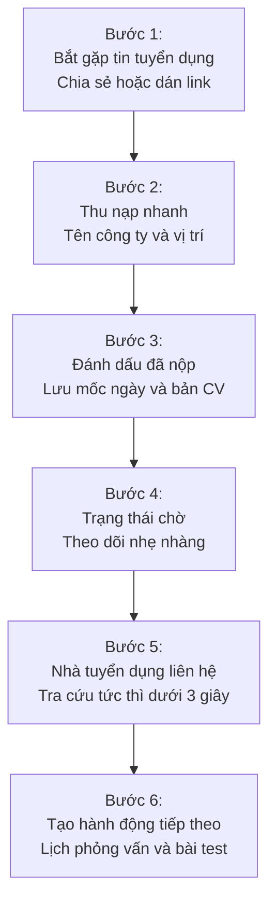
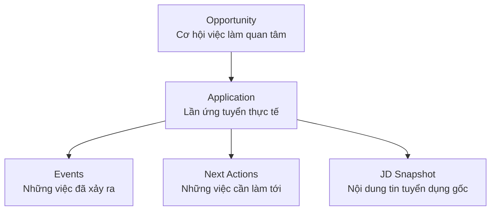

> **One-liner:** Job Hunt OS là ứng dụng di động ghi nhớ và quản lý tiến trình tìm việc cá nhân, giúp người ứng tuyển lưu giữ nhanh tin tuyển dụng, phiên bản CV đã nộp và khôi phục bối cảnh tức thì khi nhà tuyển dụng liên hệ.

## 1. Tổng quan dự án

### Ý tưởng cốt lõi
Trong quá trình tìm kiếm việc làm, đặc biệt là giai đoạn chuyển tiếp từ sinh viên năm cuối lên fresher hoặc junior, ứng viên thường rải hồ sơ đồng thời vào 20 đến 50 vị trí khác nhau qua LinkedIn, TopCV, ITviec, email và referral. Khi số lượng cơ hội tăng lên, thông tin bắt đầu phân mảnh nghiêm trọng: ứng viên không nhớ đã gửi phiên bản CV nào, bài đăng tuyển dụng gốc đã bị gỡ hay nhà tuyển dụng đang gọi điện phỏng vấn cho vị trí cụ thể nào.

Job Hunt OS được định nghĩa với nguyên lý sản phẩm nhất quán:
> **Less CRM. More memory.** — Không biến người tìm việc thành nhân viên nhập liệu cho một bảng tính phức tạp, mà đóng vai trò như một lớp ghi nhớ thông minh và chỉ dẫn bước hành động tiếp theo.

### Đối tượng mục tiêu
- **Trọng tâm kiểm chứng:** Sinh viên năm cuối và fresher đang theo đuổi nhiều cơ hội việc làm song song, bắt đầu xuất hiện tình trạng quá tải thông tin và mất bối cảnh ứng tuyển.
- **Không phục vụ:** Những người chỉ ứng tuyển 2 đến 3 vị trí đã nhớ trọn vẹn trong đầu, hoặc những người theo trường phái nộp hồ sơ xong quên đi và chỉ chờ thư phản hồi.

---

## 2. Vấn đề giải quyết và Khác biệt cạnh tranh

Các công cụ phổ biến hiện nay như Google Sheets, Notion hoặc các nền tảng quốc tế như Huntr, Teal thường rơi vào hai thái cực: hoặc đòi hỏi ứng viên tự xây dựng cơ sở dữ liệu thủ công tốn nhiều công sức, hoặc quá nặng nề về tính năng CRM doanh nghiệp với hàng chục trạng thái không cần thiết.

Job Hunt OS giải quyết bài toán qua 3 câu hỏi thực chiến hàng ngày:
1. **Tôi đang ứng tuyển những đâu?** — Danh sách trực quan các cơ hội đang mở.
2. **Tôi cần làm gì tiếp theo?** — Hành động cần làm hôm nay như chuẩn bị phỏng vấn, nộp bài kiểm tra kỹ thuật hoặc gửi thư hỏi thăm.
3. **Khi nhà tuyển dụng gọi, tôi có nhớ đúng bối cảnh không?** — Năng lực truy xuất bối cảnh tức thì Instant Context Recall.

---

## 3. Kiến trúc mô hình dữ liệu cốt lõi

Thay vì coi toàn bộ quá trình là một hàng ngang cứng nhắc trong bảng tính, Job Hunt OS phân tách các thực thể nghiệp vụ rõ ràng:

### Các thực thể then chốt
- **Opportunity:** Một cơ hội việc làm người dùng quan tâm, có thể lưu lại đọc sau mà chưa cần nộp đơn ngay.
- **Application:** Một lần ứng tuyển cụ thể. Cùng một công ty, người dùng có thể nộp 2 vị trí khác nhau hoặc nộp lại sau 6 tháng mà không bị đè lịch sử.
- **Event:** Những cột mốc đã diễn ra như nộp hồ sơ, nhà tuyển dụng gọi điện, làm bài kiểm tra, phỏng vấn các vòng hoặc nhận lời mời nhận việc.
- **Next Action:** Công việc chưa xảy ra cần ứng viên hành động, đi kèm hạn chót cụ thể.
- **JD Snapshot:** Bản sao lưu trữ toàn bộ nội dung mô tả công việc gốc nhằm phòng ngừa bài đăng bị ẩn hoặc xóa khi vào vòng phỏng vấn.

---

## 4. Các quyết định thiết kế then chốt

### 1. Theo dõi lũy tiến — Progressive Tracking
- **Bối cảnh:** Bắt người dùng điền 15 trường thông tin khi vừa thấy một tin tuyển dụng sẽ dẫn đến bỏ cuộc vì tracking fatigue.
- **Quyết định:** Giai đoạn chưa có phản hồi chỉ cần ghi lại tên công ty, vị trí, nguồn và phiên bản CV. Khi nhà tuyển dụng bắt đầu phản hồi, ứng dụng mới mở rộng các trường ghi chép về vòng phỏng vấn và người liên hệ.

### 2. Ưu tiên truy xuất bối cảnh tức thì — Instant Context Recall
- **Kịch bản thực tế:** Nhà tuyển dụng gọi điện bất ngờ hỏi về vị trí ứng tuyển từ 2 tuần trước.
- **Quyết định:** Tính năng tìm kiếm trên ứng dụng di động được tối ưu để trong vòng dưới 3 giây, ứng viên xem được ngay mô tả công việc tóm tắt, phiên bản CV đã dùng và ghi chú gần nhất ngay khi đang cầm điện thoại.

---

## 5. Kế hoạch phát triển MVP và Đo lường

### Phạm vi phiên bản đầu tiên MVP
- Lưu nhanh cơ hội từ clipboard hoặc chia sẻ link.
- Đánh dấu đã nộp đơn và ghi chú tên phiên bản CV.
- Lưu trữ nội dung mô tả công việc và mốc thời gian sự kiện.
- Danh sách công việc cần làm hôm nay tại màn hình chính.
- Tìm kiếm nhanh theo tên công ty và vị trí.

### Trạng thái dự án
Dự án hiện đang ở giai đoạn hoàn thiện tài liệu PRD và bắt đầu tiến hành xây dựng nguyên mẫu ứng dụng di động.
