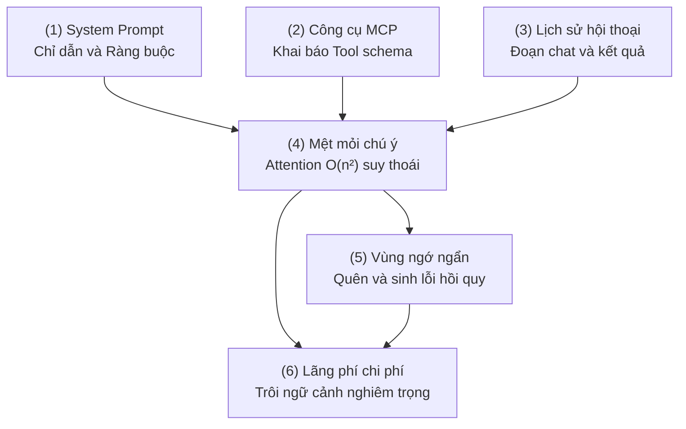
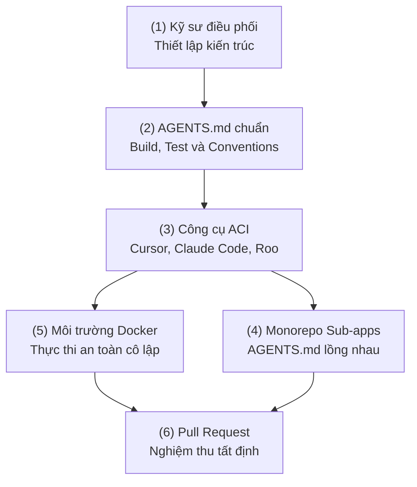
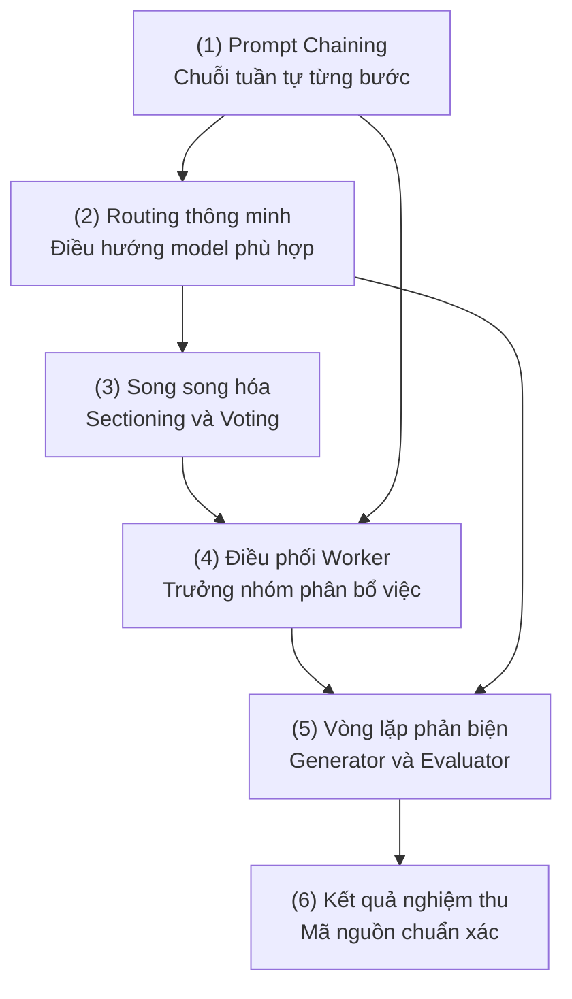
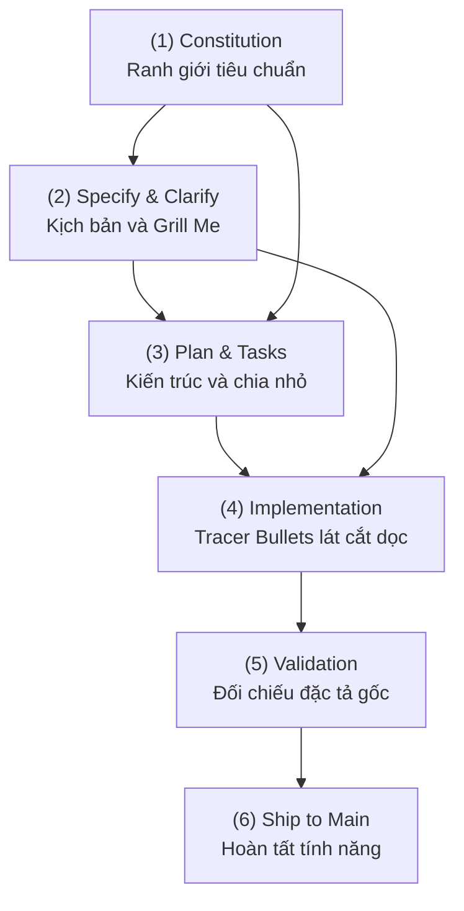
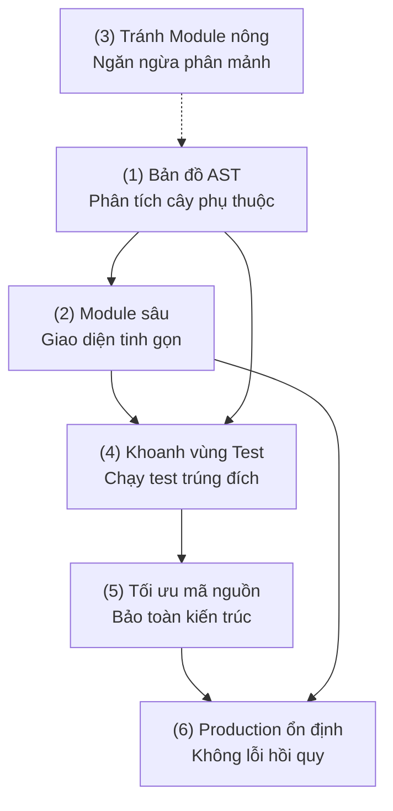
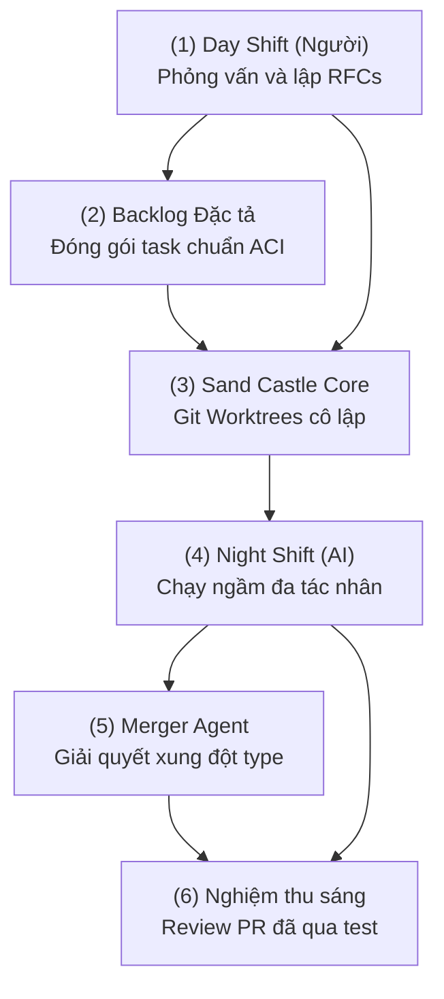

Nhiều kỹ sư phần mềm đang trải qua một cú sốc thực tế: sau những hào hứng ban đầu với AI, họ nhận ra các mô hình ngôn ngữ lớn (LLM) dường như "càng dùng càng ngớ ngẩn". Mã nguồn do AI tạo ra thường xuyên gây ra lỗi hồi quy (regressions) hoặc biến codebase thành một mớ hỗn độn manh mún.

Bước sang năm 2026, kỷ nguyên của "Vibe Coding" – kiểu lập trình dựa trên cảm tính và những câu lệnh mơ hồ – đang bộc lộ những giới hạn chết người. Ngành kỹ nghệ phần mềm không còn coi AI là công cụ gõ code hỗ trợ đơn thuần. Chúng ta đang chứng kiến sự dịch chuyển mang tính kỷ luật: từ việc "cầu nguyện AI hiểu ý" sang **Kỹ nghệ Bản địa AI** (AI-Native Engineering). 

Minh chứng rõ ràng nhất là từ chính Anthropic: khoảng 90% mã nguồn của công cụ Claude Code được viết bởi chính nó. Tuy nhiên, sự thành bại của một tác nhân (agent) không nằm ở khả năng "tự chủ ảo tưởng" mà nằm ở hạ tầng ngữ cảnh và cấu trúc kỷ luật do con người thiết lập.

---

## 1. Bản chất Vùng Ngớ Ngẩn (Dumb Zone) và Cơ học Chú ý

Dù các mô hình hiện nay quảng cáo cửa sổ ngữ cảnh (Context Window) lên đến hàng triệu token, thực tế kỹ thuật lại khắc nghiệt hơn rất nhiều. Hiện tượng "Vùng ngớ ngẩn" xuất hiện khi lượng token tích lũy trong phiên làm việc vượt ngưỡng kiểm soát.

Về mặt toán học, các mối quan hệ chú ý (attention relationships) trong kiến trúc Transformer tăng theo hàm bình phương $O(n^2)$ mỗi khi chúng ta nạp thêm token:



Mô hình LLM hoạt động tương tự nhân vật trong phim *Memento*: liên tục quên và mất phương hướng khi bối cảnh quá dài. Để giữ AI luôn ở trong **Vùng thông minh** (Smart Zone - dưới 100k tokens), chúng ta áp dụng 3 nguyên tắc sống còn:

1. **Giữ System Prompt tinh gọn:** Loại bỏ toàn bộ văn xuôi mô tả dự án và cây thư mục thừa thãi.
2. **Dọn dẹp triệt để (Cleaning thay vì Compacting):** Nén lịch sử thường để lại cặn bã ngữ cảnh (context sediment) làm nhiễu logic. Khi xong một tác vụ, hãy xóa sạch phiên và cấp lại bối cảnh mới.
3. **Đóng gói bối cảnh chọn lọc (Context Packing):** Sử dụng các công cụ như `gitingest`, `repo2txt` hoặc giao thức Model Context Protocol (MCP) để nạp đúng file cần chỉnh sửa.

---

## 2. Chuẩn Hóa Giao Diện Người - Máy - Tác Nhân (ACI)

Nếu `README.md` là tài liệu dành cho con người, thì dự án hiện đại bắt buộc phải có `AGENTS.md` – bản đặc tả giao diện Agent-Computer Interface (ACI).



### Chiến lược AGENTS.md lồng nhau trong Monorepo
Trong các dự án lớn, chúng ta đặt các tệp `AGENTS.md` tại từng thư mục con. Tác nhân sẽ ưu tiên đọc tệp tin nằm gần nhất với mã nguồn đang xử lý, giúp cô lập ngữ cảnh và không làm quá tải bối cảnh toàn cục:

| Nhóm Công cụ | Nền tảng tiêu biểu hỗ trợ chuẩn ACI |
| :--- | :--- |
| **IDE & Editors** | Cursor, Zed, Windsurf, VS Code, JetBrains Junie |
| **Agents & CLI** | Claude Code, Aider, Devin, Gemini CLI, OpenAI Codex, RooCode |
| **Doanh nghiệp** | GitHub Copilot Workspace, Factory, Augment Code, Google Jules |

---

## 3. Năm Mẫu Thiết Kế Hệ Thống Tác Nhân (Agentic Patterns)

Theo khung phân loại của Anthropic, chúng ta phân định ranh giới rõ ràng:
- **Workflows:** Quy trình xác định bằng đường dẫn mã nguồn cứng (predefined code paths), ưu tiên tính dự báo cao và độ trễ thấp.
- **Agents:** Tác nhân tự chủ, tự điều phối quy trình và sử dụng công cụ dựa trên phản hồi môi trường.



1. **Prompt Chaining:** Chia nhỏ tác vụ phức tạp thành chuỗi các bước đơn giản để tối đa hóa độ chính xác.
2. **Routing:** Điều hướng câu hỏi đơn giản tới model nhẹ (Haiku, Flash-Lite) và chuyển bài toán kiến trúc cho model mạnh (Sonnet, Opus, GPT-4o).
3. **Parallelization:** Thực thi đồng thời nhiều worker qua cơ chế chia nhỏ phần việc hoặc biểu quyết (Voting).
4. **Orchestrator-Workers:** Agent trung tâm phân tích bài toán, giao việc cho các Worker Agent chuyên trách trên từng file và tổng hợp lại.
5. **Evaluator-Optimizer:** Một Agent sinh mã và một Agent độc lập đóng vai trò phản biện, từ chối nghiệm thu cho đến khi thỏa mãn tiêu chuẩn.

---

## 4. Phát Triển Dựa Trên Đặc Tả (Spec-Driven Development)

Lập trình kiểu "Prompt-first" thường thất bại vì thiếu một Nguồn chân lý duy nhất. Phương pháp Spec-Driven Development (SDD) thiết lập hệ thống phòng thủ đa tầng gồm 7 lăng kính (Seven Lenses):



### Kỹ thuật "Grill Me" (Phỏng vấn ngược)
Thay vì bắt AI lập kế hoạch ngay, chúng ta yêu cầu AI phỏng vấn ngược lại mình:

```text
Bạn là Kiến trúc sư Trưởng. Hãy liên tục đặt câu hỏi phỏng vấn tôi từng câu một (Grill Me) để làm rõ mọi trường hợp biên, ràng buộc cơ sở dữ liệu và yêu cầu phi chức năng trước khi viết kế hoạch triển khai.
```


LLM là một cặp lập trình viên quyền năng nhưng đòi hỏi sự chỉ dẫn, bối cảnh và giám sát rõ ràng thay vì khả năng phán đoán tự trị.


### Lát cắt dọc (Tracer Bullets) thay vì tầng ngang
AI có xu hướng tự nhiên là code theo tầng ngang (viết hết model, sang viết controller, rồi sang UI). Chúng ta cần ép AI triển khai theo **Tracer Bullets** – một lát cắt dọc hoàn chỉnh xuyên suốt từ Database $\rightarrow$ API Backend $\rightarrow$ UI Frontend để nhận phản hồi tích hợp tức thì và ngăn chặn rác công nghệ (Tech Slop).

---

## 5. Nghịch Lý TDD và Kiến Trúc Module Sâu (Deep Modules)

Nghiên cứu về TDAD (Test-Driven Agentic Development) của Pepe Alonso chỉ ra một nghịch lý: **Việc ép AI thực hiện TDD theo quy trình máy móc có thể làm tăng tỷ lệ lỗi hồi quy lên 9.94%**.

Nguyên nhân là do AI có xu hướng "gian lận" để vượt qua bài test nếu không hiểu bức tranh tổng thể. Khi chúng ta cung cấp **Bản đồ tác động AST (Abstract Syntax Tree)** chỉ rõ mối quan hệ phụ thuộc giữa các module, tỷ lệ lỗi hồi quy giảm ngay lập tức **70%**.



### Triết lý Deep Modules của John Ousterhout
- **Interface-first:** Con người giữ vai trò thiết kế giao diện module thật đơn giản, rõ ràng.
- **Implementation-second:** Để AI xử lý toàn bộ logic triển khai phức tạp bên trong "hộp đen". Tránh việc chia cắt thành quá nhiều module nông (Shallow Modules) làm bùng nổ quan hệ phụ thuộc chéo.

---

## 6. Vận Hành Tác Nhân Quy Mô Lớn: Sandbox và Ca Đêm (Night Shift)

Để vận hành an toàn và mở rộng năng suất, quy trình làm việc được chia thành 2 ca rõ rệt:



- **Môi trường Sandbox cô lập:** Mọi Agent chạy trong Docker container thông qua Git Worktrees, bảo đảm không can thiệp vào mã nguồn chính khi chưa được kiểm chứng.
- **Mô hình Day Shift & Night Shift:**
  - **Ban ngày (Con người):** Kỹ sư tập trung thiết kế kiến trúc, làm rõ đặc tả và xây dựng danh sách nhiệm vụ chi tiết.
  - **Ban đêm (AI Agents):** Hệ thống Agent tự động thực thi trong sandbox, tự chạy linter, viết test và giải quyết xung đột kiểu dữ liệu qua Merger Agent.
  - **Sáng hôm sau:** Kỹ sư chỉ cần review danh sách Pull Request đã vượt qua 100% bài kiểm tra tự động.

---

## Lời Kết: Trở Thành Nhạc Trưởng Của Dàn Nhạc Agent

Kỹ nghệ phần mềm bản địa AI không phải là tự động hóa thay thế con người, mà là sự **cộng tác tăng cường**. Con người giữ vững nguyên tắc: **Tuyệt đối không commit mã nguồn mà mình không thể giải thích**.

3 Trụ cột cốt lõi để làm chủ kỷ nguyên mới:
1. **Sự đơn giản (Simplicity):** Giữ thiết kế hệ thống và Agent thật tinh gọn, dễ mở rộng.
2. **Minh bạch (Transparency):** Mọi quyết định và kế hoạch của AI phải được ghi lại rõ ràng trong tài liệu đặc tả.
3. **ACI chuẩn mực:** Đầu tư vào file `AGENTS.md` và công cụ tương tác cho AI kỹ lưỡng như cách chúng ta xây dựng tài liệu cho đồng nghiệp.

AI có thể đảm nhận 90% phần cơ bắp lập trình, nhưng 10% nỗ lực còn lại trong việc định hình kiến trúc, thiết lập đặc tả và kiểm soát chất lượng chính là yếu tố quyết định sản phẩm của chúng ta là một kiệt tác kỹ thuật hay chỉ là một mớ rác công nghệ vô giá trị.
