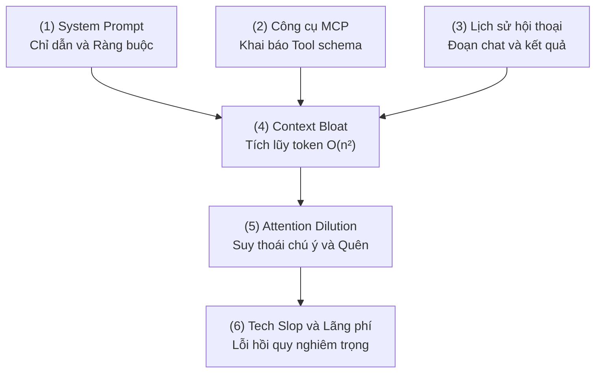
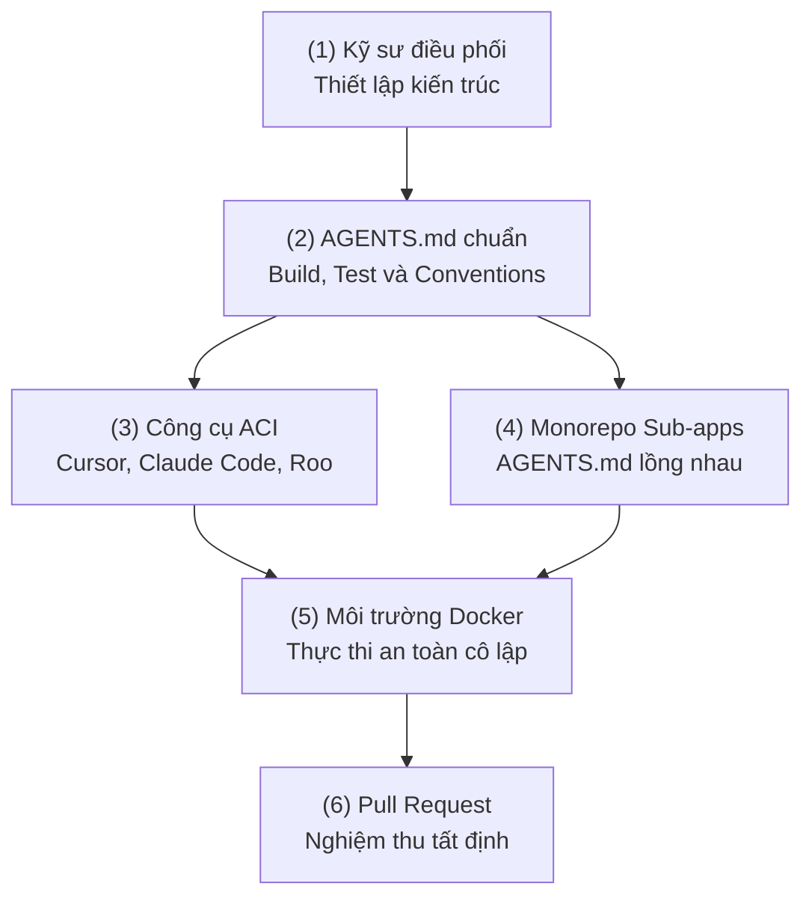
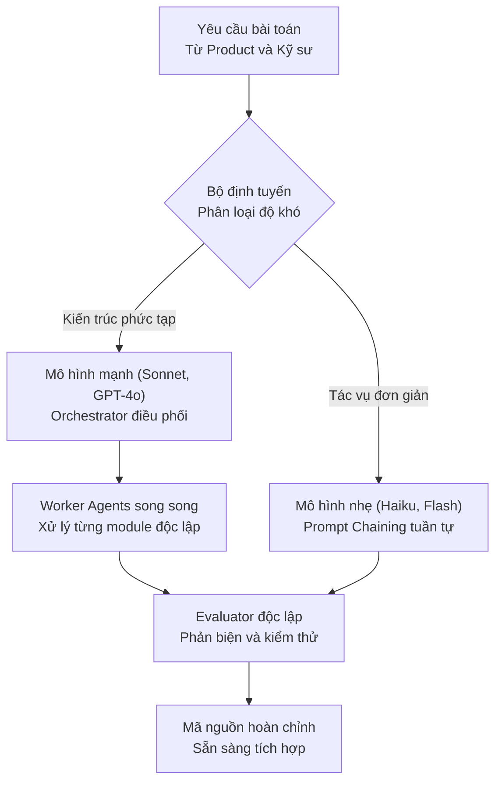
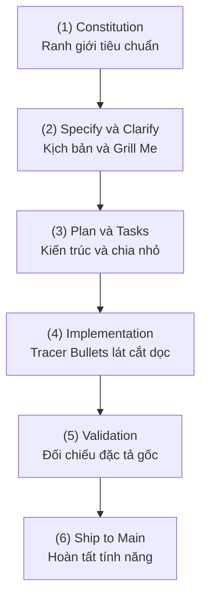
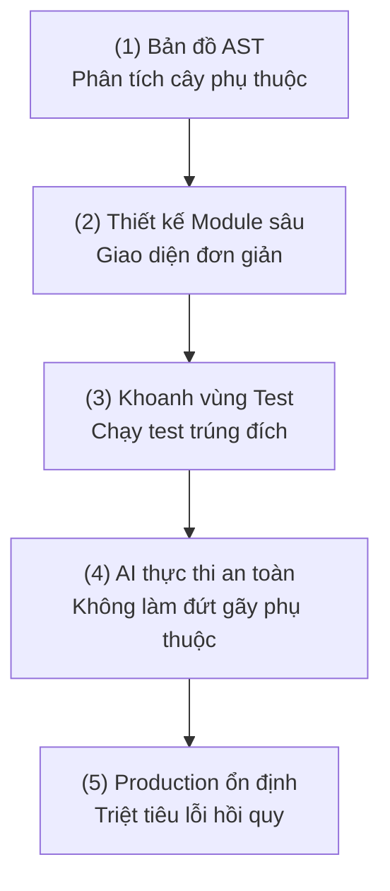
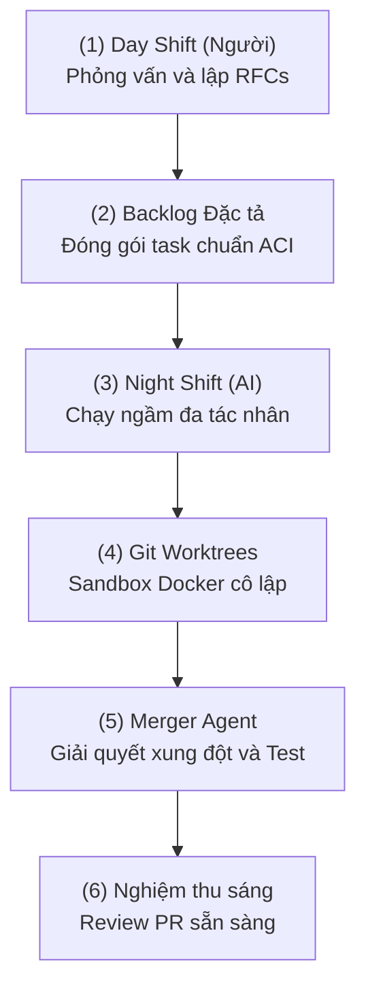

> [!TLDR]
> Bước sang năm 2026, kiểu lập trình cảm tính "Vibe Coding" đang bộc lộ những giới hạn lớn về lỗi hồi quy và suy thoái ngữ cảnh. Bài viết phân tích cơ chế Attention Dilution khi vượt ngưỡng token, chuẩn giao tiếp ACI qua `AGENTS.md`, 5 mẫu kiến trúc đa tác nhân, phương pháp Spec-Driven Development (SDD) và mô hình vận hành sandbox ngày-đêm.

Nhiều kỹ sư phần mềm đang trải qua một cú sốc thực tế: sau những hào hứng ban đầu với AI, các mô hình ngôn ngữ lớn (LLM) dường như "càng dùng lâu càng ngớ ngẩn". Mã nguồn do AI tạo ra thường xuyên gây lỗi hồi quy (regressions) hoặc biến codebase thành mớ hỗn độn manh mún.

Kỷ nguyên của "Vibe Coding" – lập trình dựa trên cảm tính và các câu lệnh mơ hồ – bộc lộ rõ giới hạn khi quy mô dự án tăng lên. Ngành kỹ nghệ phần mềm dịch chuyển mang tính kỷ luật: từ việc "hy vọng AI hiểu ý" sang **Kỹ nghệ Bản địa AI** (AI-Native Engineering). 

Minh chứng rõ nét đến từ Anthropic: khoảng 90% mã nguồn của công cụ Claude Code được viết bởi chính nó. Tuy nhiên, sự thành bại của một tác nhân (agent) không nằm ở khả năng "tự chủ ảo tưởng" mà nằm ở hạ tầng ngữ cảnh và cấu trúc kỷ luật do con người thiết lập.

---

## Bản chất vùng suy thoái chú ý (Dumb Zone)

Dù các mô hình hiện nay quảng cáo cửa sổ ngữ cảnh (Context Window) lên đến hàng triệu token, thực tế kỹ thuật lại khác biệt. Hiện tượng "vùng ngớ ngẩn" xuất hiện khi lượng token tích lũy trong phiên làm việc vượt ngưỡng kiểm soát.

Về mặt toán học, các mối quan hệ chú ý (attention relationships) trong kiến trúc Transformer tăng theo hàm bình phương $O(n^2)$ mỗi khi nạp thêm token vào ngữ cảnh:



Mô hình LLM có xu hướng liên tục mất phương hướng khi bối cảnh quá dài. Để giữ AI luôn ở trong **Vùng hiệu quả** (dưới 100k tokens), có 3 nguyên tắc thực tế:

1. **Giữ System Prompt tinh gọn:** Loại bỏ toàn bộ văn xuôi mô tả dự án và cây thư mục thừa thãi.
2. **Dọn dẹp triệt để (Cleaning thay vì Compacting):** Nén lịch sử thường để lại cặn bã ngữ cảnh (context sediment) làm nhiễu logic. Khi xong một tác vụ, hãy bắt đầu phiên làm việc mới với bối cảnh sạch.
3. **Đóng gói bối cảnh chọn lọc (Context Packing):** Sử dụng các công cụ như `gitingest`, `repo2txt` hoặc giao thức Model Context Protocol (MCP) để chỉ nạp đúng những file cần chỉnh sửa.

---

## Chuẩn hóa giao diện Người - Máy - Tác nhân (ACI)

Nếu `README.md` là tài liệu dành cho con người, thì dự án hiện đại cần thêm `AGENTS.md` – bản đặc tả giao diện Agent-Computer Interface (ACI).



### Chiến lược AGENTS.md lồng nhau trong Monorepo
Trong các dự án lớn, tệp `AGENTS.md` nên được đặt tại từng thư mục con. Tác nhân sẽ ưu tiên đọc tệp tin nằm gần nhất với mã nguồn đang xử lý, giúp cô lập ngữ cảnh và tránh làm quá tải bối cảnh toàn cục.

Các nhóm công cụ tiêu biểu hỗ trợ chuẩn ACI:
- **IDE và Trình soạn thảo:** Cursor, Zed, Windsurf, VS Code, JetBrains Junie.
- **Agents và CLI:** Claude Code, Aider, Devin, Gemini CLI, OpenAI Codex, RooCode.

---

## Năm mẫu thiết kế hệ thống đa tác nhân cốt lõi

Thay vì để AI tự động mò mẫm trong một "vòng lặp đen" (Black-box loop), 5 mẫu kiến trúc điều phối tất định sau giúp kiểm soát luồng xử lý:



1. **Prompt Chaining:** Chia nhỏ tác vụ phức tạp thành chuỗi các bước đơn giản để tối đa hóa độ chính xác.
2. **Routing:** Điều hướng câu hỏi đơn giản tới model nhẹ (Haiku, Flash-Lite) và chuyển bài toán kiến trúc cho model mạnh (Sonnet, GPT-4o).
3. **Parallelization:** Thực thi đồng thời nhiều worker qua cơ chế chia nhỏ phần việc hoặc biểu quyết (Voting).
4. **Orchestrator-Workers:** Agent trung tâm phân tích bài toán, giao việc cho các Worker Agent chuyên trách trên từng file và tổng hợp lại.
5. **Evaluator-Optimizer:** Một Agent sinh mã và một Agent độc lập đóng vai trò phản biện, từ chối nghiệm thu cho đến khi thỏa mãn tiêu chuẩn.

---

## Phát triển dựa trên đặc tả (Spec-Driven Development)

Lập trình kiểu "Prompt-first" thường thất bại vì thiếu một Nguồn chân lý duy nhất. Phương pháp Spec-Driven Development (SDD) thiết lập hệ thống phòng thủ đa tầng:



### Kỹ thuật "Grill Me" (Phỏng vấn ngược)
Thay vì bắt AI lập kế hoạch ngay, yêu cầu AI phỏng vấn ngược lại kỹ sư:

```text
Bạn là Kiến trúc sư Trưởng. Hãy liên tục đặt câu hỏi phỏng vấn tôi từng câu một (Grill Me) để làm rõ mọi trường hợp biên, ràng buộc cơ sở dữ liệu và yêu cầu phi chức năng trước khi viết kế hoạch triển khai.
```


LLM là một cặp lập trình viên quyền năng nhưng đòi hỏi sự chỉ dẫn, bối cảnh và giám sát rõ ràng thay vì khả năng phán đoán tự trị.


### Lát cắt dọc (Tracer Bullets) thay vì tầng ngang
AI có xu hướng tự nhiên là code theo tầng ngang (viết hết model, sang viết controller, rồi sang UI). Cần định hướng AI triển khai theo **Tracer Bullets** – lát cắt dọc hoàn chỉnh xuyên suốt từ Database $\rightarrow$ API Backend $\rightarrow$ UI Frontend để nhận phản hồi tích hợp tức thì và ngăn chặn mã rác công nghệ (Tech Slop).

---

## Nghịch lý TDD và kiến trúc module sâu (Deep Modules)

Nghiên cứu về TDAD (Test-Driven Agentic Development) của Pepe Alonso chỉ ra một nghịch lý: **Việc ép AI thực hiện TDD theo quy trình máy móc có thể làm tăng tỷ lệ lỗi hồi quy lên 9.94%**.

Nguyên nhân là do AI có xu hướng "gian lận" để vượt qua bài test nếu không hiểu bức tranh tổng thể. Khi cung cấp **Bản đồ tác động AST (Abstract Syntax Tree)** chỉ rõ mối quan hệ phụ thuộc giữa các module, tỷ lệ lỗi hồi quy giảm ngay lập tức **70%**.



### Triết lý Deep Modules của John Ousterhout
- **Interface-first:** Con người giữ vai trò thiết kế giao diện module đơn giản, rõ ràng.
- **Implementation-second:** Để AI xử lý logic triển khai chi tiết bên trong. Tránh việc chia cắt thành quá nhiều module nông (Shallow Modules) làm bùng nổ quan hệ phụ thuộc chéo.

---

## Vận hành tác nhân quy mô lớn: Sandbox và ca làm việc ngày-đêm

Để vận hành an toàn và mở rộng năng suất, quy trình làm việc có thể phân tách thành 2 ca:



- **Môi trường Sandbox cô lập:** Mọi Agent chạy trong Docker container thông qua Git Worktrees, bảo đảm không can thiệp vào mã nguồn chính khi chưa được kiểm chứng.
- **Mô hình Day Shift và Night Shift:**
  - **Ban ngày (Con người):** Kỹ sư tập trung thiết kế kiến trúc, làm rõ đặc tả và xây dựng danh sách nhiệm vụ chi tiết.
  - **Ban đêm (AI Agents):** Hệ thống Agent tự động thực thi trong sandbox, tự chạy linter, viết test và giải quyết xung đột kiểu dữ liệu qua Merger Agent.
  - **Sáng hôm sau:** Kỹ sư review danh sách Pull Request đã vượt qua các bài kiểm tra tự động.

---

## Trở thành người điều phối hệ thống Agent

Kỹ nghệ phần mềm bản địa AI không phải là tự động hóa thay thế hoàn toàn con người, mà là sự **cộng tác tăng cường**. Nguyên tắc cốt lõi: **Không commit mã nguồn mà mình không thể giải thích**.

Ba trụ cột để kiểm soát hiệu quả:
1. **Sự đơn giản (Simplicity):** Giữ thiết kế hệ thống và Agent tinh gọn, dễ mở rộng.
2. **Minh bạch (Transparency):** Mọi quyết định và kế hoạch của AI cần được ghi lại rõ ràng trong tài liệu đặc tả.
3. **ACI chuẩn mực:** Đầu tư vào file `AGENTS.md` và công cụ tương tác cho AI kỹ lưỡng như cách xây dựng tài liệu cho đồng nghiệp.

