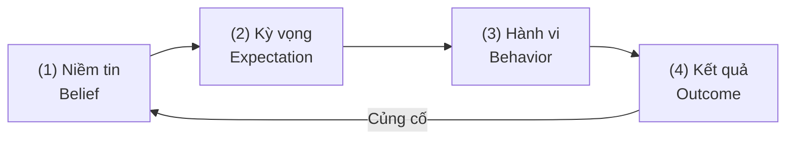

Có một khoảng thời gian mình nhìn gần như mọi task khó theo cùng một cách: **nó sẽ rất mệt**.

Một project mới là một đống thứ phải học. Một task khó đồng nghĩa với vài tiếng căng não. Một thói quen mới là một cuộc chiến với bản thân.

Mình trì hoãn, cảm thấy kiệt sức trước cả khi bắt đầu và liên tục cầm điện thoại lên để trốn khỏi cảm giác khó chịu đó.

Sau này mình mới bắt đầu để ý một điều:

**Có khi một phần cảm giác "task này quá khó" không chỉ đến từ bản thân task, mà còn đến từ expectation mình mang vào nó.**

Không phải theo kiểu "hãy nghĩ tích cực rồi vũ trụ sẽ đáp lại".

Ý mình đơn giản hơn nhiều:

**Cách chúng ta diễn giải một trải nghiệm có thể ảnh hưởng cách chúng ta cảm nhận nó, cách chúng ta hành động trong nó, và cuối cùng là kết quả chúng ta tạo ra.**

---

## 1. Expectation không hoàn toàn "chỉ nằm trong đầu"

Một thí nghiệm nổi tiếng năm 2011 của Alia Crum và Ellen Langer cho người tham gia uống cùng một loại milkshake chứa khoảng **380 calories**, nhưng ở hai thời điểm khác nhau nó được giới thiệu theo hai cách hoàn toàn trái ngược.

- Một lần, họ được nói rằng đó là loại milkshake "indulgent" chứa **620 calories**.
- Lần khác, nó được giới thiệu như một loại "sensible" chỉ chứa **140 calories**.

Thứ nằm trong cốc không hề thay đổi. Nhưng thứ người uống **tin rằng mình đang uống** thì có.

Các nhà nghiên cứu theo dõi ghrelin — một hormone liên quan đến cảm giác đói và điều hòa năng lượng trong cơ thể.

Khi những người tham gia tin rằng mình vừa uống một cốc milkshake nhiều calories, nồng độ ghrelin của họ giảm mạnh hơn rõ rệt so với khi họ nghĩ mình vừa uống phiên bản ăn kiêng.

Điều đáng chú ý ở đây không phải là:

> "Calories không quan trọng, chỉ cần tin là được."

Nghiên cứu hoàn toàn không chứng minh điều đó. Điểm cốt lõi là:

**Cùng một input vật lý, nhưng cách một người diễn giải trải nghiệm đó có thể góp phần tạo ra phản ứng sinh lý khác nhau.**

Mindset không thay thế biology. Nhưng mindset cũng không hoàn toàn đứng ngoài biology.

Điều này còn rõ hơn khi nhìn sang hiện tượng đối lập với placebo: **nocebo**. Khi một người kỳ vọng một trải nghiệm sẽ gây đau, khó chịu hoặc tạo ra tác dụng phụ, expectation đó có thể khiến trải nghiệm chủ quan thực sự trở nên tệ hơn.

Điều này không đồng nghĩa rằng cứ suy nghĩ tiêu cực là chúng ta sẽ tự làm mình mắc bệnh. Nhưng nó chỉ ra một sự thật quan trọng:

**Expectation có thể trở thành một phần của chính trải nghiệm.**

Và từ đây mới xuất hiện câu hỏi thực sự đáng quan tâm: nếu expectation có thể ảnh hưởng cách chúng ta cảm nhận một thứ, liệu nó có thể ảnh hưởng luôn cách chúng ta hành động trước thứ đó không?

---

## 2. Phần quan trọng nhất không nằm ở hormone, mà nằm ở hành vi

Giả sử mình tin:

> "Mình không giỏi code."

Niềm tin đó rất dễ tạo ra một expectation:

> "Bài này chắc mình cũng không giải được."

Rồi expectation đó bắt đầu tác động trực tiếp lên hành vi:

- Gặp lỗi 10 phút.
- Khó chịu và nản lòng.
- Hỏi AI ngay lập tức thay vì phân tích.
- Ít tự debug hơn.
- Ít ngồi lại với vấn đề hơn.
- Ít rèn luyện được năng lực giải quyết vấn đề thực tế.

Một tháng sau, khi vẫn loay hoay với những bài toán khó, mình nhìn kết quả đó và tự nhủ: *"Thấy chưa, mình không giỏi code thật."*

Vòng lặp khép lại:

Đây mới là phần quan trọng nhất.

Không cần giả định rằng bộ não đang "thu hút đúng tần số", cũng không cần tin rằng thực tại đang tự sắp xếp theo ý nghĩ của mình. Cơ chế thực tế đơn giản và mạnh mẽ hơn nhiều:

**Niềm tin thay đổi cách chúng ta hành động trong thực tại.**

Khi hành vi đó được lặp lại đủ lâu, kết quả bắt đầu phân hóa rõ rệt.

Người tin rằng mình có thể học được một kỹ năng không tự động trở nên giỏi hơn sau một đêm. Nhưng họ sẽ ở lại với vấn đề lâu hơn, thử thêm một cách tiếp cận khác, đặt thêm một câu hỏi, hoặc đón nhận phản hồi mà không vội vàng xem đó là bằng chứng rằng mình "không có tố chất".

Những khác biệt nhỏ đó nhìn riêng lẻ không có gì đặc biệt. Nhưng sau hàng chục, hàng trăm lần lặp lại, chúng bắt đầu cộng dồn thành một khoảng cách khổng lồ.

Nhìn từ bên ngoài, người ta thường tóm gọn: *"Người tự tin thường thành công hơn."* Nhưng nằm giữa confidence và result là vô số hành vi vi mô mà chúng ta thường bỏ qua.

---

## 3. Nếu belief chưa chắc đúng thì có phải đang tự lừa mình?

Đây từng là phần khiến mình khó chấp nhận nhất. Chúng ta thường có xu hướng nghĩ rằng một belief phải đúng tuyệt đối thì mình mới được phép tin nó:

- Nếu chưa kỷ luật, tại sao lại được nghĩ rằng mình có thể trở thành người kỷ luật?
- Nếu chưa giỏi một kỹ năng, tại sao lại được tự tin rằng mình có thể làm chủ nó?

Nhà thống kê George Box có một câu nói nổi tiếng:

> All models are wrong, but some are useful.

Câu nói này áp dụng rất chính xác vào cách chúng ta nhìn nhận chính mình.

*"Mình không có kỷ luật"*, *"Mình không có tố chất code"*, *"Mình không học được tiếng Anh"* — những câu khẳng định đó nghe giống như fact, nhưng thực chất phần lớn chỉ là những model chúng ta tự xây dựng từ các trải nghiệm trong quá khứ.

Vấn đề là một khi tin vào model đó quá lâu, chúng ta bắt đầu hành động như thể nó là một định luật bất biến.

Tuy nhiên, giải pháp không phải là nhảy sang cực đoan đối lập của tư duy tích cực sáo rỗng: *"Mình là thiên tài"*, *"Mình chắc chắn sẽ thành công"*. Nếu thực tế liên tục phản bác thì những câu khẳng định suông đó cũng không mang lại giá trị gì.

Một belief hữu ích cần đáp ứng đồng thời hai tiêu chí:

1. **Giúp tạo ra hành vi tốt hơn.**
2. **Vẫn cho phép thực tế chứng minh mình sai.**

| Niềm tin đóng (Giới hạn) | Niềm tin mở (Thực nghiệm) |
| :--- | :--- |
| *"Mình không thể học cái này."* | *"Mình chưa tìm được cách học cái này hiệu quả."* |
| *"Mình không có kỷ luật."* | *"Mình chưa biết giới hạn kỷ luật của mình ở đâu."* |

Sự khác biệt nghe có vẻ nhỏ, nhưng belief thứ hai mở ra một hành động tiếp theo, trong khi belief thứ nhất lập tức đóng cuộc chơi lại.

---

## 4. Đừng affirm. Hãy chạy experiment.

Thay vì đứng trước gương mỗi sáng và lặp lại những câu như *"I am unstoppable"*, hãy lấy một belief đang giới hạn mình và biến nó thành một giả thuyết có thể kiểm chứng được bằng dữ liệu.

Ví dụ, thay vì thay thế *"Mình không có kỷ luật"* bằng *"Mình cực kỳ kỷ luật"*, hãy đặt câu hỏi:

> **"Trong 7 ngày tới, mình có thể tập trung làm việc 25 phút mỗi ngày không?"**

Lúc này chúng ta không còn tranh luận vô ích với cảm xúc của chính mình nữa. Chúng ta đang vận hành một experiment thực sự:

- **Thời gian:** 7 ngày.
- **Khối lượng:** 25 phút mỗi ngày.
- **Metric:** Hoàn thành tối thiểu 6/7 ngày.

Nếu hoàn thành được 6/7 ngày, belief cũ lập tức lung lay: *"Mình không có kỷ luật"* không còn mô tả chính xác thực tế nữa.

Đó chính là sự khác biệt giữa tư duy thực nghiệm và positive thinking:

**Chúng ta không ép bản thân tin vào một câu chuyện đẹp hơn — chúng ta tạo ra dữ liệu mới để kiểm tra xem câu chuyện cũ có còn đúng hay không.**

---

## 5. Khung Belief Audit trong 7 ngày

Hãy chọn **2 niềm tin** đang khiến bạn trì hoãn hoặc né tránh một mục tiêu quan trọng. Với mỗi niềm tin, hãy trả lời 3 câu hỏi sau:

> [!TIP] Khung 3 Câu Hỏi Đánh Giá Niềm Tin
> 1. **Bằng chứng nào khiến mình tin điều này?**
>    Ghi lại cụ thể những trải nghiệm trong quá khứ mà không cần né tránh hay phủ nhận.
> 2. **Belief này đang khiến mình hành động như thế nào?**
>    Né tránh? Trì hoãn? Bỏ cuộc sớm khi gặp trở ngại? Không dám thử cách tiếp cận mới?
> 3. **Experiment nhỏ nhất mình có thể chạy trong 7 ngày là gì?**
>    Thiết lập một hành vi vi mô có thể đo lường rõ ràng.

### Ví dụ thiết lập experiment cụ thể:

- **Nếu nghĩ mình không thể đọc tài liệu tiếng Anh:**
  $\rightarrow$ Đọc 10 phút mỗi ngày liên tục trong 7 ngày.
- **Nếu nghĩ mình không thể tập trung sâu:**
  $\rightarrow$ Làm việc 25 phút không chạm vào điện thoại mỗi ngày trong 7 ngày.
- **Nếu nghĩ mình không thể duy trì một dự án cá nhân:**
  $\rightarrow$ Thực hiện 1 commit code nhỏ mỗi ngày trong 7 ngày.

Sau một tuần, hãy ngồi lại và đánh giá dữ liệu thu thập được:

- Có thể niềm tin cũ đúng một phần.
- Có thể nó hoàn toàn sai.
- Hoặc có thể vấn đề không nằm ở "khả năng của bản thân", mà chỉ nằm ở phương pháp, cách tổ chức môi trường và kỳ vọng chưa hợp lý.

Nhưng quan trọng nhất: bạn không để niềm tin cũ định đoạt trước kết quả. Bạn cho phép bằng chứng thực nghiệm có cơ hội điều chỉnh lại hệ thống niềm tin của mình.

> Đó có lẽ là phiên bản "level up" đáng tin cậy nhất: **Không phải tin mạnh đến mức thực tại phải nghe lời, mà là chọn một belief đủ tốt để thúc đẩy hành vi khác đi — rồi để chính kết quả của những hành động đó quyết định xem chúng ta nên tin vào điều gì tiếp theo.**
