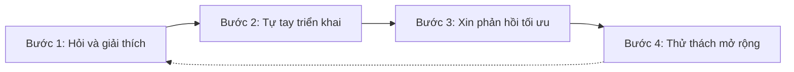
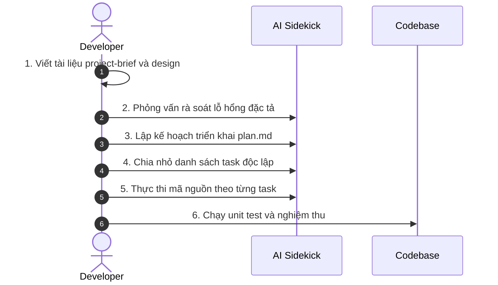

> *"AI sẽ không thay thế lập trình viên. Nhưng lập trình viên biết dùng AI sẽ thay thế những lập trình viên không biết dùng AI."*

Bước vào kỷ nguyên AI, chỉ với vài câu lệnh gửi tới ChatGPT, Cursor hay Claude Code, một hệ thống RESTful API phức tạp đã hiện ra trong vài giây. Thế nhưng, nếu chúng ta sa vào lối làm việc **Vibe Coding** — gõ prompt ngẫu hứng, copy-paste mã nguồn và dán traceback bảo AI sửa hộ — chúng ta sẽ hoàn toàn mất kiểm soát khi dự án mở rộng hoặc phát sinh sự cố trên môi trường thực tế.

Bài viết này tổng hợp các nghiên cứu và thảo luận mới nhất về **Spec-Driven Development**, giúp chúng ta chuyển dịch từ cách làm việc thụ động sang tư duy kiến trúc sư, làm chủ AI như một trợ thủ đắc lực.

---

## 1. TƯ DUY NỀN TẢNG: VIBE CODING VS. SPEC-DRIVEN DEVELOPMENT

### 1. Sự nguy hiểm của Vibe Coding
Vibe Coding là thuật ngữ mô tả thói quen lập trình hoàn toàn dựa vào cảm xúc và sự phó mặc cho AI:
- Ra lệnh cho AI tạo toàn bộ tính năng lớn chỉ bằng một prompt ngắn mơ hồ.
- Copy-paste mã nguồn vào dự án mà không đọc hiểu bản chất.
- Khi xảy ra lỗi, liên tục dán traceback cho AI sửa hộ mà không phân tích nguyên nhân gốc rễ, dẫn đến vòng lặp nợ kỹ thuật và xung đột kiến trúc.

### 2. Phương trình hiệu suất lập trình AI

$$\text{Năng Lực Thực Tế} = \text{Kiến Thức Nền Tảng} \times \text{Năng Lực Điều Khiển AI}$$

- **Nền tảng chắc chắn:** AI giúp nhân bản năng suất lên gấp 5 đến 10 lần.
- **Nền tảng bằng 0:** AI chỉ nhân bản sự bối rối, tạo ra đống code chắp vá và nguy cơ rò rỉ bảo mật.

Giá trị cốt lõi của lập trình viên hiện đại chuyển dịch từ việc viết từng dòng cú pháp sang **thẩm định và phê duyệt mã nguồn**. Chúng ta phải đánh giá được sự đánh đổi về hiệu năng, bộ nhớ, truy vấn N+1 query và các rủi ro bảo mật như SQL Injection hay XSS.


Lạm dụng AI làm suy giảm khả năng tư duy độc lập. Mỗi khi gặp lỗi, việc tự phân tích luồng dữ liệu tối thiểu trước khi tham khảo AI là ranh giới phân định giữa một kỹ sư phần mềm thực thụ và một người copy-paste thụ động.


---

## 2. BIẾN AI THÀNH MENTOR HƯỚNG DẪN HỌC TẬP

Để tiếp thu kiến thức mới hiệu quả, hãy biến AI thành một người thầy kiên nhẫn thông qua các quy tắc giao tiếp có định hướng.

### 1. Hợp đồng học tập và rào chắn giới hạn


Bạn là gia sư web dev của tôi. Hãy dạy tôi như một người mới bắt đầu muốn trở nên thành thạo, không phải như một người muốn copy-paste nhanh. Ưu tiên các bước ngắn có điểm kiểm tra. Khi đưa ra code, hãy giải thích bản chất và các lỗi phổ biến.

Quy tắc: Không tạo quá 40 dòng code một lúc; Ưu tiên thay đổi từng bước với diffs; Khi tôi dán lỗi, hãy gợi ý nguyên nhân có khả năng nhất và hướng dẫn tôi tự kiểm tra trước.


### 2. Vòng lặp học tập 4 bước

- **Bước 1 — Hỏi và giải thích:** Yêu cầu AI giải thích khái niệm kèm ví dụ tối giản.
- **Bước 2 — Tự tay triển khai:** Tự gõ lại từng dòng code vào trình soạn thảo để tạo phản xạ cú pháp trong não bộ.
- **Bước 3 — Xin phản hồi:** Hỏi AI đánh giá mã nguồn vừa viết để tìm điểm tối ưu về hiệu năng hoặc cấu trúc.
- **Bước 4 — Thử thách mở rộng:** Yêu cầu AI đưa ra bài tập biến thể nhỏ để kiểm thử mức độ thấu hiểu.

### 3. Gỡ lỗi theo phương pháp Socratic


Tôi gặp lỗi này khi chạy ứng dụng Django: [dán traceback]. Đừng đưa cho tôi code sửa ngay. Hãy đặt cho tôi 3 câu hỏi gợi ý từng bước để giúp tôi tự tìm ra nguyên nhân gốc rễ.


---

## 3. QUY TRÌNH SPEC-DRIVEN DEVELOPMENT TRONG THỰC TẾ

Spec-Driven Development là phương pháp lấy tài liệu đặc tả làm **Nguồn sự thật duy nhất**. Thay vì bắt AI đoán ý, chúng ta cùng AI xây dựng đặc tả hoàn chỉnh trước khi viết bất kỳ dòng mã nào.

### Quy trình 6 bước phối hợp với AI Sidekick

#### Bước 1: Khởi tạo tài liệu đặc tả (Project Brief & Specs)
Soạn thảo mục tiêu tính năng, danh sách yêu cầu và quan trọng nhất là **Non-goals** để tránh hiện tượng AI tự ý mở rộng tính năng vô bờ bến.


Tôi muốn xây dựng tính năng [Tên tính năng]. Hãy đóng vai Product Owner và Senior Architect để soạn thảo file specs/feature-brief.md.

Cấu trúc tài liệu cần có:
1. Mục tiêu kinh doanh & User Stories.
2. Phạm vi thực hiện (Scope) và Các điểm KHÔNG làm (Non-goals).
3. Giả định kỹ thuật & Data Schema đề xuất.
4. Ràng buộc bảo mật & Hiệu năng.

Hãy đặt 3 câu hỏi làm rõ trước khi xuất bản nháp đầu tiên.


#### Bước 2: Phỏng vấn rà soát lỗ hổng đặc tả (Columbo Method)
Áp dụng phương pháp điều tra Columbo — yêu cầu AI thẩm vấn tài liệu đặc tả để phát hiện các trường hợp biên và rủi ro kiến trúc trước khi chạm vào mã nguồn.


Đọc file specs/feature-brief.md và codebase hiện tại. Đóng vai một Principal Engineer khắt khe, hãy rà soát và chỉ ra:
1. Các trường hợp biên (Edge cases) chưa được bao phủ trong brief.
2. Rủi ro xung đột kiến trúc hoặc lãng phí truy vấn (N+1 query, Race condition).
3. 3 điểm mơ hồ nhất trong tài liệu cần tôi làm rõ ngay.

Đừng viết code. Chỉ tập trung phỏng vấn để hoàn thiện brief.


#### Bước 3: Kích hoạt chế độ lập kế hoạch (Plan Mode)
Sử dụng các công cụ như Claude Code hoặc Cursor ở chế độ Plan Mode để buộc AI phân tích codebase và phác thảo `plan.md`.


Dựa trên specs/feature-brief.md đã chốt, hãy phác thảo file plan.md cho tính năng này.

Nội dung plan.md phải bao gồm:
1. Danh sách các file cần tạo mới [NEW], chỉnh sửa [MODIFY] hoặc xóa [DELETE].
2. Chi tiết thay đổi về Data Models, Migration, API Endpoints và Services.
3. Kế hoạch kiểm thử tự động (Unit test & Integration test).

Lưu ý: CHƯA viết mã nguồn chi tiết. Chỉ tập trung vào kiến trúc kế hoạch.


#### Bước 4: Phân rã thành danh sách Task độc lập (Atomic Tasks)
Chia `plan.md` thành các bước nhỏ, mỗi bước có tiêu chuẩn nghiệm thu rõ ràng.


Đọc plan.md và tạo file tasks.md chia kế hoạch thành các nhiệm vụ độc lập (Atomic Tasks).

Mỗi task cần có:
- ID và tên task rõ ràng (ví dụ: Task 1.1: Create Migration for Survey Model).
- Tiêu chuẩn nghiệm thu cụ thể (Acceptance Criteria).
- Lệnh kiểm thử tự động để xác nhận hoàn thành.

Đảm bảo mỗi task có dung lượng vừa đủ để triển khai trong 1 lượt tương tác mà không bị tràn context.


#### Bước 5: Thực thi mã nguồn tuần tự (Sequential Execution)
Cho phép AI CLI thực thi từng nhiệm vụ đã phê duyệt theo phạm vi giới hạn.


Hãy thực hiện Task 1.1 trong file tasks.md.

Quy tắc thực thi:
1. Chỉ sửa đổi các file được chỉ định cho Task 1.1.
2. Không tự ý viết mã cho các task tiếp theo.
3. Sau khi viết code, hãy trình bày diffs và giải thích ngắn gọn lý do chọn giải pháp này.


#### Bước 6: Kiểm thử tự động & Nghiệm thu (Verification & Review)
Chạy bộ kiểm thử tự động unit test để đảm bảo mã nguồn tuân thủ đúng tiêu chí nghiệm thu Acceptance Criteria.


Đã hoàn thành Task 1.1. Hãy hỗ trợ kiểm thử và rà soát:
1. Viết bộ unit test bao phủ các kịch bản thành công và thất bại cho Task 1.1.
2. Chạy lệnh test và phân tích kết quả.
3. Review mã nguồn vừa viết so với tiêu chí Acceptance Criteria trong specs/feature-brief.md.

Nếu phát hiện lỗi hoặc thiếu sót, hãy đề xuất hướng sửa đổi tối giản.


---

## 4. BỘ SƯU TẬP PROMPT THỰC CHIẾN

### 1. Phân tích bài toán ban đầu

Tôi đang xây dựng ứng dụng web Django tên là TallyApp. Hãy đọc kỹ project-brief.md và design.md.

Trước khi tạo code, hãy phân tích:
1. Trình bày lại yêu cầu bài toán.
2. Các điểm chưa rõ ràng.
3. Giả định kỹ thuật.
4. Rủi ro tiềm ẩn.

Sau khi phân tích:
5. Chia giai đoạn phát triển.
6. Đề xuất cấu trúc Django apps.
7. Thiết kế data models.
8. Danh sách URLs.

Chỉ sau khi tôi xác nhận bản phân tích này, bạn mới bắt đầu tạo mã cơ bản.


### 2. Viết kiểm thử tự động

Đây là Django model cho Survey: [dán code model]. Hãy viết unit tests xác minh các quy tắc validation, giá trị mặc định và các ràng buộc. Tập trung vào các trường hợp biên và kịch bản lỗi.


### 3. Phê duyệt và rà soát mã nguồn

Hãy review lại tính năng vừa triển khai so với spec và tiêu chuẩn ban đầu:
1. Yêu cầu nào còn thiếu?
2. Có sự phức tạp không cần thiết nào không?
3. Trường hợp kiểm thử nào còn bỏ ngỏ?


---

## 5. LỜI KẾT

Lập trình viên trong thập kỷ tới không định vị giá trị ở tốc độ gõ bàn phím hay khả năng thuộc lòng cú pháp. Chúng ta thành công nhờ 3 năng lực cốt lõi:
1. **Tư duy hệ thống và phân rã bài toán.**
2. **Kỹ năng thiết lập đặc tả và định hướng AI.**
3. **Năng lực thẩm định và phê duyệt mã nguồn.**

> *"AI là trợ thủ vĩ đại, nhưng lập trình viên luôn là người nắm giữ vô-lăng."*

