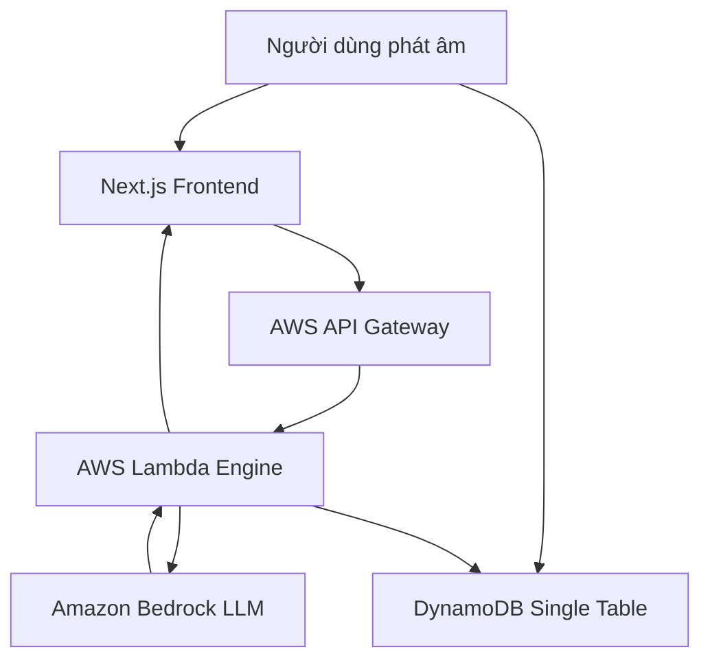



Bài toán thực tế trong việc học giao tiếp tiếng Anh là người học thường thiếu môi trường phản xạ tự nhiên và ngần ngại khi nói chuyện trực tiếp với người bản xứ. Các giải pháp gia sư truyền thống chi phí cao và khó linh hoạt theo thời gian cá nhân. Dự án Lexi được thiết kế để giải quyết triệt để vấn đề này bằng cách xây dựng một gia sư AI giao tiếp theo luồng âm thanh thời gian thực, có khả năng phân tích lỗi sai ngữ pháp và phản hồi ngữ cảnh ngay lập tức.

## Kiến trúc hệ thống Serverless Event-Driven

Để đảm bảo khả năng mở rộng tự động và tối ưu chi phí vận hành ở mức thấp nhất khi không có lưu lượng truy cập, chúng ta lựa chọn mô hình Serverless hoàn toàn trên nền tảng AWS:

- **Frontend:** Next.js và TypeScript được triển khai trên Vercel, xử lý thu âm microphone người dùng và phát âm thanh phản hồi.
- **API Gateway và WebSockets:** Tiếp nhận dữ liệu âm thanh và thiết lập kết nối hai chiều thời gian thực.
- **AWS Lambda và Python:** Xử lý logic chuyển đổi giọng nói thành văn bản, điều phối prompt và phân tích ngữ pháp.
- **Amazon Bedrock:** Mô hình ngôn ngữ lớn đóng vai trò não bộ phản hồi hội thoại thông minh.
- **DynamoDB Single-Table Schema:** Lưu trữ lịch sử hội thoại, tiến trình học và phân tích phát âm với truy vấn độ trễ dưới 10ms.

## Quy trình xử lý luồng thoại

## Kết quả đạt được

Hệ thống phản hồi luồng thoại với độ trễ phản xạ trung bình dưới 1.2 giây, hỗ trợ phân tích và sửa lỗi ngữ pháp chi tiết sau mỗi lượt nói của người học. Kiến trúc Serverless giúp chi phí hạ tầng duy trì ở mức tối thiểu và sẵn sàng mở rộng khi lượng người dùng tăng đột biến.

---
- 
