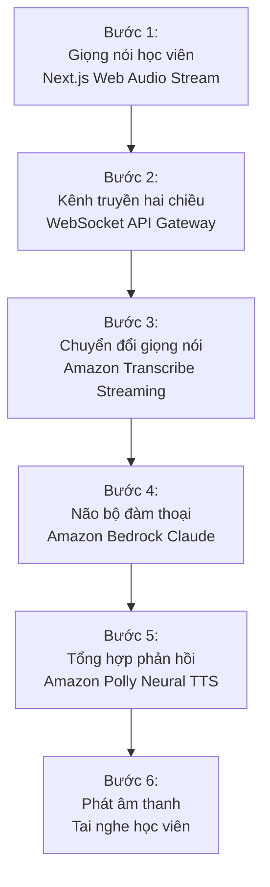
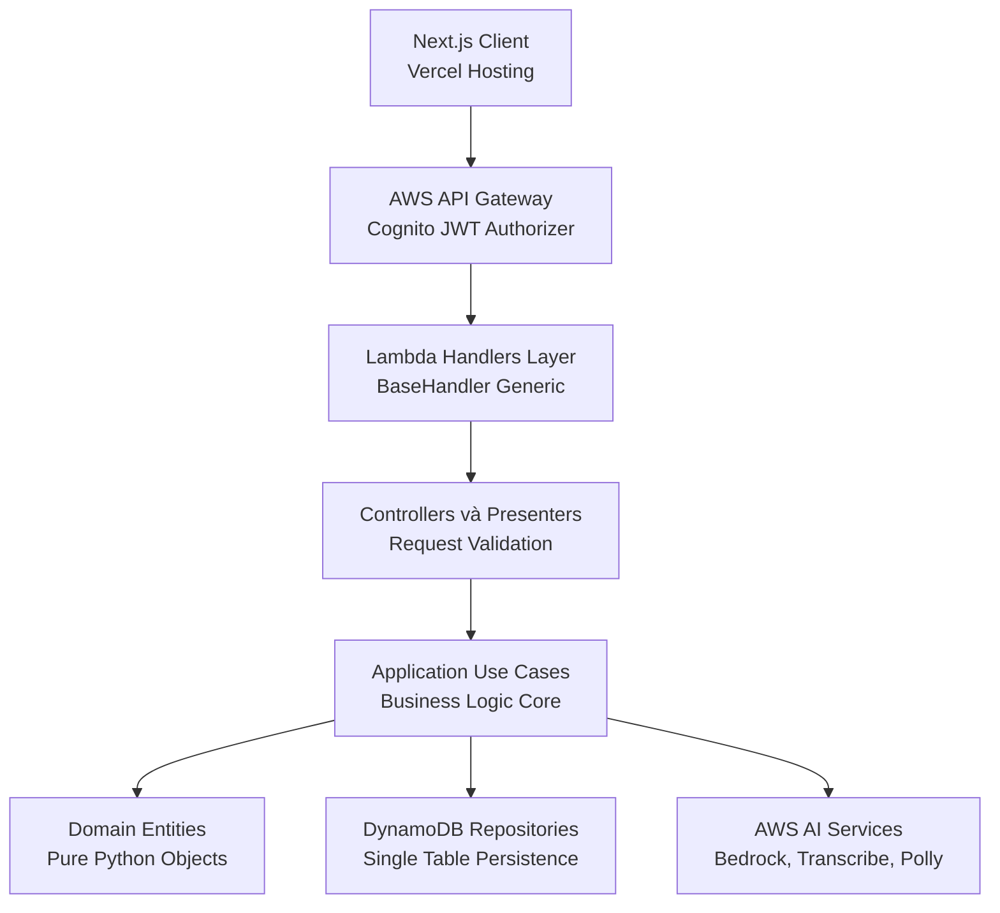



> **One-liner:** Lexi là trợ lý AI luyện giao tiếp phản xạ tiếng Anh hai chiều qua giọng nói thời gian thực, giúp người học phát hiện lỗi phát âm, sửa ngữ pháp và cải thiện phản xạ đàm thoại theo kịch bản thực tế.

## 1. Tổng quan dự án

### Bài toán thực tế
Rào cản lớn nhất của người học giao tiếp tiếng Anh là thiếu môi trường tương tác phản xạ tự nhiên và tâm lý e ngại khi trò chuyện trực tiếp với người bản xứ. Các giải pháp gia sư truyền thống thường có chi phí đắt đỏ và khó sắp xếp thời gian linh hoạt theo lịch cá nhân.

### Đối tượng sử dụng
Học viên tiếng Anh trình độ từ cơ bản đến trung cấp (A2 đến B2) cần một môi trường an toàn, kiên nhẫn để luyện phản xạ nói hàng ngày mà không sợ bị phán xét.

### Giải pháp cốt lõi
Xây dựng một gia sư AI đàm thoại qua luồng âm thanh thời gian thực. Hệ thống tiếp nhận giọng nói, chuyển đổi thành văn bản, phân tích ngữ cảnh để đối đáp tự nhiên, đồng thời cung cấp phản hồi tức thì về lỗi phát âm và cấu trúc ngữ pháp với độ trễ phản xạ dưới 1.2 giây.

---

## 2. Luồng hoạt động cốt lõi

Toàn bộ quy trình luyện tập diễn ra theo luồng khép kín giữa học viên và các dịch vụ đám mây:



1. **Thu âm và truyền phát:** Trình duyệt thu âm giọng nói từ microphone học viên và truyền stream nhị phân liên tục qua kết nối WebSocket bảo mật.
2. **Nhận diện giọng nói:** Amazon Transcribe chuyển đổi âm thanh trực tiếp thành văn bản theo thời gian thực.
3. **Phân tích và đối đáp:** Amazon Bedrock với mô hình Claude nhận văn bản, duy trì ngữ cảnh hội thoại, sinh câu trả lời tiếp nối kèm theo đánh giá lỗi ngữ pháp hoặc từ vựng.
4. **Tổng hợp giọng đọc:** Câu phản hồi được Amazon Polly chuyển thành giọng nói tự nhiên và phát trực tiếp về tai nghe của học viên.

---

## 3. Kiến trúc hệ thống và Thiết kế dữ liệu

Hệ thống vận hành hoàn toàn trên hạ tầng Serverless của AWS, áp dụng Clean Architecture để cô lập mã nguồn Lambda khỏi các phụ thuộc bên ngoài:



### Triển khai BaseHandler Generic Pattern

Mọi Lambda function trong hệ thống đều kế thừa từ lớp `BaseHandler` generic. Cách tiếp cận này giúp đóng gói logic xác thực người dùng từ Cognito JWT claims, chuẩn hóa định dạng phản hồi và hỗ trợ lazy dependency injection (khởi tạo singleton một lần dùng lại qua các lần warm invocation):

```python
class MyHandler(BaseHandler[MyController]):
    def build_dependencies(self) -> MyController:
        # Khởi tạo repository và use case theo mô hình Singleton
        repo = RepositoryFactory.create_my_repository()
        use_case = MyUseCase(repo)
        return MyController(use_case)

    def handle(self, user_id: str, event: dict, context: Any) -> dict:
        controller = self.get_dependencies()
        result = controller.execute(user_id, event)
        
        if result.is_success:
            return self.presenter.present_success(result.value)
        return self.presenter.present_error(400, result.error)
```

### Thiết kế Cơ sở Dữ liệu DynamoDB Single Table

Để đạt độ trễ truy xuất dữ liệu dưới 10ms và tối ưu chi phí vận hành, toàn bộ dữ liệu người dùng, thẻ từ vựng flashcard, phiên luyện nói và kịch bản giao tiếp được gom chung vào một bảng `LexiAppTable` duy nhất:

| Khóa phân vùng (PK) | Khóa sắp xếp (SK) | Loại thực thể | Dữ liệu chính |
| :--- | :--- | :--- | :--- |
| `USER#{user_id}` | `PROFILE` | User Profile | Email, họ tên, cấp độ CEFR hiện tại |
| `USER#{user_id}` | `FLASHCARD#{flashcard_id}` | Flashcard | Từ vựng, phiên âm, ví dụ, lịch ôn tập SRS |
| `USER#{user_id}` | `SESSION#{session_id}` | Speaking Session | Bản ghi âm, văn bản phiên âm, điểm phát âm |
| `SCENARIO#{scenario_id}` | `METADATA` | Scenario | Tiêu đề chủ đề, độ khó, prompt dẫn dắt |

#### Tối ưu truy vấn với Global Secondary Index

Bằng việc thiết kế khóa phân vùng đảo ngược `GSI1_PK = TYPE#FLASHCARD` và `GSI1_SK = USER#{user_id}#DUE#{due_date}`, hệ thống có thể quét toàn bộ các từ vựng cần ôn trong ngày của một học viên cụ thể với một câu lệnh Query duy nhất, loại bỏ hoàn toàn thao tác Scan tốn kém tài nguyên.

---

## 4. Các quyết định kỹ thuật then chốt

### 1. Serverless và WebSocket API Gateway thay vì máy chủ truyền thống
- **Bối cảnh:** Ứng dụng âm thanh thời gian thực thường yêu cầu duy trì kết nối socket liên tục.
- **Quyết định:** Sử dụng AWS API Gateway WebSocket kết hợp AWS Lambda thay vì tự host cụm Socket.io server trên EC2 hoặc ECS.
- **Đánh đổi:** 
  - *Ưu điểm:* Không mất chi phí nhàn rỗi, hệ thống tự động scale từ 0 lên hàng ngàn kết nối đồng thời mà không cần cấu hình cluster.
  - *Nhược điểm:* Phải quản lý connection ID phân tán trong DynamoDB và bị giới hạn thời gian chạy tối đa của Lambda cho mỗi event.

### 2. DynamoDB Single Table thay vì cơ sở dữ liệu quan hệ
- **Bối cảnh:** Dữ liệu học tập có cấu trúc phân tầng giữa người dùng, phiên luyện nói và các lượt đối đáp âm thanh.
- **Quyết định:** Sử dụng Single Table Design trên DynamoDB.
- **Đánh đổi:**
  - *Ưu điểm:* Tốc độ truy xuất nhất quán ở mức một chữ số mili-giây bất kể kích thước dữ liệu tăng lên; chi phí duy trì gần như bằng 0 trong bậc miễn phí.
  - *Nhược điểm:* Cần thiết kế sẵn toàn bộ access patterns từ đầu; các câu truy vấn thống kê phân tích phức tạp trong tương lai sẽ khó thực hiện trực tiếp.

---

## 5. Kết quả đạt được và Giới hạn hiện tại

### Kết quả đạt được
1. **Độ trễ phản xạ:** Phản hồi ấm của Lambda đạt từ 50ms đến 100ms; tổng thời gian từ khi người học dứt lời đến khi nghe câu trả lời trung bình khoảng 1.2 giây.
2. **Tối ưu chi phí:** Hạ tầng Serverless hoàn toàn giúp chi phí duy trì chỉ khoảng $12/tháng cho quy mô thử nghiệm 10.000 người dùng với 100.000 lượt tương tác.
3. **Chất lượng mã nguồn:** Áp dụng Clean Architecture cho phép kiểm thử độc lập tầng Use Case với độ bao phủ kiểm thử cao mà không cần giả lập môi trường AWS thực tế.

### Giới hạn đã biết
- **Chất lượng đường truyền di động:** Khi mạng yếu hoặc chập chờn, luồng audio streaming qua WebSocket có thể bị đứt đoạn gói tin.
- **Giọng địa phương và tạp âm:** Mặc dù Amazon Transcribe nhận diện tốt giọng chuẩn, nhưng với những trường hợp môi trường xung quanh có nhiều tiếng ồn hoặc phát âm nuốt âm quá nhiều, độ chính xác nhận diện câu văn có thể bị ảnh hưởng.

---

- 
- 
