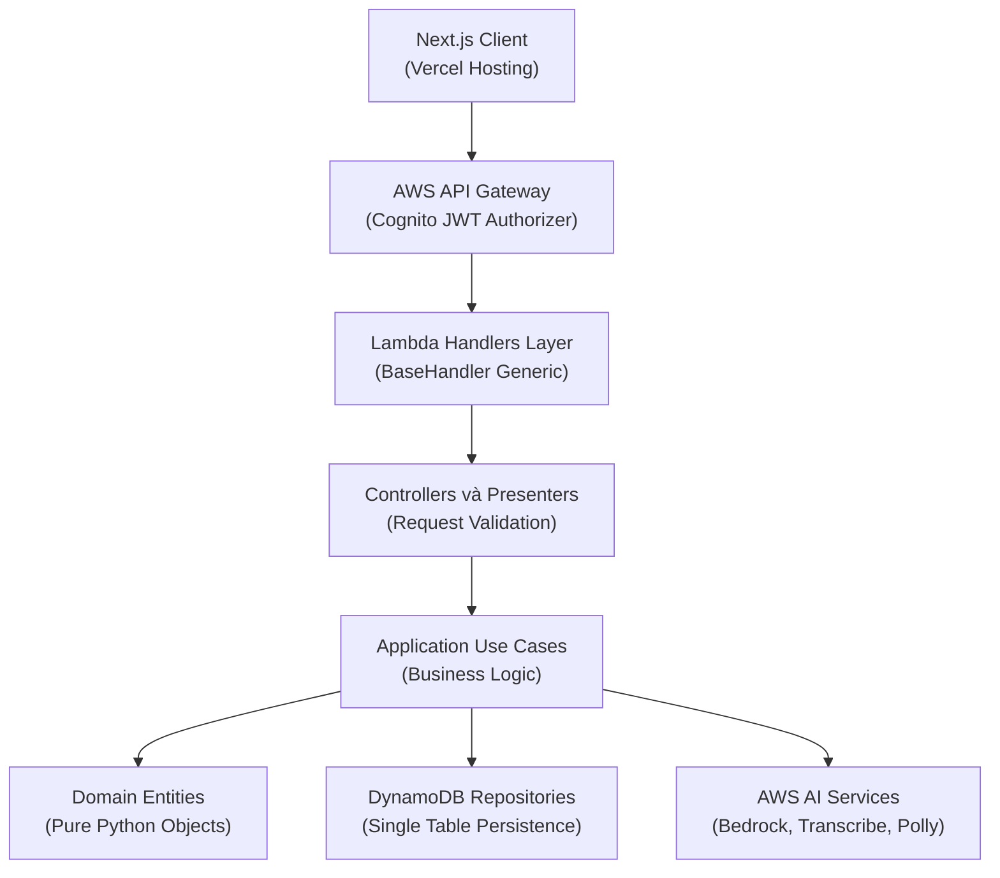
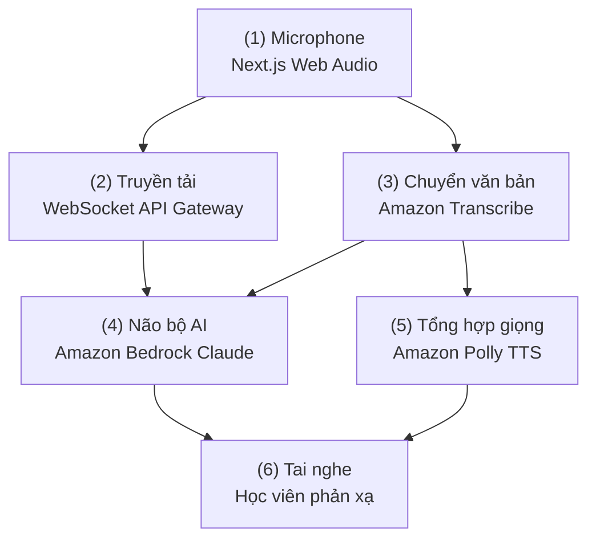
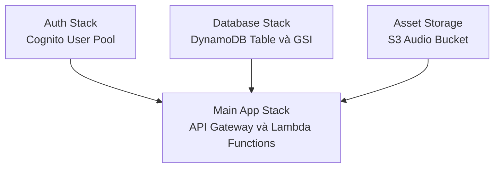



Bài toán thực tế trong việc học giao tiếp tiếng Anh là người học thường thiếu môi trường phản xạ tự nhiên và e ngại khi trò chuyện trực tiếp với người bản xứ. Các giải pháp gia sư truyền thống chi phí cao và khó linh hoạt theo thời gian cá nhân. Dự án Lexi được thiết kế để giải quyết triệt để vấn đề này bằng cách xây dựng một gia sư AI giao tiếp qua luồng âm thanh thời gian thực, có khả năng nhận diện giọng nói, phân tích lỗi sai ngữ pháp và phản hồi ngữ cảnh với độ trễ phản xạ thấp.

## Kiến trúc phân tầng Clean Architecture trên Serverless

Để tránh tình trạng mã nguồn Lambda bị rối rắm và khó kiểm thử, chúng ta áp dụng mô hình Clean Architecture phân tách rõ ràng trách nhiệm từng tầng vào hệ thống serverless:



### Triển khai BaseHandler Generic Pattern

Mọi Lambda function trong hệ thống đều kế thừa từ lớp `BaseHandler` generic. Cách tiếp cận này giúp đóng gói logic xác thực người dùng từ Cognito JWT claims, chuẩn hóa định dạng phản hồi và hỗ trợ lazy dependency injection (khởi tạo singleton một lần dùng lại qua các lần warm invocation):

```python
class MyHandler(BaseHandler[MyController]):
    def build_dependencies(self) -> MyController:
        # Khởi tạo repository và use case theo mô hình Singleton
        repo = RepositoryFactory.create_my_repository()
        use_case = MyUseCase(repo)
        return MyController(use_case)

    def handle(self, user_id: str, event: dict, context: Any) -> dict:
        controller = self.get_dependencies()
        result = controller.execute(user_id, event)
        
        if result.is_success:
            return self.presenter.present_success(result.value)
        return self.presenter.present_error(400, result.error)
```

## Thiết kế Cơ sở Dữ liệu DynamoDB Single Table

Để đạt độ trễ truy xuất dữ liệu dưới 10ms và tối ưu chi phí vận hành ở mức thấp nhất, toàn bộ dữ liệu người dùng, thẻ từ vựng flashcard, phiên luyện nói và kịch bản giao tiếp được gom chung vào một bảng `LexiAppTable` duy nhất:

| Khóa phân vùng (PK) | Khóa sắp xếp (SK) | Loại thực thể | Dữ liệu chính |
| :--- | :--- | :--- | :--- |
| `USER#{user_id}` | `PROFILE` | User Profile | Email, họ tên, cấp độ CEFR hiện tại |
| `USER#{user_id}` | `FLASHCARD#{flashcard_id}` | Flashcard | Từ vựng, phiên âm, ví dụ, lịch ôn tập SRS |
| `USER#{user_id}` | `SESSION#{session_id}` | Speaking Session | Bản ghi âm, văn bản phiên âm, điểm phát âm |
| `SCENARIO#{scenario_id}` | `METADATA` | Scenario | Tiêu đề chủ đề, độ khó, prompt dẫn dắt |

### Tối ưu truy vấn với Global Secondary Index (GSI1)

Nhằm phục vụ tính năng nhắc nhở ôn tập từ vựng ngắt quãng Spaced Repetition System mỗi ngày, chúng ta thiết lập thêm chỉ mục phụ GSI1:

- **GSI1PK:** `FLASHCARD#DUE`
- **GSI1SK:** `{YYYY-MM-DD}#USER#{user_id}`
- **Ứng dụng:** Hệ thống có thể quét toàn bộ các từ vựng cần ôn trong ngày của một học viên cụ thể với một câu lệnh Query duy nhất, loại bỏ hoàn toàn thao tác Scan tốn kém tài nguyên.

## Quy trình Xử lý Luồng Thoại Thời gian thực

Hệ thống kết hợp WebSocket API Gateway cùng bộ dịch vụ AI của AWS để tạo nên trải nghiệm hội thoại hai chiều liên tục:



1. **Thu âm và Truyền phát:** Ứng dụng Next.js thu âm giọng nói từ microphone người dùng và truyền stream dữ liệu qua kết nối WebSocket bảo mật.
2. **Chuyển văn bản và Phân tích:** Amazon Transcribe chuyển đổi giọng nói thành văn bản. Amazon Bedrock với mô hình Claude đóng vai trò não bộ, vừa tiếp tục hội thoại theo kịch bản vừa phân tích chi tiết các lỗi phát âm, từ vựng và ngữ pháp.
3. **Phản hồi tức thì:** Lời thoại của gia sư AI được tổng hợp thành giọng đọc tự nhiên thông qua Amazon Polly và stream ngược lại tai nghe của người học với độ trễ phản xạ trung bình dưới 1.2 giây.

## Hạ tầng Triển khai và Quản lý Đa Stack

Toàn bộ tài nguyên đám mây được quản lý theo mô hình Infrastructure as Code bằng AWS SAM, chia tách thành 3 stack độc lập nhằm giảm thiểu rủi ro khi cập nhật hệ thống:



- **Auth Stack (`auth-base.yaml`):** Quản lý Cognito User Pool, hỗ trợ đăng nhập email và xác thực Google OAuth.
- **Database Stack (`database.yaml`):** Quản lý bảng DynamoDB `LexiAppTable` với mã hóa dữ liệu tại chỗ Encryption at Rest.
- **Main Application Stack (`template.yaml`):** Khởi tạo API Gateway, tập hợp các Lambda Handlers và S3 Bucket lưu trữ file âm thanh luyện nói.

## Kết quả Đạt được

1. **Hiệu năng và Độ trễ:** Thời gian phản hồi ấm của Lambda chỉ từ 50ms đến 100ms; truy vấn dữ liệu DynamoDB duy trì ở mức mili-giây.
2. **Tối ưu chi phí:** Kiến trúc Serverless hoàn toàn giúp chi phí duy trì chỉ khoảng $12/tháng cho quy mô 10.000 người dùng hoạt động với 100.000 lượt tương tác.
3. **Mã nguồn sạch và Dễ kiểm thử:** Áp dụng Clean Architecture giúp việc viết Unit Test cho tầng Use Case đạt độ bao phủ kiểm thử cao mà không cần phụ thuộc vào môi trường AWS thực tế.

---
- 
- 
