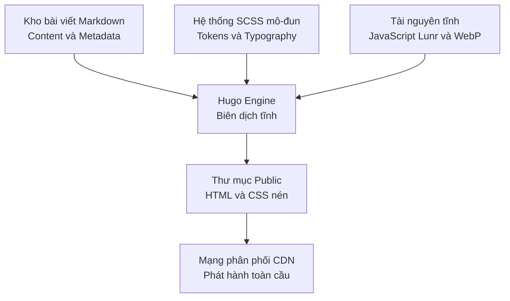

> [!TLDR]
> Ngọc Tín Site là blog kỹ thuật và portfolio cá nhân hướng tới trải nghiệm đọc tập trung, tối ưu hiệu năng tải trang tĩnh và tích hợp tìm kiếm tức thì mà không phụ thuộc máy chủ backend.
>
> **Vai trò:** Thiết kế hệ thống Design System SCSS mô-đun, cấu hình pipeline biên dịch Hugo, tùy biến tìm kiếm Lunr.js và tự động hóa triển khai qua GitHub Actions.

## Bối cảnh và bài toán thực tế

Nhiều trang blog công nghệ hiện nay phụ thuộc các framework JavaScript phức tạp, kéo theo bundle nặng nề, quảng cáo chen ngang và thời gian tải trang chậm. Điều này làm suy giảm trải nghiệm đọc chuyên sâu và lãng phí tài nguyên máy chủ cho những nội dung thuần túy là văn bản tĩnh.

### Đối tượng sử dụng
- **Bạn đọc:** Những người tìm kiếm tài liệu, giải pháp kỹ thuật và bài học thực tế, mong muốn giao diện đọc sáng sủa, tải trang nhanh và không bị làm phiền.
- **Tác giả:** Cần quy trình xuất bản bài viết liền mạch bằng Markdown, quản lý phiên bản qua Git và triển khai tự động.

### Giải pháp cốt lõi
Sử dụng bộ tạo trang tĩnh Hugo kết hợp hệ thống SCSS mô-đun hóa:
- Biên dịch toàn bộ mã nguồn Markdown thành các file HTML tĩnh trong vài mili-giây.
- Tự thiết kế hệ thống token giao diện theo phong cách tạp chí biên tập, hỗ trợ chế độ Dark Mode chuẩn HSL mà không gây hiện tượng chớp màn hình khi tải trang.
- Tích hợp công cụ tìm kiếm nội dung phía trình duyệt bằng Lunr.js, cho phép tìm bài viết tức thì mà không cần duy trì cơ sở dữ liệu riêng.

---

## Luồng hoạt động cốt lõi

Quy trình xử lý nội dung từ lúc viết bài đến khi bài viết hiển thị trên môi trường trực tuyến:

1. **Soạn thảo và quản trị:** Tác giả viết bài dưới dạng Markdown, quản lý hình ảnh và cấu trúc thư mục rõ ràng.
2. **Biên dịch mã nguồn tĩnh:** Hugo đọc các file Markdown, kết hợp với các partial template và render toàn bộ website ra thư mục public chỉ trong chưa đầy 1 giây.
3. **Tối ưu hóa tài nguyên:** Hệ thống tự động nén định dạng ảnh WebP và biên dịch SCSS thành file CSS duy nhất được băm mã hóa cache.
4. **Triển khai tự động:** GitHub Actions tự động kích hoạt tiến trình kiểm tra cú pháp và triển khai trực tiếp lên CDN toàn cầu.

---

## Kiến trúc hệ thống và quy chuẩn thiết kế

Trang web hoạt động theo mô hình Jamstack thuần túy, không duy trì máy chủ ứng dụng:

### Điểm nhấn thiết kế và kiến trúc
- **Zero Runtime Framework:** Không dùng React, Vue hay các UI runtime nặng nề cho các trang nội dung tĩnh, giúp DOM nhẹ và trình duyệt xử lý tức thì.
- **Hệ thống Design System SCSS tự xây dựng:** Tách biệt giữa các module typography, grid layout, dark mode filter và animation marquee.
- **Tìm kiếm không máy chủ:** Xây dựng file chỉ mục bài viết tĩnh dạng JSON trong quá trình build, trình duyệt tải về và sử dụng thư viện Lunr.js để tìm kiếm từ khóa với độ trễ 0ms.

---

## Các quyết định kỹ thuật then chốt

### Chọn Hugo thay vì Next.js hoặc Astro
- **Bối cảnh:** Cần một công cụ tạo trang tĩnh cho blog cá nhân với nhiều bài viết kỹ thuật dài và sơ đồ phức tạp.
- **Quyết định:** Chọn Hugo viết bằng ngôn ngữ Go.
- **Đánh đổi:** 
  - *Ưu điểm:* Tốc độ build tĩnh vượt trội (vài chục mili-giây); binary độc lập không lo xung đột dependency của npm.
  - *Nhược điểm:* Cú pháp Go Template đòi hỏi thời gian làm quen ban đầu và hệ sinh thái plugin không đồ sộ bằng JavaScript.

### Tìm kiếm bằng Lunr.js phía trình duyệt thay vì dịch vụ bên thứ ba
- **Bối cảnh:** Cần tính năng tìm kiếm bài viết cho độc giả.
- **Quyết định:** Tự sinh file chỉ mục tĩnh và tìm kiếm trực tiếp trên trình duyệt bằng Lunr.js thay vì tích hợp các dịch vụ bên ngoài như Algolia.
- **Đánh đổi:**
  - *Ưu điểm:* Độc lập hoàn toàn, không mất chi phí duy trì hàng tháng và bảo vệ quyền riêng tư của độc giả.
  - *Nhược điểm:* Khi số lượng bài viết lên tới hàng ngàn bài, kích thước file JSON chỉ mục sẽ tăng lên; tuy nhiên với quy mô blog cá nhân dưới vài trăm bài, giải pháp này là tối ưu nhất.

---

## Kết quả đạt được và giới hạn hiện tại

### Kết quả đạt được
1. **Hiệu năng tải trang cao:** Tối ưu hóa asset giúp trang đạt điểm số tối đa trên Google PageSpeed Insights cho các chỉ số tải trang và tương tác tĩnh.
2. **Chi phí vận hành bằng 0:** Nhờ phát hành dưới dạng tĩnh trên GitHub Pages kết hợp Cloudflare CDN, chi phí hosting hàng tháng duy trì ở mức 0 đồng.
3. **Trải nghiệm đọc tập trung:** Loại bỏ hoàn toàn các yếu tố gây xao nhãng, giữ chân người đọc vào nội dung cốt lõi.

### Giới hạn đã biết
- **Tương tác động:** Vì là trang tĩnh hoàn toàn, các tính năng tương tác như bình luận cần tích hợp giải pháp lưu trữ ngoài như Giscus qua GitHub Discussions.
- **Khả năng tìm kiếm tiếng Việt có dấu:** Lunr.js thuần túy cần cấu hình bộ tách từ tiếng Việt để tối ưu hóa độ chính xác khi tìm kiếm từ khóa có dấu phức tạp.

---

- 
- 

