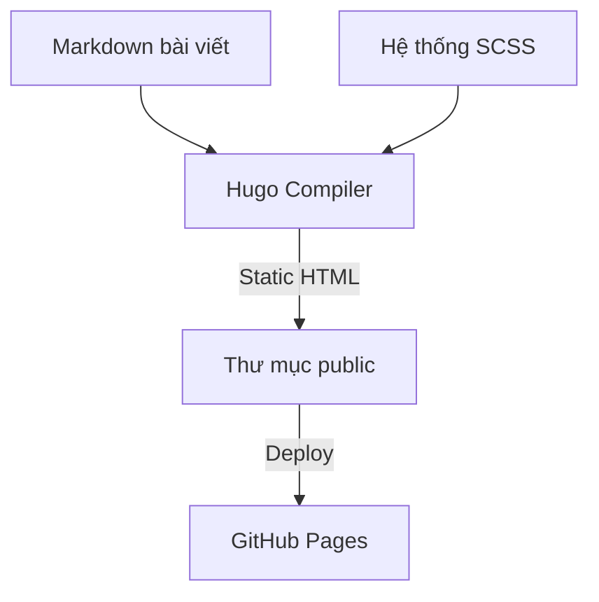

Trong kỷ nguyên của các trang web cồng kềnh chứa nhiều JavaScript nặng nề, tốc độ tải trang và trải nghiệm đọc thuần khiết là hai yếu tố then chốt cho một blog kỹ thuật chất lượng. Dự án Ngọc Tín Site được phát triển dựa trên triết lý tối giản, đạt điểm số hiệu năng tuyệt đối trên Google PageSpeed Insights và tối ưu hóa trải nghiệm đọc báo chí cao cấp.

## Điểm nhấn kiến trúc và công nghệ

- **Hugo Static Site Generator:** Biên dịch hàng trăm bài viết markdown thành file HTML tĩnh chỉ trong vài millisecond.
- **Hệ thống Design System SCSS tùy biến:** Xây dựng hệ thống token màu sắc, typography font Lora thanh lịch và hỗ trợ chế độ Dark Mode chuẩn HSL.
- **Tìm kiếm client-side bằng Lunr.js:** Tìm kiếm tức thì nội dung bài viết ngay trên trình duyệt mà không cần máy chủ cơ sở dữ liệu riêng.
- **Tự động hóa CI CD:** Đẩy mã nguồn lên GitHub và tự động build tĩnh triển khai lên GitHub Pages hoặc Cloudflare Pages.

## Sơ đồ quy trình biên dịch và triển khai

## Kết quả đạt được

Trang web đạt tốc độ phản hồi tức thì, trải nghiệm đọc báo chí mượt mà và chi phí lưu trữ hoàn toàn miễn phí nhờ hạ tầng tĩnh.

---
- 
- 
