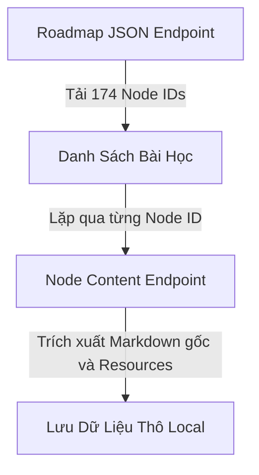

Khi đối mặt với một lộ trình học tập đồ sộ gồm 174 bài học kỹ thuật như AI Engineer Roadmap trên roadmap.sh, thách thức lớn nhất của chúng ta là làm sao chuyển đổi toàn bộ tài liệu này thành các tệp Markdown song ngữ chất lượng cao mà không làm mất đi bất kỳ đoạn kiến thức nào. Việc đọc tài liệu kỹ thuật tiếng Anh thuần túy thường tạo ra rào cản nhận thức đối với người mới, trong khi các bản dịch tự động thông thường lại dễ gây mất ngữ cảnh hoặc dịch sai thuật ngữ chuyên ngành.

Để giải quyết bài toán này, chúng ta đã xây dựng một pipeline tự động hóa hoàn chỉnh: từ khâu giải mã API ẩn của roadmap.sh, thu thập dữ liệu thô, thiết kế prompt phân đoạn song ngữ cho Gemini API, đến khâu tối ưu hóa cấu trúc Markdown tương thích với Hugo. Bài viết này tổng hợp toàn bộ quy trình, công cụ, prompt mẫu và những bài học xương máu xử lý sự cố thực tế để chúng ta có thể tái sử dụng cho bất kỳ lộ trình học tập nào khác.

---

## 1. Phân Tích Bài Toán và Yêu Cầu Thiết Kế

Một bài học kỹ thuật song ngữ đạt chuẩn không chỉ đơn thuần là việc dịch từ dòng này sang dòng khác. Nếu dịch nguyên đoạn văn dài, người đọc sẽ rất khó đối chiếu giữa bản gốc và bản dịch. Do đó, chúng ta đặt ra các yêu cầu khắt khe cho nội dung đầu ra:

1. **Bảo tồn 100% kiến thức:** TUYỆT ĐỐI KHÔNG tóm tắt, diễn giải, thêm bớt hay lược bỏ bất kỳ đoạn văn nào từ bài học gốc.
2. **Quy tắc Chunking song ngữ:** Chia mỗi câu tiếng Anh thành các cụm từ ngữ nghĩa nhỏ (semantic chunks) từ 3 đến 6 từ. Các chunk được phân tách bằng ký tự `|`.
3. **Quy tắc dòng:** Mỗi dòng chứa từ 2 đến 3 chunks (tối đa 15 từ). Dòng tiếng Anh in đậm nằm ngay trên, dòng tiếng Việt in nghiêng nằm ngay bên dưới.
4. **Giữ nguyên thuật ngữ chuyên ngành:** Các từ khóa như AI, Machine Learning, LLM, Transformer, Embedding, Fine-tuning, Vector Database, RAG, API, SDK phải được giữ nguyên.
5. **Cấu trúc Hugo Markdown:** Định dạng đầy đủ Front Matter, giữ nguyên các khối mã code, hình ảnh, liên kết tham khảo và bổ sung hệ thống điều hướng bài học.


Semantic Chunking ưu tiên phân tách theo cụm danh từ, cụm động từ, mệnh đề hoặc cụm giới từ. Tránh tuyệt đối việc tách động từ khỏi tân ngữ, tính từ khỏi danh từ hoặc tách phrasal verbs.


---

## 2. Giải Mã API Bí Mật của Roadmap.sh

Trang web roadmap.sh được xây dựng dưới dạng ứng dụng single-page client-side. Khi kiểm tra trang web, chúng ta nhận thấy nền tảng này không cung cấp REST API công khai cho người dùng. Tuy nhiên, bằng cách phân tích lưu lượng mạng và các file script frontend, chúng ta đã phát hiện ra hai endpoint ẩn trả về dữ liệu định dạng JSON rất sạch:

- **Endpoint 1 (Lấy toàn bộ sơ đồ):** `https://roadmap.sh/ai-engineer.json`  
  Endpoint này trả về toàn bộ cấu trúc nút (nodes) của roadmap, bao gồm 174 nút đại diện cho 22 chủ đề lớn (topics) và 152 bài học nhỏ (subtopics) cùng ID duy nhất của từng nút.
- **Endpoint 2 (Lấy nội dung chi tiết bài học):** `https://roadmap.sh/ai-engineer/{nodeId}.json`  
  Endpoint này trả về dữ liệu JSON chứa toàn bộ nội dung bài học dưới dạng Markdown gốc (trong trường `description`), danh sách tài liệu đọc thêm (trong trường `resources`) và thông tin cập nhật.



Dưới đây là đoạn mã Python rút gọn được chúng ta sử dụng để tải toàn bộ dữ liệu thô về máy:

```python
import json
import urllib.request
import time

BASE_URL = "https://roadmap.sh"
ROADMAP_SLUG = "ai-engineer"

# Tải danh sách tất cả các nút trong roadmap
req = urllib.request.Request(f"{BASE_URL}/{ROADMAP_SLUG}.json")
with urllib.request.urlopen(req) as resp:
    roadmap_data = json.loads(resp.read().decode('utf-8'))

nodes = [n for n in roadmap_data.get('nodes', []) if n.get('type') in ('topic', 'subtopic')]

# Tải nội dung chi tiết từng bài học
all_lessons = []
for node in nodes:
    node_id = node['id']
    url = f"{BASE_URL}/{ROADMAP_SLUG}/{node_id}.json"
    try:
        with urllib.request.urlopen(url) as resp:
            content_data = json.loads(resp.read().decode('utf-8'))
            node['description'] = content_data.get('description', '')
            node['resources'] = content_data.get('resources', [])
            all_lessons.append(node)
    except Exception as e:
        print(f"Lỗi khi tải node {node_id}: {e}")
    time.sleep(1.0) # Tránh vượt giới hạn rate limit
```

---

## 3. Kiến Trúc Pipeline và Tối Ưu Hóa Chi Phí XL bằng LLM

Xử lý 174 bài học riêng lẻ từng bài một thông qua API sẽ mất rất nhiều thời gian và chi phí HTTP overhead. Mặt khác, nếu gửi toàn bộ 174 bài trong một request duy nhất, mô hình AI sẽ bị quá tải bộ nhớ bối cảnh (context limit) và dẫn đến hiện tượng trôi thông tin.

Giải pháp tối ưu của chúng ta là phân chia xử lý theo từng **Batch 20 bài học**. Mô hình được lựa chọn là `gemini-3.1-flash-lite` thông qua Google Gemini API, mang lại tốc độ xử lý vượt trội (trung bình 25 đến 35 giây cho mỗi batch 20 bài) với mức chi phí vô cùng tiết kiệm.


You are a bilingual content processor. Process the following lessons from the AI Engineer Roadmap.

For EACH lesson, you must:
1. Keep ALL original content: headings, paragraphs, lists, tables, code blocks. Do NOT summarize, paraphrase, or add anything.
2. Apply bilingual chunking to EVERY English paragraph:
   - Split each sentence into semantic chunks of 3-6 words each.
   - Split at noun phrases, verb phrases, clauses, prepositional phrases, conjunctions.
   - Do NOT split verb+object, adjective+noun, compound nouns, idioms, phrasal verbs.
   - Each line has 2-3 chunks separated by "|", max 15 words per line.
   - English line in bold, Vietnamese translation in italic directly below.
   - Keep technical terms untranslated: AI, ML, LLM, Transformer, Embedding, Fine-tuning, Vector Database, Prompt Engineering, Deep Learning, RAG, API, SDK, MCP, etc.
3. Format:
**Chunk 1 | Chunk 2 | Chunk 3**
*Dich chunk 1 | Dich chunk 2 | Dich chunk 3*

4. For headings: Keep original English heading as-is (## heading). Do NOT chunk headings.
5. For code blocks: Keep exactly as-is. Do NOT translate code.
6. Output format for EACH lesson:
<<<LESSON_START>>>
LESSON_ID: [id]
LESSON_SLUG: [slug]
LESSON_CATEGORY: [category]
---
title: "[Original Title]"
description: "[First sentence]"
summary: "[First sentence in Vietnamese]"
slug: "[slug]"
date: 2026-08-01
draft: false
categories:
  - Tech Blog
toc: true
---
[Chunked content]

## Resources
[Resource links]

## References
- https://roadmap.sh/ai-engineer (Node: [label])
<<<LESSON_END>>>


---

## 4. Các Sự Cố Thực Tế và Bài Học Triển Khai

Trong quá trình thực thi, chúng ta đã gặp phải 4 sự cố kỹ thuật lớn. Việc phân tích và khắc phục những sự cố này mang lại những bài học vô cùng giá trị.

### Sự Cố 1: Lỗi Tiếng Anh và Tiếng Việt Dính Dòng Trên Hugo

**Bài toán:** Khi xem trên giao diện web, dòng tiếng Anh in đậm và dòng dịch tiếng Việt in nghiêng bị dính liền với nhau trên cùng một dòng thay vì xuống dòng ngay bên dưới.

**Phân tích nguyên nhân:** Theo chuẩn Markdown (Goldmark Engine trong Hugo), việc xuống dòng đơn giữa hai dòng văn bản mà không có 2 dấu cách ở cuối dòng hoặc một dòng trống ở giữa sẽ làm cho bộ biên dịch gộp chung hai dòng thành một đoạn văn duy nhất `<p><b>...</b> <i>...</i></p>`.

**Giải pháp:** Chúng ta bổ sung một bước hậu xử lý tự động trong Python script: thêm 2 ký tự khoảng trắng (`  `) vào cuối mỗi dòng tiếng Anh in đậm `**...**`. Trong Markdown, 2 khoảng trắng ở cuối dòng báo hiệu sinh thẻ `<br>`, giúp dòng tiếng Việt hiển thị ngay bên dưới mà không làm tăng khoảng cách dòng như một paragraph mới.

```python
import re

# Thêm 2 dấu cách vào cuối mỗi dòng tiếng Anh in đậm
fixed_content = re.sub(r'(\*\*[^\n]+\*\*)$', r'\1  ', raw_content, flags=re.MULTILINE)
```

---

### Sự Cố 2: Lỗi Crash Go Runtime Panic của Theme LoveIt

**Bài toán:** Khi truy cập vào bài viết `prompt-engineering.md`, Hugo dev server văng lỗi nghiêm trọng:

```text
render of "prompt-engineering.md" failed: 
"themes/LoveIt/layouts/single.html:18:31": execute of template failed at <.Content>: 
error calling Content: runtime error: slice bounds out of range [:2721] with capacity 2048
```

**Phân tích nguyên nhân:** Theme LoveIt mặc định chạy các hàm xử lý Regex qua partial `function/content.html` (như chuyển đổi cú pháp Ruby, FontAwesome, Fraction, Escape). Khi nội dung bài viết chứa các cụm từ nằm trong ngoặc đơn như `(prompts)` hoặc `(context)` đi kèm với ký tự phân cách `|`, bộ xử lý Regex của Go văng lỗi tràn bộ nhớ đệm (slice bounds out of range panic).

**Giải pháp:** Chúng ta tạo một tệp đè an toàn tại `layouts/_partials/function/content.html` trong thư mục dự án để vô hiệu hóa các hàm Regex dễ bị tổn thương này, trả về trực tiếp nội dung Markdown đã được biên dịch:

```html
{{- /* Safe Content Processor: Ngăn ngừa lỗi replaceRE slice bounds panic trong LoveIt */ -}}
{{- $content := .Content -}}

{{- if $content -}}
    {{- $content = partial "function/checkbox.html" $content -}}
{{- end -}}

{{- return $content -}}
```

---

### Sự Cố 3: Thiếu Trang Danh Mục Lộ Trình Tổng và Điều Hướng Bài Học

**Bài toán:** Truy cập đường dẫn `/ai-engineer/` chỉ hiển thị danh sách bài viết theo dạng lưu trữ ngày tháng (Archive) thay vì một bảng mục lục học tập trực quan. Ngoài ra, người đọc khi đọc xong một bài học không có cách nào bấm chuyển sang bài tiếp theo.

**Giải pháp:**
1. Tạo tệp layout tùy chỉnh `layouts/ai-engineer/section.html` để buộc Hugo hiển thị nội dung tệp `_index.md` (nơi chứa Bảng mục lục Master 12 chuyên mục với 174 liên kết).
2. Viết script tự động thêm thuộc tính `weight`, `prev`, `next` vào Front Matter và chèn dòng liên kết văn bản tối giản ở cuối mỗi bài học:

```markdown
---

[← Bài trước](/ai-engineer/01-introduction/introduction/) · [AI Engineer Roadmap](/ai-engineer/) · [Bài tiếp theo →](/ai-engineer/01-introduction/ai-engineer-vs-ml-engineer/)
```

---

## 5. Quy Trình 4 Bước Tái Sử Dụng Cho Các Roadmap Khác

Để áp dụng quy trình này cho bất kỳ lộ trình nào khác trên roadmap.sh (như Frontend, Backend, DevOps, Data Science), chúng ta chỉ cần thực hiện theo 4 bước tiêu chuẩn:

1. **Bước 1 (Fetch Data):** Chạy script `fetch_roadmap_data.py` với slug mới (ví dụ `ROADMAP_SLUG = "devops"`).
2. **Bước 2 (Batch Processing):** Sử dụng `process_batch.py` gửi dữ liệu sang Gemini API để phân đoạn song ngữ và tự động thêm 2 dấu cách ngắt dòng.
3. **Bước 3 (Generate Index):** Chạy `generate_roadmap_index.py` để tạo trang mục lục chính `_index.md` và các trang danh mục con.
4. **Bước 4 (Add Navigation và Build):** Chạy `add_roadmap_navigation.py` để liên kết các bài học theo thứ tự `weight` và thực hiện kiểm tra `hugo --gc --minify`.

---

## 6. Tổng Kết

Nhờ sự kết hợp giữa kỹ thuật khai thác API ẩn, khả năng phân đoạn ngôn ngữ của LLM và việc làm chủ cấu trúc theme trong Hugo, chúng ta đã biến một lộ trình học tập phức tạp 174 bài học thành một tài liệu song ngữ tra cứu tiện lợi, chuẩn SEO và tối ưu trải nghiệm đọc. Quá trình xử lý các sự cố ngắt dòng và lỗi Go template cũng mang lại cho chúng ta hiểu biết sâu sắc hơn về cơ chế hoạt động bên dưới của Hugo và Goldmark Engine.
