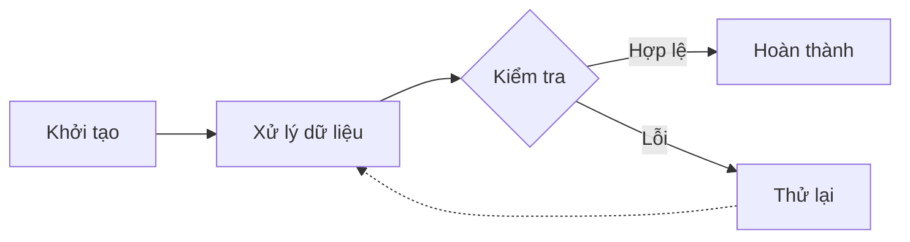

> *"Các shortcodes của LoveIt giúp nâng cao trải nghiệm hiển thị nội dung phong phú mà không cần viết thêm mã HTML phức tạp."*

Giao diện **LoveIt** cung cấp một bộ công cụ shortcodes đa dạng giúp chúng ta dễ dàng trình bày bài viết chuẩn đẹp, tích hợp sơ đồ, âm nhạc, biểu đồ và các ô ghi chú ấn tượng. 

Dưới đây là tài liệu tổng hợp và demo trực quan toàn bộ 16 shortcodes có sẵn trong hệ thống.

---

## 1. THẺ GHI CHÚ ADMONITION

Shortcode `admonition` giúp tạo các hộp thông báo phân loại theo màu sắc và biểu tượng.

### Các loại Admonition hỗ trợ:
`note`, `abstract`, `info`, `tip`, `success`, `question`, `warning`, `failure`, `danger`, `bug`, `example`, `quote`.


Đây là ô thông báo ghi chú mặc định dùng để cung cấp thông tin ngữ cảnh bổ sung cho bài viết.



Đây là ô chứa các mẹo tối ưu hiệu năng hoặc lời khuyên hữu ích khi viết mã.



Đây là ô cảnh báo các rủi ro có thể gặp phải hoặc các thao tác nhạy cảm.



Đây là ô trình bày ví dụ minh họa hoặc các câu lệnh mẫu thực thi.


### Cú pháp Markdown:
```markdown

Nội dung bên trong ô thông báo...

```

---

## 2. SƠ ĐỒ ĐỘNG MERMAID

Sử dụng khối mã ```` ```mermaid ```` cho phép tạo sơ đồ quy trình, luồng dữ liệu hoặc biểu đồ trình tự trực quan.



### Cú pháp Markdown:
```markdown

```

---

## 3. TÙY CHỈNH KIỂU DÁNG CƠ BẢN STYLE

Shortcode `style` giúp chúng ta can thiệp trực tiếp các thuộc tính CSS cho một đoạn văn bản hoặc khối nội dung.


Đoạn văn này được tùy chỉnh màu đỏ nổi bật và chữ in đậm thông qua shortcode style.


### Cú pháp Markdown:
```markdown

Nội dung tùy chỉnh CSS...

```

---

## 4. HIỆU ỨNG GÕ CHỮ TỰ ĐỘNG TYPEIT

Shortcode `typeit` tạo hiệu ứng gõ phím hoạt hình cho văn bản hoặc đoạn mã nguồn.


Chào mừng chúng ta đến với trang web cá nhân của Nguyễn Ngọc Tín!


### Cú pháp Markdown:
```markdown

Nội dung hiển thị dạng gõ chữ tự động...

```

---

## 5. THẺ PHIÊN BẢN VERSION

Shortcode `version` hiển thị các huy hiệu đánh dấu phiên bản cập nhật kèm màu sắc tương ứng.

- Phiên bản mới: 
- Phiên bản thay đổi: 
- Phiên bản ngưng hỗ trợ: 

### Cú pháp Markdown:
```markdown


```

---

## 6. THẺ NHÂN VẬT PERSON

Shortcode `person` giúp tạo thẻ giới thiệu thông tin cá nhân hoặc tác giả dạng card.



### Cú pháp Markdown:
```markdown

```

---

## 7. LIÊN KẾT TÙY CHỈNH LINK

Shortcode `link` hỗ trợ tạo liên kết nâng cao kèm thuộc tính hiển thị.



### Cú pháp Markdown:
```markdown

```

---

## 8. HÌNH ẢNH NÂNG CAO IMAGE

Shortcode `image` tạo hình ảnh có phản hồi kích thước, tự động làm lightbox xem ảnh phóng to và chú thích bên dưới.



### Cú pháp Markdown:
```markdown

```

---

## 9. BIỂU ĐỒ ECHARTS

Shortcode `echarts` render các biểu đồ thống kê trực quan dạng Bar, Line hoặc Pie bằng cấu trúc dữ liệu JSON.


{"title":{"text":"Thống kê mức độ sử dụng ngôn ngữ"},"tooltip":{},"xAxis":{"data":["Python","Java","TypeScript","SQL"]},"yAxis":{},"series":[{"name":"Tỷ lệ","type":"bar","data":[45,25,20,10]}]}


### Cú pháp Markdown:
```markdown

{"title":{"text":"Thống kê"},"xAxis":{"data":["Python","Java","TypeScript"]},"yAxis":{},"series":[{"type":"bar","data":[40,30,30]}]}

```

---

## 10. TRÌNH PHÁT NHẠC MUSIC

Shortcode `music` nhúng trình phát nhạc trực tuyến MetingJS trên bài viết.

### Cú pháp Markdown:
```markdown

```

---

## 11. BẢNG TỔNG HỢP DANH SÁCH 16 SHORTCODES

| Tên Shortcode | Chức năng chính | Ví dụ sử dụng tiêu biểu |
| :--- | :--- | :--- |
| **admonition** | Tạo khung thông báo phân loại | `...` |
| **mermaid** | Vẽ sơ đồ quy trình và trình tự | ` ```mermaid flowchart LR ... ``` ` |
| **style** | Định dạng CSS trực tiếp cho văn bản | `...` |
| **typeit** | Hiệu ứng gõ chữ hoạt hình | `Hello World` |
| **version** | Huy hiệu đánh dấu phiên bản | `` |
| **person** | Thẻ giới thiệu tác giả | `` |
| **link** | Liên kết tùy chỉnh | `` |
| **image** | Hiển thị ảnh kèm chú thích & lightbox | `` |
| **echarts** | Vẽ biểu đồ thống kê dạng JSON | ` { ... } ` |
| **music** | Nhúng trình phát nhạc APlayer | `` |
| **gist** | Nhúng GitHub Gist snippet | `` |
| **bilibili** | Nhúng video từ Bilibili | `` |
| **mapbox** | Nhúng bản đồ tương tác Mapbox | `` |
| **highlight** | Tô màu cú pháp mã nguồn | `...` |
| **raw** | Chèn trực tiếp mã HTML thô | `<div>HTML</div>` |
| **script** | Thực thi đoạn mã JavaScript nội tuyến | `console.log("OK")` |

---

## LỜI KẾT

Việc kết hợp linh hoạt các shortcodes sẵn có trên LoveIt giúp chúng ta tạo nên những bài viết kỹ thuật chuyên nghiệp, giàu hình ảnh và tối ưu trải nghiệm đọc cho người dùng.
