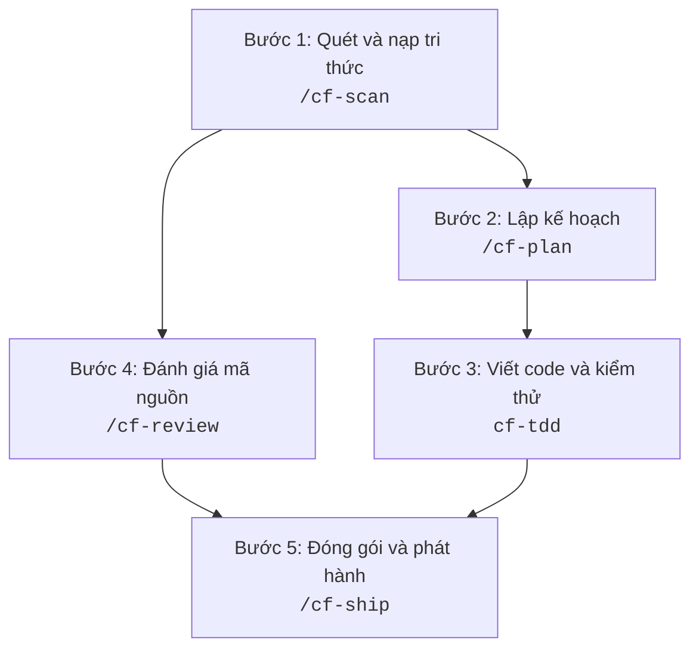
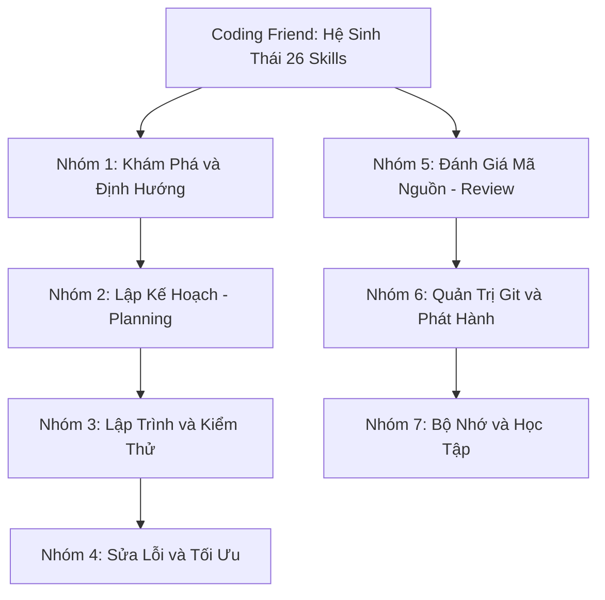
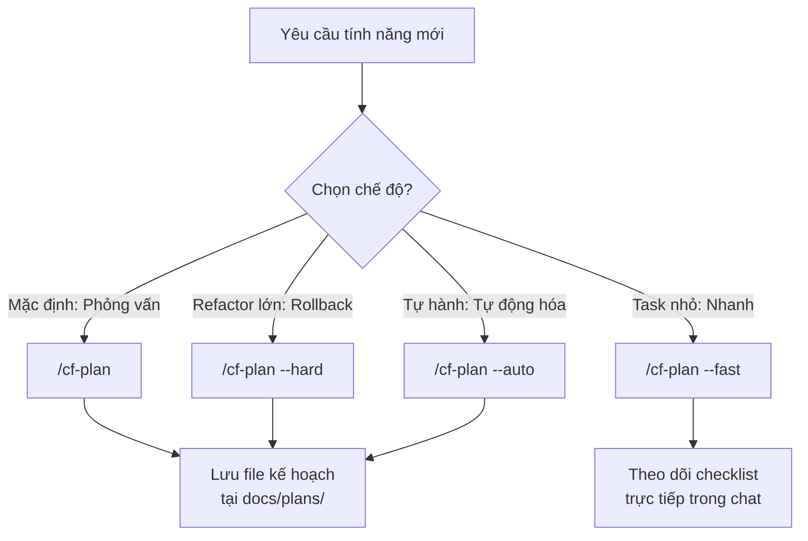
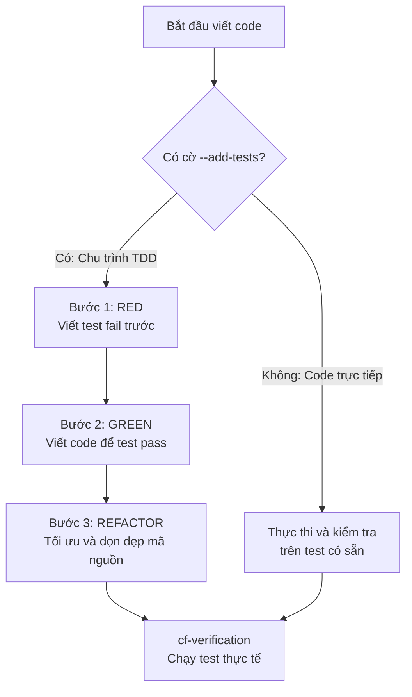
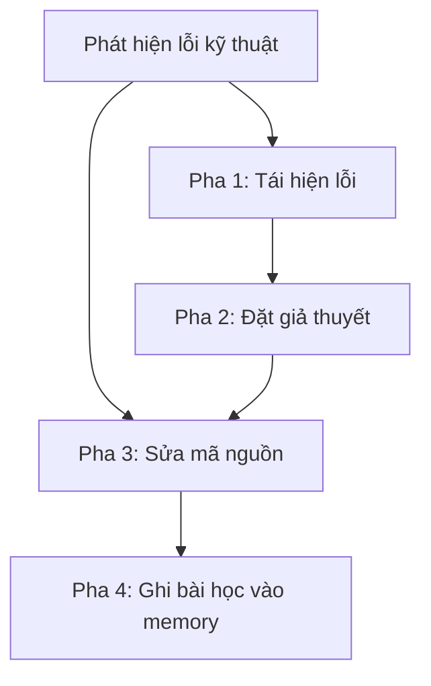
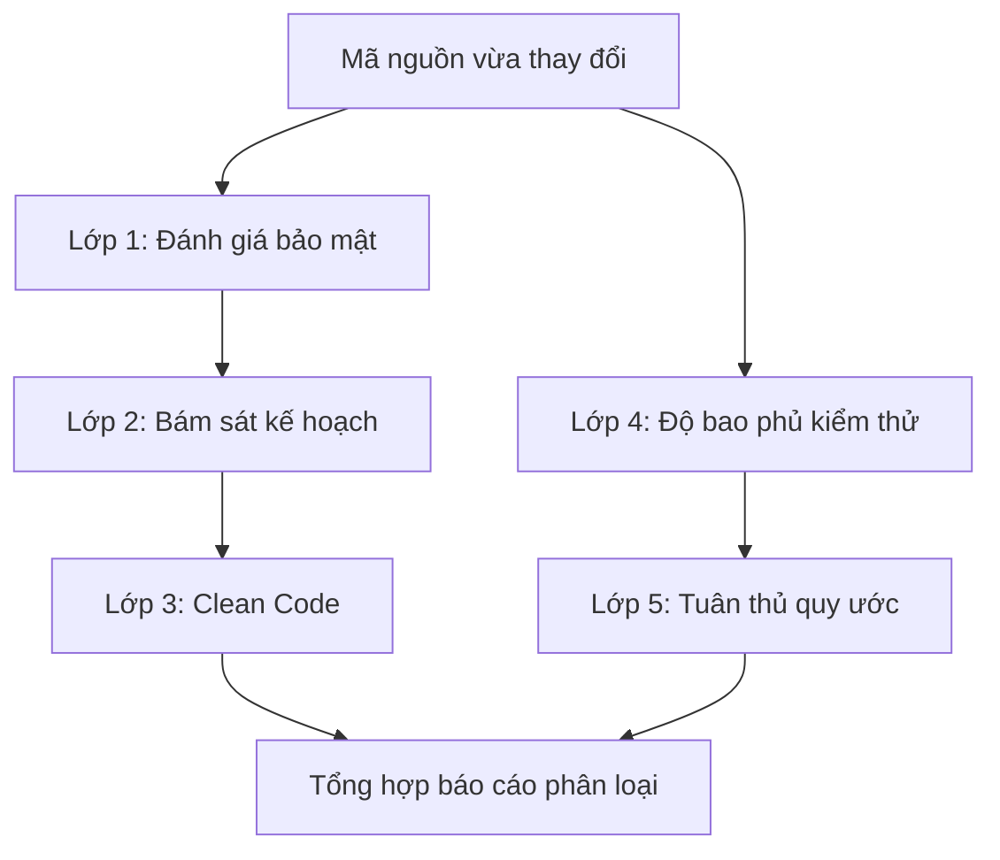


AI viết code rất nhanh, nhưng con người mới là người chịu trách nhiệm cho hệ thống. Kỷ luật kỹ thuật chính là ranh giới giữa một codebase chất lượng cao và một đống nợ kỹ thuật.



Bài viết được tổng hợp và chuẩn hóa từ toàn bộ tài liệu chính thức của  do tác giả **Anh-Thi Dinh** phát triển.


Khi lập trình cùng các AI Coding Agent như Claude Code hay Codex CLI, chúng ta rất dễ gặp phải tình trạng: AI sinh code nhanh nhưng mất kiểm soát, tạo ra lỗi ngầm, sửa lan man hoặc nhanh chóng làm tràn bộ nhớ ngữ cảnh.

**Coding Friend (CF)** sinh ra để giải quyết bài toán này. Đây là bộ công cụ thực chiến giúp chúng ta định hình một quy trình làm việc kỷ luật, rõ ràng và dễ tiếp cận: **Khám phá → Lập kế hoạch → Viết code có kiểm thử → Đánh giá an toàn → Ghi nhớ tri thức**.

Dưới đây là cẩm nang mô tả chi tiết toàn bộ 26 skills, sơ đồ luồng hoạt động trực quan và các kinh nghiệm thực tế hữu ích nhất khi làm việc cùng Coding Friend hàng ngày.

---

## 1. Coding Friend là gì và cách bắt đầu trong 5 phút

Coding Friend gồm 2 thành phần chính hoạt động song hành:
1. **Plugin (`coding-friend`):** Chứa toàn bộ câu lệnh và quy trình tự động hỗ trợ cho Claude Code hoặc Codex CLI.
2. **CLI (`coding-friend-cli`):** Bộ công cụ dòng lệnh `cf` hỗ trợ tăng tốc tìm kiếm bộ nhớ dự án và lưu trữ bài học cá nhân.

Chúng ta có thể cài đặt nhanh qua npm:

```bash
# Cài đặt công cụ dòng lệnh
npm i -g coding-friend-cli

# Khởi tạo dự án
cf init
```



---

## 2. Mô tả chi tiết toàn bộ 26 Skills của Coding Friend

Hệ sinh thái Coding Friend được tổ chức thành 7 nhóm kỹ năng chuyên biệt để phục vụ trọn vẹn vòng đời phát triển phần mềm:



---

### Nhóm 1: Khám phá và Định hướng (Discovery & Advisory)

1. **`/cf-scan` (Khám phá và khởi tạo bộ nhớ):**  
   Quét toàn bộ cấu trúc dự án, nhận diện framework, công nghệ và các pattern có sẵn để khởi tạo bộ nhớ ngữ cảnh ban đầu vào `docs/memory/`.
2. **`/cf-advise` (Cố vấn quyết định kiến trúc):**  
   Thực hiện phỏng vấn từng câu một để làm rõ bài toán và đưa ra khuyến nghị phân tích đa chiều (ưu điểm, nhược điểm, phương án thay thế). Skill này chỉ cố vấn, không sinh code hay tạo kế hoạch.
3. **`/cf-research` (Nghiên cứu công nghệ chuyên sâu):**  
   Nghiên cứu kỹ lưỡng một chủ đề, thư viện hoặc giải pháp kỹ thuật kết hợp tìm kiếm dữ liệu trên web và lưu kết quả vào `docs/research/`.
4. **`/cf-ask` (Hỏi đáp nhanh về codebase):**  
   Tìm kiếm và phân tích luồng code để trả lời các câu hỏi thắc mắc của bạn về kiến trúc dự án.
5. **`/cf-help` (Hướng dẫn và tra cứu tính năng):**  
   Tra cứu nhanh cách sử dụng các skill, agent và quy trình trong hệ sinh thái Coding Friend.

---

### Nhóm 2: Lập kế hoạch (Planning & Context Management)



6. **`/cf-plan` (Lập kế hoạch triển khai):**  
   Khám phá dự án, đối chiếu yêu cầu, brainstorm 2 đến 3 hướng giải quyết kỹ thuật và tạo kế hoạch từng bước cụ thể.
7. **`/cf-plan-resume` (Tiếp tục kế hoạch dang dở):**  
   Đọc lại file kế hoạch đã lưu trong `docs/plans/` và tiếp tục thực hiện từ vị trí đang dừng lại.
8. **`/cf-checkpoint` (Lưu snapshot ngữ cảnh):**  
   Lưu ảnh chụp trạng thái làm việc hiện tại vào một file ngắn gọn để có thể khôi phục trong phiên làm việc mới.
9. **`/cf-checkpoint-from` (Khôi phục ngữ cảnh từ snapshot):**  
   Nạp lại bối cảnh từ file checkpoint đã lưu trước đó để tiếp tục tác vụ một cách liền mạch.
10. **`/cf-session` (Đồng bộ phiên làm việc):**  
    Lưu phiên làm việc để có thể chuyển sang máy tính khác tiếp tục code.
11. **`/cf-later-do` (Quản lý việc tồn đọng):**  
    Duyệt và xử lý dần danh sách các công việc phụ phát sinh đã được hoãn lại trong `docs/later/`.

---

### Nhóm 3: Lập trình và Kiểm thử (Coding & Testing)



12. **`cf-tdd` (Lập trình chuẩn Test-Driven Development):**  
    Tự động kích hoạt khi viết code. Khi có cờ `--add-tests` (hoặc cấu hình `tdd: true`), bắt buộc AI phải viết test fail trước (RED), sau đó viết code để test pass (GREEN) và cuối cùng tối ưu mã nguồn (REFACTOR).
13. **`cf-verification` (Xác minh trước khi bàn giao):**  
    Bắt buộc AI phải chạy lệnh build hoặc test thực tế trên máy tính để chứng minh code hoạt động tốt trước khi báo hoàn thành với người dùng.
14. **`/cf-design` (Thiết kế và chuẩn hóa giao diện UI):**  
    Quét các mẫu giao diện có sẵn, trích xuất Design System và xây dựng component mới đồng bộ với phong cách chung của dự án.

---

### Nhóm 4: Sửa lỗi và Tối ưu (Debugging & Optimization)



15. **`/cf-fix` (Sửa lỗi nhanh có kiểm chứng):**  
    Tái hiện lỗi, khoanh vùng nguyên nhân và sửa chữa có kiểm tra lại bằng test, tránh việc sửa mò lan man.
16. **`/cf-sys-debug` (Điều tra lỗi hệ thống phức tạp):**  
    Quy trình sửa lỗi 4 pha nghiêm ngặt dành cho các lỗi khó tái hiện, lỗi hồi quy hoặc lỗi liên quan đến nhiều module.
17. **`/cf-optimize` (Tối ưu hóa hiệu năng):**  
    Đo lường chỉ số benchmark trước khi sửa, tiến hành tối ưu hóa thuật toán hoặc truy vấn và đo lại để so sánh hiệu quả.

---

### Nhóm 5: Đánh giá mã nguồn (Multi-Layer Code Review)



18. **`/cf-review` (Review mã nguồn 5 lớp):**  
    Điều phối đánh giá độc lập về bảo mật, chất lượng code, độ bao phủ test, bám sát kế hoạch và tuân thủ quy tắc dự án.
19. **`/cf-review-out` (Đóng gói review cho bên ngoài):**  
    Tạo file prompt chứa diff và ngữ cảnh để gửi sang Gemini, ChatGPT hoặc nhờ đồng nghiệp review chéo.
20. **`/cf-review-in` (Nhập kết quả review từ bên ngoài):**  
    Đọc file kết quả đánh giá từ bên ngoài và tự động tạo danh sách công việc cần sửa chữa.


---

### Nhóm 6: Quản trị Git và Phát hành (Git & Release)

21. **`/cf-commit` (Tạo commit thông minh):**  
    Phân tích thay đổi trong diff, quét kiểm tra rò rỉ secret hoặc API key và tạo Conventional Commit ngắn gọn, chuẩn xác.
22. **`/cf-ship` (Phát hành trọn gói một lệnh):**  
    Thực hiện liên hoàn: Chạy kiểm thử xác minh → Tạo commit → Đẩy lên nhánh Git → Mở Pull Request.
23. **`/cf-warm` (Cập nhật tiến độ sau khi vắng mặt):**  
    Tóm tắt nhanh các thay đổi trong lịch sử Git của dự án kể từ lần cuối bạn làm việc.

---

### Nhóm 7: Bộ nhớ và Học tập (Memory & Learning)

24. **`/cf-remember` (Lưu tri thức dự án cho AI):**  
    Ghi nhớ các quyết định kiến trúc, quy ước đặt tên và kinh nghiệm sửa bug vào `docs/memory/` để AI đọc lại trong các phiên sau.
25. **`/cf-learn` (Rút trích ghi chú học tập cho con người):**  
    Trích xuất những kiến thức, cú pháp và khái niệm mới thành tài liệu học tập cá nhân.
26. **`/cf-teach` (Giải thích chuyên sâu dạng trò chuyện):**  
    AI đóng vai trò như một người bạn kỹ sư giàu kinh nghiệm, phân tích sâu về lý do chọn giải pháp, các phương án bị loại trừ và bài học rút ra.

---

## 3. Các Best Practices quan trọng nhất trong thực tế

### 1. Luôn lập kế hoạch trước khi code (`/cf-plan`)
Đối với bất kỳ tác vụ nào lớn hơn việc sửa một dòng code, chúng ta nên bắt đầu bằng `/cf-plan`. Lập kế hoạch trước giúp AI nắm bắt đầy đủ bối cảnh, hiểu cấu trúc thư mục và giảm thiểu rủi ro sửa sai.

```bash
# Chế độ tiêu chuẩn: Phỏng vấn, tìm hiểu codebase và đưa ra phương án tối ưu
/cf-plan Xây dựng hệ thống xác thực người dùng bằng JWT

# Chế độ Fast (--fast): Bỏ qua bước hỏi đáp, đi thẳng vào checklist cho task nhỏ
/cf-plan --fast Thêm endpoint /healthz kiểm tra trạng thái server

# Chế độ Hard (--hard): Đào sâu rủi ro, lên phương án rollback (dành cho refactor lớn)
/cf-plan --hard Chuyển đổi toàn bộ API từ REST sang GraphQL

# Chế độ Autopilot (--auto): AI tự làm từ đầu đến cuối (Code -> Review -> Fix -> Commit)
/cf-plan --auto Tạo giao diện trang hồ sơ cá nhân
```


Với các tác vụ cực kỳ đơn giản như sửa lỗi chính tả, đổi màu một nút bấm hoặc sửa 1–2 dòng code, chúng ta không cần dùng `/cf-plan` mà chỉ cần mô tả trực tiếp yêu cầu cho AI.


---

### 2. Viết câu lệnh cụ thể, có phạm vi rõ ràng
AI hoạt động hiệu quả nhất khi nhận được yêu cầu cụ thể kèm đường dẫn file hoặc thông báo lỗi thực tế.

- ❌ **Tránh viết chung chung:**
  ```text
  /cf-fix Lỗi đăng nhập rồi
  ```
- ✅ **Nên viết rõ ràng và kèm ngữ cảnh:**
  ```text
  /cf-fix API /api/login trả về lỗi 401 khi cookie phiên làm việc đã hết hạn trong file src/auth/session.ts
  ```

---

### 3. Quét dự án vào bộ nhớ ngay khi bắt đầu (`/cf-scan`)
Khi mở một dự án mới hoặc kho mã nguồn lớn, hãy chạy `/cf-scan` đầu tiên. AI sẽ đọc tổng quan cấu trúc, nhận diện framework và lưu các hiểu biết cốt lõi vào `docs/memory/` để dùng lại cho các câu lệnh sau này.

```bash
/cf-scan Dự án web e-commerce viết bằng Next.js, Prisma và Stripe
```

---

### 4. Chia nhỏ commit, commit thường xuyên (`/cf-commit`)
Đừng gom toàn bộ công việc của cả ngày vào một commit khổng lồ. Hãy chạy `/cf-commit` ngay sau mỗi bước hoàn thành nhỏ. Lệnh này sẽ tự động phân tích diff và tạo commit message chuẩn:

```bash
# Sau khi hoàn thành tạo API endpoint
/cf-commit

# Sau khi viết xong bộ unit test
/cf-commit

# Sau khi cập nhật tài liệu
/cf-commit
```

---

### 5. Luôn review mã nguồn trước khi merge (`/cf-review`)
Trước khi đóng gói bàn giao, hãy chạy `/cf-review` để AI kiểm tra chéo mã nguồn theo nhiều tiêu chí (bảo mật, chất lượng code, độ bao phủ test và tuân thủ quy ước dự án).

```bash
# Review toàn bộ các thay đổi chưa commit
/cf-review

# Hoặc review riêng một thư mục nhạy cảm
/cf-review src/auth/
```

---

### 6. Ghi nhớ bài học và lưu trữ quyết định (`/cf-remember` và `/cf-learn`)
Để tránh việc phiên làm việc sau AI lại mắc cùng một lỗi cũ hoặc quên mất quy ước của nhóm:

- **Dành cho AI (`/cf-remember`):** Lưu các quyết định kỹ thuật vào `docs/memory/` để AI tự đọc lại trong tương lai.
  ```bash
  /cf-remember Chúng ta dùng Redis thay vì Memcached vì cần tính năng Pub/Sub cho thông báo thời gian thực
  ```
- **Dành cho bản thân (`/cf-learn` và `/cf-teach`):**
  - `/cf-learn`: Rút trích ghi chú học tập ngắn gọn.
  - `/cf-teach`: Yêu cầu AI giải thích lại toàn bộ bản chất kiến trúc và bài học rút ra theo phong cách trò chuyện dễ hiểu.

---

### 7. Quản lý dung lượng ngữ cảnh thông minh (Context Management)
Ngữ cảnh của các mô hình AI luôn có giới hạn. Để đạt hiệu suất cao và tiết kiệm chi phí:

1. **Mở phiên mới cho tác vụ mới:** Không nên dùng tiếp một phiên làm việc đã quá dài cho một tính năng hoàn toàn khác.
2. **Chỉ định chính xác đường dẫn file:** Thay vì bảo "hãy xem phần auth", hãy viết rõ "hãy xem file `src/auth/middleware.ts`".
3. **Cách dùng lệnh `/compact` chuẩn xác:** Khi thanh ngữ cảnh gần đầy, hãy hướng dẫn rõ ràng cho lệnh nén:

```bash
# ✅ Cách nén ngữ cảnh đúng: Chỉ định rõ thông tin cần giữ lại
/compact giữ lại kế hoạch ban đầu, yêu cầu của tôi, các thay đổi chính và danh sách việc còn lại

# ❌ Tránh gõ lệnh /compact trơ trọi vì AI có thể tóm tắt mất các chi tiết quan trọng!
```

---

## 4. Tóm tắt cốt lõi

Việc lập trình cùng AI chỉ thực sự mang lại hiệu quả cao khi chúng ta có phương pháp kiểm soát đúng đắn:
- **Lập kế hoạch trước (`/cf-plan`)** để định hình kiến trúc.
- **Yêu cầu rõ ràng, commit nhỏ thường xuyên (`/cf-commit`)** để dễ kiểm soát.
- **Review kỹ lưỡng (`/cf-review`)** để chặn đứng lỗi phát sinh.
- **Tích lũy tri thức (`/cf-remember`, `/cf-learn`)** để cả AI và chúng ta đều giỏi hơn qua từng ngày.
