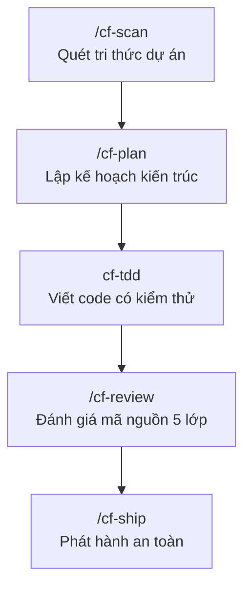
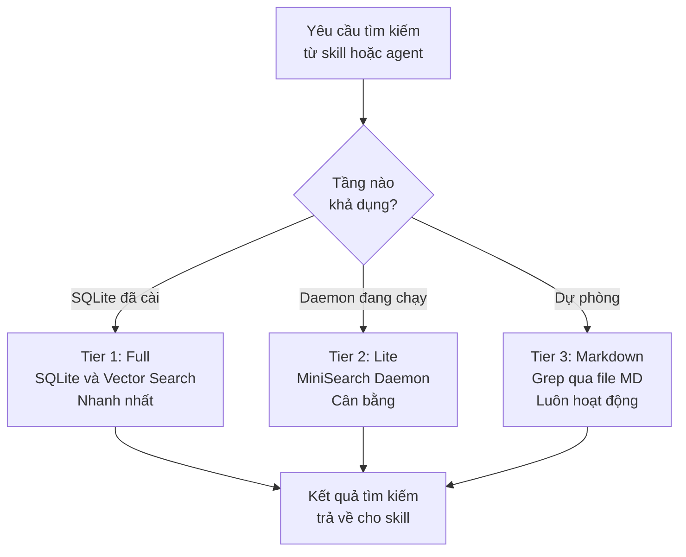
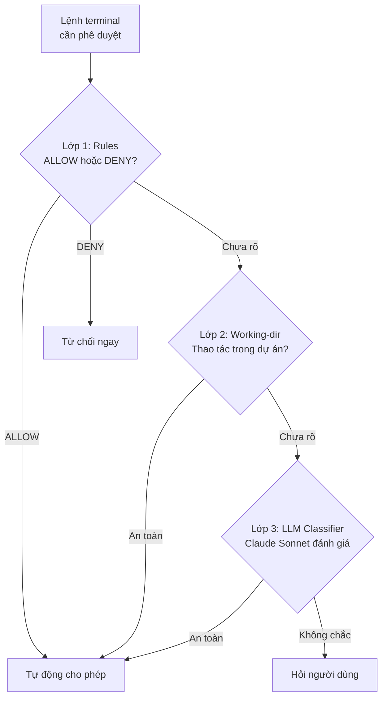


A lean toolkit for disciplined engineering workflows in Claude Code, Codex CLI, omp, and Google Antigravity.



Handbook này tổng hợp từ  — phiên bản mới nhất tại thời điểm viết. Nguồn tham chiếu gốc tại `cf.dinhanhthi.com/llms.txt`.


Khi lập trình cùng AI Agent, vấn đề không nằm ở tốc độ sinh code — mà ở kỷ luật kỹ thuật: không có test, không có review, không có bộ nhớ ngữ cảnh, AI tự ý hóa 100% và chúng ta mất kiểm soát hoàn toàn sau vài session.

**Coding Friend** sinh ra để giải quyết đúng bài toán đó. Đây là bộ skills, agents, hooks và CLI tools giúp chúng ta định hình một quy trình làm việc kỷ luật: **Khám phá → Lập kế hoạch → Viết code có kiểm thử → Đánh giá an toàn → Ghi nhớ tri thức**.

Handbook này được tổ chức theo nguyên tắc **đọc từng phần theo nhu cầu**:
- **Chương 1:** Đọc xong là dùng được ngay trong 5 phút
- **Chương 2:** Tra cứu khi cần điều chỉnh cấu hình hoặc hiểu sâu cơ chế vận hành
- **Chương 3:** Tra cứu lệnh cụ thể khi đang code
- **Chương 4:** Đọc khi muốn làm chủ ở cấp độ nâng cao

---

## Chương 1: Bắt Đầu Trong 5 Phút

*Mục tiêu: Chạy được Coding Friend ngay sau khi đọc xong phần này.*

### 1.1 Cài đặt và khởi động

Coding Friend hỗ trợ 4 nền tảng chính. Chọn một nền tảng phù hợp:

```bash
# Bước 1: Cài đặt CLI toàn cục
npm i -g coding-friend-cli

# Bước 2a: Cài vào Claude Code (chính thức)
cf install

# Bước 2b: Hoặc cài vào Codex CLI
cf install --agent codex

# Bước 2c: Hoặc cài vào oh-my-pi (omp) — beta
cf install --agent omp

# Bước 2d: Hoặc cài vào Google Antigravity (agy) — beta
cf install --agent agy

# Bước 3: Khởi tạo workspace dự án
cf init           # Claude Code
cf init --agent agy  # Google Antigravity

# Bước 4: Khởi động lại session sau khi cài

# Bước 5: Kiểm tra trạng thái
cf status
```


Nếu tên `cf` đã bị chiếm bởi công cụ khác (ví dụ Cloudflare CLI), hãy dùng bí danh `cdf` — hoạt động hoàn toàn giống `cf`.

```bash
cdf install
cdf init
cdf memory status
```


**Cập nhật sau này:**

```bash
cf update           # Cập nhật tất cả các nền tảng đã cài
cf update --agent agy   # Chỉ cập nhật Google Antigravity
```

### 1.2 Vòng lặp phát triển tiêu chuẩn

Coding Friend áp dụng quy trình 5 bước có kỷ luật:



### 1.3 Lần đầu chạy dự án

Ngay khi cài xong và mở Claude Code, chúng ta gõ lệnh đầu tiên:

```bash
# Bước 0 — Quét và nạp tri thức dự án vào bộ nhớ
/cf-scan

# Bước 1 — Lên kế hoạch tính năng
/cf-plan Build a user authentication system

# Bước 2 — (AI tự động gọi cf-tdd khi bắt đầu viết code)

# Bước 3 — Review sau khi hoàn thành
/cf-review src/auth/

# Bước 4 — Ship toàn bộ pipeline
/cf-ship Add user authentication
```


`/cf-scan` đọc kiến trúc, quy ước đặt tên và tech stack của dự án, ghi vào `docs/memory/`. Các skills sau đó như `/cf-plan` và `cf-tdd` sẽ tự động đọc bộ nhớ này để đưa ra gợi ý phù hợp với dự án, thay vì sinh code chung chung.


---

## Chương 2: Cấu Hình và Vận Hành Nền Tảng

*Mục tiêu: Hiểu rõ các thông số cấu hình, cơ chế Hooks tự động và hệ thống bộ nhớ — những thứ hoạt động trong nền mà ít ai biết.*

### 2.1 File cấu hình .coding-friend/config.json

Coding Friend có 2 cấp cấu hình:
- **Global:** `~/.coding-friend/config.json` — áp dụng cho tất cả dự án
- **Local:** `.coding-friend/config.json` tại thư mục gốc dự án — ghi đè Global

Chỉnh sửa tương tác qua `cf config` hoặc sửa thẳng file JSON.

**Toàn bộ config mẫu:**

```json
{
  "language": "en",
  "docsDir": "docs",
  "privacyBlock": true,
  "scoutBlock": true,
  "commit": {
    "verify": true
  },
  "learn": {
    "language": "en",
    "outputDir": "~/.coding-friend/learn",
    "categories": [
      { "name": "concepts", "description": "Design patterns, algorithms, architecture principles" },
      { "name": "patterns", "description": "Repository pattern, observer pattern" },
      { "name": "languages", "description": "Language-specific features, syntax, idioms" },
      { "name": "tools", "description": "Libraries, frameworks, CLI tools" },
      { "name": "debugging", "description": "Debugging techniques, bug fixes" }
    ],
    "autoCommit": false,
    "readmeIndex": false
  },
  "autoApprove": false,
  "autoApproveAllowExtra": [],
  "autoApproveIgnore": [],
  "disableGUIPlan": true,
  "guiPlanFormat": "html",
  "memory": {
    "tier": "auto",
    "embedding": {
      "provider": "transformers",
      "model": "Xenova/all-MiniLM-L6-v2",
      "ollamaUrl": "http://localhost:11434"
    },
    "autoCapture": false,
    "autoStart": false
  },
  "review": {
    "withCodex": false
  },
  "statusline": {
    "components": ["version", "folder", "model", "branch", "context", "usage"],
    "accountAliases": {
      "me@work.com": "Work"
    }
  }
}
```

**Bảng giải thích các key quan trọng:**

| Key | Mặc định | Mô tả |
| :--- | :--- | :--- |
| `language` | `"en"` | Ngôn ngữ xuất tài liệu (`/cf-ask`, `/cf-plan`, `/cf-research`) |
| `docsDir` | `"docs"` | Thư mục gốc chứa tất cả output của skills |
| `privacyBlock` | `true` | Hook chặn AI đọc file `.env`, credentials, secrets |
| `scoutBlock` | `true` | Hook ngăn AI đọc quá nhiều file cùng lúc |
| `commit.verify` | `true` | Chạy test suite trước khi cho phép commit |
| `autoApprove` | `false` | Bật cổng phê duyệt lệnh thông minh (3 lớp phân loại) |
| `disableGUIPlan` | `true` | Khi `false`: `/cf-plan` sinh thêm file `overview.html` trực quan |
| `guiPlanFormat` | `"html"` | Định dạng file overview: `"html"` hoặc `"md"` |
| `memory.tier` | `"auto"` | Chế độ tìm kiếm bộ nhớ: `auto`, `full`, `lite`, `markdown` |
| `memory.autoCapture` | `false` | Tự động lưu tóm tắt session trước khi context bị nén |
| `review.withCodex` | `false` | Thêm Codex vào review song song cùng Claude |

### 2.2 Hệ thống bộ nhớ 3 tầng (Memory System)

Đây là cơ chế lưu và tìm kiếm tri thức dự án giữa các session. Chúng ta không cần giải thích lại kiến trúc mỗi lần — AI tự đọc từ bộ nhớ.



**3 chế độ Memory Tier:**

| Tier | Tên | Yêu cầu | Tốc độ |
| :--- | :--- | :--- | :--- |
| **Tier 1** | Full | `cf memory init` (cài SQLite và deps) | Nhanh nhất — hybrid search |
| **Tier 2** | Lite | `cf memory start-daemon` | Trung bình — MiniSearch |
| **Tier 3** | Markdown | Không cần setup | Chậm nhất — grep thuần |

```bash
# Khởi tạo Tier 1 (khuyến nghị cho dự án lớn)
cf memory init

# Khởi động daemon Tier 2
cf memory start-daemon

# Kiểm tra trạng thái memory
cf memory status

# Tìm kiếm thủ công trong bộ nhớ
cf memory search "authentication flow"

# Xây lại chỉ mục (khi đổi embedding model)
cf memory rebuild
```

**2 MCP Servers đi kèm:**
- **Memory MCP:** Cho phép bất kỳ AI client nào (Gemini, ChatGPT, Cursor...) kết nối và tìm kiếm trong bộ nhớ dự án của chúng ta
- **Learn MCP:** Phục vụ ghi chú học tập từ `/cf-learn` để các AI client khác có thể tra cứu

```bash
# Cài đặt và cấu hình MCP servers
cf mcp
```

### 2.3 Hệ thống 8 Lifecycle Hooks tự động

Hooks là các script chạy tự động trong vòng đời session — hầu hết không cần can thiệp. Chúng bảo vệ chúng ta theo các cách sau:

| Hook | Khi nào chạy | Chức năng |
| :--- | :--- | :--- |
| **privacy-block** | Trước khi AI đọc file | Chặn đọc `.env`, `.credentials`, secrets |
| **scout-block** | Trước thao tác đọc nhiều file | Ngăn AI đọc vô hạn file cùng lúc |
| **auto-approve** | Trước mỗi lệnh terminal | 3 lớp phân loại: Rules, Working-dir, LLM Classifier |
| **PreCompact** | Trước khi context bị nén | Lưu tóm tắt session vào bộ nhớ (nếu `autoCapture: true`) |

**Auto-Approve Pipeline hoạt động như sau:**




Khi dùng với `agy`, Auto-Approve chỉ chạy Lớp 1 (Rules). Lớp 3 LLM Classifier sử dụng Claude Sonnet không có sẵn. Các lệnh không rõ ràng sẽ trả về `ask` để hỏi người dùng.


**Cấu hình thêm lệnh vào danh sách cho phép:**

```json
{
  "autoApprove": true,
  "autoApproveAllowExtra": ["cargo test", "pytest", "npm test"],
  "autoApproveIgnore": ["gh pr"]
}
```

### 2.4 Thanh trạng thái cf statusline

`cf statusline` hiển thị thông tin dự án và API usage trực tiếp trong Claude Code status bar:

```bash
# Cài đặt và cấu hình statusline
cf statusline
```

Các component có thể bật/tắt: `version`, `folder`, `model`, `branch`, `context`, `usage`.

---

## Chương 3: Từ Điển 26 Skills — Tra Cứu Khi Đang Code

*Mục tiêu: Tìm đúng lệnh cần dùng trong vòng 30 giây. Mỗi skill ghi đúng bản chất và ví dụ thực tế.*


- **Tự động (Auto):** AI nhận diện và tự gọi skill — không cần gõ lệnh
- **Thủ công (Slash-only):** Bắt buộc gõ lệnh `/cf-xxx` để kích hoạt
- Skills **chỉ auto** (cf-tdd, cf-verification, cf-sys-debug): không có prefix `/`


---

### Nhóm 1: Khám Phá và Định Hướng

Dùng trước khi bắt tay vào làm bất cứ việc gì.

| Skill | Kích hoạt | Khi nào dùng |
| :--- | :--- | :--- |
| `/cf-scan` | Thủ công | Bắt đầu dự án mới hoặc refresh bộ nhớ |
| `/cf-ask` | Tự động | Hỏi về codebase |
| `/cf-research` | Tự động | Nghiên cứu thư viện trước khi dùng |
| `/cf-advise` | Tự động | Cần quyết định chọn phương án A hay B |
| `/cf-warm` | Thủ công | Quay lại dự án sau kỳ nghỉ |

#### /cf-scan — Quét và nạp tri thức dự án

**Bản chất:** Đọc kiến trúc, convention và tech stack của dự án, ghi vào `docs/memory/`. Các skills khác sẽ tự động dùng bộ nhớ này để đưa ra gợi ý phù hợp.


`/cf-scan` tiêu tốn nhiều token. Luôn có bước xác nhận trước khi quét. Chỉ cần chạy 1 lần khi bắt đầu, sau đó bộ nhớ được cập nhật tự động.


```bash
/cf-scan                    # Quét toàn bộ dự án
/cf-scan src/auth/          # Quét chỉ module auth
```

Output: `docs/memory/` (architecture, conventions, tech stack, infrastructure)

#### /cf-ask — Hỏi đáp nhanh về codebase

**Bản chất:** Trả lời câu hỏi tập trung về một module cụ thể. Không tạo kế hoạch, không viết code mới.

```bash
/cf-ask How does the auth middleware work?
/cf-ask Where is the payment webhook handler defined?
```

#### /cf-research — Nghiên cứu chuyên sâu

**Bản chất:** Khi chúng ta cần nghiên cứu một thư viện, so sánh giải pháp hoặc khảo sát best practice trước khi bắt tay vào code.

```bash
/cf-research GraphQL vs REST for mobile APIs
/cf-research Best practices for Redis caching in Django
```

Output: `docs/research/YYYY-MM-DD-<slug>/`

#### /cf-advise — Tư vấn ra quyết định

**Bản chất:** Phỏng vấn từng câu một để làm rõ yêu cầu thực sự, sau đó đưa ra khuyến nghị có thứ tự ưu tiên. **Chỉ tư vấn — không bao giờ viết code hay tạo plan.**

```bash
/cf-advise Should we migrate to a monorepo or keep multiple repos?
/cf-advise Is it worth refactoring the auth module now?
```

#### /cf-warm — Bắt nhịp lại sau thời gian vắng mặt

**Bản chất:** Tóm tắt lịch sử Git và những thay đổi quan trọng kể từ commit cuối cùng của chúng ta.

```bash
/cf-warm
/cf-warm --user ngoctin --n-commits 30
```

Output: `docs/warm/YYYY-MM-DD-<user>.md`

---

### Nhóm 2: Kế Hoạch và Kiến Trúc

Dùng khi đã quyết định sẽ làm gì và cần thiết kế cách làm.

| Skill | Kích hoạt | Cờ quan trọng |
| :--- | :--- | :--- |
| `/cf-plan` | Tự động | `--fast`, `--hard`, `--auto`, `--gui`, `--model` |
| `/cf-plan-resume` | Thủ công | `--recap` |

#### /cf-plan — Lập kế hoạch triển khai

**Bản chất:** Phỏng vấn, khám phá codebase qua sub-agent `cf-explorer`, brainstorm qua `cf-planner` và tạo kế hoạch phân phase cụ thể.

**Các chế độ hoạt động:**

| Cờ | Hành vi | Khi nào dùng |
| :--- | :--- | :--- |
| *(Mặc định)* | Phỏng vấn đầy đủ, tạo file plan | Hầu hết các tính năng |
| `--fast` / `--quick` | Bỏ qua phỏng vấn, không lưu file | Tác vụ đơn giản, rõ ràng |
| `--hard` | Phân tích vùng ảnh hưởng và kế hoạch Rollback | Đổi schema DB, migration |
| `--auto` | Chế độ Autopilot — tự thực thi từng phase | Muốn AI chạy trọn gói |
| `--inline` / `--no-file` | Không ghi file, chỉ theo dõi trong chat | Tác vụ tạm thời |
| `--gui` / `--human` | Sinh thêm file `overview.html` trực quan | Trình bày cho đồng nghiệp |
| `--model <alias>` | Chỉ định model riêng cho bước brainstorm | Cần lý luận mạnh hơn |

```bash
/cf-plan Build a user authentication system
/cf-plan --fast Add a health check endpoint
/cf-plan --hard Migrate user table to UUID primary key
/cf-plan --auto --add-tests Implement payment webhook handler
/cf-plan --gui Design a new dashboard layout
/cf-plan --model opus Architect a microservices migration
```

Output: `docs/plans/YYYY-MM-DD-<slug>/README.md`

#### /cf-plan-resume — Tiếp tục kế hoạch dang dở

**Bản chất:** Đọc lại plan đã lưu, xác định phase đã xong và tiếp tục từ nơi dừng lại.

```bash
/cf-plan-resume 2026-08-24-user-auth
/cf-plan-resume 2026-08-24-user-auth --recap    # In tóm tắt tiến độ
```

---

### Nhóm 3: Lập Trình và Hiện Thực Hóa

Các skill trong nhóm này **tự động kích hoạt** khi chúng ta bắt đầu viết code.

| Skill | Kích hoạt | Ghi chú |
| :--- | :--- | :--- |
| `cf-tdd` | Tự động | Mặc định Direct Mode; TDD khi có `--add-tests` |
| `cf-verification` | Tự động | Bắt AI chạy test thực sự trước khi nói "done" |
| `/cf-design` | Tự động | Thiết kế UI nhất quán với hệ thống hiện tại |

#### cf-tdd — Cổng kiểm soát viết code

**Bản chất:** Tải trước khi viết bất kỳ dòng code sản phẩm nào. Mặc định là Direct Mode (viết code trực tiếp). Khi có `--add-tests` hoặc `tdd: true` trong config, bắt buộc chu trình RED → GREEN → REFACTOR.

```bash
# Truyền --add-tests vào /cf-plan để bật TDD cho cả plan
/cf-plan --add-tests Build the authentication module

# Hoặc bật toàn cục qua config
cf config   # chọn tdd: true
```

**Chu trình TDD khi bật `--add-tests`:**
1. **RED** — Viết test fail trước
2. **GREEN** — Viết code tối giản để test pass
3. **REFACTOR** — Tối ưu khi test vẫn xanh

#### cf-verification — Xác minh thực tế

**Bản chất:** Ngăn AI "nói suông" rằng code đã chạy. Bắt buộc AI phải thực thi lệnh build, test và linter trên terminal thực tế và chứng minh kết quả.

Kiểm tra 4 điều kiện bắt buộc: Tests pass, Build succeeds, Linter clean, No console errors.

#### /cf-design — Thiết kế UI nhất quán

**Bản chất:** Quét Design System hiện tại (màu sắc, typography, spacing) rồi tạo hoặc chỉnh sửa component mới theo đúng hệ thống, không phá vỡ tính nhất quán thị giác.

```bash
/cf-design Add a dark mode toggle to the header
/cf-design Create a new card component matching the existing style
```

---

### Nhóm 4: Sửa Lỗi và Tối Ưu

| Skill | Kích hoạt | Khi nào dùng |
| :--- | :--- | :--- |
| `/cf-fix` | Tự động | Lỗi rõ ràng, sửa được trong 1 lần |
| `cf-sys-debug` | Tự động | Lỗi phức tạp, lặp lại, race condition |
| `/cf-optimize` | Tự động | Cần số liệu trước và sau khi tối ưu |
| `/cf-later-do` | Thủ công | Xử lý tồn đọng trong `docs/later/` |

#### /cf-fix — Sửa lỗi nhanh có kiểm chứng

**Bản chất:** Đưa ra giả thuyết nguyên nhân trước khi sửa, viết test tái hiện lỗi, sửa và chứng minh lỗi đã biến mất.

```bash
/cf-fix Login fails with 401 error after password change
/cf-fix Cart total shows wrong value when using voucher
```

#### cf-sys-debug — Điều tra lỗi hệ thống 4 pha

**Bản chất:** Quy trình điều tra nghiêm ngặt khi lỗi lặp lại, có race condition hoặc khi `/cf-fix` đã thất bại.

**4 pha bắt buộc:**
1. **Tái hiện** — Viết test cô lập lỗi
2. **Kiểm chứng giả thuyết** — Dùng logs và benchmarks
3. **Sửa mã tối giản** — Thay đổi nhỏ nhất có thể
4. **Lưu bài học** — Bắt buộc ghi `docs/memory/bugs/`

```bash
# Tự động kích hoạt khi nói:
"This is a race condition"
"Same error came back after fix"
"Intermittently failing"
```

#### /cf-optimize — Tối ưu hóa có số liệu

**Bản chất:** Đo baseline trước, tối ưu, đo lại và xuất báo cáo so sánh. Không tối ưu mò.

```bash
/cf-optimize getUserById query
/cf-optimize Load time of the product listing page
```

Output: `docs/benchmarks/YYYY-MM-DD-<slug>.md`

#### /cf-later-do — Giải quyết tồn đọng

**Bản chất:** Đọc danh sách nhiệm vụ tồn đọng trong `docs/later/`, chọn 1 tác vụ, chuyển sang `/cf-fix` hoặc `/cf-plan`, xóa sau khi xong.

```bash
/cf-later-do
```

---

### Nhóm 5: Đánh Giá Mã Nguồn

| Skill | Kích hoạt | Khi nào dùng |
| :--- | :--- | :--- |
| `/cf-review` | Tự động | Review nội bộ sau khi viết code |
| `/cf-review-out` | Thủ công | Gửi để AI khác review chéo |
| `/cf-review-in` | Thủ công | Nhận kết quả review từ ngoài |

#### /cf-review — Đánh giá mã nguồn 5 lớp độc lập

**Bản chất:** Điều phối sub-agent `cf-reviewer` đánh giá Git Diff theo 5 tiêu chí độc lập:

1. **Bảo mật** — Quét secret rò rỉ, lỗ hổng injection
2. **Kế hoạch** — Bám sát `docs/plans/` đã duyệt
3. **Cú pháp sạch** — Chuẩn hóa code style
4. **Độ bao phủ kiểm thử** — Test coverage có đủ không
5. **Quy ước dự án** — Đặt tên, cấu trúc file

```bash
/cf-review
/cf-review src/auth/
/cf-review main..feature-branch
```

Bật review song song với Codex: `review.withCodex: true` trong config.

#### /cf-review-out — Xuất gói review cho AI bên ngoài

**Bản chất:** Đóng gói Git Diff và ngữ cảnh thành file markdown để gửi cho Gemini, ChatGPT hoặc đồng nghiệp đánh giá chéo.

```bash
/cf-review-out
```

Output: `docs/reviews/YYYY-MM-DD-<name>-prompt.md`

#### /cf-review-in — Nhập kết quả review từ bên ngoài

```bash
/cf-review-in docs/reviews/2026-08-24-gemini-result.md
```

---

### Nhóm 6: Quản Trị Git và Quản Lý Phiên

| Skill | Kích hoạt | Cờ quan trọng |
| :--- | :--- | :--- |
| `/cf-commit` | Tự động | *(không)* |
| `/cf-ship` | Tự động | `--dry-run` |
| `/cf-session` | Thủ công | *(không)* |
| `/cf-checkpoint` | Thủ công | *(không)* |
| `/cf-checkpoint-from` | Thủ công | `--recap` |

#### /cf-commit — Tạo commit thông minh

**Bản chất:** Phân tích Git Diff, quét bí mật rò rỉ, tạo Conventional Commit chuẩn.

```bash
/cf-commit
/cf-commit Add user authentication system
```

`commit.verify: true` trong config sẽ chạy test suite trước khi commit.

#### /cf-ship — Pipeline phát hành trọn gói

**Bản chất:** Chạy test → Tạo commit → Push → Mở Pull Request trên GitHub.

```bash
/cf-ship
/cf-ship Add user authentication
/cf-ship --dry-run    # Mô phỏng, không push thật
```

#### /cf-session — Lưu phiên để đồng bộ liên máy

```bash
/cf-session refactor auth flow

# Tiếp tục ở máy khác:
cf session load
claude --resume
```

Output: `docs/sessions/`

#### /cf-checkpoint và /cf-checkpoint-from — Bảo toàn ngữ cảnh hội thoại

`/cf-checkpoint` lưu tóm tắt mục tiêu và quyết định của cuộc hội thoại hiện tại. `/cf-checkpoint-from` nạp lại trong phiên mới.

```bash
/cf-checkpoint refactoring auth to JWT

# Phiên mới:
/cf-checkpoint-from 2026-08-24-refactoring-auth-to-jwt --recap Continue implementing
```

Output: `docs/checkpoints/`

---

### Nhóm 7: Bộ Nhớ Dự Án và Học Tập

| Skill | Kích hoạt | Output |
| :--- | :--- | :--- |
| `/cf-remember` | Tự động | `docs/memory/` |
| `/cf-learn` | Tự động | `~/.coding-friend/learn/` |
| `/cf-teach` | Thủ công | `docs/learn/` |
| `/cf-help` | Tự động | Chat |

**Khác biệt cốt lõi giữa 3 skills liên quan đến học:**

| Skill | Cho ai | Mục đích |
| :--- | :--- | :--- |
| `/cf-remember` | AI | Tri thức dự án để nhớ trong session tương lai |
| `/cf-learn` | Con người | Ghi chú sư phạm để nâng cao năng lực |
| `/cf-teach` | Con người | Kể chuyện kỹ thuật để hiểu thấu đáo |

#### /cf-remember — Ghi nhớ tri thức dự án cho AI

**Bản chất:** Lưu quyết định kiến trúc, quy ước, hành vi API và cách xử lý lỗi vào bộ nhớ để các session sau AI tự đọc.

```bash
/cf-remember auth flow uses JWT with 15-minute refresh
/cf-remember payment webhook must be idempotent
```

Tự động phân loại vào: `decisions/`, `conventions/`, `features/`, `bugs/`

#### /cf-learn — Trích xuất bài học cho con người

**Bản chất:** Tạo ghi chú sư phạm từ những phát hiện kỹ thuật trong session.

```bash
/cf-learn
/cf-learn explain the JWT refresh flow we just built
```

Cấu hình `learn.language: "vi"` để học bằng tiếng Việt.

Host ghi chú cục bộ:
```bash
cf learn host   # Chạy web tại http://localhost:3333
```

#### /cf-teach — Giảng giải câu chuyện kỹ thuật

**Bản chất:** Đóng vai người bạn đồng nghiệp dày dặn kinh nghiệm kể lại toàn bộ những gì vừa diễn ra: phương án đã chọn, giải pháp bị bác bỏ, sự đánh đổi và bài học.

```bash
/cf-teach explain the database migration approach we just did
```

---

### Bảng Tra Cứu Nhanh 26 Skills (Cheat Sheet)

| Skill | Kích hoạt | Cờ chính | Output | Cần CLI? |
| :--- | :--- | :--- | :--- | :--- |
| `/cf-scan` | Thủ công | *(không)* | `docs/memory/` | Không |
| `/cf-ask` | Tự động | *(không)* | Chat | Không |
| `/cf-research` | Tự động | *(không)* | `docs/research/` | Không |
| `/cf-advise` | Tự động | *(không)* | Chat | Không |
| `/cf-warm` | Thủ công | `--user`, `--n-commits` | `docs/warm/` | Không |
| `/cf-plan` | Tự động | `--fast`, `--hard`, `--auto`, `--gui`, `--model` | `docs/plans/` | Tùy chọn |
| `/cf-plan-resume` | Thủ công | `--recap` | `docs/plans/` | Tùy chọn |
| `cf-tdd` | Tự động | `--add-tests` | Mã nguồn | Không |
| `cf-verification` | Tự động | *(không)* | Terminal | Không |
| `/cf-design` | Tự động | *(không)* | CSS/Components | Không |
| `/cf-fix` | Tự động | *(không)* | Mã nguồn | Không |
| `cf-sys-debug` | Tự động | *(không)* | `docs/memory/bugs/` | Không |
| `/cf-optimize` | Tự động | *(không)* | `docs/benchmarks/` | Không |
| `/cf-later-do` | Thủ công | *(không)* | `docs/later/` | Không |
| `/cf-review` | Tự động | *(không)* | Chat | Không |
| `/cf-review-out` | Thủ công | *(không)* | `docs/reviews/` | Không |
| `/cf-review-in` | Thủ công | *(không)* | `docs/reviews/` | Không |
| `/cf-commit` | Tự động | *(không)* | Git | Không |
| `/cf-ship` | Tự động | `--dry-run` | Git / PR | Không |
| `/cf-session` | Thủ công | *(không)* | `docs/sessions/` | **Có** |
| `/cf-checkpoint` | Thủ công | *(không)* | `docs/checkpoints/` | Không |
| `/cf-checkpoint-from` | Thủ công | `--recap` | `docs/checkpoints/` | Không |
| `/cf-remember` | Tự động | *(không)* | `docs/memory/` | Tùy chọn |
| `/cf-learn` | Tự động | *(không)* | `~/.coding-friend/learn/` | **Có** |
| `/cf-teach` | Thủ công | *(không)* | `docs/learn/` | Không |
| `/cf-help` | Tự động | *(không)* | Chat | Không |

---

## Chương 4: Vận Hành Nâng Cao

*Mục tiêu: Hiểu các cơ chế ẩn bên dưới — Agents, CLI Commands và luồng thực chiến tổng hợp.*

### 4.1 Hệ thống 12 Agents chuyên biệt

Coding Friend sử dụng các sub-agent chuyên biệt để thực hiện công việc nặng theo cách song song và độc lập:

| Agent | Gọi bởi | Nhiệm vụ |
| :--- | :--- | :--- |
| `cf-explorer` | `/cf-plan` | Khám phá kiến trúc codebase |
| `cf-planner` | `/cf-plan` | Brainstorm các phương án tiếp cận |
| `cf-implementer` | `/cf-plan` | Thực thi từng phase của kế hoạch |
| `cf-reviewer` | `/cf-review` | Đánh giá mã nguồn 5 lớp độc lập |
| `cf-debugger` | `cf-sys-debug` | Điều tra lỗi hệ thống 4 pha |
| `cf-optimizer` | `/cf-optimize` | Đo lường và tối ưu hiệu năng |
| `cf-writer-deep` | `/cf-plan --gui` | Sinh file `overview.html` cho plan |

**Agent Context Handoff — Cơ chế truyền ngữ cảnh:**

Các agents giao tiếp qua file JSON trung gian tại `docs/context/<task-id>.json`. `cf-explorer` ghi phát hiện vào file này, `cf-planner` đọc và bổ sung, `cf-implementer` đọc và thực thi. Đây là cách Coding Friend duy trì ngữ cảnh nhất quán qua nhiều lần gọi agent mà không bị mất thông tin.

### 4.2 Bảng 18 CLI Commands đầy đủ

```bash
cf config       # Chỉnh sửa cấu hình tương tác
cf clean        # Dọn sạch docs/ theo thư mục, có xác nhận từng phần
cf dev          # Dành cho nhà phát triển plugin
cf disable      # Tắt plugin tạm thời mà không gỡ cài đặt
cf enable       # Bật lại plugin đã tắt
cf guide        # Tạo và quản lý Custom Skill Guides
cf init         # Khởi tạo workspace với cấu trúc docs/ và config
cf install      # Cài plugin vào Claude Code, Codex hoặc agy
cf learn        # Quản lý ghi chú học tập, host website cục bộ
cf mcp          # Cài đặt hai MCP Servers (Learn và Memory)
cf memory       # Quản lý hệ thống bộ nhớ (search, list, daemon, rebuild)
cf permission   # Quản lý quyền truy cập cho Claude/Codex/agy
cf session      # Lưu và tải session Claude giữa các máy tính
cf status       # Hiển thị trạng thái tổng hợp: version, plugin, memory, config
cf statusline   # Cấu hình thanh trạng thái trong Claude Code
cf uninstall    # Gỡ cài đặt plugin khỏi các nền tảng
cf update       # Cập nhật cả plugin và CLI
```

**Các lệnh hay dùng nhất:**

```bash
# Xem trạng thái tổng quan
cf status

# Cập nhật lên phiên bản mới nhất
cf update

# Dọn dẹp tài liệu cũ (giữ plans, xóa research cũ)
cf clean

# Quản lý bộ nhớ
cf memory status
cf memory search "JWT authentication"
cf memory rebuild    # Sau khi đổi embedding model

# Host ghi chú học tập cục bộ
cf learn host        # Mở tại http://localhost:3333
```

### 4.3 Custom Skill Guides — Mở rộng skills theo dự án

Chúng ta có thể thêm hướng dẫn riêng cho từng skill để AI tự động áp dụng quy ước dự án:

```bash
cf guide    # Tạo và quản lý custom guides
```

Ví dụ: tạo guide cho `/cf-commit` để luôn dùng tiếng Việt trong commit message, hoặc guide cho `/cf-plan` để luôn kiểm tra file `ARCHITECTURE.md` trước khi brainstorm.

### 4.4 Ba luồng thực chiến mẫu hàng ngày

#### Luồng 1: Xây dựng tính năng mới từ đầu

```bash
# 1. Lên kế hoạch kỹ lưỡng
/cf-plan --add-tests Build VietQR payment integration

# 2. AI phỏng vấn, khám phá codebase, tạo plan tại docs/plans/
# 3. AI tự động gọi cf-tdd với chu trình RED → GREEN → REFACTOR

# 4. Review sau khi xong
/cf-review

# 5. Ship và ghi nhớ
/cf-ship
/cf-remember VietQR webhook must validate signature before processing
```

#### Luồng 2: Sửa lỗi nhanh và ngăn hồi quy

```bash
# 1. Báo lỗi
/cf-fix Cart total shows wrong value when applying percentage voucher

# 2. AI: tái hiện lỗi bằng test, xác định nguyên nhân, sửa, chứng minh xanh

# 3. Commit an toàn
/cf-commit fix(cart): correct voucher calculation for percentage discount
```

#### Luồng 3: Tối ưu hiệu năng có số liệu

```bash
# 1. Đo baseline trước
/cf-optimize Product listing page loads in 3.2 seconds

# 2. AI: benchmark → xác định bottleneck → tối ưu → benchmark lại
# Kết quả: giảm từ 3.2s xuống 0.4s
# Báo cáo lưu tại: docs/benchmarks/

# 3. Ship nếu đạt mục tiêu
/cf-ship
```

---


Coding Friend không phải là một công cụ thần kỳ — mà là **kỷ luật kỹ thuật được tự động hóa**. Nguyên tắc cốt lõi: **Plan first, implement second, review always, remember everything**.

Điểm bắt đầu tốt nhất:
1. `cf install` + `cf init` cho dự án hiện tại
2. `/cf-scan` để nạp tri thức dự án
3. `/cf-plan` trước bất kỳ tính năng nào

