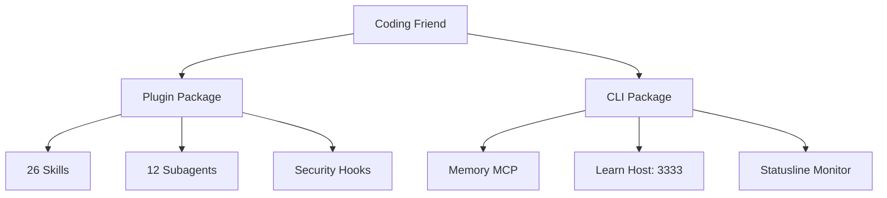
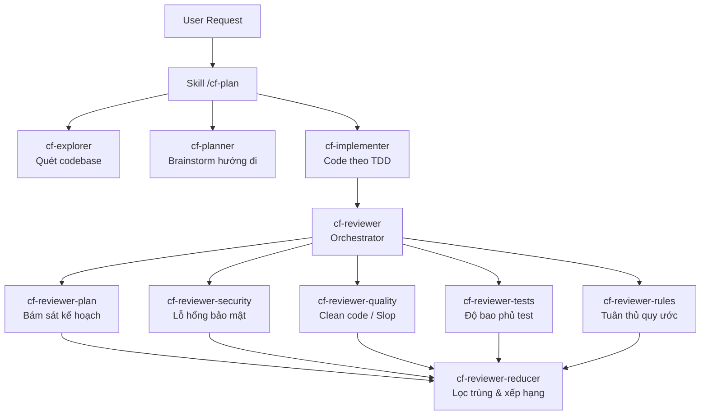
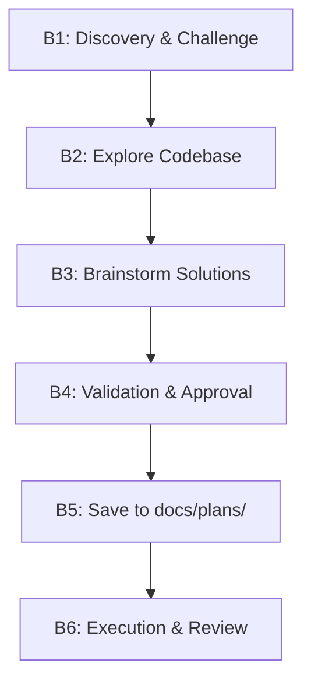
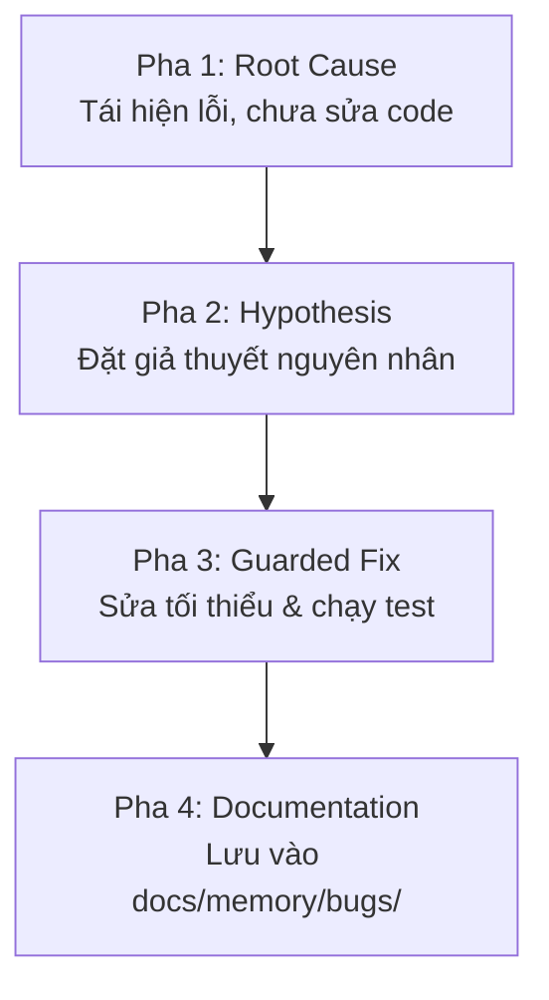


AI viết code rất nhanh, nhưng con người mới là người chịu trách nhiệm cho hệ thống. Kỷ luật kỹ thuật chính là ranh giới giữa một codebase chất lượng cao và một đống nợ kỹ thuật (technical debt).



Toàn bộ nội dung, kiến trúc và quy trình trong bài viết được trích xuất và tổng hợp chuẩn xác từ  và kho mã nguồn mở của tác giả **Anh-Thi Dinh**.


Trong kỷ nguyên "Vibe Coding" — nơi lập trình viên phó mặc việc sinh mã cho các trợ lý AI — đa số chúng ta đều nhanh chóng rơi vào 2 cái bẫy chết người:
1. **Thất thoát tri thức dự án (Project Knowledge Loss):** Qua nhiều phiên làm việc, không ai còn nhớ các quyết định kiến trúc, quy ước đặt tên hay những bug ngầm đã từng sửa.
2. **Khoảng trống học tập của con người (Human Learning Gap):** AI viết code, con người chỉ việc bấm *Accept/Approve* mà không thực sự hiểu bản chất, dần dần đánh mất khả năng làm chủ mã nguồn.

**Coding Friend (CF)** ra đời như một bộ công cụ tinh gọn (*lean toolkit*) để mang lại **kỷ luật kỹ thuật phần mềm (Disciplined Workflows)**: Lập kế hoạch có phản biện $\rightarrow$ Test-Driven Development (TDD) $\rightarrow$ Systematic Debugging $\rightarrow$ Code Review chuyên sâu 5 tầng $\rightarrow$ Ghi nhớ tri thức & Học tập.

---

## 1. Kiến trúc phân tách hai gói độc lập (Two Independent Packages)

Coding Friend áp dụng nguyên lý phân tách trách nhiệm rất rõ ràng giữa tầng **Quy trình lõi (Plugin)** và tầng **Công cụ hỗ trợ (CLI)**:

- **Plugin (`coding-friend`)**: Chứa toàn bộ logic quy trình. Hoạt động độc lập 100% (nếu không cài CLI, hệ thống tự động fallback về `grep` trên `docs/memory/`).
- **CLI (`cf`)**: Đóng vai trò là cầu nối tăng tốc độ truy xuất bộ nhớ qua SQLite + BM25 + Vector Search, hiển thị thanh trạng thái thời gian thực và khởi chạy website tra cứu kiến thức học tập.

---

## 2. Hệ thống dàn 12 Custom Subagents chuyên biệt

Coding Friend không dùng một prompt chung cho mọi việc, mà điều phối các **Subagent chuyên trách** chạy trong ngữ cảnh cô lập (*Isolated Context*):

1. **`cf-explorer`**: Khám phá kiến trúc dự án, tìm các file bị ảnh hưởng và đọc pattern code hiện có.
2. **`cf-planner`**: Brainstorm 2–3 hướng tiếp cận kỹ thuật kèm ưu/nhược điểm, độ rủi ro và đánh giá chi phí rollback.
3. **`cf-implementer`**: Nhận từng task cụ thể, thực thi theo chu trình TDD (Red $\rightarrow$ Green $\rightarrow$ Refactor).
4. **`cf-reviewer` (Dàn Review 5 Lớp)**:
   - `cf-reviewer-plan`: Kiểm tra code có bám sát kế hoạch ban đầu không.
   - `cf-reviewer-security`: Soi lỗ hổng bảo mật, SQL injection, XSS, lộ lọt dữ liệu.
   - `cf-reviewer-quality`: Phát hiện code rác (*AI slop*), logic dư thừa, code không tối ưu.
   - `cf-reviewer-tests`: Soi độ bao phủ kiểm thử (Edge cases, Mocking, Boundary conditions).
   - `cf-reviewer-rules`: Kiểm tra tuân thủ các quy tắc trong `CLAUDE.md` / `GEMINI.md`.
   - `cf-reviewer-reducer`: Gộp tất cả kết quả, lọc trùng lặp và xếp hạng mức độ nghiêm trọng.

---

## 3. Bản đồ quy trình thực chiến của 26 Skills

### A. Lập kế hoạch đỉnh cao (`/cf-plan`)

Trước khi viết bất kỳ dòng code nào, `/cf-plan` sẽ dẫn dắt quy trình thiết kế giải pháp:

1. **Discovery & Challenge:** Phỏng vấn người dùng và thử thách ý tưởng bằng 4 góc tấn công (*Attack Angles*): Rủi ro phụ thuộc, khả năng mở rộng quy mô, chi phí rollback và sự sụp đổ của tiền đề ban đầu.
2. **Codebase Exploration:** `cf-explorer` quét toàn bộ dự án để tìm các pattern tương tự.
3. **Brainstorming:** `cf-planner` đưa ra 2–3 hướng tiếp cận kỹ thuật kèm ưu/nhược điểm.
4. **Trình bày & Phê duyệt:** Chờ người dùng bấm xác nhận rồi mới xuất file kế hoạch ra `docs/plans/YYYY-MM-DD-slug/`.


- `--fast`: Bỏ qua brainstorm, tìm kiếm inline nhanh, lưu checklist trong chat (không tạo file rác cho task nhỏ).
- `--hard`: Khám phá sâu, bắt buộc có chiến lược rollback cho từng task (dành cho breaking changes/refactor lớn).
- `--auto`: **Chế độ Autopilot** — AI tự động thực hiện từ đầu đến cuối: Code $\rightarrow$ Auto Review $\rightarrow$ Auto Fix lỗi Critical/Important $\rightarrow$ Commit từng phase mà không hỏi phiền hà.
- `--gui`: Tự động tạo trang web báo cáo trực quan `overview.html` dành cho con người theo dõi.


---

### B. Sửa lỗi khoa học (Systematic Debugging: `cf-fix` & `cf-sys-debug`)

Coding Friend nghiêm cấm hành vi *"thấy lỗi rồi sửa đại xem sao"*. Quy trình bắt buộc tuân thủ 4 pha:

---

### C. Review đa tầng chuyên sâu (`/cf-review`)

Khi gọi `/cf-review`, hệ thống tự động đánh giá kích thước diff và điều phối dàn subagent:
- 🚨 **Critical:** Lỗi logic nghiêm trọng, lỗ hổng bảo mật, leak tài nguyên.
- ⚠️ **Important:** Xử lý thiếu try/catch, edge case chưa bọc, thiếu index DB.
- 💡 **Suggestions:** Góp ý Clean Code, đặt tên biến, tách hàm.
- 📋 **Summary:** Đánh giá tổng quan chất lượng mã nguồn.


- `/cf-review-out`: Đóng gói prompt review kèm ngữ cảnh diff để gửi sang Gemini, ChatGPT, Codex hay chuyên gia con người.
- `/cf-review-in`: Đọc kết quả review từ bên ngoài và tự động tạo kế hoạch vá lỗi.


---

### D. Cam kết chất lượng trước khi giao việc (`cf-tdd` & `cf-verification`)
- **`cf-tdd`**: Tự động kích hoạt khi viết code. Với cờ `--add-tests`, AI bắt buộc tuân thủ: **RED** (viết test fail trước) $\rightarrow$ **GREEN** (code vừa đủ để test pass) $\rightarrow$ **REFACTOR** (tối ưu mã nguồn).
- **`cf-verification`**: Bắt buộc AI phải chạy lệnh build/test thực tế trước khi dám báo hoàn thành với người dùng.

---

## 4. Lá chắn bảo mật & Lifecycle Hooks

Coding Friend can thiệp vào vòng đời hoạt động của AI qua hệ thống Hook tự động:

1. **Privacy Block Hook (`privacy-block.sh`)**: Chặn đứng mọi hành vi AI cố đọc/sửa file nhạy cảm (`.env`, `.pem`, `.key`, `id_rsa`, `.ssh/`, `.aws/`, credentials).
2. **Context Bootstrap (`session-init.sh`)**: Tự động nạp bộ nhớ dự án từ `docs/memory/` vào context ban đầu.
3. **Auto-Approve Hook**: Cơ chế 3 bước (Kiểm tra quy tắc $\rightarrow$ Kiểm tra thư mục an toàn $\rightarrow$ Phân loại tự động) giúp tiết kiệm thời gian bấm phím `y`.

---

## 5. Bảng tra cứu lệnh toàn diện (Full Cheatsheet)

| Câu Lệnh / Lời Nhắc Mẫu | Nhóm | Chức Năng Chi Tiết |
| :--- | :--- | :--- |
| `/cf-plan [tác vụ]` | Planning | Lập kế hoạch chi tiết nhiều bước trước khi code. |
| `/cf-plan --auto [tác vụ]` | Autopilot | Tự hành hoàn toàn: code $\rightarrow$ review $\rightarrow$ fix $\rightarrow$ commit. |
| `/cf-plan-resume <slug>` | Planning | Tiếp tục kế hoạch đang dở từ điểm dừng gần nhất. |
| `/cf-advise [vấn đề]` | Advisory | Phỏng vấn cố vấn kiến trúc (không sinh code/kế hoạch). |
| `/cf-fix [mô tả lỗi]` | Debugging | Sửa lỗi nhanh nhưng tuân thủ quy trình khoa học. |
| `/cf-sys-debug` | Debugging | Quy trình điều tra lỗi hệ thống phức tạp 4 pha. |
| `/cf-tdd [tác vụ]` | TDD | Phát triển theo chuẩn Red $\rightarrow$ Green $\rightarrow$ Refactor. |
| `/cf-verification` | Testing | Bắt buộc chạy test xác minh trước khi báo hoàn thành. |
| `/cf-review [đích]` | Review | Review đa tầng qua dàn subagent chuyên biệt. |
| `/cf-commit [gợi ý]` | Git | Quét lộ secret và tạo conventional commit thông minh. |
| `/cf-ship` | Release | Chạy test $\rightarrow$ Commit $\rightarrow$ Push $\rightarrow$ Tạo Pull Request. |
| `/cf-remember [chủ đề]` | Memory | Ghi nhớ quy ước ngầm vào `docs/memory/`. |
| `/cf-learn` | Learning | Rút trích ghi chú ngắn gọn để người dùng ôn tập. |
| `/cf-teach` | Learning | Giải thích chuyên sâu bản chất vấn đề như một người thầy. |
| `cf learn host` *(CLI)* | Learning | Mở website tra cứu kiến thức học tập tại `http://localhost:3333`. |
| `/cf-session` | Session | Lưu và chuyển phiên làm việc sang máy tính khác. |
| `/cf-scan` | Bootstrap | Quét toàn bộ project để khởi tạo bộ nhớ AI ban đầu. |
