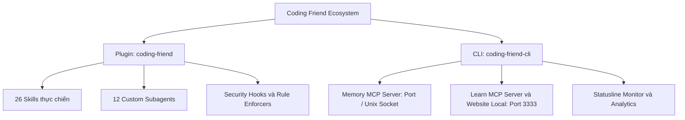
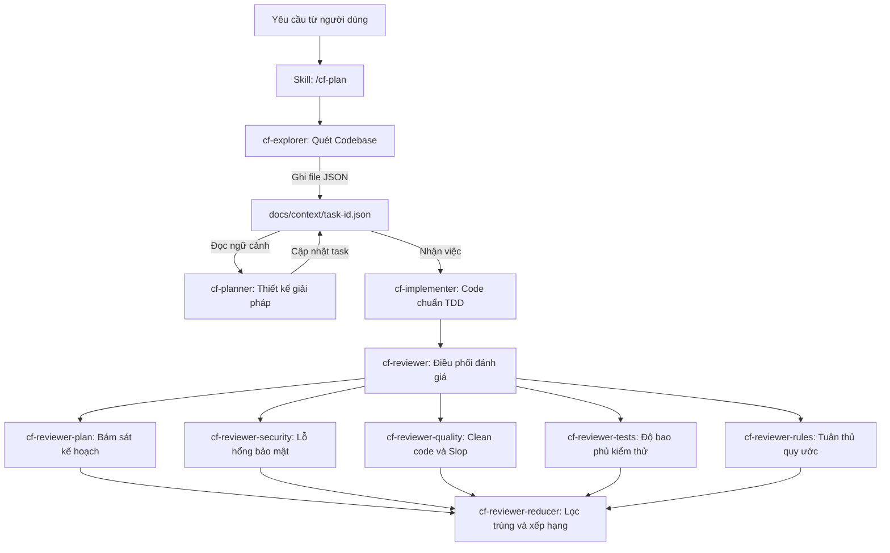
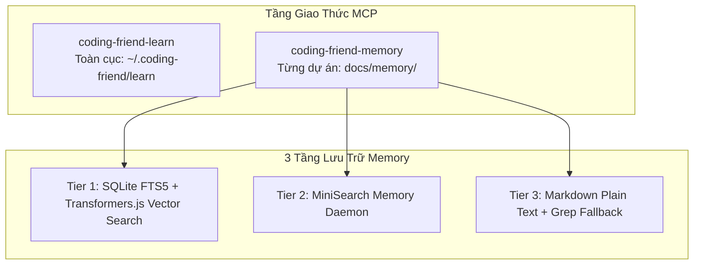
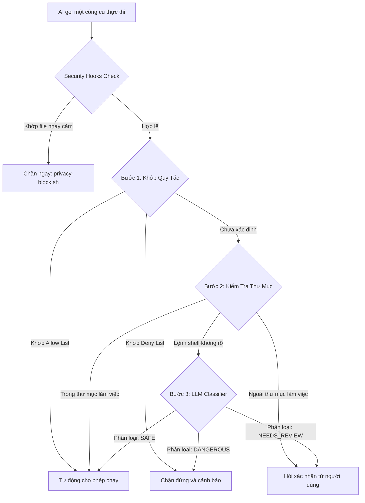


AI viết code rất nhanh, nhưng con người mới là người chịu trách nhiệm cho hệ thống. Kỷ luật kỹ thuật chính là ranh giới giữa một codebase chất lượng cao và một đống nợ kỹ thuật.



Toàn bộ nội dung, kiến trúc và quy trình trong bài viết được trích xuất và tổng hợp chuẩn xác từ  và kho mã nguồn mở của tác giả **Anh-Thi Dinh**.


Trong kỷ nguyên "Vibe Coding" — nơi lập trình viên phó mặc việc sinh mã cho các trợ lý AI — đa số chúng ta đều nhanh chóng đối mặt với 2 vấn đề lớn:
1. **Thất thoát tri thức dự án:** Qua nhiều phiên làm việc, không ai còn nhớ các quyết định kiến trúc, quy ước đặt tên hay những lỗi ngầm đã từng xử lý.
2. **Khoảng trống học tập của con người:** AI viết code, con người chỉ việc bấm chấp thuận mà không thực sự hiểu bản chất, dần dần đánh mất khả năng làm chủ mã nguồn.

**Coding Friend (CF)** ra đời như một bộ công cụ tinh gọn nhằm mang lại **kỷ luật kỹ thuật phần mềm**: Lập kế hoạch có phản biện $\to$ Test-Driven Development $\to$ Systematic Debugging $\to$ Code Review chuyên sâu 5 tầng $\to$ Ghi nhớ tri thức và Học tập.

---

## 1. Kiến trúc phân tách hai gói độc lập

Coding Friend áp dụng nguyên lý phân tách trách nhiệm rất rõ ràng giữa tầng **Quy trình lõi (Plugin)** và tầng **Công cụ hỗ trợ (CLI)**:



- **Plugin (`coding-friend`)**: Chứa toàn bộ logic quy trình, prompt định tuyến và các hook bảo mật. Plugin hoạt động độc lập 100%. Nếu không cài CLI, hệ thống tự động chuyển sang chế độ dự phòng bằng lệnh `grep` trên thư mục `docs/memory/`.
- **CLI (`coding-friend-cli`)**: Đóng vai trò là cầu nối tăng tốc độ truy xuất bộ nhớ qua SQLite FTS5 kết hợp Vector Search, quản trị cấu hình, đồng bộ phiên làm việc và khởi chạy website tra cứu kiến thức học tập tại cổng `3333`.

---

## 2. Hệ thống 12 Custom Subagents và Cơ chế Context Handoff

Coding Friend không dùng một prompt chung cho mọi việc, mà điều phối các **Subagent chuyên trách** chạy trong các phiên cô lập nhằm tối ưu dung lượng ngữ cảnh và độ chính xác:



### Bản chất kỹ thuật của Context Handoff
Khi chuyển giao công việc giữa các Agent, việc chuyển tiếp toàn bộ chuỗi hội thoại văn bản sẽ làm bùng nổ số lượng token và gây nhiễu ngữ cảnh. Coding Friend giải quyết bài toán này bằng cơ chế **Context Handoff qua file JSON có cấu trúc**:
1. `cf-explorer` quét dự án và ghi kết quả vào `docs/context/<task-id>.json`.
2. `cf-planner` đọc file JSON này để lên kế hoạch và bổ sung các task thực thi.
3. `cf-implementer` đọc trực tiếp các thông số kỹ thuật từ file JSON để tiến hành viết code.
4. Sau khi hoàn tất hoặc cần thử lại, trạng thái thực thi được cập nhật trực tiếp vào file JSON với khóa `previous_failure`.

### Danh mục 12 Subagents chuyên trách

| Tên Subagent | Model Mặc Định | Nhiệm Vụ Kỹ Thuật Trọng Tâm |
| :--- | :--- | :--- |
| `cf-explorer` | Haiku | Khám phá cấu trúc dự án, tìm file liên quan và trích xuất code mẫu. |
| `cf-planner` | Sonnet / Opus | Brainstorm 2 đến 3 hướng tiếp cận kèm ưu nhược điểm và rủi ro rollback. |
| `cf-implementer` | Sonnet | Viết code thực thi theo chu trình TDD (Red $\to$ Green $\to$ Refactor). |
| `cf-reviewer` | Sonnet | Điều phối dàn chuyên gia review đa tầng song song. |
| `cf-reviewer-plan` | Sonnet | Đánh giá mức độ bám sát thiết kế và phát hiện task bị bỏ sót. |
| `cf-reviewer-security` | Sonnet | Quét lỗ hổng bảo mật, OWASP, SQL Injection và rò rỉ dữ liệu. |
| `cf-reviewer-quality` | Haiku | Phát hiện mã nguồn rác, logic thừa và cấu trúc phức tạp hóa. |
| `cf-reviewer-tests` | Haiku | Đánh giá độ bao phủ kiểm thử, ca biên và dữ liệu giả lập. |
| `cf-reviewer-rules` | Haiku | Kiểm tra tuân thủ các quy tắc trong `CLAUDE.md` và `AGENTS.md`. |
| `cf-reviewer-reducer` | Haiku | Hợp nhất kết quả từ 5 chuyên gia, loại bỏ trùng lặp và phân loại độ nghiêm trọng. |
| `cf-writer` | Haiku | Soạn thảo tài liệu kỹ thuật tinh gọn và file markdown phụ trợ. |
| `cf-writer-deep` | Sonnet | Rút trích tri thức chuyên sâu và tạo tài liệu học tập đa chiều. |

---

## 3. Hệ thống bộ nhớ 3 tầng và 2 MCP Servers

Coding Friend xây dựng cơ chế quản trị tri thức bền vững thông qua 2 MCP Server và 3 tầng lưu trữ:



### So sánh 3 Tầng Lưu Trữ Bộ Nhớ (Memory Tiers)

1. **Tier 1 (Full - Khuyến nghị):** Kết hợp tìm kiếm toàn văn SQLite FTS5 (BM25) và tìm kiếm ngữ nghĩa qua mô hình nhúng cục bộ Transformers.js (`Xenova/all-MiniLM-L6-v2` hoặc Ollama). Kết quả được xếp hạng lại bằng thuật toán Reciprocal Rank Fusion.
2. **Tier 2 (Lite):** Chạy tiến trình nền `MiniSearch daemon`, phù hợp cho các môi trường không cài được thư viện native SQLite.
3. **Tier 3 (Markdown):** Quét trực tiếp qua các file markdown trong `docs/memory/` bằng lệnh `grep`. Hoạt động ngay lập tức mà không cần bất kỳ cài đặt phụ thuộc nào.

### Phân biệt 2 MCP Server Độc Lập

- **`coding-friend-learn` (Toàn cục):** Đăng ký ở phạm vi người dùng (`--scope user`), phục vụ việc tra cứu và tích lũy bài học kỹ thuật dùng chung cho mọi dự án tại `~/.coding-friend/learn/`.
- **`coding-friend-memory` (Từng dự án):** Đăng ký ở phạm vi người dùng nhưng tự động giải quyết đường dẫn dự án thực tế tại runtime thông qua biến môi trường `CLAUDE_PROJECT_DIR`. Điều này giúp cô lập hoàn toàn bộ nhớ giữa các kho mã nguồn khác nhau mà không cần cấu hình file `.mcp.json` thủ công cho từng repo.

---

## 4. Lá chắn bảo mật đa tầng và Quy trình Auto-Approve

Để đảm bảo AI không vô tình truy cập các tệp nhạy cảm hoặc thực thi các lệnh nguy hiểm, Coding Friend thiết lập hệ thống bảo vệ nhiều lớp:



### 1. Privacy Block Hook (`privacy-block.sh`)
Tự động chặn đứng quyền truy cập vào các file chứa thông tin nhạy cảm:
- Toàn bộ file `.env` (ngoại trừ `.env.example`).
- Các file chứng chỉ và khóa bảo mật: `.pem`, `.key`, `id_rsa`.
- Thư mục cấu hình xác thực cá nhân: `~/.ssh/`, `~/.aws/`.

### 2. Pipeline Auto-Approve 3 bước
- **Bước 1 (Khớp quy tắc tức thì):** So khớp tiền tố lệnh với danh sách an toàn đã biết (ví dụ: `git status`, `pnpm test`) hoặc danh sách cấm phá hoại.
- **Bước 2 (Kiểm tra ranh giới thư mục):** Sử dụng `path.resolve()` để xác định thao tác ghi file có nằm trong phạm vi dự án hay không, ngăn chặn triệt để tấn công vượt quyền thư mục (`../../etc/passwd`).
- **Bước 3 (Bộ phân loại LLM chuyên dụng):** Sử dụng Claude Sonnet đóng gói đầu vào trong thẻ `<tool_input>` nhằm chống lại các cuộc tấn công chèn mã lệnh Prompt Injection, phân loại thao tác thành `SAFE`, `DANGEROUS` hoặc `NEEDS_REVIEW`.

---

## 5. Hỗ trợ song hành: Claude Code và Codex CLI

Coding Friend hỗ trợ cả hai nền tảng AI CLI hàng đầu với kiến trúc tích hợp phù hợp cho từng môi trường:

| Đặc Điểm Kiến Trúc | Claude Code | Codex CLI |
| :--- | :--- | :--- |
| **Cú pháp gọi Skill** | `/cf-plan`, `/cf-review` | `$cf-plan`, `$cf-review` |
| **Phạm vi cấu hình MCP** | Cấu hình toàn cục tại User Scope | Cấu hình cục bộ tại `.codex/config.toml` |
| **Định nghĩa Subagent** | Load trực tiếp từ Markdown trong plugin | Biên dịch thành file `.codex/agents/*.toml` |
| **Ánh xạ mức độ tư duy** | `haiku` $\to$ `sonnet` $\to$ `opus` | `low` $\to$ `medium` $\to$ `high` |
| **Cơ chế Auto-Approve** | Pipeline 3 bước kết hợp LLM Classifier | Kiểm tra tất định theo quy tắc tĩnh |

---

## 6. Mở rộng quy trình với Custom Skill Guides

Chúng ta có thể dễ dàng mở rộng bất kỳ skill có sẵn nào mà không cần chỉnh sửa mã nguồn của plugin thông qua lệnh `cf guide`:

```bash
# Tạo file hướng dẫn tùy biến cho skill cf-commit
cf guide create cf-commit
```

Cấu trúc file `.coding-friend/skills/cf-commit-custom/SKILL.md` hỗ trợ 3 phần mở rộng:
- **`## Before`**: Các bước tiền xử lý chạy trước khi quy trình mặc định bắt đầu (ví dụ: tự động chạy kiểm tra định dạng).
- **`## Rules`**: Các quy định bổ sung được áp dụng xuyên suốt quy trình (ví dụ: chuẩn đặt tên commit riêng của công ty).
- **`## After`**: Các bước hậu xử lý sau khi hoàn thành (ví dụ: gửi thông báo qua webhook).

---

## 7. Bảng tra cứu toàn diện 26 Skills và Token Footprint

Dưới đây là bảng tổng hợp toàn bộ 26 skills của Coding Friend kèm mức độ chiếm dụng ngữ cảnh đầu vào (Prompt Footprint): `⚡` (Thấp, dưới 2k tokens), `⚡⚡` (Trung bình, 2k đến 6k tokens), `⚡⚡⚡` (Cao, trên 6k tokens).

| Lệnh / Skill | Loại Kích Hoạt | Footprint | Mục Đích Sử Dụng Chi Tiết |
| :--- | :--- | :---: | :--- |
| `/cf-plan` | Lệnh thủ công | `⚡⚡⚡` | Khám phá dự án, brainstorm và lập kế hoạch thực thi theo từng pha. |
| `/cf-plan-resume` | Lệnh thủ công | `⚡⚡` | Tiếp tục thực hiện kế hoạch dang dở từ điểm dừng gần nhất. |
| `/cf-advise` | Lệnh thủ công | `⚡⚡` | Phỏng vấn cố vấn ra quyết định kiến trúc (không viết code hay lập kế hoạch). |
| `/cf-tdd` | Tự động / Lệnh | `⚡` | Phát triển tính năng theo chu trình kiểm thử Red $\to$ Green $\to$ Refactor. |
| `/cf-verification` | Tự động | `⚡` | Bắt buộc chạy kiểm thử xác minh thực tế trước khi báo hoàn thành task. |
| `/cf-fix` | Tự động / Lệnh | `⚡⚡` | Sửa lỗi nhanh nhưng tuân thủ tái hiện và kiểm chứng khoa học. |
| `/cf-sys-debug` | Tự động / Lệnh | `⚡⚡⚡` | Quy trình điều tra và khoanh vùng lỗi hệ thống phức tạp 4 pha. |
| `/cf-review` | Tự động / Lệnh | `⚡⚡⚡` | Điều phối dàn 5 chuyên gia đánh giá toàn diện mã nguồn. |
| `/cf-review-out` | Lệnh thủ công | `⚡⚡` | Xuất gói prompt review kèm diff để gửi sang AI bên ngoài hoặc chuyên gia. |
| `/cf-review-in` | Lệnh thủ công | `⚡` | Đọc kết quả review từ bên ngoài và tự động tạo kế hoạch vá lỗi. |
| `/cf-commit` | Tự động / Lệnh | `⚡` | Phân tích thay đổi, quét rò rỉ bí mật và tạo Conventional Commit. |
| `/cf-ship` | Lệnh thủ công | `⚡` | Quy trình hoàn chỉnh: Kiểm thử $\to$ Commit $\to$ Push $\to$ Tạo Pull Request. |
| `/cf-remember` | Tự động / Lệnh | `⚡` | Lưu trữ quyết định kiến trúc và quy ước vào `docs/memory/`. |
| `/cf-ask` | Lệnh thủ công | `⚡` | Hỏi đáp nhanh về luồng hoạt động của dự án và lưu vào bộ nhớ. |
| `/cf-learn` | Tự động / Lệnh | `⚡⚡` | Rút trích bài học kinh nghiệm sau buổi làm việc cho con người ôn tập. |
| `/cf-teach` | Lệnh thủ công | `⚡⚡` | Giảng giải bản chất kỹ thuật theo lối kể chuyện đàm đạo sâu sắc. |
| `/cf-research` | Lệnh thủ công | `⚡⚡⚡` | Nghiên cứu công nghệ chuyên sâu kết hợp tìm kiếm dữ liệu trên web. |
| `/cf-optimize` | Tự động / Lệnh | `⚡⚡` | Quy trình tối ưu hiệu năng có đo lường trước và sau khi tinh chỉnh. |
| `/cf-design` | Lệnh thủ công | `⚡⚡` | Thiết kế và tinh chỉnh giao diện bám sát Design System của dự án. |
| `/cf-scan` | Lệnh thủ công | `⚡⚡⚡` | Quét toàn bộ kho mã nguồn để khởi tạo bộ nhớ tri thức ban đầu. |
| `/cf-session` | Lệnh thủ công | `⚡` | Đóng gói phiên làm việc để chuyển đổi mượt mà sang máy tính khác. |
| `/cf-checkpoint` | Lệnh thủ công | `⚡` | Lưu ảnh chụp ngữ cảnh hiện tại để nạp lại vào phiên làm việc mới. |
| `/cf-checkpoint-from` | Lệnh thủ công | `⚡` | Nạp lại ngữ cảnh từ file checkpoint đã lưu trước đó. |
| `/cf-later-do` | Lệnh thủ công | `⚡` | Duyệt và giải quyết danh sách các việc phụ đã hoãn trong `docs/later/`. |
| `/cf-warm` | Lệnh thủ công | `⚡` | Tóm tắt nhanh lịch sử commit khi quay trở lại dự án sau thời gian vắng mặt. |
| `/cf-help` | Tự động / Lệnh | `⚡` | Tra cứu hướng dẫn sử dụng và thông tin về toàn bộ hệ sinh thái Coding Friend. |

---

## 8. Bài học đúc kết khi ứng dụng Coding Friend

1. **Kế hoạch đi trước, code theo sau:** Luôn dành thời gian cho `/cf-plan` hoặc `/cf-advise` để làm rõ các góc khuất kiến trúc trước khi để AI gõ phím.
2. **Context cô lập là chìa khóa:** Sử dụng các Subagent chuyên trách và file trung gian để giữ cho ngữ cảnh của phiên làm việc luôn tinh gọn, tránh hiện tượng suy giảm chú ý của mô hình.
3. **Chuyển hóa tri thức thành tài sản:** Sử dụng song song `/cf-remember` (để AI hiểu dự án hơn trong tương lai) và `/cf-learn` (để chính chúng ta không ngừng nâng cao trình độ chuyên môn).
