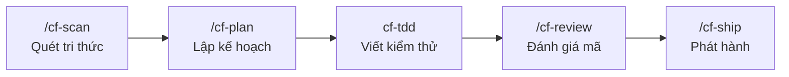
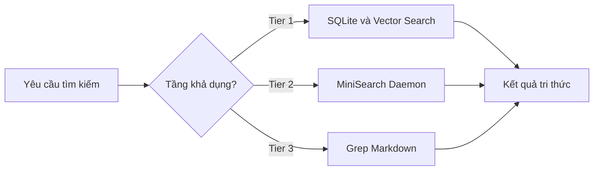
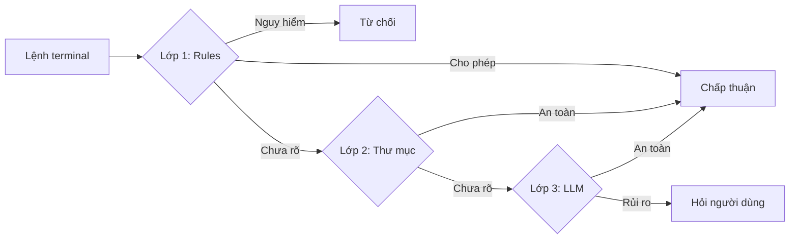


A lean toolkit for disciplined engineering workflows in Claude Code, Codex CLI, omp, and Google Antigravity.



Tài liệu được cập nhật và đối chiếu theo Coding Friend v0.43.5 từ tài liệu kỹ thuật chính thức tại .


Khi lập trình cùng AI Agent, vấn đề không nằm ở tốc độ sinh code — mà ở kỷ luật kỹ thuật: không có test, không có review, không có bộ nhớ ngữ cảnh, AI tự ý hóa 100% và chúng ta mất kiểm soát hoàn toàn sau vài session.

**Coding Friend** sinh ra để giải quyết đúng bài toán đó. Đây là bộ skills, agents, hooks và CLI tools giúp chúng ta định hình một quy trình làm việc kỷ luật: **Khám phá → Lập kế hoạch → Viết code có kiểm thử → Đánh giá an toàn → Ghi nhớ tri thức**.

Tài liệu này được tổ chức theo nguyên tắc **tra cứu theo nhu cầu thực tế**:
- **Chương 1:** Thiết lập và chạy thử trong 5 phút
- **Chương 2:** Tra cứu khi cần điều chỉnh cấu hình hoặc cơ chế vận hành nền tảng
- **Chương 3:** Tra cứu lệnh và skill cụ thể khi đang làm việc
- **Chương 4:** Vận hành chuyên sâu: sub-agents, CLI commands và kịch bản phối hợp


---

## Chương 1: Bắt Đầu Trong 5 Phút

*Mục tiêu: Chạy được Coding Friend ngay sau khi đọc xong phần này.*

### 1.1 Cài đặt và khởi động

Coding Friend hỗ trợ 4 nền tảng chính. Chọn một nền tảng phù hợp:

```bash
# Bước 1: Cài đặt CLI toàn cục
npm i -g coding-friend-cli

# Bước 2a: Cài vào Claude Code (chính thức)
cf install

# Bước 2b: Hoặc cài vào Codex CLI
cf install --agent codex

# Bước 2c: Hoặc cài vào oh-my-pi (omp) — beta
cf install --agent omp

# Bước 2d: Hoặc cài vào Google Antigravity (agy) — beta
cf install --agent agy

# Bước 3: Khởi tạo workspace dự án
cf init           # Claude Code
cf init --agent agy  # Google Antigravity

# Bước 4: Khởi động lại session sau khi cài

# Bước 5: Kiểm tra trạng thái
cf status
```


Nếu tên `cf` đã bị chiếm bởi công cụ khác (ví dụ Cloudflare CLI), hãy dùng bí danh `cdf` — hoạt động hoàn toàn giống `cf`.

```bash
cdf install
cdf init
cdf memory status
```


**Cập nhật sau này:**

```bash
cf update           # Cập nhật tất cả các nền tảng đã cài
cf update --agent agy   # Chỉ cập nhật Google Antigravity
```

### 1.2 Vòng lặp phát triển tiêu chuẩn

Coding Friend áp dụng quy trình 5 bước có kỷ luật:




### 1.3 Lần đầu chạy dự án

Ngay khi cài xong và mở Claude Code, chúng ta gõ lệnh đầu tiên:

```bash
# Bước 0 — Quét và nạp tri thức dự án vào bộ nhớ
/cf-scan

# Bước 1 — Lên kế hoạch tính năng
/cf-plan Build a user authentication system

# Bước 2 — (AI tự động gọi cf-tdd khi bắt đầu viết code)

# Bước 3 — Review sau khi hoàn thành
/cf-review src/auth/

# Bước 4 — Ship toàn bộ pipeline
/cf-ship Add user authentication
```


`/cf-scan` đọc kiến trúc, quy ước đặt tên và tech stack của dự án, ghi vào `docs/memory/`. Các skills sau đó như `/cf-plan` và `cf-tdd` sẽ tự động đọc bộ nhớ này để đưa ra gợi ý phù hợp với dự án, thay vì sinh code chung chung.


---

## Chương 2: Cấu Hình và Vận Hành Nền Tảng

*Mục tiêu: Hiểu rõ các thông số cấu hình, cơ chế Hooks tự động và hệ thống bộ nhớ — những thứ hoạt động trong nền mà ít ai biết.*

### 2.1 File cấu hình .coding-friend/config.json

Coding Friend có 2 cấp cấu hình:
- **Global:** `~/.coding-friend/config.json` — áp dụng cho tất cả dự án
- **Local:** `.coding-friend/config.json` tại thư mục gốc dự án — ghi đè Global

Chỉnh sửa tương tác qua `cf config` hoặc sửa thẳng file JSON.

**Toàn bộ config mẫu:**

```json
{
  "language": "en",
  "docsDir": "docs",
  "privacyBlock": true,
  "scoutBlock": true,
  "commit": {
    "verify": true
  },
  "learn": {
    "language": "en",
    "outputDir": "~/.coding-friend/learn",
    "categories": [
      { "name": "concepts", "description": "Design patterns, algorithms, architecture principles" },
      { "name": "patterns", "description": "Repository pattern, observer pattern" },
      { "name": "languages", "description": "Language-specific features, syntax, idioms" },
      { "name": "tools", "description": "Libraries, frameworks, CLI tools" },
      { "name": "debugging", "description": "Debugging techniques, bug fixes" }
    ],
    "autoCommit": false,
    "readmeIndex": false
  },
  "autoApprove": false,
  "autoApproveAllowExtra": [],
  "autoApproveIgnore": [],
  "disableGUIPlan": true,
  "guiPlanFormat": "html",
  "memory": {
    "tier": "auto",
    "embedding": {
      "provider": "transformers",
      "model": "Xenova/all-MiniLM-L6-v2",
      "ollamaUrl": "http://localhost:11434"
    },
    "autoCapture": false,
    "autoStart": false
  },
  "review": {
    "withCodex": false
  },
  "statusline": {
    "components": ["version", "folder", "model", "branch", "context", "usage"],
    "accountAliases": {
      "me@work.com": "Work"
    }
  }
}
```

**Các tham số cấu hình chính:**
- `language` (mặc định: `"en"`): Ngôn ngữ xuất tài liệu cho `/cf-ask`, `/cf-plan`, `/cf-research`.
- `docsDir` (mặc định: `"docs"`): Thư mục gốc chứa toàn bộ output sinh ra từ skills.
- `privacyBlock` (mặc định: `true`): Hook chặn AI đọc các tệp cấu hình bảo mật và biến môi trường nhạy cảm (`.env`, secrets).
- `scoutBlock` (mặc định: `true`): Hook ngăn AI quét đồng thời quá nhiều tệp gây quá tải ngữ cảnh.
- `commit.verify` (mặc định: `true`): Tự động chạy test suite trước khi cho phép commit.
- `autoApprove` (mặc định: `false`): Bật cổng phê duyệt lệnh thông minh với cơ chế 3 lớp phân loại.
- `disableGUIPlan` (mặc định: `true`): Khi đặt `false`, `/cf-plan` sẽ sinh thêm file `overview.html` trực quan.
- `guiPlanFormat` (mặc định: `"html"`): Định dạng file overview (`"html"` hoặc `"md"`).
- `memory.tier` (mặc định: `"auto"`): Chế độ tìm kiếm bộ nhớ (`auto`, `full`, `lite`, `markdown`).
- `memory.autoCapture` (mặc định: `false`): Tự động lưu tóm tắt session vào bộ nhớ trước khi context bị nén.
- `review.withCodex` (mặc định: `false`): Gọi thêm Codex review song song cùng Claude.


### 2.2 Hệ thống bộ nhớ 3 tầng (Memory System)

Đây là cơ chế lưu và tìm kiếm tri thức dự án giữa các session. Chúng ta không cần giải thích lại kiến trúc mỗi lần — AI tự đọc từ bộ nhớ.




**Đặc tính từng tầng bộ nhớ:**
- **Tier 1 (Full):** Yêu cầu chạy `cf memory init` để cài SQLite và dependencies. Tốc độ nhanh nhất, hỗ trợ hybrid search (FTS5 kết hợp semantic vector search).
- **Tier 2 (Lite):** Khởi động qua `cf memory start-daemon`. Tốc độ trung bình, sử dụng MiniSearch daemon chạy nền.
- **Tier 3 (Markdown):** Không yêu cầu thiết lập bổ sung. Tốc độ tìm kiếm chậm nhất do grep trực tiếp qua các file markdown.


```bash
# Khởi tạo Tier 1 (khuyến nghị cho dự án lớn)
cf memory init

# Khởi động daemon Tier 2
cf memory start-daemon

# Kiểm tra trạng thái memory
cf memory status

# Tìm kiếm thủ công trong bộ nhớ
cf memory search "authentication flow"

# Xây lại chỉ mục (khi đổi embedding model)
cf memory rebuild
```

**2 MCP Servers đi kèm:**
- **Memory MCP:** Cho phép bất kỳ AI client nào (Gemini, ChatGPT, Cursor...) kết nối và tìm kiếm trong bộ nhớ dự án của chúng ta
- **Learn MCP:** Phục vụ ghi chú học tập từ `/cf-learn` để các AI client khác có thể tra cứu

```bash
# Cài đặt và cấu hình MCP servers
cf mcp
```

### 2.3 Hệ thống 8 Lifecycle Hooks tự động

**Các hook bảo vệ mặc định:**
- `privacy-block`: Chạy trước khi AI đọc file, chặn truy cập vào `.env`, token hoặc secret keys.
- `scout-block`: Chạy trước thao tác đọc nhiều file, ngăn AI đọc quá tải tài nguyên cùng lúc.
- `auto-approve`: Chạy trước mỗi lệnh terminal, phân loại an toàn qua 3 lớp: Rules, Working directory và LLM Classifier.
- `PreCompact`: Chạy trước khi context bị nén, tự động lưu tóm tắt session vào bộ nhớ nếu bật `autoCapture`.


**Auto-Approve Pipeline hoạt động như sau:**





Khi dùng với `agy`, Auto-Approve chỉ chạy Lớp 1 (Rules). Lớp 3 LLM Classifier sử dụng Claude Sonnet không có sẵn. Các lệnh không rõ ràng sẽ trả về `ask` để hỏi người dùng.


**Cấu hình thêm lệnh vào danh sách cho phép:**

```json
{
  "autoApprove": true,
  "autoApproveAllowExtra": ["cargo test", "pytest", "npm test"],
  "autoApproveIgnore": ["gh pr"]
}
```

### 2.4 Thanh trạng thái cf statusline

`cf statusline` hiển thị thông tin dự án và API usage trực tiếp trong Claude Code status bar:

```bash
# Cài đặt và cấu hình statusline
cf statusline
```

Các component có thể bật/tắt: `version`, `folder`, `model`, `branch`, `context`, `usage`.

---

## Chương 3: Từ Điển 26 Skills — Tra Cứu Khi Đang Code

*Mục tiêu: Tìm đúng lệnh cần dùng trong vòng 30 giây. Mỗi skill ghi đúng bản chất và ví dụ thực tế.*


- **Tự động (Auto):** AI nhận diện và tự gọi skill — không cần gõ lệnh
- **Thủ công (Slash-only):** Bắt buộc gõ lệnh `/cf-xxx` để kích hoạt
- Skills **chỉ auto** (cf-tdd, cf-verification, cf-sys-debug): không có prefix `/`


---

### Nhóm 1: Khám Phá và Định Hướng

Dùng trước khi bắt tay vào làm bất cứ việc gì.

**Danh mục các skill khám phá:**
- `/cf-scan` (kích hoạt thủ công): Bắt đầu dự án mới hoặc cần quét nạp lại bộ nhớ.
- `/cf-ask` (kích hoạt tự động): Đặt câu hỏi cụ thể về codebase và luồng xử lý.
- `/cf-research` (kích hoạt tự động): Nghiên cứu chuyên sâu thư viện hoặc giải pháp trước khi dùng.
- `/cf-advise` (kích hoạt tự động): Cần tư vấn quyết định kỹ thuật, cân nhắc phương án A và B.
- `/cf-warm` (kích hoạt thủ công): Bắt nhịp lại tiến độ dự án sau kỳ nghỉ hoặc thời gian vắng mặt.

#### /cf-scan — Quét và nạp tri thức dự án

**Bản chất:** Đọc kiến trúc, convention và tech stack của dự án, ghi vào `docs/memory/`. Các skills khác sẽ tự động dùng bộ nhớ này để đưa ra gợi ý phù hợp.


`/cf-scan` tiêu tốn nhiều token. Luôn có bước xác nhận trước khi quét. Chỉ cần chạy 1 lần khi bắt đầu, sau đó bộ nhớ được cập nhật tự động.


```bash
/cf-scan                    # Quét toàn bộ dự án
/cf-scan src/auth/          # Quét chỉ module auth
```

Output: `docs/memory/` (architecture, conventions, tech stack, infrastructure)

#### /cf-ask — Hỏi đáp nhanh về codebase

**Bản chất:** Trả lời câu hỏi tập trung về một module cụ thể. Không tạo kế hoạch, không viết code mới.

```bash
/cf-ask How does the auth middleware work?
/cf-ask Where is the payment webhook handler defined?
```

#### /cf-research — Nghiên cứu chuyên sâu

**Bản chất:** Khi chúng ta cần nghiên cứu một thư viện, so sánh giải pháp hoặc khảo sát best practice trước khi bắt tay vào code.

```bash
/cf-research GraphQL vs REST for mobile APIs
/cf-research Best practices for Redis caching in Django
```

Output: `docs/research/YYYY-MM-DD-<slug>/`

#### /cf-advise — Tư vấn ra quyết định

**Bản chất:** Phỏng vấn từng câu một để làm rõ yêu cầu thực sự, sau đó đưa ra khuyến nghị có thứ tự ưu tiên. **Chỉ tư vấn — không bao giờ viết code hay tạo plan.**

```bash
/cf-advise Should we migrate to a monorepo or keep multiple repos?
/cf-advise Is it worth refactoring the auth module now?
```

#### /cf-warm — Bắt nhịp lại sau thời gian vắng mặt

**Bản chất:** Tóm tắt lịch sử Git và những thay đổi quan trọng kể từ commit cuối cùng của chúng ta.

```bash
/cf-warm
/cf-warm --user ngoctin --n-commits 30
```

Output: `docs/warm/YYYY-MM-DD-<user>.md`

---

### Nhóm 2: Kế Hoạch và Kiến Trúc

Dùng khi đã quyết định sẽ làm gì và cần thiết kế cách làm:
- `/cf-plan` (kích hoạt tự động): Hỗ trợ các cờ `--fast`, `--hard`, `--auto`, `--gui`, `--model`.
- `/cf-plan-resume` (kích hoạt thủ công): Tiếp tục kế hoạch dang dở, hỗ trợ cờ `--recap`.

#### /cf-plan — Lập kế hoạch triển khai

**Bản chất:** Phỏng vấn, khám phá codebase qua sub-agent `cf-explorer`, brainstorm qua `cf-planner` và tạo kế hoạch phân phase cụ thể.

**Các chế độ hoạt động của /cf-plan:**
- *(Mặc định)*: Phỏng vấn đầy đủ, khám phá codebase và lưu file plan chi tiết vào `docs/plans/`. Phù hợp cho hầu hết các tính năng mới.
- `--fast` hoặc `--quick`: Bỏ qua bước phỏng vấn và không ghi file, phù hợp cho tác vụ đơn giản, yêu cầu đã rõ.
- `--hard`: Yêu cầu phân tích vùng ảnh hưởng kỹ lưỡng và lên sẵn kế hoạch rollback. Dành cho việc đổi schema cơ sở dữ liệu hoặc migration lớn.
- `--auto`: Bật chế độ Autopilot, tự động thực thi tuần tự từng phase trong kế hoạch mà không dừng lại hỏi xác nhận.
- `--inline` hoặc `--no-file`: Chỉ theo dõi tiến độ kế hoạch trực tiếp trong cửa sổ chat, không tạo file vật lý.
- `--gui` hoặc `--human`: Sinh thêm tệp giao diện `overview.html` trực quan để trình bày hoặc chia sẻ cho đồng nghiệp.
- `--model <alias>`: Chỉ định model riêng biệt cho bước brainstorm khi cần năng lực lập luận cao hơn.


```bash
/cf-plan Build a user authentication system
/cf-plan --fast Add a health check endpoint
/cf-plan --hard Migrate user table to UUID primary key
/cf-plan --auto --add-tests Implement payment webhook handler
/cf-plan --gui Design a new dashboard layout
/cf-plan --model opus Architect a microservices migration
```

Output: `docs/plans/YYYY-MM-DD-<slug>/README.md`

#### /cf-plan-resume — Tiếp tục kế hoạch dang dở

**Bản chất:** Đọc lại plan đã lưu, xác định phase đã xong và tiếp tục từ nơi dừng lại.

```bash
/cf-plan-resume 2026-08-24-user-auth
/cf-plan-resume 2026-08-24-user-auth --recap    # In tóm tắt tiến độ
```

---

### Nhóm 3: Lập Trình và Hiện Thực Hóa

Các skill trong nhóm này **tự động kích hoạt** khi bắt đầu viết code:
- `cf-tdd` (tự động): Mặc định là Direct Mode (viết code trực tiếp); chuyển sang TDD nghiêm ngặt khi có cờ `--add-tests` hoặc cấu hình `tdd: true`.
- `cf-verification` (tự động): Cổng kiểm soát hoàn tất, yêu cầu bằng chứng chạy test và build thực tế trước khi tuyên bố hoàn thành.
- `/cf-design` (tự động): Thiết kế và điều chỉnh giao diện người dùng đồng bộ với Design System hiện hữu.

#### cf-tdd — Cổng kiểm soát viết code

**Bản chất:** Tải trước khi viết bất kỳ dòng code sản phẩm nào. Mặc định là Direct Mode (viết code trực tiếp). Khi có `--add-tests` hoặc `tdd: true` trong config, bắt buộc chu trình RED → GREEN → REFACTOR.

```bash
# Truyền --add-tests vào /cf-plan để bật TDD cho cả plan
/cf-plan --add-tests Build the authentication module

# Hoặc bật toàn cục qua config
cf config   # chọn tdd: true
```

**Chu trình TDD khi bật `--add-tests`:**
1. **RED** — Viết test fail trước
2. **GREEN** — Viết code tối giản để test pass
3. **REFACTOR** — Tối ưu khi test vẫn xanh

#### cf-verification — Xác minh thực tế

**Bản chất:** Ngăn AI "nói suông" rằng code đã chạy. Bắt buộc AI phải thực thi lệnh build, test và linter trên terminal thực tế và chứng minh kết quả.

Kiểm tra 4 điều kiện bắt buộc: Tests pass, Build succeeds, Linter clean, No console errors.

#### /cf-design — Thiết kế UI nhất quán

**Bản chất:** Quét Design System hiện tại (màu sắc, typography, spacing) rồi tạo hoặc chỉnh sửa component mới theo đúng hệ thống, không phá vỡ tính nhất quán thị giác.

```bash
/cf-design Add a dark mode toggle to the header
/cf-design Create a new card component matching the existing style
```

---

### Nhóm 4: Sửa Lỗi và Tối Ưu

Đặc tính kích hoạt và phạm vi áp dụng:
- `/cf-fix` (tự động): Sửa lỗi nhanh, rõ ràng, có khả năng giải quyết dứt điểm trong một lần sửa.
- `cf-sys-debug` (tự động): Điều tra lỗi hệ thống phức tạp, lỗi lặp lại nhiều lần hoặc hiện tượng race condition khó tái hiện.
- `/cf-optimize` (tự động): Tối ưu hóa hiệu năng dựa trên đo đạc số liệu thực nghiệm trước và sau thay đổi.
- `/cf-later-do` (thủ công): Xử lý tuần tự danh sách nhiệm vụ kỹ thuật được hoãn lại trong `docs/later/`.

#### /cf-fix — Sửa lỗi nhanh có kiểm chứng

**Bản chất:** Đưa ra giả thuyết nguyên nhân trước khi sửa, viết test tái hiện lỗi, sửa và chứng minh lỗi đã biến mất.

```bash
/cf-fix Login fails with 401 error after password change
/cf-fix Cart total shows wrong value when using voucher
```

#### cf-sys-debug — Điều tra lỗi hệ thống 4 pha

**Bản chất:** Quy trình điều tra nghiêm ngặt khi lỗi lặp lại, có race condition hoặc khi `/cf-fix` đã thất bại.

**4 pha bắt buộc:**
1. **Tái hiện** — Viết test cô lập lỗi
2. **Kiểm chứng giả thuyết** — Dùng logs và benchmarks
3. **Sửa mã tối giản** — Thay đổi nhỏ nhất có thể
4. **Lưu bài học** — Bắt buộc ghi `docs/memory/bugs/`

```bash
# Tự động kích hoạt khi nói:
"This is a race condition"
"Same error came back after fix"
"Intermittently failing"
```

#### /cf-optimize — Tối ưu hóa có số liệu

**Bản chất:** Đo baseline trước, tối ưu, đo lại và xuất báo cáo so sánh. Không tối ưu mò.

```bash
/cf-optimize getUserById query
/cf-optimize Load time of the product listing page
```

Output: `docs/benchmarks/YYYY-MM-DD-<slug>.md`

#### /cf-later-do — Giải quyết tồn đọng

**Bản chất:** Đọc danh sách nhiệm vụ tồn đọng trong `docs/later/`, chọn 1 tác vụ, chuyển sang `/cf-fix` hoặc `/cf-plan`, xóa sau khi xong.

```bash
/cf-later-do
```

---

### Nhóm 5: Đánh Giá Mã Nguồn

Các công cụ review nội bộ và chéo nền tảng:
- `/cf-review` (tự động): Đánh giá mã nguồn nội bộ sau khi viết code thông qua các sub-agent chuyên biệt.
- `/cf-review-out` (thủ công): Đóng gói Git diff và ngữ cảnh thành prompt để gửi AI bên ngoài hoặc đồng nghiệp review chéo.
- `/cf-review-in` (thủ công): Nhập và phân tích kết quả review nhận được từ bên ngoài.

#### /cf-review — Đánh giá mã nguồn 5 lớp độc lập

**Bản chất:** Điều phối sub-agent `cf-reviewer` đánh giá Git Diff theo 5 tiêu chí độc lập:

1. **Bảo mật** — Quét secret rò rỉ, lỗ hổng injection
2. **Kế hoạch** — Bám sát `docs/plans/` đã duyệt
3. **Cú pháp sạch** — Chuẩn hóa code style
4. **Độ bao phủ kiểm thử** — Test coverage có đủ không
5. **Quy ước dự án** — Đặt tên, cấu trúc file

```bash
/cf-review
/cf-review src/auth/
/cf-review main..feature-branch
```

Bật review song song với Codex: `review.withCodex: true` trong config.

#### /cf-review-out — Xuất gói review cho AI bên ngoài

**Bản chất:** Đóng gói Git Diff và ngữ cảnh thành file markdown để gửi cho Gemini, ChatGPT hoặc đồng nghiệp đánh giá chéo.

```bash
/cf-review-out
```

Output: `docs/reviews/YYYY-MM-DD-<name>-prompt.md`

#### /cf-review-in — Nhập kết quả review từ bên ngoài

```bash
/cf-review-in docs/reviews/2026-08-24-gemini-result.md
```

---

### Nhóm 6: Quản Trị Git và Quản Lý Phiên

Các công cụ tự động hóa chu trình Git và phiên làm việc:
- `/cf-commit` (tự động): Phân tích diff, quét lộ secret và tạo Conventional Commit tập trung vào lý do thay đổi.
- `/cf-ship` (tự động): Thực thi toàn bộ chu trình xác minh, commit, push và tạo Pull Request (hỗ trợ cờ `--dry-run`).
- `/cf-session` (thủ công): Lưu trạng thái phiên làm việc để đồng bộ và tiếp tục trên thiết bị khác.
- `/cf-checkpoint` (thủ công): Lưu lại ảnh chụp nhanh mục tiêu và quyết định kỹ thuật của phiên hiện tại.
- `/cf-checkpoint-from` (thủ công): Nạp lại ngữ cảnh từ ảnh chụp nhanh đã lưu (hỗ trợ cờ `--recap`).


#### /cf-commit — Tạo commit thông minh

**Bản chất:** Phân tích Git Diff, quét bí mật rò rỉ, tạo Conventional Commit chuẩn.

```bash
/cf-commit
/cf-commit Add user authentication system
```

`commit.verify: true` trong config sẽ chạy test suite trước khi commit.

#### /cf-ship — Pipeline phát hành trọn gói

**Bản chất:** Chạy test → Tạo commit → Push → Mở Pull Request trên GitHub.

```bash
/cf-ship
/cf-ship Add user authentication
/cf-ship --dry-run    # Mô phỏng, không push thật
```

#### /cf-session — Lưu phiên để đồng bộ liên máy

```bash
/cf-session refactor auth flow

# Tiếp tục ở máy khác:
cf session load
claude --resume
```

Output: `docs/sessions/`

#### /cf-checkpoint và /cf-checkpoint-from — Bảo toàn ngữ cảnh hội thoại

`/cf-checkpoint` lưu tóm tắt mục tiêu và quyết định của cuộc hội thoại hiện tại. `/cf-checkpoint-from` nạp lại trong phiên mới.

```bash
/cf-checkpoint refactoring auth to JWT

# Phiên mới:
/cf-checkpoint-from 2026-08-24-refactoring-auth-to-jwt --recap Continue implementing
```

Output: `docs/checkpoints/`

---

### Nhóm 7: Bộ Nhớ Dự Án và Học Tập

Các công cụ lưu trữ ngữ cảnh và học tập kỹ thuật:
- `/cf-remember` (tự động): Lưu trữ tri thức và quyết định kiến trúc dự án vào `docs/memory/`.
- `/cf-learn` (tự động): Trích xuất ghi chú học tập mang tính sư phạm cho con người vào `~/.coding-friend/learn/`.
- `/cf-teach` (thủ công): Đóng vai đồng nghiệp giảng giải lại bức tranh kỹ thuật vào `docs/learn/`.
- `/cf-help` (tự động): Trả lời thắc mắc về toàn bộ hệ thống Coding Friend trực tiếp trong chat.

**Khác biệt cốt lõi giữa 3 skills liên quan đến học:**
- `/cf-remember` (Dành cho AI): Lưu trữ tri thức ngữ cảnh dự án để AI tự tra cứu trong các phiên làm việc tương lai.
- `/cf-learn` (Dành cho con người): Đúc kết ghi chú sư phạm có hệ thống để kỹ sư tự bồi dưỡng năng lực chuyên môn.
- `/cf-teach` (Dành cho con người): Tường thuật trải nghiệm kỹ thuật dưới dạng câu chuyện đồng hành để hiểu sâu lý do và sự đánh đổi.

#### /cf-remember — Ghi nhớ tri thức dự án cho AI

**Bản chất:** Lưu quyết định kiến trúc, quy ước, hành vi API và cách xử lý lỗi vào bộ nhớ để các session sau AI tự đọc.

```bash
/cf-remember auth flow uses JWT with 15-minute refresh
/cf-remember payment webhook must be idempotent
```

Tự động phân loại vào: `decisions/`, `conventions/`, `features/`, `bugs/`

#### /cf-learn — Trích xuất bài học cho con người

**Bản chất:** Tạo ghi chú sư phạm từ những phát hiện kỹ thuật trong session.

```bash
/cf-learn
/cf-learn explain the JWT refresh flow we just built
```

Cấu hình `learn.language: "vi"` để học bằng tiếng Việt.

Host ghi chú cục bộ:
```bash
cf learn host   # Chạy web tại http://localhost:3333
```

#### /cf-teach — Giảng giải câu chuyện kỹ thuật

**Bản chất:** Đóng vai người bạn đồng nghiệp dày dặn kinh nghiệm kể lại toàn bộ những gì vừa diễn ra: phương án đã chọn, giải pháp bị bác bỏ, sự đánh đổi và bài học.

```bash
/cf-teach explain the database migration approach we just did
```

---

### Danh Mục Tra Cứu Nhanh 26 Skills

Phân loại theo cơ chế kích hoạt và nơi lưu trữ dữ liệu:
- `/cf-scan`: Kích hoạt thủ công. Lưu tại `docs/memory/`. Không phụ thuộc CLI riêng.
- `/cf-ask`: Tự động nhận diện. Xuất phản hồi trực tiếp trong chat. Không phụ thuộc CLI riêng.
- `/cf-research`: Tự động nhận diện. Lưu kết quả tại `docs/research/`. Không phụ thuộc CLI riêng.
- `/cf-advise`: Tự động nhận diện. Xuất tư vấn trực tiếp trong chat. Không phụ thuộc CLI riêng.
- `/cf-warm`: Kích hoạt thủ công (`--user`, `--n-commits`). Lưu tại `docs/warm/`. Không phụ thuộc CLI riêng.
- `/cf-plan`: Tự động nhận diện (`--fast`, `--hard`, `--auto`, `--gui`, `--model`). Lưu tại `docs/plans/`. Tùy chọn CLI khi xuất GUI overview.
- `/cf-plan-resume`: Kích hoạt thủ công (`--recap`). Đọc và cập nhật `docs/plans/`. Tùy chọn CLI.
- `cf-tdd`: Tự động nhận diện (`--add-tests`). Xuất trực tiếp vào mã nguồn dự án. Không phụ thuộc CLI riêng.
- `cf-verification`: Tự động nhận diện. Chạy lệnh kiểm thử trực tiếp trên terminal. Không phụ thuộc CLI riêng.
- `/cf-design`: Tự động nhận diện. Cập nhật mã nguồn giao diện và style sheet. Không phụ thuộc CLI riêng.
- `/cf-fix`: Tự động nhận diện. Xuất bản sửa lỗi trực tiếp vào mã nguồn. Không phụ thuộc CLI riêng.
- `cf-sys-debug`: Tự động nhận diện. Lưu tài liệu phân tích lỗi vào `docs/memory/bugs/`. Không phụ thuộc CLI riêng.
- `/cf-optimize`: Tự động nhận diện. Lưu báo cáo đo lường vào `docs/benchmarks/`. Không phụ thuộc CLI riêng.
- `/cf-later-do`: Kích hoạt thủ công. Đọc và dọn dẹp các mục tồn đọng tại `docs/later/`. Không phụ thuộc CLI riêng.
- `/cf-review`: Tự động nhận diện. Trả kết quả đánh giá trực tiếp trong chat. Không phụ thuộc CLI riêng.
- `/cf-review-out`: Kích hoạt thủ công. Xuất gói đánh giá tại `docs/reviews/`. Không phụ thuộc CLI riêng.
- `/cf-review-in`: Kích hoạt thủ công. Đọc kết quả đánh giá từ `docs/reviews/`. Không phụ thuộc CLI riêng.
- `/cf-commit`: Tự động nhận diện. Tạo commit trực tiếp vào lịch sử Git. Không phụ thuộc CLI riêng.
- `/cf-ship`: Tự động nhận diện (`--dry-run`). Thực thi Git pipeline và tạo Pull Request. Không phụ thuộc CLI riêng.
- `/cf-session`: Kích hoạt thủ công. Quản lý trạng thái tại `docs/sessions/`. Yêu cầu có `coding-friend-cli`.
- `/cf-checkpoint`: Kích hoạt thủ công. Lưu ảnh chụp nhanh tại `docs/checkpoints/`. Không phụ thuộc CLI riêng.
- `/cf-checkpoint-from`: Kích hoạt thủ công (`--recap`). Nạp ngữ cảnh từ `docs/checkpoints/`. Không phụ thuộc CLI riêng.
- `/cf-remember`: Tự động nhận diện. Ghi nhớ tri thức vào `docs/memory/`. Tùy chọn CLI.
- `/cf-learn`: Tự động nhận diện. Lưu ghi chú tại `~/.coding-friend/learn/`. Yêu cầu có `coding-friend-cli` để host giao diện.
- `/cf-teach`: Kích hoạt thủ công. Lưu tài liệu giảng giải tại `docs/learn/`. Không phụ thuộc CLI riêng.
- `/cf-help`: Tự động nhận diện. Phản hồi giải thích tính năng trực tiếp trong chat. Không phụ thuộc CLI riêng.

---

## Chương 4: Vận Hành Nâng Cao

*Mục tiêu: Hiểu các cơ chế ẩn bên dưới — Agents, CLI Commands và luồng thực chiến tổng hợp.*

### 4.1 Hệ thống 12 Agents chuyên biệt

Coding Friend sử dụng các sub-agent chuyên biệt để thực hiện công việc nặng theo cách song song và độc lập:
- `cf-explorer` (điều phối bởi `/cf-plan`): Quét cấu trúc tệp, lập bản đồ phụ thuộc và thu thập ngữ cảnh kỹ thuật.
- `cf-planner` (điều phối bởi `/cf-plan`): Đề xuất các phương án kỹ thuật khả thi, so sánh ưu nhược điểm và ước lượng độ phức tạp.
- `cf-implementer` (điều phối bởi `/cf-plan` hoặc `cf-tdd`): Viết mã nguồn triển khai thực tế theo từng phase đã hoạch định.
- `cf-reviewer` (điều phối bởi `/cf-review`): Điều phối nhóm chuyên gia đánh giá mã nguồn đa khía cạnh (kế hoạch, bảo mật, chất lượng, test, quy ước).
- `cf-debugger` (điều phối bởi `cf-sys-debug`): Vận hành quy trình chẩn đoán lỗi hệ thống qua 4 pha kiểm chứng giả thuyết.
- `cf-optimizer` (điều phối bởi `/cf-optimize`): Đo đạc baseline, phân tích điểm nghẽn hiệu năng và xác nhận kết quả sau can thiệp.
- `cf-writer` và `cf-writer-deep`: Tạo lập tài liệu kỹ thuật, ghi chú và sinh tệp `overview.html` trực quan khi lập kế hoạch.


**Agent Context Handoff — Cơ chế truyền ngữ cảnh:**

Các agents giao tiếp qua file JSON trung gian tại `docs/context/<task-id>.json`. `cf-explorer` ghi phát hiện vào file này, `cf-planner` đọc và bổ sung, `cf-implementer` đọc và thực thi. Đây là cách Coding Friend duy trì ngữ cảnh nhất quán qua nhiều lần gọi agent mà không bị mất thông tin.

### 4.2 Bảng 18 CLI Commands đầy đủ

```bash
cf config       # Chỉnh sửa cấu hình tương tác
cf clean        # Dọn sạch docs/ theo thư mục, có xác nhận từng phần
cf dev          # Dành cho nhà phát triển plugin
cf disable      # Tắt plugin tạm thời mà không gỡ cài đặt
cf enable       # Bật lại plugin đã tắt
cf guide        # Tạo và quản lý Custom Skill Guides
cf init         # Khởi tạo workspace với cấu trúc docs/ và config
cf install      # Cài plugin vào Claude Code, Codex hoặc agy
cf learn        # Quản lý ghi chú học tập, host website cục bộ
cf mcp          # Cài đặt hai MCP Servers (Learn và Memory)
cf memory       # Quản lý hệ thống bộ nhớ (search, list, daemon, rebuild)
cf permission   # Quản lý quyền truy cập cho Claude/Codex/agy
cf session      # Lưu và tải session Claude giữa các máy tính
cf status       # Hiển thị trạng thái tổng hợp: version, plugin, memory, config
cf statusline   # Cấu hình thanh trạng thái trong Claude Code
cf uninstall    # Gỡ cài đặt plugin khỏi các nền tảng
cf update       # Cập nhật cả plugin và CLI
```

**Các lệnh hay dùng nhất:**

```bash
# Xem trạng thái tổng quan
cf status

# Cập nhật lên phiên bản mới nhất
cf update

# Dọn dẹp tài liệu cũ (giữ plans, xóa research cũ)
cf clean

# Quản lý bộ nhớ
cf memory status
cf memory search "JWT authentication"
cf memory rebuild    # Sau khi đổi embedding model

# Host ghi chú học tập cục bộ
cf learn host        # Mở tại http://localhost:3333
```

### 4.3 Custom Skill Guides — Mở rộng skills theo dự án

Chúng ta có thể thêm hướng dẫn riêng cho từng skill để AI tự động áp dụng quy ước dự án:

```bash
cf guide    # Tạo và quản lý custom guides
```

Ví dụ: tạo guide cho `/cf-commit` để luôn dùng tiếng Việt trong commit message, hoặc guide cho `/cf-plan` để luôn kiểm tra file `ARCHITECTURE.md` trước khi brainstorm.

### 4.4 Ba luồng thực chiến mẫu hàng ngày

#### Luồng 1: Xây dựng tính năng mới từ đầu

```bash
# 1. Lên kế hoạch kỹ lưỡng
/cf-plan --add-tests Build VietQR payment integration

# 2. AI phỏng vấn, khám phá codebase, tạo plan tại docs/plans/
# 3. AI tự động gọi cf-tdd với chu trình RED → GREEN → REFACTOR

# 4. Review sau khi xong
/cf-review

# 5. Ship và ghi nhớ
/cf-ship
/cf-remember VietQR webhook must validate signature before processing
```

#### Luồng 2: Sửa lỗi nhanh và ngăn hồi quy

```bash
# 1. Báo lỗi
/cf-fix Cart total shows wrong value when applying percentage voucher

# 2. AI: tái hiện lỗi bằng test, xác định nguyên nhân, sửa, chứng minh xanh

# 3. Commit an toàn
/cf-commit fix(cart): correct voucher calculation for percentage discount
```

#### Luồng 3: Tối ưu hiệu năng có số liệu

```bash
# 1. Đo baseline trước
/cf-optimize Product listing page loads in 3.2 seconds

# 2. AI: benchmark → xác định bottleneck → tối ưu → benchmark lại
# Kết quả: giảm từ 3.2s xuống 0.4s
# Báo cáo lưu tại: docs/benchmarks/

# 3. Ship nếu đạt mục tiêu
/cf-ship
```

---


Coding Friend không phải là một công cụ thần kỳ — mà là **kỷ luật kỹ thuật được tự động hóa**. Nguyên tắc cốt lõi: **Plan first, implement second, review always, remember everything**.

Điểm bắt đầu tốt nhất:
1. `cf install` + `cf init` cho dự án hiện tại
2. `/cf-scan` để nạp tri thức dự án
3. `/cf-plan` trước bất kỳ tính năng nào

