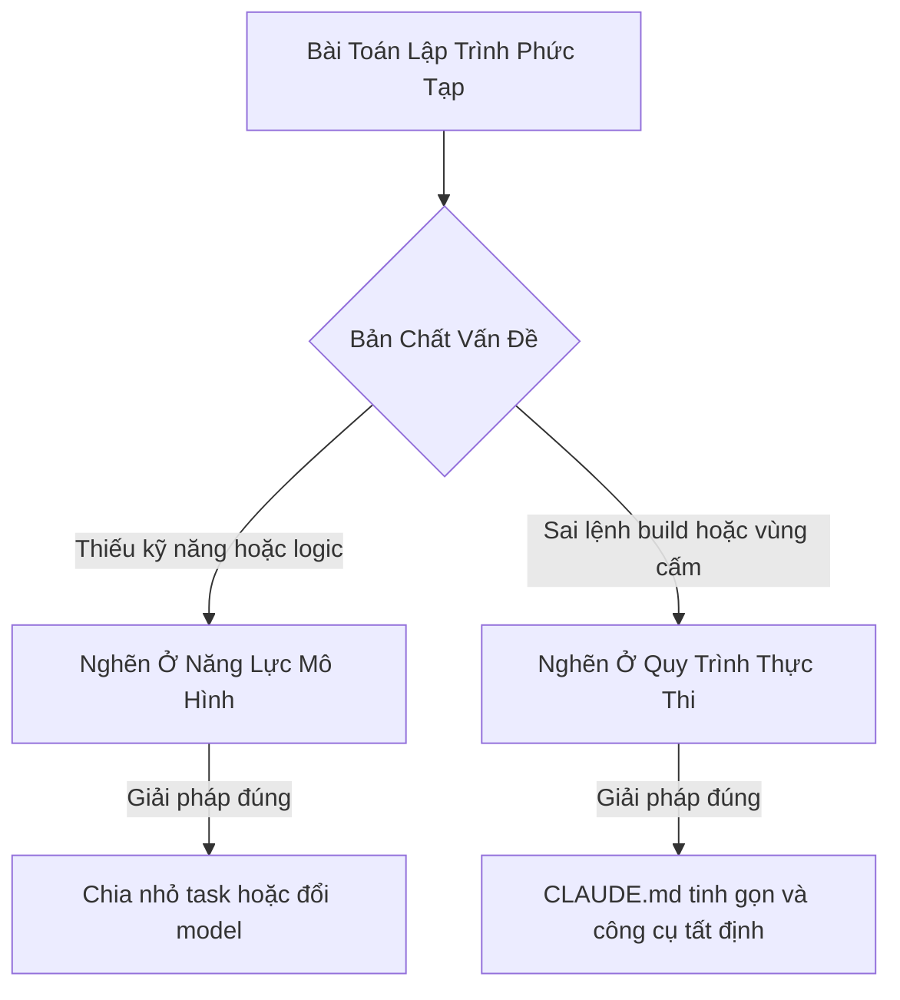
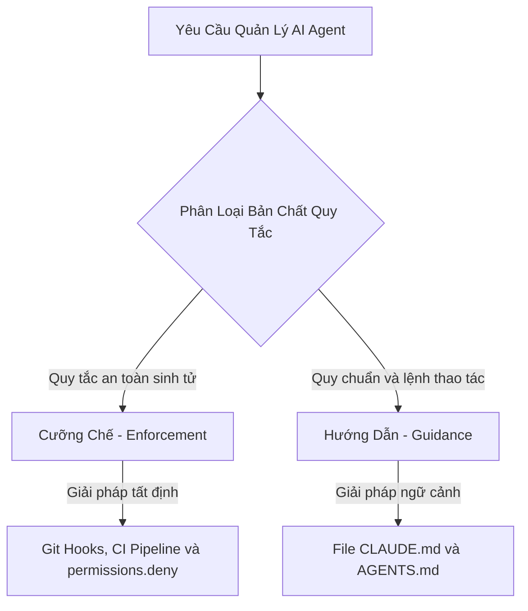


CLAUDE.md không phải bộ nhớ kiến thức, nó là bộ nhớ quy trình. Nó không làm agent thông minh hơn, nhưng nó điều khiển hành vi của agent — và hành vi mới là nơi chúng ta đang đốt tiền.



Bài viết này được tổng hợp và phát triển dựa trên góc nhìn thực chiến từ bài chia sẻ  của tác giả **Duy /zuey/** (Founder BuildInPublicVN, Creator AgentKit và ClaudeKit). Xin chân thành cảm ơn những đúc kết giá trị từ tác giả.


Hơn 60.000 kho lưu trữ mã nguồn mở trên GitHub đang chứa file `AGENTS.md` hoặc `CLAUDE.md` tại thư mục gốc. Phần lớn chúng ta đều bắt đầu với thói quen nhồi nhét hàng trăm dòng quy tắc, vẽ sơ đồ cây thư mục và mô tả kiến trúc dự án với niềm tin rằng AI Coding Agent sẽ thông minh hơn, hiểu sâu dự án hơn và ít phạm sai lầm hơn.

Thế nhưng, 4 nghiên cứu độc lập gần đây trên hàng nghìn lượt chạy thực tế trên các kho mã nguồn thật đã chỉ ra một kết luận bất ngờ: **Những file quy tắc dài dòng đó gần như không làm tăng tỷ lệ giải quyết tác vụ. Thậm chí có trường hợp còn làm giảm độ chính xác, trong khi luôn làm đội chi phí inference lên hơn 20%.**

Nếu file markdown không giúp mô hình code giỏi hơn, tại sao chúng ta vẫn cần chúng, và làm thế nào để viết đúng mà không lãng phí tài nguyên?

---

## 1. Bằng chứng từ 4 nghiên cứu thực nghiệm mới nhất

Thay vì phỏng đoán theo cảm tính, chúng ta hãy nhìn vào các số liệu đo lường cụ thể từ 4 công trình nghiên cứu độc lập:

### 1. Lulla và cộng sự (Tháng 1/2026)
Nghiên cứu trên 10 kho mã nguồn với 124 pull request để so sánh hiệu quả giữa việc có và không có file `AGENTS.md`. 

- **Kết quả:** Thời gian chạy trung vị giảm 28,64%, lượng token sinh ra ở đầu ra giảm 16,58%, trong khi tỷ lệ hoàn thành tác vụ tương đương nhau.
- **Kết luận:** File quy tắc không làm mô hình thông minh hơn nhưng giúp cải thiện tốc độ và hiệu suất vận hành.
- **Chi tiết:** 

### 2. Nhóm SRI Lab thuộc ETH Zurich (Tháng 2/2026)
Nhóm nghiên cứu xây dựng benchmark AGENTbench với 138 bài toán thực tế từ 12 kho mã nguồn Python kết hợp SWE-bench Lite, thử nghiệm trên 4 agent gồm Claude Code với Sonnet-4.5, Codex với GPT-5.2 và GPT-5.1 mini, cùng Qwen Code.

- **Kết quả:** File do lập trình viên viết tay chỉ giúp cải thiện tỷ lệ giải quyết tác vụ trung bình +4%. File do mô hình tự tạo qua câu lệnh khởi tạo như `/init` làm giảm 3% độ chính xác. Cả hai trường hợp đều làm tăng chi phí token từ 20% đến 23%, đồng thời lượng reasoning token tăng 22%.
- **Kết luận:** File cấu hình tự sinh chứa quá nhiều thông tin dư thừa, khiến mô hình phải suy nghĩ phức tạp hóa vấn đề không cần thiết.
- **Chi tiết:** 

### 3. Nghiên cứu của Khatri (Tháng 7/2026)
Thực hiện 288 lượt chạy kiểm thử nghiêm ngặt với 17 tác vụ trên 3 kho mã nguồn, đo lường các cách nạp ngữ cảnh khác nhau.

- **Kết quả:** Tỷ lệ vượt qua bài test giữa việc không nạp file quy tắc (53,3%), nạp toàn bộ vào system prompt mỗi lượt (55,6%), và để agent tự đọc tài liệu (55,6%) là tương đương nhau.
- **Phân tích lỗi:** Khi mổ xẻ các trường hợp agent chỉ trượt từ 1 đến 4 bài test cận kề mức đạt, tác giả phát hiện nguyên nhân thất bại luôn nằm ở:
  - Thiếu độ chính xác kỹ thuật khi viết thuật toán.
  - Chọn sai kiến trúc thực thi.
  - Nối sai luồng dữ liệu dù đã đọc đúng quy tắc trong mã nguồn.
- **Kết luận:** Không có tác vụ nào thất bại vì thiếu một dữ kiện văn bản mà file markdown có thể bù đắp. File quy tắc không biến một lần chạy suýt đỗ thành đỗ.
- **Chi tiết:** 

### 4. Khảo sát của Chatlatanagulchai và cộng sự (Tháng 11/2025)
Khảo sát 2.303 file ngữ cảnh từ 1.925 kho mã nguồn thực tế để tìm hiểu thói quen của lập trình viên.

- **Kết quả:** Có đến 69,9% lập trình viên viết chi tiết triển khai, 67,7% mô tả kiến trúc dự án, 62,3% viết lệnh cài đặt và chạy thử. Trong khi đó, các chỉ dẫn về bảo mật và tối ưu hiệu năng chỉ chiếm 14,5%.
- **Nghịch lý:** Thứ mà lập trình viên đầu tư viết nhiều nhất (mô tả kiến trúc và giải thích module) lại chính là phần mà dữ liệu thực nghiệm chứng minh là ít mang lại giá trị nhất cho AI Agent.
- **Chi tiết:** 

---

## 2. Vì sao Markdown không làm Agent code giỏi hơn?

Các con số trên cho chúng ta một bài học rõ ràng: **File quy tắc không thay thế được năng lực nội tại của mô hình.**

AI bản chất đã sở hữu khối lượng kiến thức rất lớn từ quá trình huấn luyện. Điểm nghẽn hiện tại của các Coding Agent nằm ở **kỹ năng tư duy logic và độ chính xác khi ra quyết định**, chứ không phải do thiếu thông tin định nghĩa.



Khi Agent viết sai kiến trúc hoặc tạo ra lỗi logic, việc bổ sung 300 dòng markdown mô tả kiến trúc không thể cứu vãn tình hình. Động thái đúng đắn là chia nhỏ bài toán thành các phần độc lập, định nghĩa đặc tả rõ ràng hơn, tái cấu trúc codebase cho thân thiện với Agent, hoặc chuyển sang mô hình có năng lực lý luận cao hơn.


Đừng cố đổ thêm văn bản markdown vào một bài toán không thuộc về phạm trù tài liệu.


---

## 3. Ba phát hiện then chốt định hình cách viết

Khi phân tích sâu các thí nghiệm, chúng ta rút ra được 3 quy tắc thực chiến để tối ưu hóa file quy tắc:

### Quy tắc 1: Mệnh lệnh thì được tuân thủ, văn xuôi mô tả thì vô dụng
Nhóm nghiên cứu tại ETH Zurich đã đo tần suất gọi công cụ của Agent khi công cụ đó có hoặc không xuất hiện trong file ngữ cảnh:
- Công cụ `uv`: Được gọi trung bình 1,6 lần mỗi bài toán khi được nhắc tới, so với dưới 0,01 lần khi không nhắc.
- Bộ công cụ nội bộ riêng của dự án: Được gọi 2,5 lần khi có hướng dẫn, so với dưới 0,05 lần khi không có.

Mức độ chênh lệch lên đến hơn 100 lần. Khả năng tuân thủ mệnh lệnh trực tiếp của các mô hình hiện đại rất chuẩn xác.

Tuy nhiên, đối với phần mô tả tổng quan dự án và cây thư mục, nhóm nghiên cứu đếm số bước mà Agent cần thực hiện trước khi chạm vào file đầu tiên cần sửa trong pull request. Kết quả cho thấy sự xuất hiện của phần tổng quan hoàn toàn không giúp giảm số bước tìm kiếm file. Thậm chí 100% file do Sonnet-4.5 tự tạo qua lệnh `/init` đều chứa phần tổng quan thừa thãi này.

> **Kết luận:** Hãy viết mệnh lệnh thao tác rõ ràng. Không viết văn tả cảnh hay vẽ lại cây thư mục.

### Quy tắc 2: File ngữ cảnh chỉ có giá trị khi là Nguồn sự thật duy nhất
Nhóm nghiên cứu ETH đã tiến hành một thử nghiệm đặc biệt: Xóa sạch toàn bộ tài liệu trong thư mục `docs/`, các file markdown hướng dẫn và code ví dụ có sẵn trong repo sau khi đã tạo file quy tắc, rồi cho Agent chạy lại.

Trong môi trường không còn tài liệu trùng lặp, hiệu quả của file quy tắc tăng thêm 2,7%. Điều này chỉ ra rằng Agent không cần chúng ta thuật lại những gì nó có thể tự đọc được từ mã nguồn. Nó chỉ cần những thông tin mà nó không thể tự suy luận.

> **Kết luận:** Trước khi viết bất kỳ dòng nào, hãy tự hỏi: Agent có thể dùng lệnh `grep`, `cat` hay đọc `package.json` để tìm ra không? Nếu tìm được, hãy loại bỏ khỏi file quy tắc.

### Quy tắc 3: Mỗi dòng đều tốn chi phí, phải ngăn chặn một hành vi tốn kém
Dữ liệu từ ETH Zurich cho thấy sự xuất hiện của file quy tắc khiến Agent tốn thêm từ 2,45 đến 3,92 bước tư duy cho mỗi bài toán, đẩy chi phí tăng hơn 20%. Khi nhìn thấy quá nhiều ràng buộc mơ hồ, mô hình kích hoạt cơ chế suy luận thích ứng Adaptive Reasoning, khiến nó thăm dò nhiều hơn và suy nghĩ phức tạp hơn mức cần thiết.

Tuy nhiên, trong nghiên cứu của Khatri, kho lưu trữ `opshin` có một dòng cảnh báo ngắn gọn: *"Chạy toàn bộ bộ test mất hơn 20 phút"*. Dòng cảnh báo duy nhất này giúp Claude giảm 24% thời gian chạy thực tế và giảm số lần chạy mù quáng cả bộ test từ 3,67 lần xuống còn 1,67 lần.

> **Kết luận:** Mỗi dòng quy tắc đưa vào phải trả lời được câu hỏi: *"Dòng này giúp ngăn chặn hành vi tốn kém cụ thể nào của Agent?"* Nếu không trả lời được, dòng đó đang là chi phí lãng phí.

---

## 4. Phân định ranh giới: Guidance và Enforcement

Sự nhầm lẫn nguy hiểm nhất khi thiết lập quy tắc cho AI Agent là nhầm lẫn giữa định hướng hành vi và kiểm soát cưỡng chế.



- **Hướng dẫn mềm Guidance:** File `CLAUDE.md` hoặc `AGENTS.md` chỉ đóng vai trò định hướng cách gọi lệnh, định dạng kiểm thử và chỉ định các thư mục cấm can thiệp.
- **Cưỡng chế cứng Enforcement:** Những yêu cầu mang tính an toàn sinh tử như *"Cấm push trực tiếp lên main"*, *"Cấm xóa bảng cơ sở dữ liệu"*, hoặc *"Bắt buộc vượt qua linter trước khi bàn giao"* tuyệt đối không thể dựa vào file markdown. AI là mô hình xác suất, nó hoàn toàn có thể bỏ qua câu chữ khi ngữ cảnh quá tải.


Markdown mang tính xác suất, công cụ kiểm soát mang tính tất định. Hãy chuyển toàn bộ quy tắc sinh tử xuống các công cụ tất định như Git pre-commit hooks, quy trình CI/CD và cơ chế phân quyền trực tiếp trong môi trường chạy.


---

## 5. Bộ lọc 4 câu hỏi khi viết quy tắc cho Agent

Trước khi thêm bất kỳ dòng chỉ dẫn nào vào `CLAUDE.md` hoặc `AGENTS.md`, chúng ta hãy cho dòng đó đi qua bộ lọc 4 bước:

1. **Agent có tự tìm ra được không?**  
   Nếu các lệnh `ls`, `grep`, hoặc việc đọc trực tiếp `package.json`, `go.mod`, `pyproject.toml` có thể làm rõ vấn đề, hãy xóa ngay khỏi file quy tắc.
2. **Nếu thiếu dòng này, Agent sẽ làm sai hoặc tốn tài nguyên ở điểm cụ thể nào?**  
   Nếu chỉ trả lời chung chung như "để Agent hiểu dự án hơn", hãy xóa. Chỉ giữ lại khi có hành vi sai sót cụ thể, chẳng hạn như Agent sẽ tự ý chạy `npm install` làm hỏng lockfile của `pnpm workspace`.
3. **Chỉ dẫn có thể kiểm chứng được một cách rõ ràng không?**  
   Thay vì viết *"Hãy viết code cẩn thận và format đẹp"*, hãy đổi thành *"Dùng thụt lề 2 spaces"* hoặc *"Chạy pnpm lint trước khi hoàn thành"*.
4. **Quy tắc có gây mâu thuẫn không?**  
   Đặc biệt trong các dự án monorepo, quy tắc ở thư mục cha và thư mục con không được đá nhau, tránh làm mô hình bối rối và lựa chọn ngẫu nhiên.


Chỉ thêm quy tắc mới theo nguyên tắc **Add-on-failure**: Bổ sung khi có lỗi phát sinh trong thực tế, cụ thể là khi Agent phạm cùng một lỗi lần thứ hai, hoặc khi chúng ta phải lặp lại cùng một câu nhắc sửa lỗi qua nhiều phiên làm việc. Tuyệt đối không ngồi viết sẵn hàng trăm dòng quy tắc lý thuyết trước khi bắt tay vào chạy code.


---

## 6. Cấu hình CLAUDE.md chuẩn thực chiến

Tài liệu chính thức của Anthropic khuyến nghị mỗi file quy tắc nên duy trì độ dài **dưới 200 dòng** để tránh hiện tượng Lost in the middle làm suy giảm khả năng chú ý ở phần giữa ngữ cảnh.

Dưới đây là cấu trúc mẫu tinh gọn khoảng 50 dòng, tập trung hoàn toàn vào quy trình và lệnh thực thi:

```markdown
# Commands
- Install: `pnpm install --frozen-lockfile`
- Dev: `pnpm dev` (cần Docker chạy trước: `make db-up`)
- Test all: `pnpm test` (chạy mất 8 phút, hạn chế chạy toàn bộ)
- Test một file: `pnpm vitest run path/to/file.test.ts`
- Test một ca kiểm thử: `pnpm vitest run -t "<tên test>"`
- Lint và kiểm tra kiểu: `pnpm check` (bắt buộc chạy trước khi báo hoàn thành)
- Migration: `pnpm db:migrate` (không sửa các file đã commit trong `migrations/`)

# Tooling
- Dùng pnpm, không dùng npm hay yarn. Dự án là pnpm workspace.
- Yêu cầu Node 22. Chạy `nvm use` trước khi thực thi.

# Vùng Cấm Can Thiệp
- `src/generated/**` là mã nguồn sinh tự động, chỉnh sửa file `*.proto` rồi chạy `pnpm gen`.
- `infra/prod/**` thuộc quyền quản lý của đội ngũ hạ tầng, không tự ý sửa.
- Không chạy lệnh `git push` hoặc tạo PR tự động.

# Quy Ước Triển Khai
- Chuẩn commit: Conventional Commits với scope là tên package.
- Phản hồi lỗi API: Trả về cấu trúc chuẩn theo `src/lib/errors.ts`, không throw trực tiếp raw Error.
- Truy vấn cơ sở dữ liệu: Luôn đi qua repository layer trong `src/db/repos/`.

# Definition of Done
1. Lệnh `pnpm check` vượt qua không có cảnh báo.
2. Các bài test liên quan trực tiếp đều pass.
3. Không tự ý thêm dependency mới khi chưa có xác nhận.
```

### Tối ưu chi phí bằng Path-Scoped Rules
Nếu dự án thực tế có nhiều quy tắc chuyên biệt cho từng ngôn ngữ hoặc thư mục, thay vì dồn tất cả vào một file lớn, chúng ta có thể tách thành các quy tắc gắn theo đường dẫn thông qua frontmatter:

```markdown
---
paths:
  - "src/**/*.{ts,tsx}"
  - "tests/**/*.test.ts"
---

# Quy Tắc Cho TypeScript
- Không dùng kiểu `any`, ưu tiên dùng `unknown` kết hợp type narrowing.
- Mọi component giao diện mới tạo bắt buộc phải có file test đi kèm.
```

Quy tắc này chỉ được tải vào bộ nhớ ngữ cảnh khi Agent thực sự mở hoặc chỉnh sửa các file khớp với đường dẫn đã khai báo, giúp tiết kiệm tối đa chi phí token.

### Đồng bộ giữa AGENTS.md và CLAUDE.md
Hiện nay `AGENTS.md` đã trở thành chuẩn chung mở được nhiều công cụ hỗ trợ. Để tránh bảo trì hai file song song, chúng ta có thể liên kết chúng:

- **Sử dụng cú pháp import:**
  ```markdown
  # CLAUDE.md
  @AGENTS.md
  
  ## Chỉ dẫn riêng cho Claude Code
  Ưu tiên sử dụng plan mode khi thay đổi mã nguồn trong `src/billing/`.
  ```
- **Sử dụng symlink:**
  ```bash
  ln -s AGENTS.md CLAUDE.md
  ```

---

## 7. Tổng kết và Checklist thực hiện ngay

File quy tắc cấu hình cho AI Agent nên được xem như một file mã nguồn: Nó có nợ kỹ thuật, có thể bị lỗi thời theo thời gian và cần được định kỳ dọn dẹp, tối ưu hóa.


1. **Xóa toàn bộ phần tổng quan và mô tả cây thư mục:** Dữ liệu chứng minh phần này hoàn toàn không giúp Agent định vị file nhanh hơn.
2. **Đổi câu văn mô tả chung chung thành lệnh kiểm tra cụ thể:** Chuyển *"viết code cẩn thận"* thành lệnh chạy linter và typecheck rõ ràng.
3. **Bổ sung các cảnh báo chi phí:** Chỉ định rõ các lệnh tốn nhiều thời gian và các thư mục cấm can thiệp.
4. **Chuyển các quy tắc an toàn sang công cụ tất định:** Sử dụng Git hooks, CI/CD và cấu hình phân quyền thay vì dựa vào file markdown.


Hãy nhớ rằng: **File quy tắc không dạy cho Agent kỹ năng mới, nó chỉ trang bị quy trình thực thi chuẩn xác.** Viết đúng phần quy trình và lược bỏ phần văn phong rườm rà là cách hiệu quả nhất để làm chủ các AI Coding Agent trong kỷ nguyên lập trình hiện đại.
