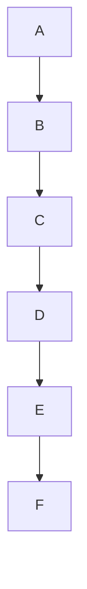
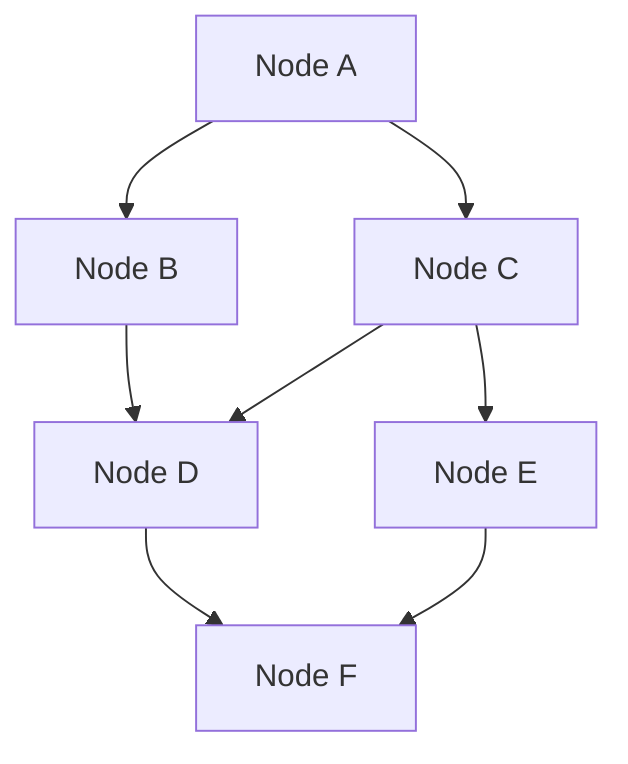

# Part 02 — Best Practice: Hugo + Mermaid (Nguồn chính thức 2025)

## Nguồn

- Hugo Docs — Diagrams: https://gohugo.io/content-management/diagrams/
- Mermaid.js Docs — Theme Config: https://mermaid.js.org/config/theming.html
- Mermaid Live Editor: https://mermaid.live

---

## 1. Render Hook — Goldmark (Chuẩn Hugo chính thức)

### Pattern chuẩn (Hugo docs)

```html
{{/* layouts/_default/_markup/render-codeblock-mermaid.html */}}
{{ .Page.Store.Set "hasMermaid" true }}
<pre class="mermaid">
  {{- .Inner | safeHTML }}
</pre>
```

Sau đó trong baseof.html:
```html
{{ if .Store.Get "hasMermaid" }}
  <script type="module">
    import mermaid from 'https://cdn.jsdelivr.net/npm/mermaid/dist/mermaid.esm.min.mjs';
    mermaid.initialize({ startOnLoad: true });
  </script>
{{ end }}
```

### Dự án này — Pattern hiện tại

Dự án dùng variant nâng cao hơn: `data-content` attribute + `div.mermaid` (không dùng `<pre>`), với `patchMermaid()` monkey-patch trước khi script load. Pattern này **hợp lệ** và nâng cao hơn chuẩn tối thiểu của Hugo docs.

**Không cần thay đổi kiến trúc render hook.**

---

## 2. Theme Configuration — Mermaid v11

### `theme: 'base'` + `themeVariables`

Đây là cách duy nhất để customize màu sắc đầy đủ. Các theme cố định (`dark`, `default`, `neutral`, `forest`) không cho phép ghi đè màu qua `themeVariables`.

```javascript
mermaid.initialize({
  theme: 'base',  // REQUIRED để themeVariables có tác dụng
  themeVariables: {
    primaryColor: '#f5f7ff',
    primaryBorderColor: '#6366f1',
    primaryTextColor: '#1e1b4b',
    lineColor: '#6366f1',
    edgeLabelBackground: '#ffffff',
    fontFamily: 'system-ui, sans-serif',
    fontSize: '15.5px'
  }
})
```

**Dự án đang dùng đúng cách này.** ✅

### Dark Mode — 2 phương pháp

| Phương pháp | Ưu điểm | Nhược điểm |
|-------------|---------|------------|
| Re-initialize với `theme: 'dark'` | Màu tự nhiên | Re-render SVG, lag ~200ms |
| CSS GPU Filter (`invert + hue-rotate`) | 0ms, instant | Màu không hoàn toàn tự nhiên |

Dự án dùng CSS GPU Filter — đây là trade-off hợp lý vì ưu tiên performance.

---

## 3. Node Label Syntax — Quy tắc cứng Mermaid v11

### Quy tắc 1: Ký tự đặc biệt phải bọc `["..."]`

```mermaid
flowchart TD
    A["Bước 1 (Khởi tạo)"]   %% ĐÚNG: dấu () bên trong "..."
    B["Node với dấu / slash"] %% ĐÚNG
    C[Bình thường]            %% OK nếu không có ký tự đặc biệt
```

### Quy tắc 2: TUYỆT ĐỐI không dùng `&`

`&` trong Mermaid label có thể được parser interpret là HTML entity. Thay bằng "và" hoặc "and".

```mermaid
%% SAI:
A["Request & Response"]
%% ĐÚNG:
A["Request và Response"]
```

### Quy tắc 3: TUYỆT ĐỐI không dùng dòng trống trong block

```
```mermaid
flowchart TD
    A --> B
             ← KHÔNG để dòng trống ở đây
    B --> C
```
```

Mermaid v11 với `markdownAutoWrap: true` parse dòng trống như break token, có thể gây `Parse error: Newline expected` ngẫu nhiên tùy context.

### Quy tắc 4: NodeID không dùng reserved keywords

Tránh: `end`, `subgraph`, `graph`, `flowchart`, `TD`, `LR`. Dùng: `EndNode`, `SubGroup`, `FlowEnd`.

### Quy tắc 5: Số đầu dòng trong `["1. Bước..."]` gây lỗi Mermaid v11+

Mermaid v11 kích hoạt Markdown rendering trong label. `1.` đầu dòng được parse như ordered list item → `Unsupported markdown: list`.

```mermaid
%% SAI (Mermaid v11):
A["1. Bước một"]
%% ĐÚNG:
A["Bước 1:<br/>Nội dung"]
```

### Quy tắc 6: Arrow label không dùng `|"..."|`

```mermaid
%% SAI:
A -->|"Nhãn mũi tên"| B
%% ĐÚNG:
A -->|Nhãn mũi tên| B
```

---

## 4. Layout — Quy tắc 3 cột (Không subgraph)

### Vấn đề single-chain



Mermaid ép thành 1 cột 6 tầng → rất cao, chữ to, không đẹp.

### Giải pháp: Lưới 3 cột x 2 hàng



Kết quả: Mermaid render thành bảng lưới 3 cột × 2 hàng.

### Tại sao không dùng `subgraph`

`subgraph` tạo border box bao quanh → làm lệch layout toàn bộ, chiều cao bất định, không responsive.

---

## 5. Diamond Node `{}` — Giới hạn ký tự

Node hình thoi được Mermaid render với góc nhọn 45°. Nội dung > 20 ký tự sẽ:
- Bị cắt bởi đường viền góc nhọn
- Chữ tràn ra ngoài hình thoi
- Không responsive trên mobile

```mermaid
%% SAI (quá dài):
CheckTest{"Có --add-tests không? Bật TDD"}
%% ĐÚNG (ngắn gọn):
CheckTest{"Có --add-tests?"}
```

---

## 6. `<br/>` trong node label — Khi nào dùng

Dùng `<br/>` để xuống dòng trong label khi:
- Node có tiền tố tiến trình: `Bước 1:`, `Pha 2:`, `Lớp 3:`
- Nội dung label > 25 ký tự
- Muốn kiểm soát cách ngắt dòng tránh bị kéo rộng

```mermaid
A["Bước 1:<br/>Quét tri thức"]
```

**Chú ý**: `htmlLabels: false` trong config hiện tại → Mermaid v11 vẫn xử lý `<br/>` như HTML break trong SVG text. Nếu set `htmlLabels: true` thì cần escape đặc biệt hơn.

---

## Kết luận

| Rule | Nguồn | Mức độ |
|------|-------|--------|
| Không dòng trống trong block | Mermaid v11 docs | CAO |
| Không `&` trong label | AGENTS.md + Mermaid | CAO |
| `["..."]` cho ký tự đặc biệt | Mermaid docs | CAO |
| Diamond node < 20 ký tự | Mermaid rendering | TRUNG BÌNH |
| Không `1.` đầu label | Mermaid v11 changelog | CAO |
| Không `|"..."|` trong arrow | Mermaid docs | CAO |
| Không `subgraph` | AGENTS.md | TRUNG BÌNH |
| Lưới ≥3 cột khi ≥4 nodes chain | AGENTS.md | THẤP |
