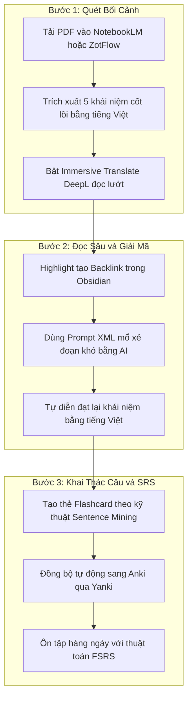

# Cách Đọc Tài Liệu Tiếng Anh IT và AI Không Bị Đứt Đoạn Tư Duy Bằng AI và SRS

Đang phân tích dở một kiến trúc hệ thống phân tán hay thuật toán học máy phức tạp bằng tiếng Anh, chúng ta lại phải khựng lại 15 giây để tra một thuật ngữ lạ hoặc dịch một cấu trúc câu lắt léo. Sự gián đoạn liên tục này khiến luồng suy luận logic bị băm nhỏ, đọc xong một chương sách mà bộ não hoàn toàn cạn kiệt năng lượng mà vẫn không đọng lại được mô hình tư duy nào.

Đây chính là hiện tượng Cognitive Disruption — đứt đoạn tư duy khi tiếp thu kiến thức kỹ thuật bằng ngoại ngữ. Để làm chủ nguồn tài liệu chuyên ngành chuẩn mực mà không rơi vào bẫy "Vibe reading" (chỉ đọc tóm tắt AI một cách thụ động), chúng ta cần xây dựng một hệ sinh thái kết hợp giữa đọc song ngữ, kỹ nghệ câu lệnh AI và hệ thống lặp lại ngắt quãng FSRS.

## Tại Sao Đọc Tài Liệu Tiếng Anh Lại Gây Kiệt Sức Nhận Thức?

Theo Thuyết Tải lượng Nhận thức (Cognitive Load Theory), bộ nhớ làm việc của con người có dung lượng hữu hạn và phải gánh ba loại tải lượng cùng lúc:

- **Tải lượng nội tại:** Độ khó bản thể của kiến thức kỹ thuật (như thuật toán lan truyền ngược hay cơ chế đồng thuận Raft).
- **Tải lượng ngoại lai:** Cản trở phát sinh từ cách trình bày hoặc rào cản ngôn ngữ thứ hai.
- **Tải lượng hữu ích:** Nỗ lực nhận thức dùng để mã hóa kiến thức mới vào trí nhớ dài hạn.


Khi trình độ ngoại ngữ chưa đủ trôi chảy, tải lượng ngoại lai sẽ chiếm trọn bộ nhớ làm việc. Não bộ cạn kiệt tài nguyên trước khi kịp xử lý logic kỹ thuật hay ghi nhớ bản chất vấn đề.


### Nguy Cơ Từ "Vibe Reading" Và Sự Lười Biếng Siêu Nhận Thức

Để né tránh sự mệt mỏi này, nhiều người chọn cách quăng toàn bộ file PDF vào AI và chỉ đọc bản tóm tắt tiếng Việt. Thói quen này tạo ra hiện tượng Vibe reading — tương tự như Vibe coding trong lập trình. 

Khi chỉ đọc văn bản đã được AI đơn giản hóa, chúng ta loại bỏ hoàn toàn cơ hội rèn luyện tư duy phản biện và tiếp xúc với từ vựng gốc. Việc phụ thuộc hoàn toàn vào tóm tắt làm nảy sinh sự lười biếng siêu nhận thức, khiến chúng ta ngộ nhận rằng mình đã hiểu sâu nhưng thực chất không thể tự tay triển khai hay giải quyết các điểm nghẽn kỹ thuật thực tế.

### Giải Pháp: Đọc Song Ngữ Theo Mô Hình Giàn Giáo Nhận Thức

Thay vì loại bỏ văn bản tiếng Anh, giải pháp tối ưu là áp dụng mô hình Đọc song ngữ (Bilingual Parallel Reading) để tạo giàn giáo nhận thức. Văn bản tiếng Việt dịch tại chỗ (in-situ translation) được hiển thị song song ngay bên dưới văn bản gốc.

Cách làm này triệt tiêu tải lượng ngoại lai ngay lập tức, giải phóng bộ nhớ làm việc để chúng ta duy trì luồng tư duy logic. Đồng thời, việc đọc đối chiếu liên tục giúp não bộ tự động hấp thụ thuật ngữ tiếng Anh chuyên ngành trong đúng ngữ cảnh mà không làm đứt đoạn nhịp đọc.

## Hệ Sinh Thái Công Cụ Xử Lý Bố Cục PDF và EPUB Phức Tạp

Tài liệu IT và AI thường chứa đa cột, khối mã nguồn, công thức toán học và bảng biểu. Nếu dùng các trình đọc PDF thông thường để bôi đen dịch, cấu trúc dữ liệu thị giác sẽ bị vỡ, tạo ra các bản dịch lộn xộn.

### Giải Mã Bài Toán Nhận Thức Bố Cục

Các công cụ hiện đại sử dụng thuật toán phân tích hình học để bảo toàn luồng đọc:

- **Immersive Translate:** Tích hợp trực tiếp vào trình duyệt, tiêm bản dịch ngay bên dưới từng dòng tiếng Anh. Công cụ này giữ nguyên định dạng toán học và bảng biểu, đồng thời dùng module BabelDOC OCR để xử lý cả file PDF dạng scan. Phù hợp nhất cho nhu cầu đọc lướt sách EPUB và PDF tiêu chuẩn.
- **ReadSavor:** Kết hợp thuật toán nhận diện ranh giới cột và mô hình ngôn ngữ để ngăn chặn hiện tượng nhảy cột khi chọn văn bản. Đây là công cụ chuyên dụng cho các bài báo khoa học IEEE hay ACM chứa bố cục hai cột đan xen code block.
- **Okuzeka:** Trình đọc AI tập trung vào trải nghiệm chạm để dịch. Khi chọn một thuật ngữ, hệ thống phân tích toàn bộ câu chứa từ đó để đưa ra giải thích chính xác theo ngữ cảnh kỹ thuật chứ không đưa ra nghĩa từ điển chung chung.

### Lựa Chọn Động Cơ Dịch: DeepL hay Mô Hình Ngôn Ngữ Lớn?


- **Dịch máy thần kinh NMT (như DeepL):** Trung thành tuyệt đối với cấu trúc câu gốc, hầu như không bị ảo giác. Đây là lựa chọn an toàn cho các tài liệu chứa thông số hệ thống và định nghĩa chính xác.
- **Mô hình ngôn ngữ lớn LLMs (như ChatGPT GPT-4o, Claude 3.5 Sonnet):** Hiểu ngữ cảnh rộng, diễn đạt mượt mà và giải thích code rất tốt, nhưng có nguy cơ tự ý diễn đạt lại làm mất tính chính xác kỹ thuật nếu thiếu prompt kiểm soát.


Cấu hình khuyến nghị cho chúng ta là dùng Immersive Translate chạy engine DeepL để đọc song ngữ toàn trang, kết hợp gọi API của Claude hoặc ChatGPT ở thanh bên khi cần mổ xẻ những đoạn lý thuyết hóc húa.

### Đồng Bộ Tài Liệu Trực Tiếp Vào Obsidian

Để ghi chú không bị phân tán, luồng đọc PDF cần kết nối trực tiếp với hệ thống quản lý tri thức Obsidian. Hiện nay, bộ đôi Zotero 7 và Obsidian cung cấp ba giải pháp tích hợp:

1. **Plugin ZotFlow:** Kết nối hai chiều giữa Zotero 7 và Obsidian. Chúng ta có thể đọc PDF, tạo highlight và viết ghi chú ngay trong Obsidian mà không cần chuyển đổi qua lại giữa hai ứng dụng.
2. **Zotero Integration:** Phương pháp truyền thống giúp kéo toàn bộ metadata và highlight từ Zotero 7 vào Obsidian thông qua template Markdown.
3. **Plugin PDF++:** Nhúng trực tiếp file PDF vào Obsidian và tạo liên kết hai chiều thẳng tới từng dòng trong PDF. Khi nhấp vào liên kết, file PDF tự động cuộn đến đúng vị trí đã đánh dấu.

## Kỹ Nghệ Câu Lệnh AI Phân Tích Ngữ Cảnh Kỹ Thuật

Khi gặp một đoạn văn bản quá khó, chúng ta không dùng AI để dịch thô mà biến AI thành một Senior Engineer đang hướng dẫn trực tiếp. Các mẫu lệnh dưới đây áp dụng Kỹ thuật Feynman và cơ chế neo giữ ngữ cảnh để bóc tách thông tin.

### 1. Mẫu Lệnh Phân Tích Khái Niệm Hệ Thống

Dùng khi cần giải mã các khái niệm kiến trúc phần mềm hoặc hệ thống phân tán.


<context>
Bạn là một Kiến trúc sư Hệ thống kiêm Chuyên gia Sư phạm Khoa học Máy tính. Nhiệm vụ của bạn là giải thích đoạn văn bản tiếng Anh chuyên ngành IT và AI sau đây sang tiếng Việt một cách trực quan, tuân thủ nguyên tắc Kỹ thuật Feynman. 
</context>

<instructions>
1. Dịch thuật gắn bối cảnh: Cung cấp bản dịch tiếng Việt của đoạn văn bản. Các thuật ngữ kỹ thuật lõi bắt buộc phải được giữ lại bằng tiếng Anh trong ngoặc đơn ở lần xuất hiện đầu tiên (Ví dụ: Sự tắc nghẽn (Bottleneck)).
2. Trích xuất Cốt lõi: Tóm gọn nguyên lý hoạt động của khái niệm này trong tối đa 2 câu định nghĩa nguyên tử.
3. Giải thích Ẩn dụ: Xây dựng một ví dụ thực tế trong đời sống (không sử dụng thuật ngữ máy tính) để minh họa cơ chế hoạt động, giúp giảm tải lượng nhận thức cho người đọc.
4. Neo giữ sự thật: Chỉ giải thích dựa trên phạm vi của văn bản gốc. Tuyệt đối không sáng tạo thêm các tính năng hoặc cơ chế không được tác giả đề cập trong văn bản để tránh ảo giác AI.
</instructions>

<input_text>
[Dán đoạn văn bản tiếng Anh từ PDF hoặc EPUB vào đây]
</input_text>


### 2. Mẫu Lệnh Giải Mã Khối Mã Nguồn và AST

Sử dụng khi văn bản tiếng Anh mô tả đan xen với khối code, giúp chúng ta ánh xạ lý thuyết vào luồng thực thi.


<context>
Bạn là một Kỹ sư Phần mềm đóng vai trò người hướng dẫn lập trình. Tôi đang gặp khó khăn trong việc kết nối giữa văn bản lý thuyết tiếng Anh và đoạn mã nguồn thực thi.
</context>

<instructions>
1. Ánh xạ Cú pháp: Đối chiếu các biến, hàm, cấu trúc dữ liệu hoặc lớp trong đoạn code với các định nghĩa lý thuyết được nhắc đến trong văn bản tiếng Anh xung quanh.
2. Dịch ngược Luồng thực thi: Trình bày từng bước logic của đoạn code bằng tiếng Việt.
3. Điểm mù Thiết kế: Chỉ ra 1 đến 2 rủi ro có thể khiến đoạn mã này thất bại nếu triển khai trong môi trường thực tế, dựa trên ngữ cảnh mà tác giả nhắc tới.
4. Cấm thao tác: Đừng tối ưu hóa hoặc viết lại đoạn code trừ khi có yêu cầu. Tập trung vào việc giải thích triết lý thiết kế đằng sau đoạn mã.
</instructions>

<code_snippet>
[Dán đoạn mã nguồn vào đây]
</code_snippet>

<surrounding_text>
[Dán đoạn tiếng Anh mô tả phía trên và dưới đoạn code vào đây]
</surrounding_text>


### 3. Mẫu Lệnh Bóc Tách Công Thức Toán Học

Chuyên dùng cho các bài báo nghiên cứu AI chứa nhiều phương trình toán học.


<context>
Bạn là một Nhà Khoa học Dữ liệu chuyên về Toán Ứng dụng trong Trí tuệ Nhân tạo. Tôi cần bóc tách một phương trình toán học phức tạp thành các khối kiến thức dễ tiêu hóa.
</context>

<instructions>
1. Biểu diễn Công thức: Trình bày lại công thức bằng định dạng LaTeX tiêu chuẩn.
2. Bóc tách Biến số: Lập bảng phân tách từng ký hiệu, biến số, trọng số và hằng số trong công thức kèm định nghĩa tiếng Việt trực quan.
3. Phân tích Động lực học: Phân tích tương quan nếu biến số cốt lõi tiến tới vô cùng hoặc giảm về 0 thì toàn bộ mô hình Học máy sẽ phản ứng thế nào.
</instructions>

<equation_context>
[Dán đoạn mô tả công thức toán học vào đây]
</equation_context>


## Ghi Nhớ Dài Hạn Bằng Kỹ Thuật Sentence Mining và Thuật Toán FSRS

Sau khi giải mã đoạn văn bản hóc húa bằng AI, kiến thức mới chỉ dừng lại ở bộ nhớ ngắn hạn. Để biến thuật ngữ và mẫu câu tiếng Anh kỹ thuật thành phản xạ tự nhiên, chúng ta áp dụng phương pháp Sentence Mining — đưa cả câu chứa ngữ cảnh vào hệ thống thẻ ghi nhớ (flashcard) thay vì học từ đơn lẻ.

### Ưu Thế Của Thuật Toán FSRS So Với SM-2

Các thuật toán lặp lại ngắt quãng cũ như SM-2 trong Anki thường khiến người học bị quá tải thẻ ôn tập hàng ngày. Hệ thống hiện đại đã chuyển sang thuật toán FSRS (Free Spaced Repetition Scheduler).

FSRS sử dụng mô hình toán học để đánh giá trí nhớ qua ba thông số:
- **Stability:** Độ ổn định của trí nhớ theo thời gian.
- **Difficulty:** Độ khó tự thân của thẻ đối với não bộ.
- **Retrievability:** Xác suất gợi nhớ lại thông tin tại thời điểm hiện tại.

Khi học thuật ngữ IT và AI, chúng ta nên đặt tỷ lệ duy trì mục tiêu (Desired Retention) của FSRS ở mức 85% đến 90%. Đây là điểm cân bằng tối ưu giúp ghi nhớ kiến thức bền vững mà không đẩy số lượng thẻ ôn tập mỗi ngày lên quá cao.

### Tự Động Hóa Đồng Bộ Từ Obsidian Sang Anki

Thay vì tạo thẻ thủ công, chúng ta dùng Obsidian làm nơi quản lý ghi chú duy nhất và đẩy thẻ tự động sang Anki thông qua các plugin:

- **Yanki:** Tự động chuyển các đoạn ghi chú chuẩn Markdown trong Obsidian thành các bộ thẻ Anki, hỗ trợ hoàn hảo khối mã nguồn và công thức MathJax.
- **Awesome Flashcard:** Quét các thẻ băm chỉ định trong Obsidian và đồng bộ một chiều sang Anki qua AnkiConnect với tốc độ cao.
- **AI-AnkiSync:** Tự động gọi AI để tinh chỉnh câu chữ, rút gọn ngữ pháp và gán nhãn cho thẻ trước khi đẩy sang Anki.

## Quy Trình SOP 3 Bước Thực Hành Cho Một Chương Sách IT và AI

Để hợp nhất công cụ và phương pháp luận vào thực tế, chúng ta tuân thủ quy trình 3 bước chuẩn hóa dưới đây mỗi khi bắt đầu một chương sách mới.

### Bước 1: Quét Bối Cảnh Để Định Hình Khung Tư Duy

Tải file PDF vào các công cụ như NotebookLM hay ZotFlow và yêu cầu AI trích xuất 5 khái niệm cốt lõi nhất của chương sách bằng tiếng Việt. Đọc qua bản tóm tắt này để bộ não hình thành lược đồ tri thức ban đầu. 

Sau đó, bật Immersive Translate với engine DeepL và tiến hành đọc lướt toàn bộ chương sách. Bản dịch tiếng Việt chạy song song bên dưới sẽ xóa bỏ hoàn toàn tải lượng ngoại lai, giúp chúng ta nắm trọn cấu trúc chương sách với tốc độ cao.

### Bước 2: Đọc Sâu và Mổ Xẻ Điểm Nghẽn Kỹ Thuật

Khi chạm đến những đoạn lý thuyết hóc húa, công thức toán học hoặc khối mã nguồn phức tạp, dùng công cụ highlight của ZotFlow hay PDF++ để tạo liên kết về file ghi chú trong Obsidian.

Sao chép đoạn văn bản tiếng Anh gốc vào ChatGPT hoặc Claude, áp dụng các mẫu lệnh XML tương ứng ở trên để AI giải thích bản chất. Sau khi đọc xong lời giải thích từ AI, tuyệt đối không copy-paste nguyên văn. Chúng ta phải tự tóm tắt lại nguyên lý bằng ngôn ngữ của chính mình vào Obsidian. Bước tự diễn đạt này là bắt buộc để kích hoạt tải lượng hữu ích và khắc ghi bản chất vấn đề.

### Bước 3: Khai Thác Câu và Đồng Bộ Hệ Thống SRS

Chuyển các ghi chú thuật ngữ trong Obsidian thành dạng thẻ Sentence Mining: mặt trước chứa câu tiếng Anh nguyên bản trích ra từ tài liệu, mặt sau chứa phần giải thích tiếng Việt tinh gọn cùng liên kết trỏ ngược về trang PDF gốc.

Chạy plugin đồng bộ để đẩy toàn bộ thẻ sang Anki. Mỗi ngày, dành từ 15 đến 20 phút ôn tập theo đúng lịch trình của thuật toán FSRS. 

Nhờ chuỗi quy trình khép kín này, rào cản ngoại ngữ được gỡ bỏ bằng công cụ đọc song ngữ, tư duy kỹ thuật được khai thông bằng prompt AI chuyên biệt, và toàn bộ tri thức được lưu trữ vĩnh viễn vào trí nhớ dài hạn.

