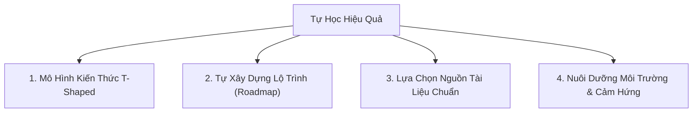

# Không Có Con Đường Tắt Trong Tự Học

> *"Đừng tốn thời gian tìm con đường tắt để rồi nhận ra với thời gian đó, bạn đã đi hết con đường vòng."*


Bài viết này được tổng hợp và phát triển dựa trên góc nhìn và các chia sẻ trên **Math2IT** của **Đinh Anh Thi**.


Trong cuốn sách *Sapiens*, nhà sử học Yuval Noah Harari có nhắc đến một bản năng tự nhiên của con người: **chúng ta luôn xu hướng chọn làm những gì mang lại cảm giác dễ chịu.** 

Khi ứng dụng vào chuyện học hành hay phát triển bản thân, bản năng này hiện diện rất rõ. Chúng ta dễ dàng thỏa hiệp với những thứ "dễ xơi", dễ tiếp cận. Chúng ta luôn khát khao tìm kiếm một bài viết tóm tắt vài trang, một video vài phút có thể dạy nhanh lẹ và dứt điểm về Thống kê, Giải tích, hay Lập trình hướng đối tượng...

---

## 1. Cạm Bẫy Từ Những Lời Hứa "Siêu Tốc"

Trên mạng hiện nay ngập tràn những tiêu đề hấp dẫn: *"Học Thống kê từ A-Z trong một bài"*, *"Làm chủ Python chỉ trong 4 giờ"*, hay *"Thành thạo lập trình sau một ngày"*. 

Liệu những người viết ra các dòng tiêu đề đó quá xem thường khả năng tỉnh táo của người đọc, hay chính chúng ta đang quá dễ dãi với việc học của bản thân?


Muốn hiểu một khái niệm trừu tượng và phức tạp bậc nhất nhưng lại lười đọc, chỉ muốn được giải thích vỏn vẹn trong vài dòng — **bạn đã muốn nó "ngon" mà bạn còn muốn nó "rẻ" nữa sao?**


Thực tế là: việc học một khái niệm kỹ thuật hay công nghệ mới đòi hỏi bộ não phải có thời gian để tiêu hóa, nghiền ngẫm và liên kết dữ liệu. Không có bất kỳ video 4 tiếng nào có thể thay thế hàng trăm giờ tự tay gõ code và gỡ lỗi.

---

## 2. "Quãng Thời Gian Chờ" Và Sự Bứt Phá

Khi tự học, bất kỳ ai cũng sẽ phải trải qua một giai đoạn gọi là **Quãng thời gian chờ (Plateau of latent potential)**.

Đây là khoảng thời gian:
- Học rất mệt, rất chán và kéo dài.
- Cảm giác bản thân giậm chân tại chỗ, không có tiến bộ gì rõ rệt.
-Dễ nảy sinh tâm lý bỏ cuộc vì thiếu đi sự "ép buộc" từ trường lớp hay bài kiểm tra.

Nhưng chính trong khoảng thời gian "không thấy kết quả" này, bộ não đang tích lũy và xây dựng các liên kết thần kinh nền tảng. Để rồi một ngày đẹp trời, bạn đột nhiên nhận ra mình đã tiến bộ vượt bậc — từ việc đọc hiểu tài liệu tiếng Anh dễ dàng đến việc tự tay kiến tạo một hệ thống phức tạp.

---

## 3. Ba Rào Cản Cần Vượt Qua Khi Tự Học

### 1. Rào cản ngôn ngữ (Tiếng Anh)
Nhiều bạn muốn học rất nhiều thứ nhưng lại ngại đọc tiếng Anh, lúc nào cũng đổ lỗi bản thân "chưa đủ tốt" để rồi bó hẹp tri thức trong nguồn tài liệu dịch lại. Trong ngành kỹ thuật, phần lớn tri thức cốt lõi đều được viết bằng tiếng Anh. Chấp nhận đọc chậm, tra từ điển và đối mặt trực tiếp với tài liệu gốc là con đường duy nhất để hiểu đúng bản chất.

### 2. Sự hời hợt trong cách truyền đạt
Sự khác nhau giữa một video giải trí trên YouTube và việc ngồi căng mắt đọc tài liệu kỹ thuật nằm ở sự cuốn hút. Người học có quyền đòi hỏi người truyền đạt phải chỉn chu cả về nội dung lẫn hình thức. Cùng một nội dung, cách diễn đạt khác nhau sẽ cho ra kết quả tiếp thu hoàn toàn khác nhau.

### 3. Sự thiếu hụt kỷ luật và định hướng
Khi không còn ai giao bài tập hay kiểm tra hàng tuần, bạn dễ rơi vào trạng thái "hư không" — biết mình phải làm gì đó nhưng thiếu lực đẩy để thực hiện.

---

## 4. Bốn Trụ Cột Xây Dựng Lộ Trình Tự Học Hiệu Quả

Tự học trong thời đại công nghệ hiện đại không chỉ là cắm đầu vào đọc sách, mà đòi hỏi một **chiến lược hệ thống**:

### 1. Tư duy kiến thức hình chữ T (T-Shaped)
Thời đại ngày nay đòi hỏi bạn phải biết rộng nhiều thứ và phát triển cực kỳ mạnh về một chuyên môn sâu. Bạn giỏi Lập trình không có nghĩa là bạn được phép ngó lơ Kiến trúc hệ thống hay Tư duy sản phẩm.

### 2. Tự thiết kế Lộ trình (Roadmap) riêng
Không có một lộ trình chung áp dụng cho tất cả mọi người, cũng không có lộ trình nào tối ưu ngay từ lần đầu. Bạn phải dựa vào các gợi ý và tài liệu sẵn có để tự phác thảo lộ trình phù hợp với nhịp sống, năng lực và mục tiêu của chính mình.

### 3. Chọn tài liệu và "tầm sư học đạo"
Khái niệm tài liệu "hay" hay "dở" chỉ mang tính tương đối. Cuốn sách hợp với người này chưa chắc đã hợp với bạn. Hãy thử nghiệm nhiều nguồn cho đến khi tìm được người thầy hoặc tài liệu có cách truyền đạt phù hợp với tần số tư duy của bạn.

### 4. Xây dựng môi trường và cảm hứng
Cảm hứng không tự nhiên đến. Chọn một không gian làm việc gọn gàng, một cuốn sổ tay phù hợp, hay chủ động gặp gỡ những người thành công và có chí cầu tiến sẽ giúp bạn thổi bùng lại ngọn lửa đam mê mỗi khi cảm thấy vô định.

---

## Lời Kết


Trừ khi bạn quá xuất chúng để đọc đâu hiểu đó, còn không, hãy chấp nhận sự yếu kém của bản thân mà đi đúng con đường của tự học. 

Đừng tốn thời gian tìm con đường tắt để rồi nhận ra với thời gian đó, bạn đã đi hết con đường vòng!


Học cách học quan trọng hơn nhiều so với việc chỉ cắm đầu tích lũy kiến thức. Hãy giữ sự kiên trì, chấp nhận "quãng thời gian chờ" và xây dựng cho mình một lộ trình tự học bền vững ngay từ hôm nay.

---

*Bài viết được viết lại dựa trên góc nhìn từ các bài đăng trên **Math2IT** của tác giả **Đinh Anh Thi**.*

