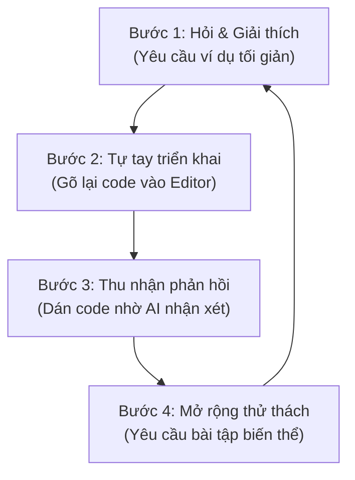
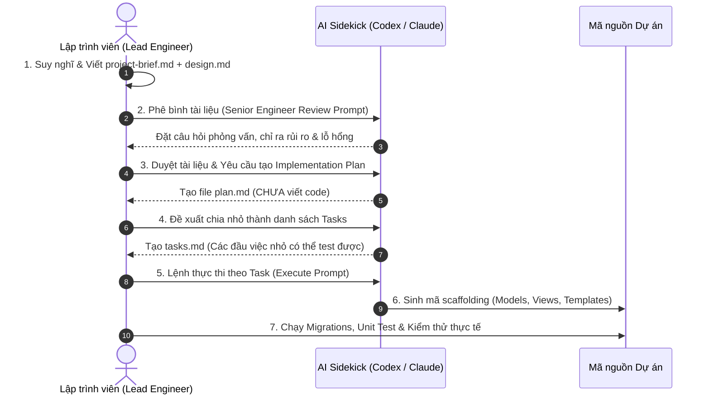

# Lập Trình Web Kỷ Nguyên AI: Đừng Để AI 'Code Hộ', Hãy Dùng AI Như Một Cộng Sự!

> *"AI sẽ không thay thế lập trình viên. Nhưng lập trình viên biết dùng AI sẽ thay thế những lập trình viên không biết dùng AI."*

Nếu bạn vừa bước chân vào thế giới lập trình web trong năm nay, rất có thể bạn đang trải qua một cảm giác vừa kinh ngạc vừa hoang mang. Chỉ với vài dòng câu lệnh đơn giản gửi tới ChatGPT, Claude hay GitHub Copilot, một trang web hoàn chỉnh hay một hệ thống RESTful API phức tạp đã hiện ra trước mắt trong vài giây.

Những đoạn mã từng khiến các thế hệ lập trình viên đi trước tốn hàng tuần nghiên cứu trên *Stack Overflow* giờ đây được sinh ra chỉ bằng một phím `Enter`.

Thế nhưng, có một sự thật phũ phàng đang diễn ra: **Hầu hết mọi người đang sử dụng AI sai cách.**

Nhiều người mới học (beginners/juniors) đang biến AI thành một "cỗ máy gõ phím hộ". Họ xin giải pháp, copy đoạn mã được sinh ra, dán thẳng vào dự án, thấy ứng dụng chạy được thì mừng rỡ — nhưng lại hoàn toàn **không hiểu bản chất bên dưới đang hoạt động ra sao**. Để rồi khi xảy ra lỗi (bug), khi hệ thống tăng tải hoặc khi khách hàng yêu cầu thay đổi logic, họ hoàn toàn bất lực.

Bài viết này được viết ra nhằm giúp bạn thoát khỏi cạm bẫy đó. Chúng ta sẽ cùng nhau khám phá tư duy chuẩn chỉ và phương pháp thực hành để biến AI từ một "nô lệ gõ code" thành một **Người Thầy (Mentor)** kiên nhẫn và một **Người Cộng Sự (Sidekick)** đắc lực trong mọi dự án lập trình web.

---

## PHẦN 1: TƯ DUY NỀN TẢNG — AI LÀ "CẤP SỐ NHÂN", KHÔNG PHẢI "CỖ MÁY THẦN KỲ"

### 1. Phương trình hiệu suất trong kỷ nguyên mới

Rất nhiều người lầm tưởng rằng chỉ cần có AI, họ có thể bỏ qua bước học kiến thức cơ bản (HTML, CSS, JavaScript, SQL, thuật toán). Đó là một sai lầm chết người.

Hãy nhìn bản chất của AI qua phương trình dưới đây:

$$\text{Năng Lực Thực Tế} = \text{Kiến Thức Nền Tảng} \times \text{Năng Lực Điều Khiển AI}$$

- **Nếu nền tảng của bạn bằng 10:** AI sẽ nhân bản năng suất của bạn lên gấp 5, gấp 10 lần ($\text{10} \times \text{10} = \text{100}$). Bạn sẽ hiện thực hóa các ý tưởng phức tạp với tốc độ chóng mặt.
- **Nếu nền tảng của bạn bằng 0:** AI cũng chỉ nhân bản sự bối rối của bạn ($\text{0} \times \text{10} = \text{0}$). Kết quả là bạn nhận về một đống code chắp vá, tiềm ẩn vô số lỗ hổng bảo mật và nợ kỹ thuật (technical debt) mà bản thân không thể kiểm soát.

### 2. Sự dịch chuyển vai trò: Từ "Viết Code" sang "Đánh Giá Code"

Trong quá khứ, giá trị của một lập trình viên phần lớn nằm ở kỹ năng **viết cú pháp (Syntax writing)** — tức là nhớ thuộc lòng các hàm, cú pháp lệnh và tự tay gõ từng dòng mã.

Ngày nay, giá trị đó đang dịch chuyển mạnh mẽ sang **Năng lực đánh giá và thẩm định (Code Judging & Reviewing)**:
- Bạn không cần nhớ chính xác tên của từng phương thức trong thư viện, nhưng bạn **bắt buộc phải thấu hiểu kiến trúc hệ thống**.
- Bạn phải biết nhận diện sự đánh đổi (trade-offs): Phương án AI đưa ra có tốn bộ nhớ không? Có bị lỗi truy vấn cơ sở dữ liệu N+1 không? Có an toàn trước các cuộc tấn công SQL Injection hay XSS không?

AI có thể sinh ra code rất nhanh, nhưng **trách nhiệm với chất lượng và sự an toàn của sản phẩm hoàn toàn thuộc về con người**.

### 3. Cảnh báo nguy hiểm: Sự ỷ lại nhận thức (Cognitive Offloading)

Các nghiên cứu về tâm lý học hành vi đã chỉ ra hiện tượng **"Cognitive Offloading"** — khi con người quá phụ thuộc vào công cụ hỗ trợ, não bộ sẽ ngừng nỗ lực tư duy và ghi nhớ.

> [!WARNING]
> **Cạm bẫy của việc lạm dụng AI:**
> Khi gặp một lỗi nhỏ, thay vì đọc vết lỗi (traceback) hay suy nghĩ logic, bạn dán ngay lỗi đó cho AI và bảo *"Sửa hộ tôi"*. Việc này tạo ra một vòng lặp tai hại: Bạn không hiểu nguyên nhân gỡ lỗi $\to$ Bạn dán code mới của AI $\to$ Code mới sinh ra lỗi khác $\to$ Bạn lại dán tiếp. Cuối cùng, bạn tốn nhiều thời gian hơn cả việc tự học và gỡ lỗi từ đầu!

---

## PHẦN 2: DÙNG AI LÀM MENTOR ĐỂ HỌC (AI AS A COACH)

Để học tập hiệu quả cùng AI mà không bị thụ động, bạn cần thay đổi cách giao tiếp. Đừng bao giờ xin giải pháp cuối cùng ngay lập tức. Hãy biến AI thành một gia sư riêng khắc nghiệt nhưng kiên nhẫn.

### 1. Thiết lập "Hợp đồng Học tập" (Learning Contract)

Trước khi bắt đầu một chủ đề mới (VD: Học Django, SQL JOINs hay Async JavaScript), hãy gửi cho AI một câu lệnh thiết lập vai trò (System Prompt / Custom Instructions):

> [!NOTE]
> **Prompt Mẫu: Hợp đồng học tập (Learning Contract)**
> *"Bạn là gia sư web dev của tôi về HTML, CSS, JavaScript, SQL, Python và Django. Hãy dạy tôi như một người mới bắt đầu muốn trở nên thành thạo, không phải như một người muốn copy-paste nhanh. Ưu tiên các bước ngắn có điểm kiểm tra. Khi đưa ra code, hãy giải thích: code làm gì, tại sao dùng cách này, và các lỗi phổ biến. Đưa ra 1-3 câu hỏi nhỏ sau khi giải thích. Luôn đưa ra một bài tập nhỏ sau khi giải thích một khái niệm. Khi tôi dán một lỗi, hãy giúp tôi debug bằng cách giải thích nguyên nhân có khả năng xảy ra nhất, bảo tôi cần kiểm tra gì và đưa ra cách sửa tối thiểu trước."*

Đồng thời, hãy đặt ra **hàng rào giới hạn (Guardrails)** để ngăn AI sinh quá nhiều code:

> [!TIP]
> **Prompt Mẫu: Hàng rào giới hạn**
> *"Bạn phải tuân thủ các quy tắc này khi phản hồi có code: Không tạo quá 40 dòng code một lúc trừ khi được yêu cầu; Ưu tiên thay đổi từng bước với diffs (nêu rõ dòng nào xóa, dòng nào thêm); Đưa ra vấn đề có khả năng xảy ra nhất trước tiên."*

### 2. Vòng lặp học tập 4 bước (The 4-Step AI Learning Loop)

Áp dụng quy trình 4 bước mỗi khi học một kỹ thuật mới:

1. **Bước 1 — Hỏi & Giải thích:** Yêu cầu AI giải thích lý thuyết đi kèm ví dụ nhỏ nhất có thể (*Minimal Working Example*).
2. **Bước 2 — Tự tay triển khai (Type it out):** Bắt buộc phải **tự gõ lại từng dòng code** vào VS Code thay vì bấm nút Copy. Việc tự gõ tạo ra liên kết thần kinh và phản xạ cú pháp trong não bộ.
3. **Bước 3 — Thu nhận phản hồi:** Dán đoạn code bạn tự gõ vào AI và hỏi: *"Tôi viết như thế này đã chuẩn chưa? Có cách nào tối ưu hơn không?"*.
4. **Bước 4 — Mở rộng thử thách:** Yêu cầu AI đưa ra một bài tập biến thể nhỏ (VD: *"Bây giờ hãy hướng dẫn tôi bổ sung bước kiểm tra dữ liệu đầu vào - Input Validation vào đoạn code này"*).

### 3. Phương pháp gỡ lỗi Socratic (Socratic Debugging)

Khi code bị lỗi, thay vì bảo AI sửa hộ, hãy dùng phương pháp vấn đáp Socratic:

> [!EXAMPLE]
> **Prompt Mẫu: Socratic Debugging**
> *"Tôi gặp lỗi này khi chạy ứng dụng Django: [dán traceback]. Đừng đưa cho tôi code sửa ngay. Hãy đặt cho tôi 3 câu hỏi gợi ý từng bước để giúp tôi tự tìm ra nguyên nhân gốc rễ."*

### 4. Kiểm tra chéo & Thẩm định giả định (Verification Prompts)

AI rất hay đưa ra các câu trả lời tự tin nhưng sai lệch (illusion of competence). Hãy luôn kiểm tra chéo bằng các câu hỏi:

- *"Bạn đang đưa ra những giả định nào về cấu trúc dự án của tôi?"*
- *"Có 3 kịch bản nào khiến đoạn code này thất bại khi chạy trên môi trường thực tế (production)?"*
- *"Cách tiếp cận đơn giản nhất mà không cần cài thêm thư viện ngoài là gì?"*

---

## PHẦN 3: DÙNG AI LÀM CỘNG SỰ ĐỂ LÀM DỰ ÁN (SPEC-DRIVEN DEVELOPMENT)

Khi chuyển từ giai đoạn học sang giai đoạn xây dựng dự án thực tế, cách làm việc với AI phải thay đổi hoàn toàn.

### 1. Tại sao các prompt ngắn ("Hãy viết cho tôi trang web X") luôn thất bại?

Khi bạn đưa một câu lệnh quá ngắn và mơ hồ, AI sẽ rơi vào trạng thái **ảo giác (hallucination)**. Để lấp đầy các khoảng trống thông tin, AI sẽ tự động đoán:
- Nó tự chọn cấu trúc thư mục mà bạn không hề muốn.
- Nó tự thêm vào các thư viện bên ngoài không cần thiết.
- Nó tự sáng tạo ra các quy tắc nghiệp vụ sai lệch với thực tế.

### 2. Giải pháp: Phát triển dựa trên đặc tả (Spec-Driven Development - SDD)

Trong môi trường chuyên nghiệp, lập trình viên áp dụng quy trình **Spec-Driven Development** — tức là xây dựng bộ tài liệu đặc tả hoàn chỉnh trước khi cho phép AI sinh bất kỳ dòng code nào.

Bộ tài liệu này thường bao gồm 2 file chính:
1. `project-brief.md`: Định nghĩa Mục tiêu (Goal), Đối tượng người dùng (Target Users), Tính năng cốt lõi (Core Features), **Những gì KHÔNG làm (Non-goals)**, Ràng buộc kỹ thuật, và Tiêu chí hoàn thành (Definition of Done).
2. `design.md`: Định nghĩa phong cách giao diện, màu sắc, bố cục UI/UX và luồng chuyển trang.

### 3. Quy trình 6 bước phối hợp đỉnh cao với AI Sidekick

Dưới đây là quy trình thực tế được trích xuất từ tài liệu phát triển ứng dụng web chuyên nghiệp:

#### Bước 1: Viết tài liệu Brief & Design
Tự mình viết ra yêu cầu bài toán vào file `project-brief.md`. Điểm quan trọng nhất là mục **Non-goals (Những gì KHÔNG làm)** để ngăn AI tự ý thêm tính năng rác.

#### Bước 2: Bắt AI đóng vai Senior Engineer để phản biện
Gửi tài liệu cho AI và yêu cầu nó "tìm lỗi":

> [!NOTE]
> **Prompt Mẫu: Senior Engineer Review Brief**
> *"Đọc file `project-brief.md` và đóng vai senior engineer review dự án trước khi triển khai code. Nhiệm vụ của bạn là tìm các điểm thiếu sót, không rõ ràng hoặc rủi ro về mặt kiến trúc. Phỏng vấn tôi bằng các câu hỏi tập trung để giải quyết các lỗ hổng. Sau đó đề xuất một phiên bản brief tốt hơn."*

#### Bước 3: Lập kế hoạch triển khai (Implementation Plan)
Sau khi chốt tài liệu Brief, yêu cầu AI lập kế hoạch chi tiết mà **chưa viết code**:

> [!NOTE]
> **Prompt Mẫu: Lên Kế hoạch triển khai (Plan)**
> *"Tạo một kế hoạch triển khai (implementation plan) cho tính năng URL shortener dựa trên spec trong project-brief.md. Ràng buộc: Giữ code đơn giản, sử dụng Django built-in templates. Chỉ tạo kế hoạch chi tiết từng file cần sửa/tạo mới, CHƯA viết code thực thi."*

#### Bước 4: Chia nhỏ thành danh sách Tasks
Yêu cầu AI chia kế hoạch thành các danh sách công việc nhỏ (tickets):

> [!NOTE]
> **Prompt Mẫu: Chia Task**
> *"Hãy chia kế hoạch triển khai tính năng thành một chuỗi các task nhỏ, có thể review được độc lập. Mỗi task phải tạo ra một kết quả nhìn thấy được (verifiable outcome) và có thứ tự thực hiện hợp lý."*

#### Bước 5: Thực thi code từng phần (Implementation)
Lúc này mới sử dụng các công cụ AI CLI (như Codex, Claude Code hay Cursor) để sinh mã nguồn theo đúng các task đã duyệt.

#### Bước 6: Thẩm định & Kiểm thử (Verification & Review)
Chạy các lệnh khởi tạo database, chạy unit test và truy cập ứng dụng trên trình duyệt để nghiệm thu theo đúng tiêu chí **Acceptance Criteria**.

---

## PHẦN 4: BỘ SƯU TẬP PROMPT THỰC CHIẾN (PROMPT CHEAT SHEET)

Dưới đây là bộ câu lệnh mẫu đắc lực mà bạn có thể lưu lại để sử dụng hàng ngày:

### 1. Mega-Prompt: One-Shot Khởi Tạo Dự Án Chuẩn Kiến Trúc

> [!EXAMPLE]
> **Prompt Mẫu: One-Shot Project Scaffolding**
> *"Tôi đang xây dựng ứng dụng web Django 6 tên là TallyApp. Hãy đọc kỹ hai file `project-brief.md` và `design.md`.
>
> Trước khi tạo code, bạn phải hoàn thành phân tích theo các bước:
> 1. Trình bày lại yêu cầu bài toán.
> 2. Xác định những điểm chưa rõ ràng.
> 3. Liệt kê các giả định kỹ thuật.
> 4. Nêu bật các rủi ro tiềm ẩn.
>
> Sau khi phân tích xong:
> 5. Chia giai đoạn phát triển.
> 6. Đề xuất cấu trúc Django apps.
> 7. Thiết kế data models.
> 8. Đề xuất danh sách URLs.
>
> Chỉ sau khi tôi xác nhận bản phân tích này, bạn mới bắt đầu tạo mã scaffolding cơ bản cho models, forms, views, urls, templates, và test cases."*

### 2. Prompt Kiểm Thử Code (Testing Prompt)

> [!EXAMPLE]
> **Prompt Mẫu: Viết Unit Test cho Django Model**
> *"Đây là Django model cho Survey: [dán code model]. Hãy viết unit tests xác minh các quy tắc xác thực (validation rules), giá trị mặc định (default values) và các ràng buộc. Tránh phụ thuộc vào giá trị primary key cố định. Tập trung vào negative paths và edge cases."*

### 3. Prompt Code Review Sau Khi AI Viết Code

> [!EXAMPLE]
> **Prompt Mẫu: Phản biện mã nguồn AI**
> *"Hãy review lại tính năng vừa triển khai so với spec và acceptance criteria ban đầu. Xác định:
> 1. Hành vi hoặc yêu cầu nào còn thiếu?
> 2. Có sự phức tạp không cần thiết nào được thêm vào không?
> 3. Những trường hợp test case nào còn thiếu?"*

---

## PHẦN 5: KẾT LUẬN — GIÁ TRỊ CỦA LẬP TRÌNH VIÊN TRONG THẬP KỶ TỚI

Trí tuệ nhân tạo đang tái định hình toàn bộ ngành công nghiệp phần mềm. Cú gõ bàn phím không còn là rào cản, và việc thuộc lòng cú pháp không còn là lợi thế cạnh tranh độc quyền.

Tuy nhiên, điều đó không có nghĩa là vai trò của lập trình viên bị mờ nhạt. Trái lại, **yêu cầu đối với một kỹ sư phần mềm thực thụ chưa bao giờ cao đến thế**.

Lập trình viên thành công trong thập kỷ tới không phải là người bắt AI code hộ nhiều nhất, mà là người có các năng lực cốt lõi:
1. **Khả năng tư duy hệ thống & phân rã bài toán (Problem Decomposition):** Biến một ý tưởng mơ hồ thành tài liệu đặc tả chặt chẽ (`project-brief.md`).
2. **Kỹ năng giao tiếp & đặt câu hỏi đúng (Prompt Engineering):** Định hướng AI đi đúng lộ trình và tuân thủ các ràng buộc kiến trúc.
3. **Năng lực thẩm định & phê bình mã nguồn (Critical Code Review):** Đủ độ sâu về kiến thức nền tảng để biết khi nào AI đúng, khi nào AI sai và biết cách tối ưu hệ thống đến mức hoàn hảo.

Hãy nhớ rằng: **AI là một trợ thủ vĩ đại, nhưng bạn mới là người giữ vô-lăng.** Hãy làm chủ công cụ, trau dồi nền tảng mỗi ngày, và biến AI thành hệ số nhân cho sự nghiệp lập trình của chính bạn!

